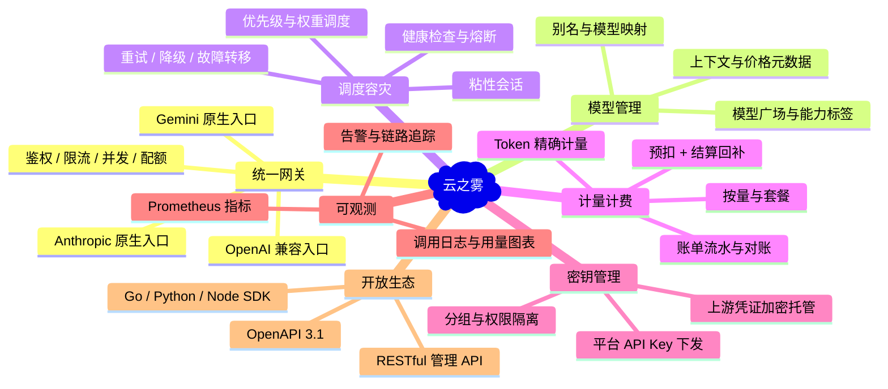
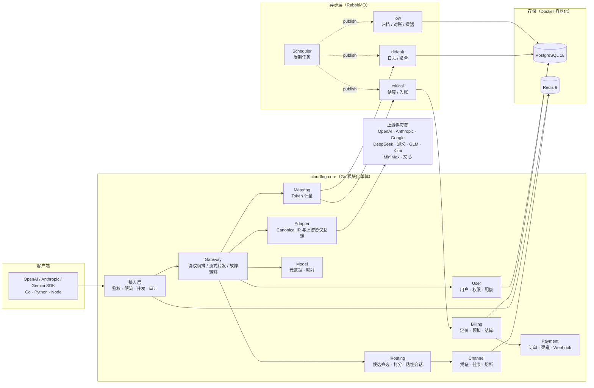

# 云之雾（CloudFog）· AI 大模型 API 聚合平台

> 一套面向开发者的多模型统一接入平台架构设计文档集。
> 一个 Base URL、一枚 API Key，调用十余家大模型供应商。

> [!NOTE]
> **文档状态：v1.3（2026-09-06，第 16 轮复核）**。已经过 16 轮系统性审计——落地缺口、数据字典、编号引用、数值参数、接口契约、图表示例、配置归口、五条端到端场景走查（调用/支付/故障/调价/降级）、开工就绪度、全局终审；第 13 轮完成 Ent→GORM 与 Asynq→RabbitMQ 架构级替换与全容器化改造（含 TTL 桶死信路由键这一资金级缺陷的修正）；第 14 轮全量逻辑闭环落地性审查（修正 3 处闭环缺口）；第 15 轮修正重试窗口与冻结额度时序矛盾（41min/45min/60min 推导链）；第 15~16 轮将前端切换为 **Nuxt 4.2**（门户 SSR/SEO），补齐公开公告端点等闭环缺口。累计拦截 30+ 个实现级问题（含资金级 3 个）。本文档集可直接指导 B1 工程地基开工；实现阶段发现的偏差应回写本集，保持"文档即事实源"。

---

## 一、平台定位

「云之雾」是一个 **AI 大模型 API 聚合平台**。平台在下游开发者与上游模型供应商之间建立一层标准化中介：

- **对开发者**：只需替换 Base URL 与 API Key，即可在 GPT、Claude、Gemini、DeepSeek、通义千问、GLM、Kimi、MiniMax、文心一言等模型间自由切换，无需关心各家协议差异、密钥管理与额度分配。
- **对供应商侧**：由平台统一完成凭证托管、健康检查、故障转移、流量调度。
- **对平台运营方**：统一的计量、计费、账单与风控体系，把"调用"变成可核算、可对账、可盈利的流水。

### 解决的真实问题

| 痛点 | 云之雾的解法 |
| --- | --- |
| 各家协议不兼容，接一家改一次代码 | 统一 OpenAI 兼容协议为主入口，Anthropic / Gemini 原生协议为辅入口，协议转换由适配器层承担 |
| 多供应商密钥散落在业务代码里，泄露风险高 | 凭证集中托管，信封加密存储，业务代码永不接触明文 |
| 某家供应商限流或宕机，业务直接不可用 | 渠道健康度感知 + 熔断 + 自动切换备用渠道/降级模型 |
| 用量与成本无法归因到用户、模型、密钥 | 全量调用日志 + 天级聚合 + 账单流水，三级归因 |
| 定价与套餐难以灵活调整 | 模型基础价 × 分组倍率 × 渠道倍率，支持历史价格快照回溯 |

---

## 二、能力全景



---

## 三、架构一图流



---

## 四、技术选型

| 层次 | 选型 | 理由 |
| --- | --- | --- |
| 语言 / 框架 | **Go 1.27.1** + Gin | 网关长连接与流式转发场景对 Go 的并发模型友好；版本精确锁定（见 [10 §3.5](./docs/10-deployment.md#35-技术基线与核心依赖清单)） |
| 架构形态 | **模块化单体** | 主链路跨进程调用会引入额外 RTT 与分布式一致性成本；模块间以 interface 隔离，保留后续拆分为 gRPC 服务的边界 |
| ORM | **GORM v1.31.2**（`gorm.io/gorm` + `gorm.io/driver/postgres`） | 生态成熟、上手成本低；金额经自定义类型直通 `shopspring/decimal`，无 float64 妥协（见 [02 §15](./docs/02-data-model.md#15-gorm-模型落地规范)） |
| 数据库迁移 | **golang-migrate v4**（versioned SQL） | SQL 是唯一事实源；禁用 `AutoMigrate`（见 [02 §11](./docs/02-data-model.md#11-迁移与版本管理)） |
| 依赖注入 | Google Wire | 编译期注入，构造边界清晰，便于模块整体替换实现 |
| 主存储 | **PostgreSQL 18**（`postgres:18-alpine`） | JSONB 凭证、部分索引、声明式分区（日志按月分区）、强事务保证账单一致性 |
| 缓存 / 限流 | **Redis 8**（`redis:8.10-alpine`） | 鉴权缓存、路由缓存、限流令牌、并发计数、粘性会话 |
| 部署 | **全容器化（Docker / Compose / Kubernetes）** | 本地开发、测试与生产统一容器形态，环境一致（见 [10 §1](./docs/10-deployment.md#1-部署拓扑)、[10 §2.1](./docs/10-deployment.md#21-镜像构建dockerfile)） |
| 异步队列 | **RabbitMQ 4.2**（`rabbitmq:4.2-management`，客户端 `amqp091-go v1.12.0`） | durable 队列 + 发布确认 + 原生死信（DLX），TTL 队列承载延迟/重试；与缓存 Redis 故障隔离（见 [01 §3 决策 4](./docs/01-architecture.md#3-关键设计决策与权衡)） |
| 支付 | `PaymentProvider` 接口抽象 | 支付宝 / 微信 / Stripe 可插拔，webhook 幂等入账 |
| 配置 / 日志 / 指标 | Viper + `log/slog` + Prometheus | 结构化日志便于聚合；指标覆盖网关热路径与队列深度 |
| 接口契约 | OpenAPI 3.1 | 作为 SDK 与文档的唯一事实源，代码由规范生成 |
| 前端 | **Nuxt 4.2**（Node 24 LTS，pnpm） | 门户公开页 SSR/SEO（模型广场公开可收录），控制台/管理端 CSR；混合渲染由 `routeRules` 统一声明（见 [14 §1.2](./docs/14-frontend.md#12-技术栈)） |

---

## 五、文档索引与阅读顺序

| 序号 | 文档 | 内容 | 建议读者 |
| --- | --- | --- | --- |
| — | [`README.md`](./README.md) | 定位、能力全景、技术选型、术语表 | 所有人，先读这篇 |
| 01 | [`docs/01-architecture.md`](./docs/01-architecture.md) | 分层架构、设计原则与权衡、模块职责矩阵、interface 契约、拆分 gRPC 的边界 | 架构师、后端负责人 |
| 02 | [`docs/02-data-model.md`](./docs/02-data-model.md) | 全量实体表结构、索引、ER 关系、分区归档与迁移约定 | 后端、DBA |
| 03 | [`docs/03-request-lifecycle.md`](./docs/03-request-lifecycle.md) | 请求全链路时序、Canonical IR、中间件链、错误码映射 | 网关开发 |
| 04 | [`docs/04-provider-adapter.md`](./docs/04-provider-adapter.md) | Provider/Adapter 规范、协议转换矩阵、10 家供应商差异、新增供应商 SOP | 适配器开发 |
| 05 | [`docs/05-scheduling-resilience.md`](./docs/05-scheduling-resilience.md) | 调度算法、粘性会话、熔断状态机、重试降级、流式中途故障转移 | 网关 / SRE |
| 06 | [`docs/06-billing-payment.md`](./docs/06-billing-payment.md) | 定价模型、预扣结算、余额并发安全、套餐订阅、支付 webhook 幂等 | 计费开发 |
| 07 | [`docs/07-api-sdk.md`](./docs/07-api-sdk.md) | 对外协议接口、管理端 RESTful、OpenAPI 组织、多语言 SDK | 前端、开发者 |
| 08 | [`docs/08-security.md`](./docs/08-security.md) | 凭证信封加密、API Key 哈希、脱敏、RBAC、审计与合规 | 安全、后端 |
| 09 | [`docs/09-observability.md`](./docs/09-observability.md) | 日志规范、Prometheus 指标、看板设计、告警分级、链路追踪 | SRE |
| 10 | [`docs/10-deployment.md`](./docs/10-deployment.md) | 部署拓扑、Compose 编排、配置项、扩缩容、备份恢复、灰度回滚 | 运维 |
| 11 | [`docs/11-roadmap.md`](./docs/11-roadmap.md) | MVP → 二期 → 规模化三阶段，验收标准与风险清单 | 项目负责人 |
| 12 | [`docs/12-testing.md`](./docs/12-testing.md) | 测试分层（单元/契约/集成/E2E/压测/混沌）、覆盖率门禁、CI 检查项、发布前回归清单 | 后端、测试 |
| 13 | [`docs/13-operations.md`](./docs/13-operations.md) | 公告、工单、客服操作台（补单/调账/退款）、数据迁移方案、运营报表与风控 | 运营、后端 |
| 14 | [`docs/14-frontend.md`](./docs/14-frontend.md) | Nuxt 4 控制台（门户页 SSR/SEO）：信息架构、渲染策略、用户端与管理端页面清单、权限中间件、组件与图表、类型同源 | 前端、产品 |

**推荐阅读路径**：README → 01（建立全局）→ 03（理解主链路）→ 02（数据骨架）→ 04/05/06（分模块深入）→ 07/08/09/10（工程化）→ 12（质量保障）→ 13（运营与迁移）→ 14（控制台）→ 11（落地节奏）。

> 02 额外包含**时区与账期切分**、**金额精度与舍入策略**、**GORM 模型落地规范**三个"开工前必须定死"的章节；06 额外包含**幂等键生命周期**、**上游用量缺失处理**与**退款流程（§7.5）**；07 额外包含**出口响应体与 SSE 契约（§2.1.1）**、**认证接口（§3.0）**与**管理端 method+path 全量清单（§4）**；01 §7.2 是**异步任务清单的唯一权威**（任务类型、队列、幂等键、触发者）。这几处是计费系统最容易出错、也最容易在设计与实现之间漂移的地方。

### 按角色速查

| 角色 | 必读 |
| --- | --- |
| 后端（网关方向） | 01、03、04、05、12 |
| 后端（计费方向） | 02（§13/§14）、06、12 |
| 前端 | 07、14、09（§4 看板） |
| 运维 / SRE | 09、10、13 |
| 产品 / 运营 | README、06（§2/§6）、13、14 |

---

## 六、设计原则

1. **主链路零阻塞**：热路径上只允许「鉴权缓存读、内存路由计算、Redis 原子操作、HTTP 转发」四类动作，任何数据库写入一律异步化。
2. **账单不可丢**：异步任务必须持久化、可重试、可观测。宁可延迟入库，不可静默丢弃。
3. **价格快照化**：每次调用把当次生效的价格写入用量记录，后续调价不污染历史账单。
4. **协议转换收敛到 IR**：N 家供应商只需 N 个 Adapter，而非 N×N 个转换器。
5. **接口先行**：模块间只通过 interface 通信，参数为可序列化 DTO，为未来拆服务留出零改动的替换点。
6. **降级优于报错**：上游不可用时优先切换渠道/降级模型，而非把错误抛给用户；无法降级时才返回明确错误。
7. **敏感数据最小暴露**：凭证只在内存使用期解密，日志与 API 响应强制出敏，不落原文。

---

## 七、与 sub2api 的关系

本方案在设计过程中参考了开源项目 sub2api（`C:\Users\12-29-2-b\Desktop\project\sub2api\backend`）的成熟实践。各章节中标注为「参考来源」的设计点包括：

| 借鉴点 | sub2api 出处 | 本平台的取舍 |
| --- | --- | --- |
| handler / service / repository 三层 + schema 层组织 | `internal/handler`、`internal/service`、`internal/repository`、`ent/schema` | **沿用三层**；schema 层本平台改用 **GORM 模型**（`internal/model/`），sub2api 的 `ent/schema/` 路径仅为参考出处（其自身使用 Ent） |
| Google Wire 依赖注入与 ProviderSet 组织 | `internal/handler/wire.go` | **沿用** |
| 渠道调度字段语义 | `ent/schema/account.go`：`priority`、`concurrency`、`schedulable`、`rate_limited_at`、`overload_until`、`temp_unschedulable_until` | **沿用并简化**，合并为统一状态机 |
| 全量调用日志表设计 | `ent/schema/usage_log.go`：token 计数族 + 成本族 + 时长 + 只追加语义 | **沿用**，补充状态码与价格快照 |
| 凭证 JSONB 存储 + AES-256-GCM 加密 | `ent/schema/account.go` 的 `credentials` 字段、`internal/repository/aes_encryptor.go` | **沿用并升级**为信封加密 + 密钥轮换 |
| 故障转移循环与同账号重试上限 | `internal/handler/failover_loop.go`：`maxSameAccountRetries=3`、指数退避上限 8s、切换次数上限 | **沿用思路**，简化为三级决策树 |
| 粘性会话 | `internal/service/antigravity_gateway_service.go`：`sessionHash` + `groupID`，TTL 1h，切换时清理并强制缓存计费 | **沿用** |
| 异步计量落库 | `internal/service/usage_record_worker_pool.go`：128 worker / 16384 队列 / 溢出降级 sync / 自动扩缩容 | **替换为 RabbitMQ 异步层**，保留"主链路零阻塞 + 溢出降级"的取舍思路 |

**明确不引入**（首期）：TLS 指纹伪装、OAuth 账号池、批量图像/视频任务、渠道监控模板、插件系统、联盟返佣等重型能力。这些在对应章节以「扩展位」标注，待业务需要时再评估。

---

## 八、术语表

| 术语 | 含义 |
| --- | --- |
| **供应商（Provider）** | 上游模型服务商，如 OpenAI、Anthropic、DeepSeek、智谱 |
| **渠道（Channel）** | 一个可用的上游调用凭证实例（某供应商下的一枚 API Key / OAuth 凭证），是调度的最小单位 |
| **模型（Model）** | 平台对外暴露的模型标识，如 `gpt-4o`、`claude-sonnet-4`、`deepseek-chat` |
| **上游模型（Upstream Model）** | 渠道侧实际请求的模型名，经模型映射后可能与对外模型名不同 |
| **模型映射（Model Mapping）** | 对外模型名 → 渠道上游模型名的转换规则，支持通配 |
| **IR（Canonical Intermediate Representation）** | 平台内部统一的请求/响应中间表示，是协议转换的枢纽 |
| **分组（Group）** | 渠道集合 + 计费倍率 + 可用模型范围的逻辑单元，用于隔离不同等级的用户 |
| **API Key** | 平台下发给开发者的调用凭证，与用户、分组绑定 |
| **预扣（Reserve）** | 请求前按估算上限冻结额度，防止超额使用 |
| **结算（Settle）** | 请求结束后按真实用量扣费并对预扣差额回补 |
| **粘性会话（Sticky Session）** | 同一会话哈希的请求尽量路由到同一渠道，以复用上游前缀缓存 |
| **熔断（Circuit Break）** | 渠道错误率超阈值后短期停止调度，避免雪崩 |
| **降级（Degrade）** | 主模型不可用时切换到能力相近的备用模型继续服务 |
| **价格快照（Price Snapshot）** | 每次调用把当次生效的价格固化进用量记录；异步结算以快照计费，调价不影响历史账单 |
| **信封加密（Envelope Encryption）** | 主密钥加密数据密钥（DEK）、DEK 加密凭证的两层结构；支持主密钥在线轮换 |
| **账期** | 配额与账单的时间切分口径：配额/对账用平台时区，用户看板用用户时区（详见 [02 §13](./docs/02-data-model.md#13-时区与账期切分)） |
| **HalfOpen 计数制** | 熔断恢复判定：窗口内最多 N 个试探请求、连续 M 次成功才转 Closed，任一失败回 Open 且冷却 ×2（详见 [05 §7](./docs/05-scheduling-resilience.md#7-熔断状态机)） |

---

## 九、快速开始（本地运行）

> 本地开发 = 存储容器（`make compose-up`）+ 后端 Go 进程 + 前端 Nuxt（pnpm）。生产编排与灰度见 [10 §2](./docs/10-deployment.md#2-容器化部署)。

### 1. 拉起依赖存储
```bash
make compose-up        # PG18 + Redis 8.10 + RabbitMQ 4.2（镜像版本锁定，见 deploy/docker-compose.dev.yml）
```

### 2. 启动后端（API/网关/异步 worker 一体化，dev 含 mock 支付渠道）
```bash
make dev               # 自动 migrate up → go run ./cmd/cloudfog --role=all（监听 :8080）
```
> 首次部署需 `bootstrap` 创建管理员账号并配置默认分组（注册用户依赖 active 分组，详见 13-operations 引导章节）。后端运行前设置环境变量：`CLOUDFOG_DSN / CLOUDFOG_REDIS_ADDR / CLOUDFOG_RABBITMQ_URL / CLOUDFOG_MASTER_KEY / CLOUDFOG_API_KEY_SALT`（10 §3.2）。

### 3. 启动前端（控制台 / 门户）
```bash
cd frontend && pnpm install --frozen-lockfile && pnpm dev   # http://127.0.0.1:3000
```
- 门户公开页：`/`（SSR/SEO）、`/models`、`/announcements`、`/docs`
- 用户自助：`/register`、`/login`、`/console`（API 密钥 / 用量 / 账单）
- 管理端：`/admin`（渠道 / 模型 / 用户，会话登录；需 admin/super 角色）
- dev 代理 `/api → http://127.0.0.1:8080`；生产同域由 ingress 保证（`NUXT_PUBLIC_SITE_URL` / `NUXT_API_SERVER_BASE` 覆盖站点基址与 SSR 后端直连地址）

### 4. 生产容器化部署（2026-09-08 落地）
Dockerfile 与生产编排已随仓库提供（此前 README 声称全容器化但无镜像文件，审计修复）：
```bash
# 必填环境变量（缺失即 compose 校验失败）：
#   POSTGRES_PASSWORD / RABBITMQ_PASSWORD / CLOUDFOG_MASTER_KEY(64hex) / CLOUDFOG_API_KEY_SALT
make docker-up      # 构建镜像并拉起 migrate(一次性) + api + worker + scheduler + web + 存储
make docker-down
```
- 镜像：`backend/Dockerfile`（golang:1.27.1 静态编译 → alpine:3.24 非 root）、`frontend/Dockerfile`（构建期 .output → node:24 运行时非 root）；编排：`deploy/docker-compose.prod.yml`。
- 角色分离：`--role=api|worker|scheduler`，migrate 一次性成功退出后业务容器才启动（`RequireSchemaVersion` 二次门禁）。
- 边界：TLS 终止由前置 Nginx/Caddy 负责（会话 Cookie Secure 标志与 HSTS 届时按部署配置）。

### 常用命令
```bash
make frontend-install frontend-tokens frontend-lint frontend-typecheck   # 前端门禁（install/tokens/stylelint/typecheck）
make build test-unit test-integration                                      # 后端门禁
```

**前端生产构建**：`cd frontend && pnpm build`。Nuxt 每次会清空重写 `.output/`（如被系统批量删除保护拦截，先手动删除该构建目录再构建）。
