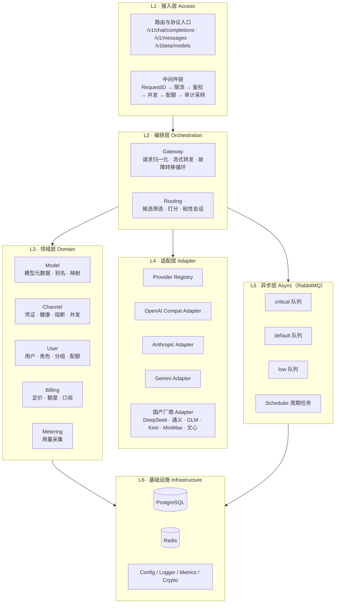
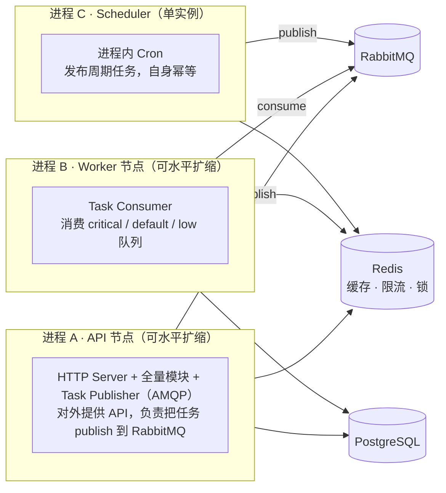
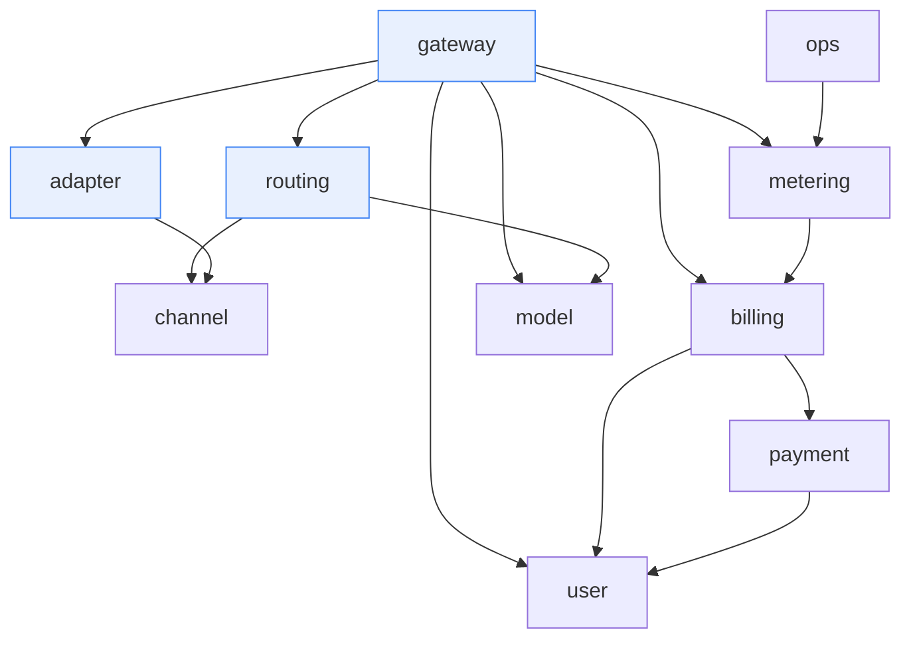
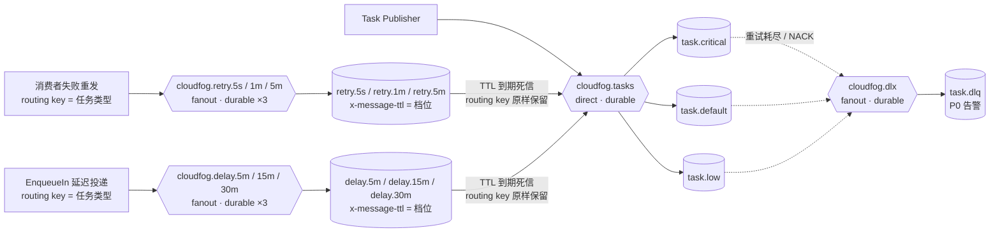
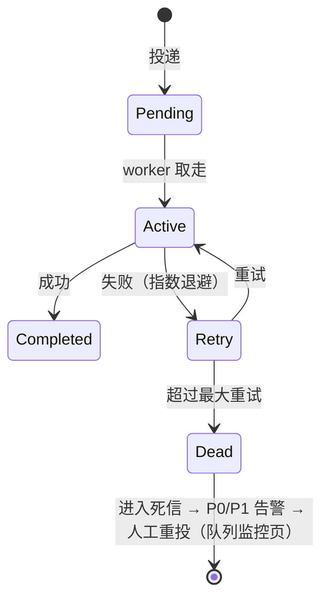
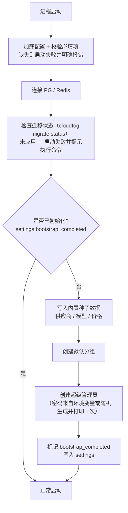
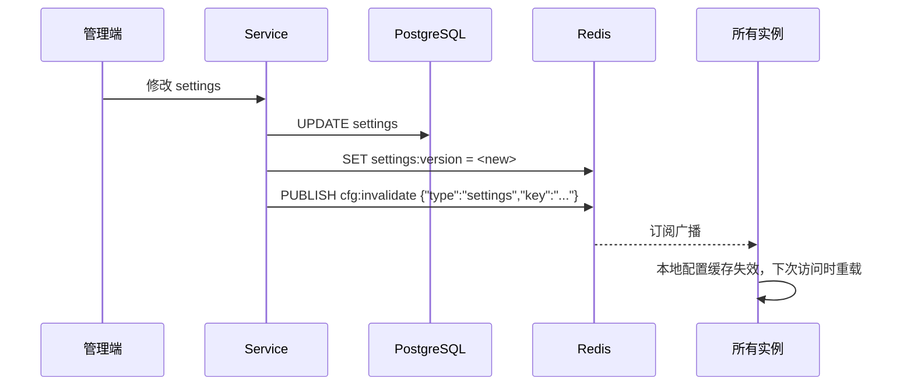

# 01 · 总体架构设计

> 本文定义「云之雾」的架构形态、模块边界与模块间契约。后续所有设计文档均以本文的模块划分为准。
> 阅读本文后你应当能回答：系统由哪些模块构成、模块之间如何通信、为什么这样切分、未来如何拆成微服务。

---

## 1. 文档目标与范围

- **目标**：给出可指导落地的架构蓝图，明确模块职责、依赖方向、接口契约与演进路径。
- **不在范围**：具体表结构（见 [02](./02-data-model.md)）、协议字段级转换（见 [04](./04-provider-adapter.md)）、算法参数细节（见 [05](./05-scheduling-resilience.md)）。

---

## 2. 架构总览

### 2.1 分层视图



### 2.2 进程视图



三种角色共用同一份二进制，通过启动参数 `--role=api|worker|scheduler` 切换。小型部署可用一个 `--role=all` 进程跑全部角色（详见 [10-deployment](./10-deployment.md)）。

---

## 3. 关键设计决策与权衡

### 决策 1：模块化单体，而非真微服务

**选择**：单进程内划分模块，模块间通过 interface 通信。

**理由**：

| 维度 | 微服务 | 模块化单体 |
| --- | --- | --- |
| 主链路延迟 | 鉴权、路由、计费各跨一次网络，累加 3~5 次 RTT | 进程内函数调用，零网络开销 |
| 计费一致性 | 跨服务扣费需分布式事务或 Saga，复杂度陡增 | 单库事务即可保证 |
| 故障排查 | 跨服务链路追踪才能定位 | 单进程栈直读 |
| 运维成本 | 服务发现、注册中心、熔断网格 | 一个二进制 |
| 扩展性 | 单模块可独立扩容 | 整体扩容（短期足够） |

网关的主链路是**延迟敏感 + 强一致**的，这正是微服务的短板区。因此把主链路放进程内，只把**非阻塞后端操作**（计量落库、账单流水、聚合、对账）异步化并允许独立为 Worker 进程。

**代价与对冲**：模块膨胀后边界可能被侵蚀。对冲手段是**强制的 interface 隔离 + 依赖方向检查**（见 §5、§6），任何跨模块访问 repository 的行为在 CI 中被静态检查拦截。

### 决策 2：协议适配收敛到统一中间表示（Canonical IR）

对外请求先归一化为内部 IR（消息数组、工具定义、多模态片段、生成参数、思考链），再由各 Adapter 序列化为上游格式；响应侧由上游格式解析回 IR，再按出口协议编码。

- **收益**：10 家供应商只需实现 10 个 Adapter，而非 10×3 = 30 个两两转换器。新增供应商是纯增量改动，零侵入。
- **代价**：IR 需要足够抽象以容纳各家特性，设计不当会导致语义丢失。对冲手段是 IR 中保留 `Extensions map[string]any` 逃生舱，承载厂商特有字段（如 Gemini 的 `generationConfig`、Claude 的 extended thinking）。

### 决策 3：OpenAI 兼容为主，原生协议透传为辅

绝大多数客户端与工具链使用 OpenAI 格式，故其为默认入口。但 Anthropic 的 extended thinking、Gemini 的 function calling 结构在二次转换中会失真，因此对这两家**额外提供原生协议入口直接透传**，由客户端自行选择。

**判定原则**：若客户端使用原生协议入口，则该请求绕过 IR 转换，走"鉴权 → 路由 → 透传"的短路路径，计量与计费逻辑不变。

### 决策 4：异步层采用 RabbitMQ

计量、日志、账单、聚合、对账、定时任务统一走 RabbitMQ（AMQP 0-9-1，镜像 `rabbitmq:4.2-management`）。核心取舍见下表（与自研内存 worker pool 对比，后者是 sub2api 的做法）：

| 能力 | 自研内存 worker pool | RabbitMQ |
| --- | --- | --- |
| 新增运维组件 | 无 | 独立 broker（容器化交付，见 10 §2） |
| 进程重启后任务存活 | **丢失** | 存活（durable 队列 + 持久化消息 + 磁盘卷） |
| 失败重试 / 退避 / 死信 | 自研 | 应用级重试（TTL 桶）+ 原生死信队列（DLX） |
| 延迟任务 | 需另引 cron + 分布式选主 | 原生 TTL + DLX 延迟队列（固定延迟档位） |
| 周期任务 | 需另引 cron | 进程内 cron（scheduler 单实例发布） |
| 优雅关闭 drain | 自研 | 原生 consumer cancel + 手动 ack |
| 队列可观测 | 自研指标 | 内置 Prometheus 插件（15692）+ Management UI（15672） |
| 单条任务开销 | 极低 | 一次 AMQP publish（confirm），约 0.1~0.5ms 级 |

**结论**：计费流水与调用日志属于**不可丢失数据**，自研内存队列在进程重启 / OOM / 滚动发布时会丢任务，只能靠事后对账补救。RabbitMQ 以成熟的持久化、发布确认与死信机制补齐可靠性，且独立 broker 让队列的扩缩容、监控、故障隔离与缓存/限流所在的 Redis 相互解耦——**Redis 收敛为缓存/限流/分布式锁专用，队列职责整体迁出**。

**代价与对策**：

- 多一个运维组件 → 全容器化交付（[10 §2](./10-deployment.md#2-docker-compose-编排)）；MVP 单节点（durable 队列 + 持久化卷），规模化升级 3 节点 quorum 集群（[11 §5.2](./11-roadmap.md#52-规模化技术方案)）；
- 延迟档位固定（TTL 队列有队头阻塞限制，不支持任意延迟）→ 平台只需 5/15/30min 三档（`payment:query`），新增档位是低频运维动作；
- 周期任务由 broker 内置变进程内 → scheduler 单实例 + Redis 分布式锁防护（§7.3）；
- 不引入 `rabbitmq_delayed_message_exchange` 社区插件（不随官方镜像分发，需自建镜像下载 .ez），一律用原生 TTL+DLX。

**容量校验**：QPS 1000 时约 2000 msg/s（远低于单节点 RabbitMQ 万级持久化消息/秒能力）。达到持续万级 QPS 时改为**批量任务**（单消息携带 N 条用量记录）摊薄，无需更换架构。

**抽象隔离**：所有任务投递经由 `TaskEnqueuer` 接口（见 §5.3），未来替换为其他队列实现不影响业务代码。

### 决策 5：对齐 sub2api 但控制复杂度

复用其经过验证的设计点（三层结构、Wire DI、渠道调度字段、全量 usage_log、JSONB 凭证、failover loop、粘性会话；其 schema 层为 Ent，本平台改用 GORM 模型，见 [02 §15](./02-data-model.md#15-gorm-模型落地规范)），但首期**不引入** TLS 指纹、OAuth 账号池、批量图像/视频、渠道监控模板、插件系统、联盟返佣等重型能力，仅在文档中标注扩展位。

---

## 4. 模块划分与职责矩阵

| 模块 | 职责 | 不负责 |
| --- | --- | --- |
| **gateway** | 协议入口编排、请求归一化、流式转发、错误映射、故障转移循环、客户端取消传播 | 具体协议编解码（委托 adapter）、候选筛选（委托 routing） |
| **routing** | 模型解析与别名映射、候选渠道筛选、打分排序、粘性会话、生成有序备用链 | 渠道健康状态维护（委托 channel） |
| **adapter** | 各供应商 IR↔上游协议编解码、模型名映射、用量解析、错误码归一 | 渠道选择、凭证获取 |
| **channel** | 上游凭证 CRUD 与加密存储、健康检查、熔断状态机、并发计数、冷却调度 | 计费 |
| **metering** | Token 计量、用量归一化、投递异步任务 | 定价计算 |
| **billing** | 定价与倍率、预扣额度、结算扣费、套餐订阅、账单流水、对账 | 用量采集 |
| **model** | 模型元数据（上下文、能力、价格、平均延迟）、别名与映射规则、模型广场查询 | — |
| **user** | 用户、角色权限、分组、配额、平台 API Key 的生成与校验 | — |
| **payment** | 订单、支付渠道抽象、webhook 幂等入账、套餐发放 | 定价 |
| **ops** | 调用日志查询、统计聚合、告警规则、对账任务 | 实时计量 |

### 4.1 模块依赖关系



**关键约束**：

1. `routing` 不反向依赖 `gateway`，只接收输入返回决策。
2. `channel`、`model`、`user` 是被依赖的**叶子型领域模块**，不依赖任何编排模块。
3. `billing` 不依赖 `gateway`；`gateway` 通过 `BillingService.Reserve` 主动调用。
4. 不存在循环依赖；CI 中用依赖分析工具强制校验。

---

## 5. 模块间 interface 契约清单

> **设计约束（决定未来能否无痛拆服务）**：
> 1. 方法粒度**粗**，一次调用完成一个完整用例，不做细碎的 getter/setter 往返。
> 2. 参数与返回值必须是**可序列化 DTO**，绝不返回 `*model.User` 之类的 GORM 实体。
> 3. 所有方法首参为 `context.Context`，末返回值包含 `error`。
> 4. 契约中禁止出现 `sql.Tx`、`*gin.Context`、`chan` 等无法跨进程传输的类型。
>
> 满足以上四条，任意一个模块都可以被替换为 gRPC 客户端而无需修改调用方。

### 5.1 核心契约

```go
// ── gateway 模块的唯一入口 ──────────────────────────────
type GatewayService interface {
    Relay(ctx context.Context, req RelayRequest) (RelayResult, error)
}

type RelayRequest struct {
    RequestID    string            // 幂等键，重试时保持不变
    IngressProto IngressProtocol   // OpenAICompat | AnthropicNative | GeminiNative
    RawBody      []byte            // 原始请求体（已通过大小限制）
    KeyContext   KeyContext        // 由 user 模块在中间件阶段解析
    ClientIP     string
    UserAgent    string
}

type RelayResult struct {
    Usage       Usage
    ChannelID   int64
    UpstreamModel string
    Degraded    bool   // 是否发生了降级
    SwitchCount int    // 故障转移次数
    FirstTokenMS int
}

// ── routing：输入是筛选条件，输出是一次完整决策 ───────────
type Router interface {
    Select(ctx context.Context, in SelectInput) (*RoutingDecision, error)
}

type SelectInput struct {
    UserID     int64
    GroupID    int64
    Model      string            // 对外模型名（可含别名）
    ClientTags map[string]string // 区域、客户端类型等软约束
    SessionKey string            // 粘性会话键（可为空）
}

type RoutingDecision struct {
    ChannelID     int64
    UpstreamModel string
    ProviderCode  string
    Fallbacks     []FallbackCandidate // 有序备用链
    StickyHash    string
    PriceSnapshot PriceSnapshot       // 当次生效价格，写入用量记录防漂移
}

// ── adapter：一家供应商一个实现，注册进 ProviderRegistry ──
// 权威定义与配套类型（EncodeInput / ChannelRuntime / UpstreamError / CapabilitySet）
// 见 [04-provider-adapter §2](./04-provider-adapter.md#2-provider-接口规范)，此处为契约摘要，两者必须保持一致。
type Provider interface {
    Code() string
    Protocol() Protocol
    Capabilities() CapabilitySet // 供路由硬过滤：请求含视觉/工具等能力时剔除不支持的渠道
    EncodeRequest(ctx context.Context, in EncodeInput) (*http.Request, error)
    DecodeStream(ctx context.Context, r io.Reader) (<-chan StreamEvent, error)
    DecodeResponse(ctx context.Context, b []byte) (*CanonicalResponse, error)
    ExtractUsage(resp *CanonicalResponse) (*Usage, error)
    NormalizeError(statusCode int, body []byte) *UpstreamError
    // 健康检查：只负责"构造请求"，执行与结果判定由 channel 模块统一完成
    //（管理端"测试连通"走同一入口，见 07 §4.7）。
    BuildHealthCheck(ctx context.Context, in EncodeInput) (*http.Request, error)
}

// ── channel：获取凭证 + 回报调用结果，两件事 ───────────────
type ChannelService interface {
    Acquire(ctx context.Context, channelID int64) (*ChannelLease, error) // 含并发许可
    Release(ctx context.Context, lease *ChannelLease) error
    Report(ctx context.Context, r ReportInput) error  // 成功/限流/错误，驱动健康与熔断
}

// ── billing：预扣 - 结算 - 回补 三段式 ────────────────────
type BillingService interface {
    Quote(ctx context.Context, in QuoteInput) (Quote, error)      // 算价（不扣钱）
    Reserve(ctx context.Context, in ReserveInput) (Reservation, error)
    Settle(ctx context.Context, in SettleInput) error             // 幂等，按 RequestID
    Refund(ctx context.Context, in RefundInput) error
    GetBalance(ctx context.Context, userID int64) (Balance, error)
}

// ── user：鉴权一次拿全上下文，避免后续多次查询 ─────────────
type UserService interface {
    AuthenticateKey(ctx context.Context, rawKey string) (*KeyContext, error)
    Authorize(ctx context.Context, in AuthorizeInput) error // 模型白名单、配额、并发
}

type KeyContext struct {
    UserID      int64
    KeyID       int64
    GroupID     int64
    Role        Role
    RateLimit   RateLimitSpec   // RPM / TPM / 并发
    Quota       QuotaSpec      // 额度上限
    GroupRate   float64        // 分组计费倍率
    AllowedModels []string     // 空表示不限制
}
```

### 5.2 用户模块对外暴露的鉴权上下文

`KeyContext` 是整个请求生命周期的"通行证"，在中间件阶段解析一次，后续所有模块复用，避免重复查询：

| 字段 | 用途 |
| --- | --- |
| `UserID` / `KeyID` | 计量与账单归因 |
| `GroupID` | 决定可见渠道集合与计费倍率 |
| `RateLimit` | 令牌桶参数（RPM/TPM/并发） |
| `Quota` | 日/月额度上限，超出直接拒绝 |
| `AllowedModels` | 模型白名单，空表示不限制 |
| `GroupRate` | 分组倍率，参与最终价格计算 |

### 5.3 异步契约（隔离队列实现）

```go
// 业务代码只依赖这个接口，不直接 import amqp091-go 包。
type TaskEnqueuer interface {
    Enqueue(ctx context.Context, task Task) error
    EnqueueIn(ctx context.Context, task Task, delay time.Duration) error
}

type Task struct {
    Type    TaskType          // 决定由哪个 handler 处理
    Queue   QueueName         // Critical | Default | Low
    Payload json.RawMessage   // 可序列化负载
    Key     string            // 幂等键（如 "settle:<request_id>"），空表示不去重
    MaxRetry int              // >0 覆盖队列默认 max_retry（10 §3.2）；0 = 用队列默认
    Timeout  time.Duration
}
```

**收益**：替换队列实现（RabbitMQ → 其他）只需新增一个 `TaskEnqueuer` 实现；单元测试中用内存实现即可，无需 RabbitMQ。

---

## 6. 代码组织与依赖方向

### 6.1 目录布局

遵循 Go 社区惯例：`cmd/` 放进程入口，`internal/` 放模块私有代码（编译器强制不可外部导入），`pkg/` 放可独立复用的通用库。

```
cloudfog/
├── cmd/
│   └── cloudfog/            # main：解析 --role，组装依赖，启动
├── internal/
│   ├── config/              # Viper 配置结构与校验
│   ├── server/              # Gin engine、路由注册、中间件链、优雅关闭
│   ├── handler/             # HTTP 层：参数绑定、DTO 转换、调用 service
│   │   ├── gateway/         #   OpenAI / Anthropic / Gemini 三个协议入口
│   │   ├── admin/           #   管理端接口
│   │   └── portal/          #   用户自助接口
│   ├── service/             # 业务编排层（一个大包，按文件前缀分模块）
│   ├── domain/              # 领域模型与状态常量（无外部依赖）
│   ├── repository/          # 数据访问：GORM DB 封装、加密器、缓存读写
│   ├── task/                # 任务定义 + consumer + AMQP 拓扑声明（实现 TaskEnqueuer）
│   └── pkg/                 # 平台内可复用的内部库
│       ├── ir/              #   Canonical IR 定义
│       ├── adapter/         #   各供应商 Adapter（openai/anthropic/gemini/...）
│       ├── ratelimit/       #   Redis 令牌桶
│       ├── circuit/         #   熔断器
│       ├── crypto/          #   信封加密
│       ├── redact/          #   脱敏
│       └── httputil/        #   回源 HTTP 客户端（连接池、代理、超时）
├── internal/model/          # GORM 模型定义（手写，无 codegen；表结构唯一 Go 声明）
├── migrations/              # 版本化 SQL 迁移（golang-migrate，唯一事实源）
├── api/
│   └── openapi/             # OpenAPI 3.1 规范（SDK 与文档的唯一事实源）
└── deploy/                  # Docker Compose、systemd、监控配置
```

> **说明**：`service/` 采用「一个大包 + 文件前缀」而非「每个模块一个子包」，原因是模块间存在共享的领域类型，拆包会导致大量 import 循环与类型重复。模块边界靠**命名约定 + interface + CI 依赖检查**维持，这与 sub2api 的组织方式一致（其 `internal/service` 下有 1200+ 个文件）。

### 6.2 依赖方向规则

```
handler  →  service  →  domain
                ↘         ↑
              repository ─┘
                  ↘
                  model (GORM)

handler  ⇥  task（只投递，不直接写库）
service  ⇥  pkg/*（ir / adapter / ratelimit / circuit / crypto）
```

**铁律**：

| 规则 | 说明 |
| --- | --- |
| 反向依赖禁止 | `domain`、`repository`、`pkg` 不得 import `service` 或 `handler` |
| 跨模块禁直连 | A 模块不得直接 import B 模块的 repository，只能调用 B 的 service interface |
| HTTP 层无业务 | `handler` 只做绑定与转换，业务判断一律下沉到 `service` |
| 实体不外泄 | `service` 返回给 `handler` 的必须是 DTO，不是 `*model.Xxx` |

CI 中通过 `go mod vendor` + 自定义 lint（基于 `golang.org/x/tools/go/packages` 扫描 import 路径）强制以上规则。

---

## 7. 异步层设计

### 7.1 拓扑与队列划分



| 对象 | 声明 | 说明 |
| --- | --- | --- |
| Exchange `cloudfog.tasks` | direct, durable | routing key = 任务类型（如 `billing:settle`，与 §7.2 清单一一对应）；业务队列按 §7.2 的 19 个任务类型**逐一 binding**（拓扑即代码，随版本管理） |
| `task.critical` / `task.default` / `task.low` | durable（MVP 单节点 classic 队列；规模化换 quorum 队列，[11 §5.2](./11-roadmap.md#52-规模化技术方案)） | 业务三队列，`x-dead-letter-exchange=cloudfog.dlx` |
| Exchange `cloudfog.dlx`（fanout）+ 队列 `task.dlq` | durable | 重试耗尽或消费拒绝（NACK no-requeue）的任务进入，P0 告警（[09 §5.2](./09-observability.md#52-告警规则清单)）；手动重投见下方"死信重投" |
| Exchange `cloudfog.retry.<b>`（fanout，×3：5s/1m/5m）+ 队列 `retry.<b>` | durable，队列 `x-message-ttl` = 档位，`x-dead-letter-exchange=cloudfog.tasks` | **应用级重试桶**：消费者失败时经 fanout ingress 重发（routing key 仍填任务类型），TTL 到期死信回主交换机并按任务类型路由回原队列；消息 header `x-retry-count` 计数，超过重试上限后 NACK 进 `task.dlq` |
| Exchange `cloudfog.delay.<d>`（fanout，×3：5m/15m/30m）+ 队列 `delay.<d>` | durable，`x-message-ttl` 同上，DLX 同上 | **延迟任务**（`TaskEnqueuer.EnqueueIn`）：取 ≥ 请求延迟的最小档位（实际延迟 = 档位值，存在向上误差），请求超过最大档位 30m 直接报错；当前仅 `payment:query` 使用（[06 §7.4.1](./06-billing-payment.md#741-主动查询兜底任务原设计只有描述无任务定义)） |

> **反例（禁止）：经默认交换机直投 TTL 桶队列**（routing key = 队列名）。此时消息的 original routing key 是队列名（如 `delay.5m`）而非任务类型，TTL 到期死信回 `cloudfog.tasks` 后**无匹配 binding，broker 静默丢弃**——DLX 投递不触发 mandatory return、不产生任何日志，对 `billing:settle` 属资金级丢失。桶队列必须经各自的 fanout ingress 交换机进入：fanout 忽略 routing key 但消息**保留**它，死信时以任务类型原样路由回业务队列。
> **死信重投**：`task.dlq` 消息经 fanout DLX 进入，original routing key 保留在 `x-death` 头的 `routing-keys` 中；手动重投 = 从 `x-death` 恢复任务类型后重发 `cloudfog.tasks`（[07 §4.5](./07-api-sdk.md#45-运营支撑与系统)）。

**消息约定**：全部持久化（delivery mode 2）；发布开启 **publisher confirm + mandatory**（无路由消息立即报错并告警，绝不静默丢）；消费手动 ack。任务被 ack 后即从 broker 移除，**执行历史由应用日志与审计承载**，不再有 Asynq 式的"保留期"概念。
**channel 预算与并发安全**：每消费者独占 channel（AMQP channel 非线程安全，**禁止多 goroutine 共享**同一 channel）；单 Worker 满配 50+30+10=90 个 channel，远低于 broker 默认 `channel_max`（2047）。

| 队列 | 承载任务 | 消费者并发 / prefetch（见 [10 §3.2](./10-deployment.md#32-配置项清单按模块)） | 应用级重试 |
| --- | --- | --- | --- |
| `task.critical` | 计费结算、支付入账与退款、订阅发放、冻结额度补偿 | **50** / 10 | 10 次（经 retry TTL 桶，上限 5min） |
| `task.default` | 调用日志落库、用量聚合、支付查询兜底、余额通知 | **30** / 10 | 5 次 |
| `task.low` | 日志归档清理、对账、渠道主动探活、套餐到期、订单关单、Key 过期、配额重置、幂等清理 | **10** / 10 | 3 次 |

> **并发数必须随优先级单调递减**（`critical ≥ default > low`）。RabbitMQ 不像 Asynq 按权重在队列间分配 worker 注意力——三个队列由 Worker 进程内三个独立消费者组承载，各队列并发独立配置。若 `default` 并发反而更高，"结算优先"的语义就失效了。
>
> **重试上限的取值优先级**：`Task.MaxRetry > 0` 时覆盖该队列的默认 `max_retry`（[10 §3.2](./10-deployment.md#32-配置项清单按模块)）；为 0 时用队列默认值。与 §7.2 任务清单中各任务标注的最大重试次数保持一致。

**为什么分队列**：避免日志洪峰把计费结算堵在后面。三队列独立并发 + 独立扩容，`task.critical` 即使在 `task.default` 积压严重时也能及时消费。

### 7.2 任务清单

| 任务类型 | 队列 | 幂等键 | 触发者 | 说明 |
| --- | --- | --- | --- | --- |
| `usage:write` | default | `usage:<request_id>` | 网关（每次调用） | 写 `usage_logs`（只追加） |
| `billing:settle` | critical | `settle:<request_id>` | 网关（每次调用） | 按真实用量结算，回补预扣差额 |
| `billing:refund` | critical | `refund:<request_id>` | 网关（上游失败/客户端中断） | 预扣回补（与支付退款 `payment:refund` 不同，仅释放冻结额度） |
| `reserve:reclaim` | critical | `reclaim:<request_id>` | 周期（15min） | **冻结额度泄漏补偿**：预扣超 45min（> 结算最大重试时长约 41min，见 [06 §4.1](./06-billing-payment.md#41-任务定义)）且无 settle 流水时释放，见 [06 §3.3](./06-billing-payment.md#33-冻结额度的释放保障必须实现否则额度永久泄漏) |
| `stats:aggregate` | default | `agg:<date>:<bucket>` | 周期（10min）/ 管理端手动 | 按天聚合进 `usage_daily_stats`，并回填 `models.avg_first_token_ms` |
| `channel:probe` | low | 无 | 周期（5min） | 渠道主动健康探测 |
| `channel:reconcile` | low | `recon:<date>` | 周期（每日 3 点） | 对账：比对日志与账单流水 |
| `log:archive` | low | `archive:<partition>` | 周期（每月 1 号） | **创建下月分区 + 过期分区导出冷存并清理**（原 `stats:archive` 为笔误，已统一） |
| `payment:confirm` | critical | `pay:<trade_no>` | 支付 webhook | 支付回调入账 |
| `payment:query` | default | `payq:<order_no>:<attempt>` | 下单后延迟 5/15/30min | 回调丢失时的主动查询兜底，见 [06 §7.4.1](./06-billing-payment.md#741-主动查询兜底任务原设计只有描述无任务定义) |
| `payment:refund` | critical | `refund:<order_no>:<refund_no>` | 管理端/客服台 | 退款（原路退或退余额），见 [06 §7.5](./06-billing-payment.md#75-退款流程) |
| `subscription:grant` | critical | `sub:<subscription_id>:<period_index>` | `payment:confirm` / 续费 | **套餐额度发放**（幂等键中的 `period` 即 `subscriptions.period_index`） |
| `subscription:expire` | low | `subexp:<date>` | 周期（每日 2 点） | 套餐到期处理与自动续费扣款 |
| `order:close` | low | `orderclose:<scan_time>` | 周期（5min） | 超时未支付订单关单 |
| `balance:notify` | default | `balnotify:<user_id>:<date>` | 周期（每日 9 点）/ 结算后 | 余额低于阈值通知，走 `notification` 配置段 |
| `key:expire` | low | `keyexp:<date>` | 周期（每日 1 点） | 扫描 `expires_at < now` 的 Key，置 `status='expired'` 并删除鉴权缓存 |
| `credential:re-encrypt` | low | `reenc:{channel_id}` | 运维触发（主密钥轮换） | 分批重加密渠道凭证的 EDK（新主密钥重包数据密钥），见 [08 §2.3](./08-security.md#23-密钥管理) |
| `quota:reset` | low | `quotareset:<date>` | 周期（每日 0 点，平台时区） | 推进 `user_balances.quota_reset_at`，清零日/月额度计数 |
| `idempotency:cleanup` | low | `idclean:<date>` | 周期（每日 5 点） | 清理过期幂等记录 |

> **任务清单与队列描述的对齐**：§7.1 中"订阅发放"= `subscription:grant`（critical）、"余额通知"= `balance:notify`（default）、"统计报表"= `stats:aggregate`（default）。任务类型名一律 `域:动作` 形式，全小写。

### 7.3 可靠性设计



> **死信默认人工处理**：进入死信意味着同一任务已反复失败，自动重放大概率继续失败甚至死循环，因此默认由运维在队列监控页（[14 §4.7](./14-frontend.md#47-其他)）查看失败原因后手动重投；重投的安全性由各任务的幂等键保证（重放不会重复扣费）。仅幂等且无副作用的任务类型（如统计聚合）可配置自动重放。
    Pending --> Scheduled: 延迟/周期任务
    Scheduled --> Pending: 到点
```

- **幂等**：所有写库任务带业务幂等键，处理前先查 `idempotency_records`，保证"至少一次投递"不会变成"重复计费"。
- **超时**：每个任务处理函数带 ctx 超时（日志类 10s，结算类 30s），超时视为失败走应用级重试；broker 侧 delivery ack 上限（`consumer_timeout`，默认 30min）远大于任务超时，不会先于应用超时触发，无需调整。
- **重试投递的可靠性**：消费失败需重试时，先把消息重发至重试桶（publisher confirm 成功）**再 Ack 原消息**；重发失败则 `Nack(requeue=true)`，原消息由 broker 重新入队，不丢失——可能产生的重复消费由幂等键兜底（见下方"幂等"）。
- **优雅关闭**：API 进程收到 SIGTERM 后先停止接新请求，等待在途流式请求完成（有上限，如 30s），再关闭 Task Publisher（等待 confirm 清空）；Worker 进程先 **cancel consumer 停止取新消息**，等待在途消息处理完成并 ack（上限 `shutdown_timeout`），再关闭 AMQP 连接——未 ack 的消息由 broker 自动重新入队。
- **降级**：RabbitMQ 整体不可用时，`TaskEnqueuer` 退化为**本地内存队列 + WAL 落盘**，保证账单不丢；RabbitMQ 恢复后由补偿任务重放 WAL。
- **定时/手动任务的并发防护**：Scheduler 虽为单实例，但以下场景仍会产生重复执行，必须用 **Redis 分布式锁**（`SET key value NX EX ttl`，value 为随机 token，释放时用 Lua 校验 token 后删除，避免误删他实例的锁）互斥：

  | 场景 | 锁键 | TTL | 说明 |
  | --- | --- | --- | --- |
  | 周期任务被手动重复触发 | `lock:task:{task_type}:{window}` | 任务超时 × 2 | 运维在控制台点"立即执行"时可能与调度撞车 |
  | Scheduler 重启后补跑 | 同上 | 同上 | 重启期间漏跑，恢复后可能补跑 |
  | 多实例误部署 Scheduler | 同上 | 同上 | 编排配置错误时的兜底 |
  | 对账/归档等重任务 | `lock:job:{job_name}:{date}` | 30min | 防止重入导致重复写账 |

  锁获取失败**不是错误**，直接跳过本次执行并记 `debug` 日志（说明已有实例在执行）。

- **任务负载版本兼容**：滚动发布期间会同时存在新旧版本的 Worker。任务负载（`Task.Payload`）必须满足：新增字段可缺省（旧 Worker 忽略）、不删除或改变已有字段语义。破坏性变更需走"双写过渡期"（新旧字段并存一个版本后再清理）。详见 [10-deployment §6](./10-deployment.md#6-发布流程) 的"先升级 Worker"原则。

---

## 8. 读写路径分离

| 路径 | 经过组件 | 允许的阻塞操作 |
| --- | --- | --- |
| **写路径**（调用请求） | 中间件 → gateway → routing/adapter → 上游 → metering → 投递任务 | Redis 读、HTTP 转发、Redis 原子计数 |
| **读路径**（日志查询、看板） | handler → ops → 聚合表 / 分区表 | PostgreSQL 查询 |
| **管理路径**（配置变更） | handler → service → PostgreSQL + 缓存失效广播 | 数据库写（低频，允许） |

写路径与读路径**不共享数据表**：写路径只追加 `usage_logs`，看板查 `usage_daily_stats` 聚合表，避免大范围扫描影响调用。

---

## 9. 未来拆分为 gRPC 服务的边界

### 9.1 拆分候选顺序

| 顺序 | 模块 | 拆分信号 | 拆分收益 |
| --- | --- | --- | --- |
| 1 | **ops**（日志/统计/对账） | 日志查询与聚合占用大量 CPU/IO，影响 API 延迟 | 独立资源池，读写彻底隔离 |
| 2 | **billing** | 计费规则复杂化、需要独立扩缩或独立部署（财务合规） | 独立发版节奏 |
| 3 | **adapter** | 需要按供应商隔离故障域，或某供应商需要独立代理出口 | 故障隔离 |
| 4 | 其余 | 团队规模扩大到需要按模块划分 ownership | 组织解耦 |

**gateway / routing 不建议拆分**：二者是主链路的核心，拆分带来的网络开销大于收益。

### 9.2 拆分步骤（以 ops 为例）

1. 新建 `ops-service` 进程，把 `internal/service/ops*.go` 与相关 repository 整体搬过去。
2. 用 protobuf 定义与 `OpsService` interface 一一对应的 gRPC 服务（因为接口已经是粗粒度 + DTO，几乎是机械翻译）。
3. 在原单体中新增 `OpsServiceClient`（gRPC 实现），替换 Wire 中的本地实现 —— **调用方零改动**。
4. 灰度：通过配置项切换本地实现 / gRPC 实现，双跑校验一致后全量。
5. 数据层：ops 模块只读 `usage_logs` 与 `usage_daily_stats`，可直接给它独立的只读副本，无需拆库。

---

## 10. 系统引导与初始化（Bootstrap）

> 生产环境第一次启动时必须自动完成引导，否则系统处于"无管理员、无供应商、无分组"的不可用状态。本节定义引导流程——这是设计与可运行产品之间的关键一环。

### 10.1 引导流程



### 10.2 引导内容

| 步骤 | 内容 | 幂等性 |
| --- | --- | --- |
| **内置供应商** | `providers` 表写入 10 家供应商的元数据（code、协议、BaseURL、鉴权方式、能力集） | `ON CONFLICT (code) DO UPDATE` 仅更新非用户 editable 字段 |
| **内置模型与价格** | `models` + `model_prices` 写入初始模型清单 | `ON CONFLICT (name) DO NOTHING`（不覆盖运营调整过的价格） |
| **默认分组** | 创建 `default` 分组（倍率 1.0，不限模型） | 按 `name` 唯一，存在则跳过 |
| **超级管理员** | 创建 `role=super_admin` 的账号 | 若已存在任何 super_admin 则跳过 |
| **系统配置默认值** | `settings` 写入 `billing_timezone`、`billing_precision`、注册开关等 | `ON CONFLICT (key) DO NOTHING` |
| **引导标记** | `settings.bootstrap_completed = true` | 已标记则整段跳过 |

### 10.3 关键约束

| 约束 | 说明 |
| --- | --- |
| **超管凭据** | 优先从环境变量 `CLOUDFOG_ADMIN_EMAIL` / `CLOUDFOG_ADMIN_PASSWORD` 读取；未设置则**随机生成并仅在首次启动日志中打印一次**，同时在控制台强制提示修改 |
| **禁止硬编码默认密码** | 绝不允许 `admin/admin123` 这类默认凭据进入生产镜像 |
| **迁移与引导分离** | 迁移是结构变更（可重复执行），引导是数据初始化（只做一次），二者不可混为一谈 |
| **失败即退出** | 引导失败必须让进程退出（而非带病启动），避免"半初始化"状态 |
| **可禁用** | 提供 `--skip-bootstrap` 供多实例部署时只在首实例执行（配合分布式锁） |
| **多实例安全** | 引导前获取 Redis 锁 `lock:bootstrap`，获取不到则等待并复查标记 |

### 10.4 内置数据维护

供应商与模型的初始数据以**代码内声明**的方式维护（`internal/setup/seed/providers.go` 等），随版本发布更新。运营在管理台修改后，**内置数据不再覆盖用户修改**（靠 `ON CONFLICT DO NOTHING` + `source` 字段区分内置/自定义）。

---

## 11. 配置热更新与缓存失效

> 管理端改了配置，多久生效？跨实例如何一致？这是"能交付"与"能运维"的分水岭。

### 11.1 三类配置的生效方式

| 类型 | 载体 | 生效方式 | 延迟 |
| --- | --- | --- | --- |
| **启动配置** | `config.yaml` / 环境变量 | 重启生效 | — |
| **运行时配置** | `settings` 表 | **热更新**（见 §11.2） | 秒级 |
| **业务实体** | 渠道/模型/价格/分组/Key | **热更新 + 缓存失效**（见 §11.3） | 秒级 |

### 11.2 运行时配置热更新



**实现要点**：

| 项 | 方案 |
| --- | --- |
| 本地缓存 | 进程内 `sync.Map` 缓存 settings，`version` 变化时整体或按 key 失效 |
| 变更发现 | **双保险**：① Redis Pub/Sub 主动推送（秒级）；② 每 30s 轮询 `settings:version` 兜底（防止订阅断连漏消息） |
| 一致性 | 允许最长 30s 的不一致窗口（配置类数据可接受） |
| 不可热更新的项 | 监听地址、DSN、主密钥等启动参数——变更必须重启，管理端标注"需重启" |

### 11.3 业务实体缓存失效

| 实体 | 缓存键 | 失效触发 |
| --- | --- | --- |
| API Key 鉴权上下文 | `keyctx:{hash}` | Key 删除/禁用/改分组；用户被禁用（版本号机制） |
| 用户版本号 | `userver:{user_id}` | 用户禁用/角色变更 → 递增，使该用户所有 Key 缓存失效 |
| 路由候选集 | `cand:{group_id}:{model}` | 渠道/分组/模型/映射变更；渠道熔断/限流（主动失效） |
| 模型与价格 | `model:{name}` | 模型/价格变更 |
| 粘性会话 | `sticky:{group_id}:{session_key}` | 渠道切换时主动删除 |

**失效广播**：

```go
// 统一入口，所有实体变更必须调用
func Invalidate(ctx context.Context, ev InvalidationEvent) error {
    // 1) 删除相关缓存键
    // 2) 发布广播，通知其他实例
    return rdb.Publish(ctx, "cache:invalidate", ev)
}
```

| 约束 | 说明 |
| --- | --- |
| 所有写路径必须调用 | 遗漏等于缓存不一致——用代码审查 + 集成测试覆盖 |
| 广播失败降级 | 广播失败不阻断写操作，依赖 30s TTL 兜底（宁可短暂不一致，不可写失败） |
| TTL 兜底 | 所有缓存键均设 TTL（Key 5min、候选集 30s），即使广播全丢也能自愈 |
| 熔断/限流的特殊性 | 属高频状态变更，**不广播**（避免广播风暴），依赖短 TTL + 各实例的被动探测结果 |

### 11.4 为什么不用"无缓存直查"

候选集与 Key 上下文在每次请求都会访问。直查数据库会让主链路出现同步 DB 读（违反"主链路零阻塞"原则），且在千 QPS 下迅速压垮数据库。缓存 + 主动失效是必然选择，代价是接受秒级不一致窗口——对渠道配置这类低频变更完全可接受。

---

## 12. 参考来源（sub2api）

| 本设计点 | 参考位置 | 关系 |
| --- | --- | --- |
| handler / service / repository 三层 | `backend/internal/handler`、`internal/service`、`internal/repository` | 沿用组织方式 |
| `internal/service` 单包 + 文件前缀 | 同上（1200+ 文件） | 沿用 |
| Google Wire ProviderSet | `backend/internal/handler/wire.go` 的 `ProviderSet`、`ProvideHandlers`、`ProvideGatewayHandler` | 沿用 |
| `internal/pkg` 按供应商分包 | `backend/internal/pkg/openai|anthropicfp|gemini|geminicli|xai|apicompat` | 沿用分包思路，本平台统一收敛到 `internal/pkg/adapter` |
| 进程角色可分离 | `backend/cmd/server` | 参考 |
| 异步落库 worker pool | `backend/internal/service/usage_record_worker_pool.go`：128 worker / 队列 16384 / 溢出策略 sync / 自动扩缩容 128~512 | **替换为 RabbitMQ 异步层**；保留"溢出时同步降级执行，保证计费不丢"的取舍思路 |

---

## 13. 与其他文档的衔接

- 模块用到的数据表 → [02-data-model.md](./02-data-model.md)
- gateway 与 routing 的运行细节 → [03-request-lifecycle.md](./03-request-lifecycle.md)、[05-scheduling-resilience.md](./05-scheduling-resilience.md)
- adapter 的接口实现规范 → [04-provider-adapter.md](./04-provider-adapter.md)
- billing 的异步任务细节 → [06-billing-payment.md](./06-billing-payment.md)
- RabbitMQ 异步层的部署与监控 → [10-deployment.md](./10-deployment.md)、[09-observability.md](./09-observability.md)
- 测试策略（含本文件接口的契约测试要求）→ [12-testing.md](./12-testing.md)
- 引导种子数据与运营初始化 → [13-operations.md](./13-operations.md)
