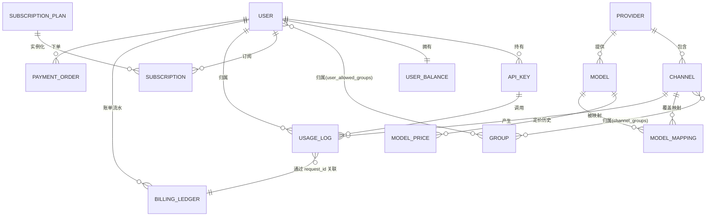
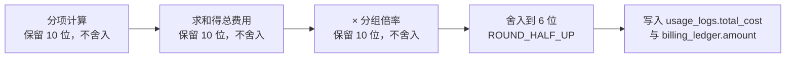

# 02 · 数据模型设计

> 本文定义「云之雾」的全量数据模型：实体、字段、索引、关系、分区归档与迁移约定。
> 阅读本文后你应当能回答：一次调用会落到哪些表、看板怎么查才不拖垮数据库、数据量涨起来怎么办。

---

## 1. 设计约定

| 约定 | 说明 |
| --- | --- |
| 主键 | 统一 `bigint` 自增（`bigserial`），避免 UUID 带来的索引碎片 |
| 时间 | 统一 `timestamptz`，应用层以 UTC 存储，展示层按用户时区转换 |
| 金额 | 统一 `numeric(20,10)`，禁止 `float` 参与金额运算；倍率用 `numeric(10,4)` |
| 软删除 | 业务实体（用户、渠道、模型、密钥）用 `deleted_at`，日志与流水**不软删** |
| 审计字段 | 业务表统一带 `created_at` / `updated_at`；日志类只带 `created_at` 且设为不可变 |
| JSON 扩展 | 需要灵活结构的用 `jsonb` + GIN 索引，不做 EAV 表 |
| 枚举 | 用 `varchar` + 应用层常量校验，而非 PG enum（变更成本高） |
| 命名 | 表名复数蛇形（`usage_logs`），字段名蛇形，外键 `xxx_id` |

---

## 2. 实体关系总览



---

## 3. 用户与权限域

### 3.1 `users` 用户

| 字段 | 类型 | 说明 |
| --- | --- | --- |
| `id` | bigserial PK | |
| `email` | varchar(255) | 唯一（部分索引：`WHERE deleted_at IS NULL`） |
| `phone` | varchar(32) | 可空，唯一 |
| `username` | varchar(64) | 唯一 |
| `password_hash` | varchar(255) | bcrypt / argon2id，可空（纯 OAuth 用户） |
| `password_algo` | varchar(20) | 哈希算法标识（`bcrypt` / `argon2id` / `md5_legacy`），**迁移用户兼容多算法必需**：登录成功时若非当前标准算法则用新算法重新哈希（渐进升级）。取值见 [13-operations §5.3](./13-operations.md#53-关键设计) |
| `role` | varchar(20) | `user` / `admin` / `super_admin` |
| `status` | varchar(20) | `active` / `disabled` / `pending`；`pending` 表示已注册待邮箱验证，验证后由用户服务置为 `active`，超时未验证由 `user:cleanup` 任务清理 |
| `default_group_id` | bigint | 默认分组 |
| `timezone` | varchar(64) | IANA 时区名（如 `Asia/Shanghai`），默认继承 `settings.billing_timezone`；决定该用户看板与账单的账期切分口径（见 §13） |
| `version` | bigint | **全局版本号**。用户被禁用/角色变更/风控处置时递增，使该用户所有 API Key 的鉴权缓存一次性失效（O(1)，无需枚举 Key）。用法见 [08 §3.2](./08-security.md#32-校验与吊销)、[01 §11.3](./01-architecture.md#113-业务实体缓存失效) |
| `risk_level` | varchar(20) | 风控标记：`normal` / `watch` / `restricted` / `blocked`，默认 `normal`。`watch` 以上触发更严格限流或人工审核，见 [13-operations §7](./13-operations.md#7-风控运营) |
| `concurrency_limit` | int | 用户级并发上限，0 表示跟随分组 |
| `last_login_at` | timestamptz | |
| `created_at` / `updated_at` / `deleted_at` | timestamptz | |

**索引**：`email`（唯一，部分）、`username`（唯一，部分）、`(status)`、`(role)`、`(risk_level)` 部分索引 `WHERE risk_level <> 'normal'`。

### 3.2 `user_balances` 余额

与 `users` 分表的原因：余额是**高频更新热点行**，分离后避免更新余额时锁住用户行、也避免用户表膨胀。

| 字段 | 类型 | 说明 |
| --- | --- | --- |
| `user_id` | bigint PK | |
| `balance` | numeric(20,10) | 可用余额，恒非负 |
| `frozen` | numeric(20,10) | 预扣冻结中的额度 |
| `total_recharged` | numeric(20,10) | 累计充值 |
| `total_consumed` | numeric(20,10) | 累计消费 |
| `quota_reset_at` | timestamptz | 下次配额（日/月额度）重置的绝对时间点，UTC；见 §13.2 的平台时区规则 |
| `version` | bigint | 乐观锁版本号 |
| `updated_at` | timestamptz | |

**约束**：`CHECK (balance >= 0)`、`CHECK (frozen >= 0)`。
**并发控制**：见 [06-billing](./06-billing-payment.md#5-余额并发安全方案)。

### 3.3 `api_keys` 平台下发密钥

| 字段 | 类型 | 说明 |
| --- | --- | --- |
| `id` | bigserial PK | |
| `user_id` | bigint | |
| `group_id` | bigint | 决定可见渠道与倍率 |
| `name` | varchar(100) | 用户自定义名称 |
| `key_prefix` | varchar(16) | 明文前缀（`sk-cf-ab12`，共 **10** 位），用于列表展示 |
| `key_hash` | varchar(64) | **唯一**，SHA-256(salt + 明文)，明文不入库 |
| `status` | varchar(20) | `active` / `disabled` / `expired`；`expired` 由 `key:expire` 周期任务（见 [01 §7.2](./01-architecture.md#72-任务清单)）扫描 `expires_at < now` 置位，同时删除鉴权缓存 |
| `expires_at` | timestamptz | 可空 |
| `ip_whitelist` | jsonb | 可空，CIDR 数组 |
| `model_whitelist` | jsonb | 可空，覆盖分组限制 |
| `quota_daily_usd` | numeric(20,10) | 可空，单 key 日额度 |
| `rpm_limit` / `tpm_limit` | int | 可空，覆盖用户级限制 |
| `last_used_at` | timestamptz | |
| `created_at` / `updated_at` / `deleted_at` | timestamptz | |

**索引**：`key_hash`（唯一）、`(user_id, status)`、`(status, expires_at)`。

> **为什么存哈希而非可逆加密**：API Key 是长期凭证，一旦泄露危害等同账号密码。存哈希意味着即使数据库整体泄露，攻击者也无法获得可用密钥。代价是用户只能在创建时看到一次明文 —— 这是所有主流 API 平台的通行做法。

### 3.4 `groups` 分组 与 `user_allowed_groups`

分组是**渠道集合 + 计费倍率 + 模型范围**的逻辑单元，用于把不同等级/不同来源的用户隔离到不同的渠道池。

`groups` 关键字段：

| 字段 | 类型 | 说明 |
| --- | --- | --- |
| `id` | bigserial PK | |
| `name` | varchar(100) | 唯一 |
| `rate_multiplier` | numeric(10,4) | 分组计费倍率，默认 1.0 |
| `allowed_models` | jsonb | 可空，模型白名单（空表示不限） |
| `rpm_limit` / `concurrency_limit` | int | 分组级限制 |
| `daily_quota_usd` | numeric(20,10) | 可空 |
| `status` | varchar(20) | `active` / `disabled`；`disabled` 时该分组不可用，其渠道不参与调度 |
| `fallback_models` | jsonb | 可空，分组级降级链（模型名数组）。优先级：**请求级 `fallback_models` > 分组级 > 模型级 `models.fallbacks`**，见 [05 §9](./05-scheduling-resilience.md#9-降级策略) |
| `sort_order` | int | 展示排序 |

`user_allowed_groups`：`(user_id, group_id)` 联合主键，决定用户可切换到哪些分组。

---

## 4. 供应商与渠道域

### 4.1 `providers` 供应商元数据

| 字段 | 类型 | 说明 |
| --- | --- | --- |
| `id` | bigserial PK | |
| `code` | varchar(50) | **唯一**：`openai` / `anthropic` / `google` / `deepseek` / `qwen` / `glm` / `moonshot` / `minimax` / `wenxin` |
| `name` | varchar(100) | 展示名 |
| `protocol` | varchar(30) | `openai_compat` / `anthropic` / `gemini_native` |
| `base_url` | varchar(512) | 默认 API 地址，渠道可覆盖 |
| `auth_type` | varchar(20) | `bearer` / `header` / `oauth` / `signature` |
| `capabilities` | jsonb | 支持的能力集：`stream` / `tools` / `vision` / `reasoning` / `embedding` / `image_gen` |
| `docs_url` | varchar(512) | |
| `bill_on_failure` | boolean | 该供应商是否对失败请求计费（默认 `false`）；决定失败但返回非零 usage 时是否向用户扣费，见 [06 §11.4](./06-billing-payment.md#114-失败请求是否计费) |
| `bill_partial_stream` | boolean | 流式中途失败时是否按已输出部分计费（默认 `true`） |
| `usage_reliable` | boolean | 该供应商的 usage 是否可信（默认 `true`）；为 `false` 时平台改用本地估算为主，见 [06 §11.3](./06-billing-payment.md#113-usage-全为-0-的判定易错点) |
| `status` | varchar(20) | `active` / `disabled`；`disabled` 时其下所有渠道不参与调度 |

> `wenxin`（文心一言）与部分国产厂商采用签名鉴权（先换 `access_token` 再调用），`auth_type=signature` 时由 Adapter 负责 token 换取与缓存，见 [04-provider-adapter](./04-provider-adapter.md)。

### 4.2 `channels` 渠道（调度与容灾的核心实体）

> 参考来源：sub2api `ent/schema/account.go`。本平台在其基础上增加了 `weight`、`circuit_*`、`health_score`、密文字段，并把分散的时间字段收敛为统一状态。

| 字段 | 类型 | 说明 |
| --- | --- | --- |
| `id` | bigserial PK | |
| `name` | varchar(100) | 展示名 |
| `provider_id` | bigint | 外键 → `providers.id`（int 外键；B1 实施时由 provider_code 演进而来） |
| `provider_code` | varchar(50) | 冗余：免 join 的展示/过滤（与 provider_id 同步写入） |
| `base_url` | varchar(512) | 可空，覆盖供应商默认地址 |
| `auth_type` | varchar(20) | **可空＝继承 `providers.auth_type`**；非空取值与 `providers.auth_type` 同一枚举：`bearer` / `header` / `oauth` / `signature`。Adapter 按此分支构造鉴权（见 [04 §4.1](./04-provider-adapter.md#41-鉴权方式处理)） |
| `credentials` | jsonb | **密文**，信封加密后的凭证，见 [08-security](./08-security.md) |
| `cred_key_id` | varchar(64) | 加密用的数据密钥 ID，用于密钥轮换 |
| `extra` | jsonb | 厂商特有配置（组织 ID、项目 ID 等） |
| `proxy_id` | bigint | 可空，回源代理 |
| `priority` | int | 默认 50，**越小越优先** |
| `weight` | int | 同优先级内的权重，默认 100 |
| `concurrency` | int | 最大并发，默认 3 |
| `rate_multiplier` | numeric(10,4) | 渠道成本倍率，默认 1.0（用于毛利核算） |
| `token_ratio` | numeric(10,4) | 本地 tokenizer 估算值相对上游真实值的修正系数，默认 1.0；按月度上游账单校准，见 [06 §11.2](./06-billing-payment.md#112-估算算法与误差控制) |
| `zero_usage_count` | int | 上游返回 usage 全 0 的累计次数（滑动窗口），用于识别不可信渠道，见 [06 §11.3](./06-billing-payment.md#113-usage-全为-0-的判定易错点) |
| `status` | varchar(20) | `active` / `error` / `disabled` |
| `schedulable` | boolean | 是否参与调度（手动暂停开关） |
| `error_message` | text | 最近错误信息 |
| `health_score` | int | 0~100，健康度，影响打分排序 |
| `circuit_state` | varchar(20) | `closed` / `open` / `half_open` |
| `circuit_open_until` | timestamptz | 熔断恢复时间 |
| `circuit_fail_count` | int | 连续失败计数 |
| `rate_limited_at` | timestamptz | 最近触发 429 的时间 |
| `rate_limit_reset_at` | timestamptz | 限流预计解除时间 |
| `overload_until` | timestamptz | 上游过载（529/503）冷却至 |
| `temp_unschedulable_until` | timestamptz | 临时不可调度至 |
| `temp_unschedulable_reason` | text | 便于排障审计 |
| `last_used_at` | timestamptz | 用于轮转 |
| `expires_at` | timestamptz | 凭证过期时间，可空 |
| `auto_pause_on_expired` | boolean | 默认 true |
| `created_at` / `updated_at` / `deleted_at` | timestamptz | |

**索引**：

| 索引 | 用途 |
| --- | --- |
| `(provider_code, priority, status)` | 调度热路径候选筛选 |
| `(status, schedulable)` | 快速剔除不可用渠道 |
| `(circuit_state, circuit_open_until)` | 熔断扫描 |
| `(rate_limit_reset_at)` | 限流恢复扫描 |
| `(last_used_at)` | 轮转排序 |
| `(health_score)` | 低优先级池筛选（`health_score < 30`） |
| `(expires_at)` 部分索引 `WHERE expires_at IS NOT NULL` | 凭证到期扫描 |
| `(deleted_at)` 部分索引 | 软删除过滤 |

> **设计说明**：调度所需的状态全部落在这张表，避免每次选渠道都要查多张表。运行时状态（并发计数、滑动窗口错误率）放 Redis，避免高频写库；DB 中的状态字段是"持久化快照"，进程重启后可恢复。

### 4.3 `channel_groups` 渠道-分组关联

`(channel_id, group_id)` 联合主键。决定某分组的用户可以使用哪些渠道。

### 4.4 `proxies` 回源代理

`id`、`name`、`type`（`http` / `socks5`）、`host`、`port`、`username`、`password`（加密）、`status`。用于海外供应商的出口 IP 管理。

---

## 5. 模型域

### 5.1 `models` 模型规格

| 字段 | 类型 | 说明 |
| --- | --- | --- |
| `id` | bigserial PK | |
| `name` | varchar(100) | **唯一**，对外模型名，如 `gpt-4o`、`claude-sonnet-4` |
| `provider_code` | varchar(50) | 主力供应商 |
| `display_name` | varchar(100) | |
| `context_window` | int | 上下文窗口（token） |
| `max_output_tokens` | int | 最大输出 |
| `capabilities` | jsonb | `vision` / `tools` / `reasoning` / `json_mode` / `audio` / `image_gen` |
| `billing_mode` | varchar(20) | `token` / `per_request` / `image` |
| `fallbacks` | jsonb | 模型级降级链（模型名数组，按序尝试）。分组级 `groups.fallback_models` 与请求级 `fallback_models` 可覆盖，优先级见 [05 §9](./05-scheduling-resilience.md#9-降级策略) |
| `avg_first_token_ms` | int | 平均首字延迟（由 `stats:aggregate` 任务每日回填，见 [01 §7.2](./01-architecture.md#72-任务清单)） |
| `status` | varchar(20) | `active` / `deprecated` / `hidden` |
| `sort_order` | int | 模型广场排序 |

### 5.2 `model_prices` 定价（带生效时间，支持历史回溯）

| 字段 | 类型 | 说明 |
| --- | --- | --- |
| `id` | bigserial PK | |
| `model_id` | bigint | |
| `currency` | varchar(8) | 默认 `USD` |
| `input_price_per_1k` | numeric(20,10) | 每千输入 token |
| `output_price_per_1k` | numeric(20,10) | |
| `cache_read_price_per_1k` | numeric(20,10) | 缓存读取，可空 |
| `cache_write_price_per_1k` | numeric(20,10) | 缓存写入，可空 |
| `long_context_threshold` | int | 长上下文阈值，可空 |
| `long_context_input_price_per_1k` | numeric(20,10) | 超阈值后的输入价 |
| `long_context_output_price_per_1k` | numeric(20,10) | |
| `per_request_price` | numeric(20,10) | 按次计费模型使用 |
| `effective_from` | timestamptz | 生效时间 |
| `effective_to` | timestamptz | 可空 |

**索引**：`(model_id, effective_from)` 唯一。

> **为什么价格独立成表并带生效时间**：调价是常态。若价格直接写在 `models` 上，历史账单会因调价而失真。独立成表后，每次调用按 `effective_from <= now` 取当前价并**快照进 usage_logs**，账单永远可复现。

### 5.3 `model_mappings` 模型映射

| 字段 | 类型 | 说明 |
| --- | --- | --- |
| `id` | bigserial PK | |
| `channel_id` | bigint | 可空；为空表示全局映射 |
| `alias` | varchar(100) | 对外模型名，支持通配（如 `gpt-4*`） |
| `upstream_model` | varchar(100) | 实际请求的模型名 |
| `priority` | int | 同一 alias 多条时的优先级 |

**索引**：`(channel_id, alias)`、`(alias)`。

映射解析顺序：渠道级精确 → 渠道级通配 → 全局精确 → 全局通配 → 原样透传。

---

## 6. 计量域

### 6.1 `usage_logs` 调用日志（核心大表，只追加）

> 参考来源：sub2api `ent/schema/usage_log.go`。本平台在其基础上补充 `status_code`、`price_snapshot`、`cache_ttl`、供应商/分组冗余字段，并改为按月分区。

| 分组 | 字段 | 类型 | 说明 |
| --- | --- | --- | --- |
| **归属** | `id` | bigserial | |
| | `request_id` | varchar(64) | **幂等键**，重试时不变 |
| | `user_id` | bigint | |
| | `api_key_id` | bigint | |
| | `channel_id` | bigint | |
| | `group_id` | bigint | 可空 |
| | `subscription_id` | bigint | 可空，套餐抵扣时记录 |
| **模型** | `model` | varchar(100) | 对外模型名 |
| | `upstream_model` | varchar(100) | 上游实际模型名 |
| | `provider_code` | varchar(50) | 冗余，避免查 join |
| | `mapping_chain` | varchar(500) | 映射链，排障用 |
| **用量** | `input_tokens` | int | |
| | `output_tokens` | int | |
| | `cache_read_tokens` | int | |
| | `cache_write_tokens` | int | |
| | `cache_write_ttl` | varchar(8) | `5m` / `1h`，可空 |
| | `image_count` / `request_count` | int | 非 token 计费模式 |
| **成本** | `input_cost` | numeric(20,10) | |
| | `output_cost` | numeric(20,10) | |
| | `cache_read_cost` | numeric(20,10) | |
| | `cache_write_cost` | numeric(20,10) | |
| | `total_cost` | numeric(20,10) | 用户实际扣费 |
| | `upstream_cost` | numeric(20,10) | 渠道成本（毛利核算） |
| | `rate_multiplier` | numeric(10,4) | 分组倍率快照 |
| | `channel_multiplier` | numeric(10,4) | 渠道倍率快照 |
| | `price_snapshot` | jsonb | 当次生效的完整价格，防调价漂移 |
| | `billing_mode` | varchar(20) | `token` / `per_request` / `image` |
| | `usage_source` | varchar(20) | `upstream`（上游返回完整 usage）/ `partial`（仅有 input，output 用估算）/ `estimated`（无 usage，全部估算）。判定规则见 [06 §11.1](./06-billing-payment.md#111-用量采集的四类情况) |
| **质量** | `stream` | boolean | |
| | `duration_ms` | int | 总耗时 |
| | `first_token_ms` | int | 首字延迟，可空 |
| | `status_code` | int | HTTP 状态码 |
| | `error_code` | varchar(64) | 归一化错误码，可空 |
| | `switch_count` | int | 故障转移次数 |
| | `degraded` | boolean | 是否降级 |
| | `retry_count` | int | |
| **上下文** | `client_ip` | varchar(45) | 支持 IPv6 |
| | `user_agent` | varchar(512) | |
| | `created_at` | timestamptz | 分区键，**不可变** |

**索引**：

| 索引 | 用途 |
| --- | --- |
| `(created_at)` | 分区裁剪基础 |
| `(user_id, created_at DESC)` | 用户调用明细 |
| `(api_key_id, created_at DESC)` | 按密钥查看 |
| `(channel_id, created_at DESC)` | 渠道用量与成本核算 |
| `(request_id, created_at)` | 幂等与排障。**受分区表限制**，无法建立不含分区键的全局唯一约束，见下方说明 |
| `(model, created_at DESC)` | 模型维度统计 |
| `(status_code)` 部分索引 `WHERE status_code >= 400` | 错误率监控 |

**约束**：日志表**禁止 UPDATE / DELETE**（通过数据库权限与触发器双重保证），只追加。

> **分区表唯一约束的重要限制（实现前必读）**
>
> PostgreSQL 的分区表**不支持**不包含分区键的全局唯一约束。`UNIQUE (request_id)` 在按月分区的 `usage_logs` 上会直接报错，只能建成 `UNIQUE (request_id, created_at)`——其语义退化为"同一 request_id 在不同月份各可插入一条"。
>
> 这意味着**计量日志无法依赖数据库做全局防重**。因此幂等职责按 [06 §10](./06-billing-payment.md#10-幂等键生命周期与重复计费防护) 的分层落实：
>
> | 层 | 载体 | 说明 |
> | --- | --- | --- |
> | L1 | Redis `idem:usage:{request_id}`（5min） | 拦截队列 at-least-once 的瞬时重复 |
> | L2 | `idempotency_records`（7 天） | 覆盖异步重试与延迟到达 |
> | L3 | `billing_ledger` 部分唯一索引（永久） | **真正的最终防线**：钱只扣一次 |
> | 兜底 | 每日对账 | 万一日志重复，对账可发现 |
>
> 即使极端情况下日志出现重复行（跨月的迟到重试），由于扣费由 `billing_ledger` 的唯一约束保护，**用户不会被重复扣费**；重复日志仅影响统计，由对账任务识别并标记。

### 6.2 `usage_daily_stats` 天级聚合

看板不直接扫 `usage_logs`，改查聚合表。

| 字段 | 类型 | 说明 |
| --- | --- | --- |
| `id` | bigserial PK | |
| `stat_date` | date | |
| `user_id` | bigint | |
| `api_key_id` | bigint | 可空（用户维度汇总时为空） |
| `model` | varchar(100) | 可空（模型维度汇总时为空） |
| `channel_id` | bigint | 可空 |
| `request_count` | bigint | |
| `success_count` / `error_count` | bigint | |
| `input_tokens` / `output_tokens` / `cache_read_tokens` / `cache_write_tokens` | bigint | |
| `total_cost` / `upstream_cost` | numeric(20,10) | |
| `avg_duration_ms` / `avg_first_token_ms` | int | |
| `p95_duration_ms` | int | |
| `updated_at` | timestamptz | |

**索引**：`(stat_date, user_id, model, api_key_id)` 唯一（用空值占位），`(stat_date)`。

聚合策略：由 `stats:aggregate` 任务按小时增量更新当天分区，支持幂等重算。

> **幂等重算的两个例外（实现必读）**：
> 1. `p95_duration_ms` **不能由增量求和重算**——分位数不具备可加性。实现方案二选一：① 存储**直方图桶计数**（`jsonb` 存 bucket→count），查询时按桶还原分位数（可加、可幂等重算）；② 退化为记录 `max_duration_ms` 与 `avg_duration_ms`，P95 由明细查询实时计算（仅限 7 天内）。**推荐 ①**，成本可控且可重算。
> 2. `avg_*` 字段存储"总和 + 次数"两个底层列，展示时相除；若直接存均值，重算时会产生均值套均值的误差。
>
> 重算入口：管理端"重新计算聚合"（指定日期范围重跑 `stats:aggregate`，见 [13-operations §4.1](./13-operations.md#41-必备操作)）。

---

## 7. 账单与支付域

### 7.1 `billing_ledger` 账单流水

每一笔余额变动都在这里留痕，`user_balances.balance` 是这张表的物化结果。

| 字段 | 类型 | 说明 |
| --- | --- | --- |
| `id` | bigserial PK | |
| `user_id` | bigint | |
| `type` | varchar(30) | `settle`（结算扣费）/ `refund`（预扣回补或退款）/ `recharge`（充值入账）/ `subscription`（套餐抵扣）/ `adjust`（人工调账）/ `promo`（赠送与回收）。**注意：预扣（`reserve`）不落库**——预扣只存在于 Redis 冻结额度中（见 [06 §3.2](./06-billing-payment.md#32-预扣实现)），本表只记录最终归属用户的资金变动 |
| `amount` | numeric(20,10) | **带符号**：负数为扣减，正数为增加 |
| `overdraft` | numeric(20,10) | **欠费额**，默认 0。仅当结算补扣时余额不足（实际 > 预扣且余额不够）才为正；此时 `balance_after` 记 0，差额记入本列。用户下次请求前须先补足（见 [06 §4.3](./06-billing-payment.md#43-差额处理)） |
| `balance_after` | numeric(20,10) | 变动后余额快照，**恒非负**（负差额记入 `overdraft`） |
| `request_id` | varchar(64) | 可空，关联调用 |
| `usage_log_id` | bigint | 可空 |
| `subscription_id` | bigint | 可空 |
| `payment_order_id` | bigint | 可空 |
| `description` | varchar(500) | |
| `operator_id` | bigint | 可空，管理员手动调整时记录 |
| `created_at` | timestamptz | |

**索引**：`(user_id, created_at DESC)`、`(type, created_at)`，以及**防重核心**的两条部分唯一索引：

```sql
-- 同一请求只能有一条 settle 流水（重复计费的最终防线，永久有效）
CREATE UNIQUE INDEX uq_ledger_settle ON billing_ledger (request_id) WHERE type = 'settle';
CREATE UNIQUE INDEX uq_ledger_refund ON billing_ledger (request_id) WHERE type = 'refund';
```

> 该表**不是分区表**，因此唯一约束可全局生效——这正是它能作为幂等最终防线的原因（对比 `usage_logs` 因分区而无法建立全局唯一约束，见 §6.1）。

### 7.2 `subscription_plans` 与 `subscriptions`

`subscription_plans`：`id`、`name`、`price_usd`、`duration_days`、`quota_usd`（套餐内含额度，可空表示不限量）、`rate_multiplier`、`allowed_models`（jsonb）、`status`。

| 字段 | 类型 | 说明 |
| --- | --- | --- |
| `id` | bigserial PK | |
| `user_id` | bigint | |
| `plan_id` | bigint | |
| `status` | varchar(20) | `pending` / `active` / `expired` / `cancelled`；`pending` = 已创建待支付，支付成功后由 `payment:confirm` 置 `active`，超时由 `order:close` 置 `cancelled` |
| `started_at` / `expires_at` | timestamptz | 当前账期起止 |
| `period_index` | int | **期次序号**，首次订阅为 1，每次续费 +1。与 `subscription_id` 共同构成套餐发放的唯一约束 |
| `auto_renew` | boolean | |
| `quota_used` / `quota_total` | numeric(20,10) | 已用额度 / 套餐内含额度（`quota_total` 为空表示不限量） |
| `created_at` / `updated_at` | timestamptz | |

**索引与约束**：

```sql
-- 套餐发放的最终防线：同一订阅的同一期次只发放一次
CREATE UNIQUE INDEX uq_subscription_period ON subscriptions (id, period_index);
```

另有 `(user_id, status)`、`(status, expires_at)`（到期扫描）。

> **`period` 字段的澄清**：[05 §10](./05-scheduling-resilience.md#10-幂等设计)、[06 §10.3](./06-billing-payment.md#103-l3-唯一约束最终防线)、[13 §4.1](./13-operations.md#41-必备操作) 中出现的幂等键 `sub:{subscription_id}:{period}`，其 `period` **即本表的 `period_index`**，不是 `started_at`。续费时 `period_index+1` 与 `expires_at` 顺延在同事务内完成。

### 7.3 `payment_providers` 与 `payment_orders`

`payment_providers`：`id`、`code`（`alipay`/`wechat`/`stripe`）、`name`、`config`（jsonb，加密存储密钥）、`enabled`、`sort_order`。

`payment_orders`：

| 字段 | 类型 | 说明 |
| --- | --- | --- |
| `id` | bigserial PK | |
| `order_no` | varchar(64) | **唯一**，平台订单号 |
| `user_id` | bigint | |
| `provider_code` | varchar(30) | |
| `provider_trade_no` | varchar(128) | 渠道流水号，**唯一**（webhook 幂等键） |
| `amount` | numeric(20,10) | 实付金额（支付渠道币种） |
| `currency` | varchar(8) | |
| `exchange_rate` | numeric(20,10) | **当次汇率快照**：`amount` 币种 → 平台记账币种（默认 USD）的换算率，默认 1.0。下单时从 `settings.exchange_rates` 读取并固化，保证入账金额可复现（见 §14.4） |
| `credited_amount` | numeric(20,10) | 实际入账额度（含赠送） |
| `type` | varchar(20) | `recharge` / `subscription` |
| `plan_id` | bigint | 可空 |
| `status` | varchar(20) | `pending` / `paid` / `failed` / `closed` / `refunded` / `partial_refunded`；状态机见 [06 §7.5](./06-billing-payment.md#75-退款流程) |
| `paid_at` / `expired_at` | timestamptz | |
| `refund_no` | varchar(64) | **唯一**（部分索引 `WHERE refund_no <> ''`），平台退款单号，退款幂等键 |
| `refunded_amount` | numeric(20,10) | 累计已退金额，默认 0；`refunded_amount >= amount` 时状态转 `refunded`，否则为 `partial_refunded` |
| `refunded_at` | timestamptz | 最后一次退款时间 |
| `raw_notify` | jsonb | 原始回调内容，排障用 |
| `created_at` / `updated_at` | timestamptz | |

**索引**：`order_no` 唯一、`provider_trade_no` 唯一（部分：`WHERE provider_trade_no <> ''`）、`refund_no` 唯一（部分：`WHERE refund_no <> ''`，退款幂等的最终防线）、`(user_id, created_at DESC)`、`(status, expired_at)`。

---

## 8. 幂等与审计

### 8.1 `idempotency_records`

| 字段 | 类型 | 说明 |
| --- | --- | --- |
| `id` | bigserial PK | |
| `scope` | varchar(50) | `settle` / `payment` / `usage` / `subscribe` |
| `idempotency_key` | varchar(128) | |
| `result` | jsonb | 首次执行结果，重复请求直接返回 |
| `expires_at` | timestamptz | 过期清理 |
| `created_at` | timestamptz | |

**索引**：`(scope, idempotency_key)` **唯一**、`(expires_at)`。

**使用方式**：幂等记录是**快速返回的缓存**，不是防重的最终防线（最终防线是各业务表的唯一约束，见 §7.1 与 [06 §10](./06-billing-payment.md#10-幂等键生命周期与重复计费防护)）。**写入时机必须在任务成功之后**——若处理前写入，任务失败后重试会被本表挡住，导致漏结算。完整时序见 [06 §4.2](./06-billing-payment.md#42-处理流程)。

### 8.2 `audit_logs` 审计日志

| 字段 | 类型 | 说明 |
| --- | --- | --- |
| `id` | bigserial PK | |
| `actor_id` | bigint | 可空（`system` 动作为空） |
| `actor_type` | varchar(20) | `user` / `admin` / `system` |
| `action` | varchar(64) | **点分命名**的动词，如 `channel.credential.view`；权限点与此同一命名空间（见 [08 §5.2](./08-security.md#52-rbac-权限模型)） |
| `target_type` / `target_id` | varchar(30) / varchar(64) | 目标对象（channel / user / order / payment_order ...） |
| `before` / `after` | jsonb | 仅记录**非敏感字段**的变更；凭证内容一律不记录 |
| `result` | varchar(20) | `success` / `failure`；失败时 `after` 记录错误摘要（脱敏） |
| `client_ip` | varchar(45) | 掩码后存储 |
| `user_agent` | varchar(512) | |
| `created_at` | timestamptz | 不可变 |

**必审计动作**：凭证读写、余额手动调整、权限变更、渠道/模型/价格配置变更、API Key 创建与吊销、登录失败。

**索引**：`(actor_id, created_at DESC)`、`(target_type, target_id)`、`(action, created_at)`。

### 8.3 `settings` 系统配置

`key`（PK）、`value`（jsonb）、`description`、`updated_at`、`updated_by`。承载运行时可调项（注册开关、默认分组、风控阈值、通知模板等）。

---

## 9. 分区与归档策略

### 9.1 `usage_logs` 按月分区

```sql
-- 声明式分区（PostgreSQL 原生）
CREATE TABLE usage_logs (... , created_at timestamptz NOT NULL)
  PARTITION BY RANGE (created_at);

-- 每月一个分区，由 log:archive 任务提前 30 天创建下月分区
CREATE TABLE usage_logs_2026_09
  PARTITION OF usage_logs
  FOR VALUES FROM ('2026-09-01') TO ('2026-10-01');
```

**为什么按月**：单月千万级记录时，分区裁剪让"查最近 7 天"只扫 1~2 个分区；归档时 `DETACH PARTITION` 是元数据操作，秒级完成，不产生大表 DELETE 的表膨胀。

### 9.2 生命周期


| 阶段 | 触发任务 | 动作 |
| --- | --- | --- |
| 创建分区 | `log:archive`（月度） | 提前 30 天创建下月分区，缺分区时自动补建并告警 |
| 温转冷 | `log:archive`（月度） | `COPY` 导出为 Parquet → 上传对象存储 → 校验行数 → `DETACH` → 保留 7 天缓冲后 `DROP` |
| 聚合保留 | — | `usage_daily_stats` 永不删除；`billing_ledger` **永不物理删除**（财务要求永久可追溯），仅在主库保留满 2 年后归档到冷存，查询走回捞 |

**归档失败的处理**（当前设计缺失，必须补）：`log:archive` 的每一步都可能失败，且不能留下"半归档"状态：

| 步骤 | 失败处理 |
| --- | --- |
| `COPY` 导出 Parquet | 任务重试（low 队列 3 次）；失败则分区保持原状，告警 P2 |
| 上传对象存储 | 已导出的临时文件保留 24h，重试时断点续传；失败同上 |
| **行数校验** | 校验不通过立即**中止并回滚**（删除远端对象、保留分区），标记 `archive_failed` 并告警 P1 |
| `DETACH PARTITION` | DETACH 是元数据操作，失败概率极低；失败则重试，重试期间该分区不可写（写入会失败并告警） |
| `DROP`（DETACH 后 7 天） | 未完成不影响服务；每次任务运行时扫描所有已 DETACH 超 7 天的分区补删 |

> 冷存后用户仍能查历史明细，走"回捞任务"从对象存储临时载入查询结果，异步返回。

### 9.3 其他大表

| 表 | 增长特征 | 策略 |
| --- | --- | --- |
| `billing_ledger` | 与调用量同量级 | 按年归档（财务要求长期保留），主库保留 2 年 |
| `audit_logs` | 低频 | 保留 1 年后归档 |
| `idempotency_records` | 与调用量同量级，但可过期 | 按 `expires_at` 批量删除（每日清理任务） |
| `payment_orders` | 低频 | 全量保留 |

---

## 10. 索引设计原则

1. **复合索引遵循最左前缀**，且把等值条件放前、范围条件放后（如 `(user_id, created_at)`）。
2. **不为低选择性字段单独建索引**（如 `stream`、`degraded`），需要时建部分索引或并入复合索引。
3. **写放大控制**：`usage_logs` 索引总数控制在 7 个以内，每多一个索引，写入成本上升约 5~10%。
4. **软删除表用部分索引**：`CREATE UNIQUE INDEX ... WHERE deleted_at IS NULL`，避免唯一索引被已删除行占用。
5. **定期审查**：用 `pg_stat_user_indexes` 找出 90 天未被使用的索引并下线。

---

## 11. 迁移与版本管理

| 约定 | 说明 |
| --- | --- |
| 工具 | **golang-migrate v4**（以 library 形式嵌入，提供 `cloudfog migrate up \| down \| status` 子命令）；**全面禁用 `gorm.AutoMigrate`**（所有环境，包括测试），表结构唯一事实源是 `migrations/` 下的 SQL |
| 命名 | `YYYYMMDDHHMMSS_<描述>.up.sql` + 同名 `<...>.down.sql`（golang-migrate 只认 `<版本>_<描述>.up/down.sql`；裸 `.sql` 会被静默忽略，禁止使用） |
| 内容 | 一个迁移文件只做一件事；DDL 与数据回填分开 |
| 兼容性 | 遵循 **expand → migrate → contract**：先加新列（可空），双写，回填，再切读，最后删旧列。禁止单文件内既改结构又删旧列 |
| 大表变更 | `usage_logs` 的加列必须允许 `NULL` 且不带默认值（PG 11+ 支持秒级加列）；创建索引用 `CONCURRENTLY` |
| 回滚 | 每个迁移必须提供对应的 down 文件；生产环境只允许前滚修复，down 文件仅用于本地与测试 |

**GORM 模型与迁移的关系**：`internal/model/*.go` 是表结构的 Go 声明（GORM tag），但它**只是数据访问层的映射描述，不是表结构的生成来源**——表结构唯一事实源是 `migrations/` 下的 SQL。两者必须同一 PR 提交，并由"模型 ↔ 表结构一致性测试"（比对 `information_schema` 与模型 tag，见 [12 §5.1](./12-testing.md#51-门禁标准)）防止漂移。

---

## 12. 容量估算

以日调用 100 万次、平均单条日志约 600 字节（含索引约 1.2KB）为例：

| 项目 | 估算 |
| --- | --- |
| `usage_logs` 日增 | 约 1.2 GB |
| 6 个月热数据 | 约 220 GB（含索引） |
| `billing_ledger` 日增 | 约 0.4 GB |
| `usage_daily_stats` 日增 | 约 5 MB（用户×模型维度，远小于明细） |
| Redis | 鉴权缓存 + 限流 + 并发计数 + 分布式锁，约 1~2 GB（队列已迁出至 RabbitMQ） |
| RabbitMQ | 任务队列（结算/日志落库等，消息持久化），日百万级调用约 2~4 GB 磁盘 |

**结论**：单台 PostgreSQL（16C32G + NVMe）可支撑日百万级调用；超过后优先做**读写分离**（ops 查询走只读副本），再考虑分库。

---

## 13. 时区与账期切分

> 时区问题是计费系统最隐蔽的坑：用户看到的"今日用量"与账单周期对不上，是投诉量第一的来源。本节把规则一次定死。

### 13.1 存储层：一律 UTC

| 项 | 规则 |
| --- | --- |
| 所有时间字段 | `timestamptz`，数据库以 UTC 存储 |
| 应用内部 | 一律 UTC 运算，禁止在业务逻辑中出现本地时间 |
| 时区转换 | **只在展示层**做（API 响应 / 前端渲染） |

### 13.2 账期切分：平台时区 + 用户时区双轨

这是最容易设计错的地方。两条规则必须同时满足：

| 场景 | 使用哪个时区 | 理由 |
| --- | --- | --- |
| **配额重置、日/月额度、RPM 窗口** | **平台时区**（`settings.billing_timezone`，默认 `Asia/Shanghai`） | 运营口径统一，便于与上游账单、财务对账 |
| **用户看板"今日/本月"、账单导出** | **用户时区**（`users.timezone`，默认继承平台时区） | 符合用户直觉，避免"我明明今天没怎么用"的投诉 |
| **对账任务、日报生成** | **平台时区** | 与财务周期一致 |
| **`usage_daily_stats.stat_date`** | **平台时区**的日期 | 聚合表唯一，无法按用户时区存多份 |

**因此必须解决的不一致**：用户时区为 `America/New_York` 时，其"9月5日"与平台 `stat_date='2026-09-05'` 的数据并不完全重合（差 12 小时）。

**解决方案（三选一，按阶段演进）**：

| 阶段 | 方案 | 精度 | 成本 |
| --- | --- | --- | --- |
| MVP | 看板统一按**平台时区**展示，并在页面显著位置标注"统计时区：UTC+8" | 有偏差但口径明确 | 零 |
| 二期 | 用户侧查询按用户时区**实时聚合 `usage_logs`**（限 7 天内的近期数据，走索引） | 精确 | 中 |
| 规模化 | 按用户时区额外维护一份聚合（`stat_date + tz_bucket`），空间换时间 | 精确 | 高 |

**MVP 阶段的强制要求**：统计口径必须在 UI 上明确标注时区，且账单导出文件里带时区声明。口径明确 > 口径精确（口径不明确必然产生争议，口径略偏但说明清楚则可控）。

### 13.3 时区字段与变更

| 字段 | 位置 | 说明 |
| --- | --- | --- |
| `settings.billing_timezone` | 系统配置 | IANA 时区名（`Asia/Shanghai`），**创建后不建议修改** |
| `users.timezone` | 用户表 | 默认继承平台时区，用户可在控制台修改 |
| `user_balances.quota_reset_at` | 余额表 | 下次配额重置的绝对时间点（UTC） |

**变更规则**：
- 平台时区变更需要**全量重算** `usage_daily_stats` 与配额窗口，属高危操作，必须停服维护窗口执行并提前公告。
- 用户时区变更只影响其后续查询的展示口径，**不重算历史**；历史账单的时区以生成时记录为准（`billing_ledger` 不存时区，但账期导出文件需带时区声明）。

### 13.4 夏令时

- 使用 IANA 时区数据库（Go 的 `time.LoadLocation`），自动处理夏令时。
- **禁止**用固定偏移量（如 `UTC+8`）存储或计算，夏令时地区会错 1 小时。
- 夏令时切换日的账期为 23 或 25 小时，聚合任务需按**绝对时间范围**计算而非"小时数"，避免重复或遗漏。

---

## 14. 金额精度与舍入策略

> 金额处理不当会导致"账对不上"，且错误会随时间累积。本节定义唯一正确的处理方式。

### 14.1 存储精度

| 项 | 类型 | 说明 |
| --- | --- | --- |
| 单价 | `numeric(20,10)` | 每千 token 价格可能极小（如 0.0000001） |
| 用量金额（各分项） | `numeric(20,10)` | 保持高精度，中间过程不损失 |
| **实际扣费金额** | `numeric(20,10)` | **最终值舍入到计费精度** |
| 余额 | `numeric(20,10)` | 与扣费精度一致 |
| 倍率 | `numeric(10,4)` | |

### 14.2 计费精度与舍入规则（唯一标准）

```
计费精度 = 6 位小数（settings.billing_precision，默认 6）
舍入模式 = ROUND_HALF_UP（四舍五入，非银行家舍入）
```

**舍入时机（关键）**：



**铁律**：

1. **只在最后一步舍入一次**。禁止对 `input_cost`、`output_cost` 等分项分别舍入后再求和（会产生累积误差）。
2. **中间计算全程用 `decimal` 库**（Go 用 `shopspring/decimal`），**禁止 `float64`**。浮点数在 0.1 这类值上无法精确表示，累积后必然出错。
3. **同一 `request_id` 的结算结果必须可复现**：给定 `price_snapshot` + token 数 + 倍率，任何时刻重算结果完全一致。

### 14.3 舍入误差的处理

| 场景 | 处理 |
| --- | --- |
| 单个请求舍入误差 | 最大 0.0000005，可忽略，由平台承担 |
| 套餐额度抵扣 | 抵扣额同样按 6 位计算；套餐剩余额度为 0 时视为耗尽（`< 0.000001` 视为 0） |
| 余额判断 | `balance < amount` 判断时用舍入后的值；`balance - amount < 0.000001` 视为余额归零 |
| 对账容差 | 允许 `|差异| < 0.01`（1 分钱）自动忽略，超出进人工队列 |
| 极端小额 | 若计算结果 `< 0.000001`（小于最小精度），**向上取到 0.000001** 而非记为 0（避免"免费调用"） |

### 14.4 充值与赠送的入账

| 项 | 规则 |
| --- | --- |
| 实付金额 | 按支付渠道币种原样记录（`payment_orders.amount`） |
| 入账额度 | `credited_amount = amount × 汇率 × (1 + 赠送比例)`，舍入到 6 位 |
| 汇率 | 多币种时由 `settings.exchange_rates` 配置并保留历史（订单记录当次汇率快照） |
| 赠送额度 | 独立记录（`billing_ledger.type = promo`），部分场景下退款需回收赠送部分 |

### 14.5 反例（明确禁止）

| 反例 | 后果 |
| --- | --- |
| 用 `float64` 累加金额 | 0.1+0.2≠0.3，日积月累账面错误 |
| 对分项分别舍入 | 每笔放大误差，万笔后差异显著 |
| 在预扣时舍入、结算时再舍入 | 两次舍入方向可能相反，产生无法解释的差额 |
| 用 `float` 与 `numeric` 混算 | 隐式转换导致精度丢失 |
| 余额判断用 `<= 0` 而非容差 | 浮点残留导致余额 0.0000001 却无法使用 |

---

## 15. GORM 模型落地规范

> 前面 §3~§8 描述的是逻辑模型，本节定义它们如何落地为 GORM 模型，避免实现时与设计漂移。
> 依赖基线：`gorm.io/gorm v1.31.2` + `gorm.io/driver/postgres`（pgx 驱动），版本策略见 [10 §3.5](./10-deployment.md#35-技术基线与核心依赖清单)。
> 各章"参考来源"中出现的 `ent/schema/*.go` 是参考项目 sub2api 的自身代码路径（其使用 Ent），仅作设计出处标注，**不指向本平台实现**。

### 15.1 组织方式

```
internal/model/
├── db.go                 // gorm.Open（pgx 驱动）、连接池参数、命名策略
├── common.go             // Timestamps / SoftDelete 公共嵌入结构
├── types.go              // Decimal（金额自定义类型）等
├── user.go               // 以下与 §3~§8 表一一对应，全部手写
├── user_balance.go
├── api_key.go
├── group.go
├── user_allowed_group.go
├── provider.go
├── channel.go
├── channel_group.go
├── proxy.go
├── model.go
├── model_price.go
├── model_mapping.go
├── usage_log.go
├── usage_daily_stat.go
├── billing_ledger.go
├── subscription_plan.go
├── subscription.go
├── payment_provider.go
├── payment_order.go
├── idempotency_record.go
├── audit_log.go
└── setting.go
```

**约定**：

| 项 | 规则 |
| --- | --- |
| 无代码生成 | GORM 模型**全部手写**，不存在生成物，无 `go generate` 步骤，也没有"生成代码是否入库"的问题 |
| 事实源分层 | 表结构唯一事实源是 `migrations/` 下的 SQL（[§11](#11-迁移与版本管理)）；模型只是访问层映射，二者漂移由 CI 一致性测试拦截（[12 §5.1](./12-testing.md#51-门禁标准)） |
| 表名 | 每个模型实现 `TableName() string` 显式返回复数表名，不依赖 GORM 默认复数化 |
| 金额字段 | 用自定义 `Decimal` 类型直通 `shopspring/decimal`，映射 `numeric(20,10)`（见 §15.3） |
| 时间字段 | 显式 `type:timestamptz`（见 §15.2） |
| 软删除 | 嵌入 `SoftDelete`（`gorm.DeletedAt`），但**日志与流水类表不用** |
| JSON 字段 | `gorm:"type:jsonb;serializer:json"`（GORM 内置 serializer，无需第三方包） |
| AutoMigrate | **任何环境禁用**（含测试）；测试环境同样执行 `migrations/`，保证与生产结构一致 |

### 15.2 公共嵌入结构

```go
// internal/model/common.go
package model

import (
    "time"

    "gorm.io/gorm"
)

// Timestamps 自动管理创建与更新时间；存储层一律 timestamptz（§13.1）。
type Timestamps struct {
    CreatedAt time.Time `gorm:"column:created_at;type:timestamptz;autoCreateTime"`
    UpdatedAt time.Time `gorm:"column:updated_at;type:timestamptz;autoUpdateTime"`
}

// SoftDelete 提供软删除（gorm.DeletedAt 自动为查询追加 WHERE deleted_at IS NULL）。
// 仅用于业务实体表；日志/流水表禁止使用（§6.1 的只追加语义）。
type SoftDelete struct {
    DeletedAt gorm.DeletedAt `gorm:"column:deleted_at;type:timestamptz;index"`
}
```

> 软删除的**部分唯一索引**（`CREATE UNIQUE INDEX ... WHERE deleted_at IS NULL`，§10.4）无法用 GORM tag 表达，由迁移 SQL 负责；模型中只声明普通 `index`。

### 15.3 金额字段的标准写法

```go
// internal/model/types.go
package model

import (
    "database/sql/driver"
    "fmt"

    "github.com/shopspring/decimal"
    "gorm.io/gorm"
    "gorm.io/gorm/schema"
)

// Decimal 直接承载 shopspring/decimal。
// 相比 Ent 时代 field.Float→float64 再二次转换的妥协，GORM 通过
// GormDBDataType + Valuer/Scanner 让 decimal 直通 numeric 列：
// 业务代码从模型到领域层全程无 float64（§14 铁律）。
type Decimal struct{ decimal.Decimal }

func (Decimal) GormDBDataType(*gorm.DB, *schema.Field) string {
    return "numeric(20,10)" // 单价与金额列的统一精度（§14.1）
}

func (d Decimal) Value() (driver.Value, error) {
    return d.Decimal, nil
}

func (d *Decimal) Scan(v any) error {
    switch t := v.(type) {
    case nil:
        d.Decimal = decimal.Zero
    case string:
        dv, err := decimal.NewFromString(t)
        if err != nil {
            return err
        }
        d.Decimal = dv
    case []byte:
        return d.Scan(string(t))
    default:
        return fmt.Errorf("unsupported type for model.Decimal: %T", v)
    }
    return nil
}

// 使用示例（pgx 对 numeric 默认返回 string，与 Scan 分支对应）
var balance Decimal       // → numeric(20,10)
var rateMultiplier Decimal // 列级精度不同（numeric(10,4)）时在 gorm tag 显式覆盖：
// RateMultiplier Decimal `gorm:"column:rate_multiplier;type:numeric(10,4);not null;default:1.0"`
```

### 15.4 代表性模型示例

> **维护约定**：以下示例是 §3~§8 字段清单的**可编译化投影**，修改字段清单（§3~§8 或 §16）时必须同步更新示例；两者冲突时以字段清单为准并在此处补齐。索引一律在迁移 SQL 中创建，模型 tag 仅作声明性标注（`AutoMigrate` 已禁用）；CI 通过"模型 ↔ 表结构一致性测试"间接校验（[12 §5.1](./12-testing.md#51-门禁标准)）。

**channels（核心调度实体）**：

```go
// internal/model/channel.go
package model

import "time"

type Channel struct {
    ID           int64  `gorm:"primaryKey;column:id"`
    Name         string `gorm:"column:name;type:varchar(100);not null"`
    ProviderID   int64  `gorm:"column:provider_id;not null;index:idx_channels_provider"` // 外键 → providers.id（§4.2）
    ProviderCode string `gorm:"column:provider_code;type:varchar(50);not null;index:idx_channels_sched,priority:1"` // 冗余，与 provider_id 同步写入
    BaseURL      *string `gorm:"column:base_url;type:varchar(512)"`
    // 可空 = 继承 providers.auth_type；非空取 bearer/header/oauth/signature
    AuthType *string `gorm:"column:auth_type;type:varchar(20)"`

    // 信封加密后的凭证密文，明文永不落库
    Credentials map[string]any `gorm:"column:credentials;type:jsonb;serializer:json;not null;default:'{}'"`
    CredKeyID   *string        `gorm:"column:cred_key_id;type:varchar(64)"`
    Extra       map[string]any `gorm:"column:extra;type:jsonb;serializer:json"`
    ProxyID     *int64         `gorm:"column:proxy_id"`

    // 调度（复合索引三字段共享 idx_channels_sched：provider_code, priority, status）
    Priority    int `gorm:"column:priority;not null;default:50;index:idx_channels_sched,priority:2;comment:越小越优先"`
    Weight      int `gorm:"column:weight;not null;default:100"`
    Concurrency int `gorm:"column:concurrency;not null;default:3"`

    RateMultiplier Decimal `gorm:"column:rate_multiplier;type:numeric(10,4);not null;default:1.0"`
    // 估算修正与用量可信度（与 §4.2 字段清单一致）
    TokenRatio     Decimal `gorm:"column:token_ratio;type:numeric(10,4);not null;default:1.0"`
    ZeroUsageCount int     `gorm:"column:zero_usage_count;not null;default:0"`

    // 状态与健康
    Status           string     `gorm:"column:status;type:varchar(20);not null;default:'active';index:idx_channels_status_sched,priority:1;index:idx_channels_sched,priority:3"`
    Schedulable      bool       `gorm:"column:schedulable;not null;default:true;index:idx_channels_status_sched,priority:2"`
    ErrorMessage     *string    `gorm:"column:error_message;type:text"`
    HealthScore      int        `gorm:"column:health_score;not null;default:100;index:idx_channels_health_score"`
    CircuitState     string     `gorm:"column:circuit_state;type:varchar(20);not null;default:'closed';index:idx_channels_circuit,priority:1"`
    CircuitOpenUntil *time.Time `gorm:"column:circuit_open_until;type:timestamptz;index:idx_channels_circuit,priority:2"`
    CircuitFailCount int        `gorm:"column:circuit_fail_count;not null;default:0"`

    // 冷却
    RateLimitedAt           *time.Time `gorm:"column:rate_limited_at;type:timestamptz"`
    RateLimitResetAt        *time.Time `gorm:"column:rate_limit_reset_at;type:timestamptz;index:idx_channels_rate_limit_reset_at"`
    OverloadUntil           *time.Time `gorm:"column:overload_until;type:timestamptz"`
    TempUnschedulableUntil  *time.Time `gorm:"column:temp_unschedulable_until;type:timestamptz"`
    TempUnschedulableReason *string    `gorm:"column:temp_unschedulable_reason;type:text"`

    LastUsedAt         *time.Time `gorm:"column:last_used_at;type:timestamptz;index:idx_channels_last_used_at"`
    ExpiresAt          *time.Time `gorm:"column:expires_at;type:timestamptz"`
    AutoPauseOnExpired bool       `gorm:"column:auto_pause_on_expired;not null;default:true"`

    // 溯源（§16：业务实体表统一字段）
    Source   string `gorm:"column:source;type:varchar(20);not null;default:'user'"` // builtin | migration | user
    SourceID string `gorm:"column:source_id;type:varchar(128)"`                     // 仅 source='migration' 时有值

    Timestamps               // created_at / updated_at（§15.2）
    SoftDelete               // deleted_at；部分唯一索引由迁移 SQL 负责（§10.4）
}

func (Channel) TableName() string { return "channels" }

// 关联（仅查询便利；外键由迁移 SQL 创建）：
//   Channels × Groups 多对多，经由 channel_groups 表（§4.3）
//   ProxyID → proxies.id；mappings → model_mappings；usage_logs → usage_logs
```

**usage_logs（只追加大表）**：

```go
// internal/model/usage_log.go
package model

import "time"

// 注意：① 无 SoftDelete（只追加，§6.1）② 只有 created_at（无 updated_at，
//       等价于原设计的 Immutable）③ 物理结构为按月分区表，建表与分区由
//       迁移 SQL 手工维护（§15.5），模型只做读写映射。
type UsageLog struct {
    ID             int64  `gorm:"primaryKey;column:id"` // 分区表主键实为 (id, created_at)，见 §15.5
    RequestID      string `gorm:"column:request_id;type:varchar(64);not null;index:idx_usage_logs_request_id"`
    UserID         int64  `gorm:"column:user_id;not null;index:idx_usage_logs_user_created,priority:1"`
    APIKeyID       int64  `gorm:"column:api_key_id;not null;index:idx_usage_logs_key_created,priority:1"`
    ChannelID      int64  `gorm:"column:channel_id;not null"`
    GroupID        *int64 `gorm:"column:group_id;index:idx_usage_logs_group_created,priority:1"`
    SubscriptionID *int64 `gorm:"column:subscription_id"`

    Model         string `gorm:"column:model;type:varchar(100);not null;index:idx_usage_logs_model"`
    UpstreamModel string `gorm:"column:upstream_model;type:varchar(100)"`
    ProviderCode  string `gorm:"column:provider_code;type:varchar(50);not null"`
    MappingChain  string `gorm:"column:mapping_chain;type:varchar(500)"`

    InputTokens      int    `gorm:"column:input_tokens;not null;default:0"`
    OutputTokens     int    `gorm:"column:output_tokens;not null;default:0"`
    CacheReadTokens  int    `gorm:"column:cache_read_tokens;not null;default:0"`
    CacheWriteTokens int    `gorm:"column:cache_write_tokens;not null;default:0"`
    CacheWriteTTL    string `gorm:"column:cache_write_ttl;type:varchar(8)"`
    ImageCount       int    `gorm:"column:image_count;not null;default:0"`
    RequestCount     int    `gorm:"column:request_count;not null;default:0"`

    // 金额：中间分项保持高精度，total_cost 为已舍入值（§14.2）
    InputCost      Decimal `gorm:"column:input_cost;type:numeric(20,10);not null;default:0"`
    OutputCost     Decimal `gorm:"column:output_cost;type:numeric(20,10);not null;default:0"`
    CacheReadCost  Decimal `gorm:"column:cache_read_cost;type:numeric(20,10);not null;default:0"`
    CacheWriteCost Decimal `gorm:"column:cache_write_cost;type:numeric(20,10);not null;default:0"`
    TotalCost      Decimal `gorm:"column:total_cost;type:numeric(20,10);not null;default:0"`
    UpstreamCost   Decimal `gorm:"column:upstream_cost;type:numeric(20,10);not null;default:0"`

    RateMultiplier    Decimal        `gorm:"column:rate_multiplier;type:numeric(10,4);not null;default:1"`
    ChannelMultiplier Decimal        `gorm:"column:channel_multiplier;type:numeric(10,4);not null;default:1"`
    PriceSnapshot     map[string]any `gorm:"column:price_snapshot;type:jsonb;serializer:json"`

    BillingMode string `gorm:"column:billing_mode;type:varchar(20);not null;default:'token'"`
    UsageSource string `gorm:"column:usage_source;type:varchar(20);not null;default:'upstream'"` // upstream | partial | estimated

    Stream       bool   `gorm:"column:stream;not null;default:false"`
    DurationMs   *int   `gorm:"column:duration_ms"`
    FirstTokenMs *int   `gorm:"column:first_token_ms"`
    StatusCode   int    `gorm:"column:status_code;not null;default:200"`
    ErrorCode    string `gorm:"column:error_code;type:varchar(64)"`
    SwitchCount  int    `gorm:"column:switch_count;not null;default:0"`
    Degraded     bool   `gorm:"column:degraded;not null;default:false"`
    RetryCount   int    `gorm:"column:retry_count;not null;default:0"`

    ClientIP  string `gorm:"column:client_ip;type:varchar(45)"`
    UserAgent string `gorm:"column:user_agent;type:varchar(512)"`

    CreatedAt time.Time `gorm:"column:created_at;type:timestamptz;autoCreateTime;index:idx_usage_logs_user_created,priority:2;index:idx_usage_logs_key_created,priority:2;index:idx_usage_logs_group_created,priority:2"`
}

func (UsageLog) TableName() string { return "usage_logs" }
```

### 15.5 模型与分区表的关系

GORM 不感知 PostgreSQL 声明式分区。因此：

| 环节 | 做法 |
| --- | --- |
| GORM | 只定义逻辑模型（普通表）；插入与查询无需感知分区（PG 按 `created_at` 自动路由分区） |
| 迁移 | **手工编写 SQL**：把 `usage_logs` 建为 `PARTITION BY RANGE (created_at)`，并创建各月分区 |
| 约束 | 分区表结构以迁移 SQL 为准，模型 tag 与其冲突时以 SQL 为准（迁移文件中注释说明） |
| 注意 | 分区表的**主键必须包含分区键**（`PRIMARY KEY (id, created_at)`），手工 DDL 时需加上；模型的 `ID` 字段照常声明即可 |
| 禁区 | 禁止对 `usage_logs` 执行 `Updates` / `Save` / `Delete`（只追加，§6.1）；`AutoMigrate` 全面禁用 |

> **逻辑模型由 GORM 管理，物理结构由 SQL 迁移管理**，迁移文件中需显式注释该表为手工维护。

### 15.6 变更与迁移工作流

```bash
# 1. 修改 internal/model/*.go（与 §3~§8 字段清单同步更新）
# 2. 手写迁移 up/down SQL（需人工审阅，尤其是分区表与索引）
migrations/20260907000000_<描述>.up.sql       # up（必须带 .up.sql 后缀，裸 .sql 会被 golang-migrate 静默忽略）
migrations/20260907000000_<描述>.down.sql     # down
# 3. 本地应用并验证（dev 容器与生产同版本：postgres:18-alpine，见 10 §1.3）
cloudfog migrate up
cloudfog migrate down 1     # 验证可回滚
cloudfog migrate up         # 再次前滚
```

**提交要求**：`internal/model/` 下的模型与 `migrations/` 下的 up/down SQL **必须同一 PR 提交**。CI 门禁（[12 §5.1](./12-testing.md#51-门禁标准)）：

1. **迁移幂等校验**：干净库上 `migrate up → down 1 → up` 全部成功（替代原 Ent 时代"`go generate` 后无 diff"门禁）；
2. **模型一致性测试**：读取 `information_schema.columns/indexes` 与模型 gorm tag 比对（字段名、类型、可空性、索引），不一致即失败。

---

## 16. 支撑表（运营与迁移）

> 以下 5 张表由 [13-operations](./13-operations.md) 引入（公告、工单、迁移进度），此处并入以保证本文档是**全量表结构**的完整清单。完整建表语句见 13-operations。

| 表 | 用途 | 关键字段 | 索引 |
| --- | --- | --- | --- |
| `announcements` | 系统公告 | `title`、`content`(text/Markdown)、`level`(info/warning/critical)、`target_type`(all/group/user)、`target_ids`(jsonb)、`status`、`pinned`、`start_at`、`end_at`、`created_by` | `(status, start_at, end_at)`、`(target_type)`、`(pinned)` |
| `announcement_reads` | 公告已读 | `announcement_id`、`user_id`、`read_at` | 联合主键 `(announcement_id, user_id)` |
| `tickets` | 工单 | `ticket_no`(唯一)、`user_id`、`category`、`subject`、`status`、`priority`、`assignee_id`、`ref_type`、`ref_id`、`first_reply_at`、`resolved_at` | `(user_id, status)`、`(status, priority, created_at)`、`(assignee_id, status)`、`(ref_type, ref_id)` |
| `ticket_messages` | 工单消息 | `ticket_id`、`sender_type`(user/admin/system)、`sender_id`、`content`、`attachments`(jsonb) | `(ticket_id, created_at)` |
| `migration_progress` | 数据迁移进度 | `source`(one-api/new-api/sub2api)、`entity`、`last_source_id`、`total`、`migrated`、`status`、`quota_per_unit`、`started_at`、`updated_at` | `(source, entity)` 唯一 |

**设计要点**：

1. `tickets.ref_type` / `ref_id` 让工单直接关联业务对象（`request_id` / `order_no` / `key_id`），客服可在工单内看到完整调用链路，是排查效率的关键。
2. `migration_progress` 支撑**断点续传**：迁移工具中断后从 `last_source_id` 继续，避免大表迁移失败重来。
3. 业务实体表（`users`、`channels`、`models`、`api_keys` 等）统一增加两个**溯源字段**，用于区分数据来源：

   | 字段 | 类型 | 取值 | 说明 |
   | --- | --- | --- | --- |
   | `source` | varchar(20) | `builtin` / `migration` / `user` | **默认 `user`**。`builtin` = 系统引导时的内置种子数据；`migration` = 从其他平台迁移导入；`user` = 运营或用户在平台创建 |
   | `source_id` | varchar(128) | 源系统主键 | **仅 `source='migration'` 时有值**，记录源系统原始 ID，供迁移后校验与回滚 |

   **三个用途**（此前各文档表述不一，以此为准）：
   - **引导幂等**：内置种子数据用 `ON CONFLICT DO NOTHING`，且**只覆盖 `source='builtin'` 的记录**，运营修改过的记录（会被标记为 `user`）不被覆盖（见 [01 §10.4](./01-architecture.md#104-内置数据维护)）。
   - **迁移校验**：迁移导入的记录带 `source_id`，可与源系统逐条比对（见 [13-operations §5.5](./13-operations.md#55-迁移校验-sql示例)）。
   - **数据治理**：运营可筛选"哪些是内置、哪些是迁移、哪些是自建"。

   两列均可为空（默认值由应用层填充），不影响既有查询。

---

## 17. 参考来源（sub2api）

| 本设计点 | 参考位置 | 关系 |
| --- | --- | --- |
| 渠道实体字段设计 | `ent/schema/account.go`：`priority`、`concurrency`、`rate_multiplier`、`schedulable`、`rate_limited_at`、`rate_limit_reset_at`、`overload_until`、`temp_unschedulable_until`、`last_used_at`、`expires_at`、`auto_pause_on_expired`、软删除 Mixin | 沿用并补充熔断与健康度字段 |
| 凭证 JSONB 存储 | `ent/schema/account.go` 的 `credentials` / `extra` 字段（jsonb） | 沿用，值改为密文 |
| 调用日志只追加语义 | `ent/schema/usage_log.go`：`created_at` 声明为 `Immutable()`，注释明确"只追加，不支持更新和删除" | 沿用 |
| 日志字段族 | 同文件：token 计数族（input/output/cache_creation/cache_read/5m/1h）、成本族（`decimal(20,10)`）、`duration_ms`、`first_token_ms`、`rate_multiplier`、`billing_mode`、`upstream_model`、`requested_model` | 沿用并精简，补充 `status_code`、`price_snapshot`、`usage_source` |
| 日志索引策略 | 同文件：`(user_id, created_at)`、`(api_key_id, created_at)`、`(group_id, created_at)`、`request_id`、`model` | 沿用，改为分区表后局部索引 |
| 幂等记录表 | `ent/schema/idempotency_record.go` | 沿用思路 |
| 支付订单与渠道 | `ent/schema/payment_order.go`、`payment_provider_instance.go` | 参考字段设计 |
| 套餐与订阅 | `ent/schema/subscription_plan.go`、`user_subscription.go` | 参考 |