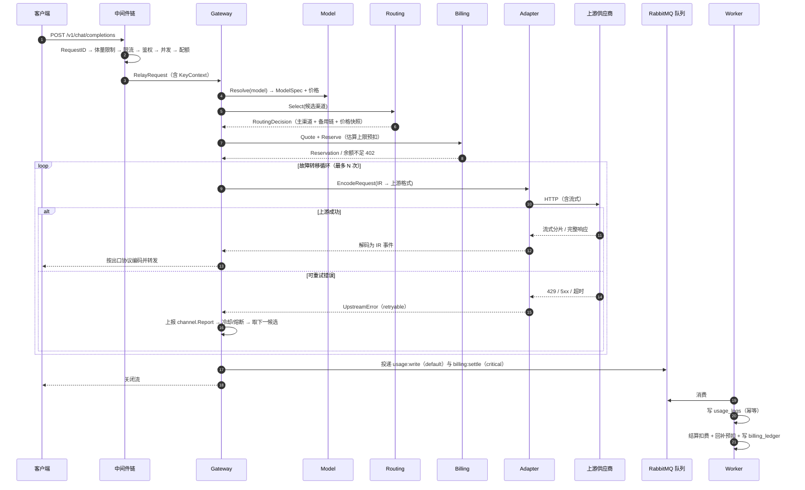
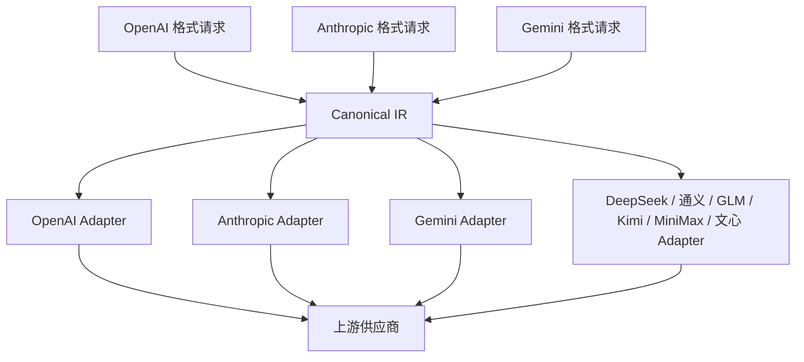
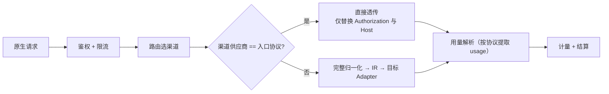
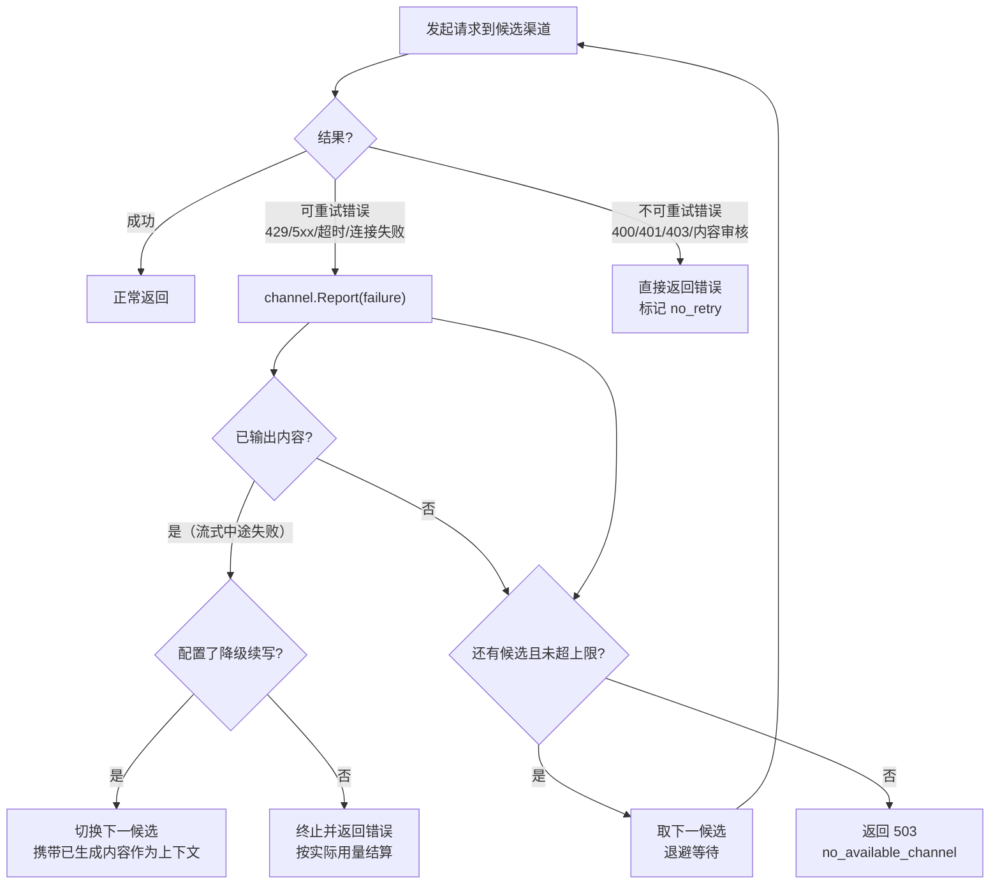
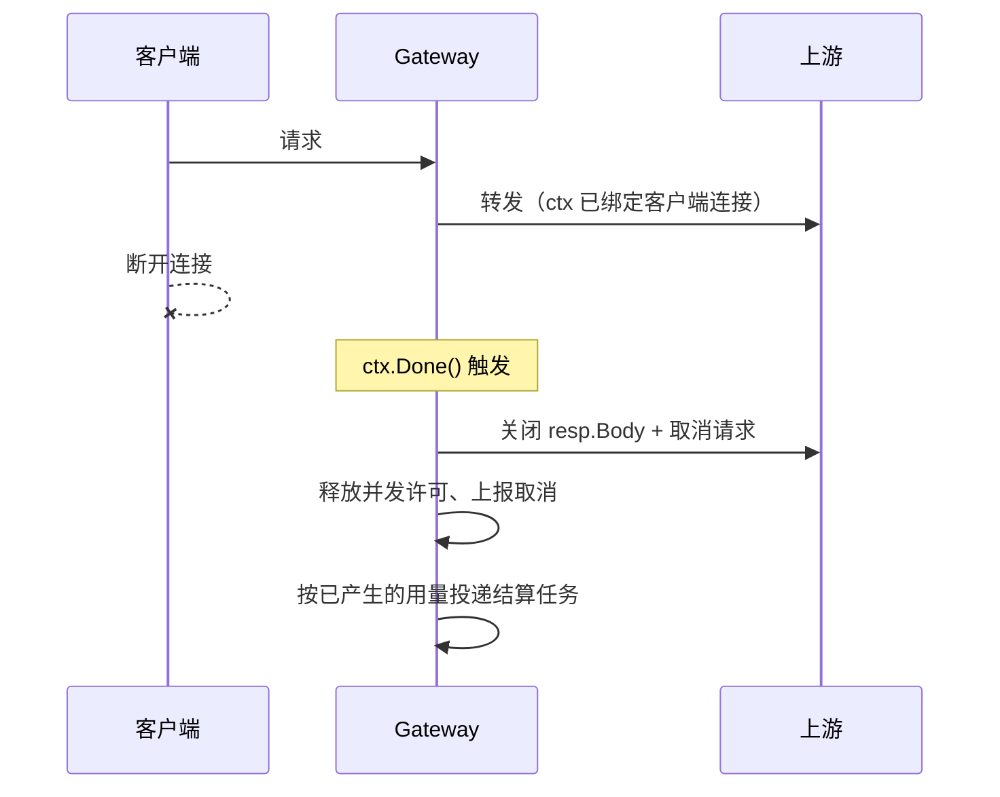

# 03 · 请求生命周期

> 本文描述一次 API 调用从进入到结束的完整链路：中间件顺序、IR 归一化、路由选路、协议编码、流式转发、计量结算、错误处理。
> 阅读本文后你应当能回答：一次请求经过哪些步骤、每步允许做什么、失败时如何兜底、为什么主链路上不能碰数据库。

---

## 1. 全链路概览



---

## 2. 中间件链

顺序至关重要：越靠前越早拒绝非法流量，成本越低。


| 中间件 | 失败响应 | 依赖 | 说明 |
| --- | --- | --- | --- |
| RequestID | — | 无 | 优先取客户端 `X-Request-ID`，缺失则生成；**重试时必须保持不变**，是幂等基石 |
| 请求体限制 | 413 | 无 | 限制（如 8MB），超限直接拒绝，避免大 body 打爆内存 |
| 全局限流 | 429 | Redis | IP + 路径维度令牌桶，抗 CC |
| API Key 鉴权 | 401 | Redis → PG | 哈希查缓存，未命中回源 PG 并回填；**Redis 不可用时降级为直查 PG（每次查询、不回填）**——服务可用但延迟上升，这也是 readiness 探针不含 Redis 的原因（[09 §7](./09-observability.md#7-健康检查端点)） |
| 用户/Key 限流 | 429 | Redis | RPM / TPM 双桶，Key 级配置覆盖用户级 |
| 并发控制 | 429 | Redis | 用户级并发计数，`Acquire`/`Release` 成对 |
| 配额校验 | 429 | PG/Redis | 日/月额度，用 Redis 计数器避免每次查库 |
| 模型授权 | 403 | 内存 | 校验 `KeyContext.AllowedModels` |
| 审计采样 | — | 异步 | 按采样率记录脱敏摘要，**不记录完整 body** |

> **性能约束**：步骤 3~8 中，除鉴权缓存未命中外，**全部只访问 Redis**。任何需要同步查 PG 的操作都必须移到异步侧或预热到 Redis。

---

## 3. 统一中间表示（Canonical IR）

### 3.1 为什么需要 IR

若每接入一家新供应商都要写"对外协议 ↔ 该供应商协议"的双向转换，N 家供应商 × 3 种出口协议 = 3N 个转换器。引入 IR 后只需 N 个（IR ↔ 供应商），出口侧 3 个（IR ↔ 出口协议），共 N+3 个。



### 3.2 IR 结构定义

```go
// CanonicalRequest 是平台内部统一的请求表示。
// 设计原则：覆盖主流能力的交集，各厂商特性通过 Extensions 逃生舱承载。
type CanonicalRequest struct {
    Model       string            // 对外模型名（未映射）
    Messages    []Message         // 归一化消息数组
    System      string            // 独立 system（便于各家注入方式不同）
    Tools       []Tool            // 工具定义
    ToolChoice  any               // auto | none | {type, name}
    Params      GenerateParams    // 生成参数
    Stream      bool
    Extensions  map[string]any    // 厂商特有字段，如 gemini.generationConfig
}

type Message struct {
    Role       Role               // system | user | assistant | tool
    Content    []ContentPart      // 多模态片段数组（纯文本时为单元素）
    Name       string             // 可选，多角色区分
    ToolCallID string             // role=tool 时必填
    ToolCalls  []ToolCall         // role=assistant 时可能有
    Reasoning  string             // 思考链内容（Anthropic thinking、OpenAI reasoning）
}

type ContentPart struct {
    Type     PartType            // text | image_url | image_base64 | file | audio
    Text     string
    ImageURL *ImageURL           // URL 或 base64 + mime
    FileRef  *FileRef
}

type GenerateParams struct {
    MaxTokens        *int
    Temperature      *float64
    TopP             *float64
    TopK             *int
    Stop             []string
    PresencePenalty  *float64
    FrequencyPenalty *float64
    Seed             *int64
    ResponseFormat   *ResponseFormat  // text | json_object | json_schema
    ReasoningEffort  string           // low | medium | high
    User             string           // 上游透传的用户标识
}

// CanonicalResponse 统一响应表示。
type CanonicalResponse struct {
    ID           string
    Model        string        // 上游返回的模型名
    Choices      []Choice
    Usage        Usage
    FinishReason FinishReason  // stop | length | tool_calls | content_filter | error
    Extensions   map[string]any
}

type Choice struct {
    Index        int
    Message      Message
    FinishReason FinishReason
}

type Usage struct {
    InputTokens      int
    OutputTokens     int
    CacheReadTokens  int
    CacheWriteTokens int
    Source           UsageSource  // Upstream | Partial | Estimated，见 06 §11.1
}

// StreamEvent 流式事件，由 Adapter 解码后统一投递。
type StreamEvent struct {
    Type         StreamEventType  // Delta | ReasoningDelta | ToolCallDelta | Usage | Error | Done
    Delta        string
    ToolCallDelta *ToolCallDelta
    Usage        *Usage
    FinishReason FinishReason
    Err          error
}
```

### 3.3 设计要点

1. **Content 用数组而非字符串**：纯文本时是单元素数组，但天然支持多模态，避免后续大改。
2. **System 独立字段**：OpenAI 放在 messages 里、Anthropic 放在顶层 `system`、Gemini 放在 `systemInstruction`，由 Adapter 各自归位。
3. **Extensions 逃生舱**：厂商特有字段（如 Gemini 的 `safetySettings`、文心的 `penalty_score`）放这里，Adapter 自行解释。避免 IR 为兼容小众特性而膨胀。
4. **Usage 带 Source 标记**：上游返回完整 usage 时标记 `Upstream`；仅有 input（output 用估算）标记 `Partial`；无 usage 全量估算标记 `Estimated`。三态与 `usage_logs.usage_source` 一一对应，便于后续识别计费精度问题（见 [06 §11.1](./06-billing-payment.md#111-用量采集的四类情况)）。
5. **IR 不覆盖 embedding**：嵌入/重排序是**非对话类**能力，与 `CanonicalRequest` 的消息结构不同形。首期不纳入 IR（`/v1/embeddings` 列为二期，见 [07 §2.1](./07-api-sdk.md#21-openai-兼容主入口)），二期通过新增 `EmbeddingRequest` 独立结构与 `billing_mode=per_request` 接入，不污染对话 IR。

---

## 4. 详细流程分解

### 4.1 阶段一：归一化（Ingress Normalize）

```
出口协议请求 → 出口协议解码器 → CanonicalRequest
```

- OpenAI 兼容入口：`messages[].content` 可能是字符串或数组，统一转 `[]ContentPart`。
- Anthropic 原生入口：`/v1/messages` 的 `system` 字段映射为 `IR.System`。
- Gemini 原生入口：走**透传短路**（见 §4.6），仅在需要跨供应商降级时才完整归一化。

**参数校验**：在此阶段完成，`max_tokens` 超过模型上限时直接裁剪或报错（可配置），避免把无效请求发到上游浪费额度。

### 4.2 阶段二：模型解析与路由

```
ModelService.Resolve(model) → ModelSpec（上下文、能力、当前价格）
Router.Select(SelectInput) → RoutingDecision
```

关键输出是 `PriceSnapshot`——把当次生效的价格固化下来，后续异步结算直接用快照计算，避免调价导致账单漂移。

### 4.3 阶段三：额度预扣

```
BillingService.Quote(...)  → 估算费用上限
BillingService.Reserve(...) → 冻结额度
```

估算方式：`输入 token 数（本地 tokenizer 快速估算）× 输入单价 + max_tokens × 输出单价`，再乘分组倍率。预扣是**保守上限**，实际结算时多退少补。

预扣失败（余额不足）返回 `402 Payment Required`，不发起上游请求。

### 4.4 阶段四：编码与转发

```
Adapter.EncodeRequest(IR, Channel, UpstreamModel) → *http.Request
```

- 应用渠道级模型映射（`gpt-4o` → `gpt-4o-2024-11-20`）。
- 注入凭证（从加密存储解密，仅在内存中）。
- 应用回源代理（若配置）。
- 设置超时：连接超时 5s、首字节超时（可配置，默认 60s）、整体无超时（由请求上下文控制）。

**流式转发要点**（Go 惯用法）：

| 要点 | 做法 |
| --- | --- |
| 逐块转发 | 用 `bufio.Reader` 逐行读 SSE，写入端立即 `Flush()`，不整包缓存 |
| 背压 | 客户端读取慢时上游写入阻塞，由 TCP 滑动窗口自然限流 |
| 取消传播 | 客户端断开 → `ctx` 取消 → 关闭上游 `resp.Body` → 上游感知断开 |
| 首字计时 | 收到第一个 delta 时记录 `first_token_ms` |
| 心跳 | 长时间无数据（如 reasoning 阶段）按配置发送注释行保活 |
| 错误隔离 | Adapter 的解码 goroutine panic 由 `recover` 兜住，转为 error 事件而非崩溃 |

### 4.5 阶段五：计量与结算（异步）

流式结束后（或错误终止时）：

```go
// 主链路只做这两件事，耗时 < 1ms
enqueuer.Enqueue(ctx, Task{
    Type:  TaskUsageWrite,
    Queue: QueueDefault,
    Key:   "usage:" + requestID,
    Payload: mustJSON(usageRecord),
})
enqueuer.Enqueue(ctx, Task{
    Type:  TaskBillingSettle,
    Queue: QueueCritical,
    Key:   "settle:" + requestID,
    // Payload 自包含：用量 + 价格快照 + 归属字段，不依赖 usage_logs 落库顺序
    //（usage:write 在 default 队列，与本任务并发，见 06 §4.1）。
    Payload: mustJSON(settleInput),
})
```

Worker 侧处理顺序：

1. `usage:write`：写 `usage_logs`（幂等键 `usage:<request_id>`，`ON CONFLICT DO NOTHING`）。
2. `billing:settle`：
   - 抢占幂等键 `settle:<request_id>`；
   - 按 `PriceSnapshot` 计算真实费用；
   - 与预扣金额比对：多退（写 `refund` 流水）少补（写 `settle` 流水）；
   - 扣减套餐额度（若有有效订阅）；
   - 更新 `user_balances`（条件更新，保证不透支）；
   - 写 `billing_ledger`。
3. `stats:aggregate`：增量更新 `usage_daily_stats`。

> **为什么结算与日志分开两个任务**：日志是诊断数据，允许延迟；结算是资金数据，必须及时。放在不同队列可避免日志洪峰阻塞结算。

### 4.6 原生协议透传路径

使用 Anthropic / Gemini 原生入口且目标渠道属于同一供应商时，走短路路径：



透传路径**不做协议转换**，保证厂商特有语义零失真；计量通过对应协议的 usage 解析逻辑提取。

---

## 5. 故障转移循环



**判定规则**：

| 条件 | 是否切换渠道 |
| --- | --- |
| 连接失败 / 超时 / 502 / 503 / 504 | 是 |
| 429（上游限流） | 是，并冷却该渠道至 `rate_limit_reset_at` |
| 500（上游内部错误） | 是，累计失败数，触发熔断阈值则熔断 |
| 400 / 401 / 403 / 404 | **否**（请求本身有问题，换渠道也是同样结果） |
| 413（请求过大） | 否，返回明确错误 |
| 内容审核拒绝 | 否，返回 `content_filter` |
| 流式中途失败且已输出内容 | 视配置（默认终止，避免重复计费与内容错乱） |

**上限控制**（参考 sub2api `failover_loop.go` 的思路并简化）：

| 参数 | 默认值 | 说明 |
| --- | --- | --- |
| `max_switches` | 3 | 单次请求最多切换渠道次数 |
| `max_same_channel_retries` | 2 | 同渠道重试次数（仅对明确可原地重试的错误）。**命名以 channel 为准**，配置键见 [10 §3.2](./10-deployment.md#32-配置项清单按模块)；sub2api 中对应的 `maxSameAccountRetries` 是历史命名，本平台不沿用 |
| `same_retry_base_delay` | 500ms | 同渠道重试间隔，指数退避 |
| `max_request_scoped_delay` | 8s | 单次请求内累计退避上限，防止把请求拖成分钟级 |
| `switch_backoff` | 200ms | 切换渠道前的短暂间隔 |

> **为什么限制单次请求的总退避时间**：上游大面积故障时，若每个请求都重试 10 次 × 30s，会把连接池和 goroutine 全部占满，导致雪崩。限制总时长让请求快速失败，把资源留给可成功的请求。

---

## 6. 取消与超时



| 场景 | 处理 |
| --- | --- |
| 客户端主动断开 | 立即取消上游请求，释放并发名额；**已产生的用量照常计费**（上游已消耗） |
| 上游超时未返回首字节 | 计入失败，切换下一候选 |
| 上游首字节后长时间无数据 | 按 `stream_idle_timeout`（默认 120s）判定失败 |
| 平台整体超时 | 由客户端控制；平台侧不设整体上限（长推理可能持续数分钟） |
| 优雅关闭 | 停止接新请求，等待在途请求最多 30s，超时强制关闭并结算已产生用量 |

> **Go 实现要点**：用 `context.WithCancel` 串联客户端连接与上游请求；`http.Request` 必须携带 ctx；`resp.Body` 用 `defer` 关闭并在取消时主动 `Close()`；所有 goroutine 必须能响应 ctx 退出，避免泄漏（用 `errgroup` 统一管理）。

---

## 7. 错误码映射

### 7.1 上游错误 → 平台错误

> **两张错误码表的关系（避免混淆）**：本表是**内部归一化表**——Adapter 把上游错误翻译为平台内部错误码与重试语义，驱动故障转移决策（中间态）；[07-api-sdk §5.2](./07-api-sdk.md#52-错误码表) 是**对外输出表**——故障转移耗尽后最终返回给客户端的错误（终态）。二者不是同一张表：
>
> | 场景 | 内部（本表） | 对客户端（07） |
> | --- | --- | --- |
> | 用户密钥无效 | 不经过本表（鉴权中间件直接拒绝） | `invalid_api_key` / 401 |
> | 上游密钥无效（渠道凭证错误） | `upstream_auth_failed` → 渠道标记 error 并切换 | 切换成功则客户端无感知；全部耗尽 → `no_available_channel` / 503 |
> | 所有候选渠道都 429 | `upstream_rate_limited` → 逐个冷却并切换 | `rate_limited` / 429 + `Retry-After` |
> | 余额不足 | 不经过本表（预扣阶段拒绝） | `insufficient_balance` / 402 |


> **错误码的权威定义在 [07 §5.2](./07-api-sdk.md#52-错误码表)**。本表是**上游状态码 → 平台错误码**的映射规则（07 是"平台错误码 → HTTP 状态 + 客户端处置"）。两处必须同时登记，新增错误码时先改 07 再改本表。

| 上游状态码 | 平台错误码 | HTTP 响应 | 可重试 | 动作 |
| --- | --- | --- | --- | --- |
| 400 | `invalid_request` | 400 | 否 | 返回上游错误信息（脱敏后） |
| 401 | `upstream_auth_failed` | 502 | 否 | 渠道标记 error，切换 |
| 403 | `permission_denied` | 403 | 否 | 切换；连续出现则禁用渠道并告警 |
| 404 | `model_not_found` | 404 | 否 | 检查模型映射配置 |
| 413 | `request_too_large` | 413 | 否 | 返回明确提示 |
| 429 | `upstream_rate_limited` | 429 | 是 | 冷却渠道至 reset 时间，切换 |
| 500 | `upstream_internal_error` | 502 | 是 | 累计失败，可能触发熔断 |
| 502/503/504 | `upstream_unavailable` | 503 | 是 | 切换 |
| 529（过载） | `upstream_overloaded` | 503 | 是 | 冷却至 `overload_until`，切换 |
| 超时 | `upstream_timeout` | 504 | 是 | 切换 |
| 上下文超长 | `context_length_exceeded` | **400** | 否 | 返回模型的上下文上限提示。**统一为 400**（与 OpenAI 官方一致；07 早期版本写作 422，已更正） |
| 内容审核拒绝 | `content_filter` | 400 | 否 | 归一化后不重试，见 [08 §9](./08-security.md#9-内容安全与合规) |

### 7.2 平台侧错误响应格式

统一 OpenAI 风格，保证客户端 SDK 能正常解析。**错误对象必须携带 `request_id`**（排障主键，前端与 SDK 均依赖它，见 [07 §5.1](./07-api-sdk.md#51-错误响应格式对外调用接口)）：

```json
{
  "error": {
    "message": "Upstream service temporarily unavailable",
    "type": "cloudfog_error",
    "code": "upstream_unavailable",
    "param": null,
    "request_id": "req_01HZX8K3M4N5P6Q7R8S9T0V1W2"
  }
}
```

响应头补充（**完整清单，与 [07 §2.1](./07-api-sdk.md#21-openai-兼容主入口) 合并后的一致版本**）：

| 头 | 说明 |
| --- | --- |
| `X-Request-ID` | 请求唯一标识，用于排障 |
| `X-CloudFog-Model` | 实际使用的上游模型（降级时与原模型不同） |
| `X-CloudFog-Provider` | 实际供应商 code |
| `X-CloudFog-Degraded` | `true` 表示本次请求发生了降级 |
| `X-CloudFog-Switches` | 故障转移次数 |
| `X-CloudFog-Channel` | 渠道 ID（**仅管理员/超管身份可见**，普通用户不返回，避免泄露内部拓扑） |
| `X-CloudFog-Notice` | 存在未读重要公告时提示（可选，见 [13 §2.2](./13-operations.md#22-能力设计)） |
| `X-RateLimit-Limit` / `-Remaining` / `-Reset` | 限流余量 |
| `Retry-After` | 429 / 503 时返回建议重试间隔 |

---

## 8. 性能约束清单

| 约束 | 要求 | 检查方式 |
| --- | --- | --- |
| 主链路禁止同步 DB 写 | 0 次 | 代码审查 + 压测时监控 PG 写入 QPS |
| 鉴权缓存命中率 | > 99% | Prometheus 指标 |
| 首字延迟增量 | 平台引入 < 30ms（P95） | 与直连上游对比压测 |
| 每请求内存分配 | 流式转发不整包缓存，常驻 < 64KB | pprof heap |
| goroutine 泄漏 | 请求结束后归零 | 压测后 `runtime.NumGoroutine()` |
| 连接复用 | 上游连接池命中率 > 95% | `httptrace` 指标 |

---

## 9. 参考来源（sub2api）

| 本设计点 | 参考位置 | 关系 |
| --- | --- | --- |
| 故障转移循环结构 | `internal/handler/failover_loop.go`：`FailoverAction`（Continue/Exhausted/Canceled）、`FailoverState`（SwitchCount / MaxSwitches / FailedAccountIDs / SameAccountRetryCount） | 沿用结构，简化决策树 |
| 同账号重试与退避上限 | 同文件：`maxSameAccountRetries=3`、`sameAccountRetryDelay=500ms`、`maxRequestScopedRetryDelay=8s`、`singleAccountBackoffDelay=2s` | 沿用数值区间，合并为统一参数表 |
| 错误可重试性判定 | 同文件：`UpstreamFailoverError` 的 `RetryableOnSameAccount`、`SameAccountRetryMax`、`SameAccountRetryDeadline`、`RequestScopedTransient` 字段 | 沿用"错误自带重试语义"的设计，而非硬编码状态码 |
| 重试耗尽后临时封禁 | 同文件：`TempUnscheduleRetryableError` | 沿用，对应本平台的 `temp_unschedulable_until` |
| 流式故障转移 | `internal/handler/gateway_handler_stream_failover_test.go`、`openai_gateway_reasoning_failover.go` | 参考"已输出内容时的处理策略" |
| 请求体大小限制与切换 | `internal/handler/request_body_limit.go`、`openai_body_limit_failover_test.go` | 沿用前置限制思路 |
| 幂等 | `internal/handler/idempotency_helper.go` | 沿用请求级幂等思路 |
| 网关取消传播 | `internal/handler/gateway_handler_cancellation_test.go` | 沿用 |