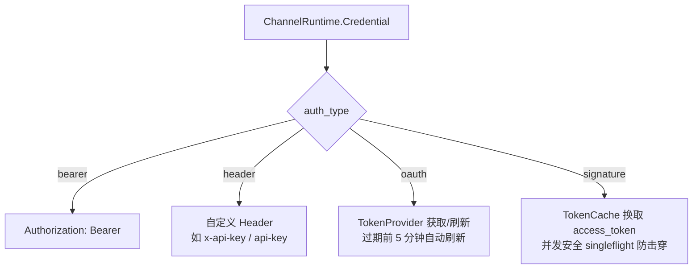
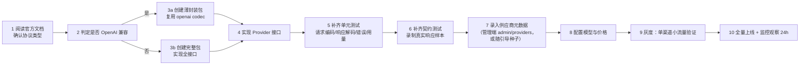

# 04 · 供应商适配器规范

> 本文定义 Provider/Adapter 的接口契约、协议转换矩阵，以及 10 家主流供应商的接入要点。
> 阅读本文后你应当能回答：新增一家供应商要写哪些代码、各家协议的坑在哪里、转换时哪些语义会丢。

---

## 1. 适配层的职责边界

| 负责 | 不负责 |
| --- | --- |
| IR ↔ 上游协议的双向编解码 | 渠道选择（routing 负责） |
| 上游模型名映射 | 凭证获取与解密（channel 负责，通过入参传入） |
| 用量（usage）提取 | 计费计算（billing 负责） |
| 上游错误归一化（含可重试判定） | 重试与切换决策（gateway 依据归一化结果决策） |
| 健康检查请求构造 | 调度状态维护 |

**关键设计**：Adapter 是**无状态**的。所有渠道相关信息（凭证、BaseURL、模型映射、代理）通过入参传入，Adapter 自身不持有任何可变状态，因此可以被所有渠道共享（同一供应商的 N 个渠道共用一个 Adapter 实例）。

---

## 2. Provider 接口规范

```go
// Provider 是一家上游供应商的统一抽象。
// 实现必须是无状态、并发安全的：同一实例会被多个渠道、多个 goroutine 同时使用。
type Provider interface {
    // Code 返回供应商唯一标识，与 providers.code 对应。
    Code() string

    // Protocol 返回上游协议类型，决定是否需要完整 IR 转换。
    Protocol() Protocol

    // Capabilities 返回该供应商支持的能力集，用于路由时的硬过滤。
    Capabilities() CapabilitySet

    // EncodeRequest 把 IR 编码为上游 HTTP 请求。
    // in.Channel 提供凭证、BaseURL、模型映射、代理配置。
    // in.UpstreamModel 是已完成映射的模型名。
    EncodeRequest(ctx context.Context, in EncodeInput) (*http.Request, error)

    // DecodeResponse 解码非流式响应为 IR。
    DecodeResponse(ctx context.Context, b []byte) (*CanonicalResponse, error)

    // DecodeStream 解码 SSE 流，返回事件 channel。
    // 实现必须保证：ctx 取消或输入结束时关闭 channel，且不会泄漏 goroutine。
    DecodeStream(ctx context.Context, r io.Reader) (<-chan StreamEvent, error)

    // ExtractUsage 从响应中提取用量。流式场景下由 DecodeStream 在 Done 事件附带，
    // 若上游未在流中返回 usage，则由本方法尝试从累积 delta 估算。
    ExtractUsage(resp *CanonicalResponse) (*Usage, error)

    // NormalizeError 把上游错误归一化为平台错误，并给出重试语义。
    NormalizeError(statusCode int, body []byte) *UpstreamError

    // BuildHealthCheck 构造健康检查请求（低频、小 token）。
    BuildHealthCheck(ctx context.Context, in EncodeInput) (*http.Request, error)
}

type EncodeInput struct {
    Request       *CanonicalRequest
    UpstreamModel string
    Channel       ChannelRuntime   // 凭证（已解密）、BaseURL、代理、Header 覆盖
    RequestID     string
    Stream        bool
}

type ChannelRuntime struct {
    ID           int64
    ProviderCode string
    BaseURL      string
    Credential   Credential      // 已解密，仅存在于内存中
    Extra        map[string]any
    ProxyURL     string
    HeaderOverride map[string]string
    Timeout      TimeoutSpec
}

// UpstreamError 归一化后的上游错误。
// 关键点：重试语义由 Adapter 声明，而非 gateway 硬编码状态码。
// 上游新增错误类型时，只需改对应 Adapter，gateway 逻辑不动。
type UpstreamError struct {
    Code            string        // 平台错误码
    HTTPStatus      int           // 对客户端返回的状态码
    Message         string        // 已脱敏的用户可见信息
    Retryable       bool          // 是否可切换到其他渠道重试
    RetryableOnSame bool          // 是否可在同一渠道原地重试（如瞬时 429）
    RetryAfter      time.Duration // 上游建议的重试等待（解析 Retry-After 头）
    TriggersCircuit bool          // 是否计入熔断统计
    CoolDownUntil   *time.Time    // 上游明确给出的恢复时间
}
```

### 2.1 注册与发现

```go
// 各 Adapter 包在 init 中自注册，主程序 import 触发注册（空导入）。
// 例：import _ "cloudfog/internal/pkg/adapter/deepseek"

package adapter

var registry = map[string]Provider{}

func Register(p Provider) {
    if _, exists := registry[p.Code()]; exists {
        panic("duplicate provider: " + p.Code())
    }
    registry[p.Code()] = p
}

func Get(code string) (Provider, bool) {
    p, ok := registry[code]
    return p, ok
}

func All() []Provider { /* 返回全部已注册适配器 */ }
```

**为什么用 init 自注册**：新增供应商只需新增一个包 + 一行空导入，无需修改注册表文件，符合开闭原则。重复注册时 `panic` 在启动期暴露问题，而非运行时。

### 2.2 目录组织

```
internal/pkg/adapter/
├── provider.go          # Provider 接口、UpstreamError、注册器
├── registry.go
├── openai/              # OpenAI 及所有 OpenAI 兼容厂商
│   ├── provider.go
│   └── codec.go
├── anthropic/           # Anthropic Messages API
├── gemini/              # Google Gemini native
├── deepseek/            # 以下为国内厂商
├── qwen/                # 阿里云通义千问
├── glm/                 # 智谱 GLM
├── moonshot/            # Kimi
├── minimax/
├── wenxin/              # 百度文心一言
└── shared/              # 各家共用的编解码工具（SSE 解析、多模态转换等）
```

> 国内厂商大多提供 OpenAI 兼容端点，可基于 `openai` 包做**薄封装**（复用编解码，只覆盖鉴权签名、特殊参数、错误格式差异），通常 200~400 行即可完成一家。

---

## 3. 协议转换矩阵

### 3.1 消息与角色

| IR | OpenAI 兼容 | Anthropic | Gemini |
| --- | --- | --- | --- |
| `system` | `messages[].role=system` | 顶层 `system`（或 `system: [{type:"text"}]`） | `systemInstruction.parts` |
| `user` | `role=user` | `role=user` | `role=user` |
| `assistant` | `role=assistant` | `role=assistant` | `role=model` |
| `tool` | `role=tool` + `tool_call_id` | `role=user` + `content[].type=tool_result` | `role=function` + `functionResponse` |
| 连续同角色消息 | 允许 | **必须合并**（不允许连续同角色） | 允许 |

**坑点与处理**：

- **Anthropic 要求 user/assistant 严格交替**。IR 中出现连续同角色消息时，Adapter 需自动合并（用 `\n\n` 连接文本部分）。
- **Anthropic 首条必须是 user**。若 IR 首条是 assistant，Adapter 需插入占位 user 消息或报错。
- **Gemini 角色只有 user/model**，system 单独走 `systemInstruction`。

### 3.2 多模态内容

| IR ContentPart | OpenAI 兼容 | Anthropic | Gemini |
| --- | --- | --- | --- |
| `text` | `{type:"text", text}` | `{type:"text", text}` | `{text}` |
| `image_url`（URL） | `{type:"image_url", image_url:{url}}` | `{type:"image", source:{type:"url", url}}` | `{inline_data}` 需下载后转 base64 |
| `image_base64` | `{type:"image_url", image_url:{url:"data:image/png;base64,..."}}` | `{type:"image", source:{type:"base64", media_type, data}}` | `{inline_data:{mime_type, data}}` |
| `file`（PDF 等） | 部分支持 | `{type:"document", source:{...}}` | `{inline_data}` |
| `audio` | 少部分支持 | 不支持 | `{inline_data}` |

**处理策略**：

1. 目标渠道不支持某模态时，在**路由阶段硬过滤**掉（通过 `Capabilities` 声明），而非转发后报错。
2. Gemini 不支持图片 URL，需要下载转 base64。为避免主链路阻塞与 SSRF 风险，下载走独立的 `media fetcher`，带大小限制（如 20MB）、超时（5s）与内网地址黑名单；失败则路由到支持 URL 的渠道。

### 3.3 工具调用（Function Calling）

| 环节 | OpenAI 兼容 | Anthropic | Gemini |
| --- | --- | --- | --- |
| 工具定义 | `tools[].function.{name,description,parameters}` | `tools[].{name,description,input_schema}` | `tools[].functionDeclarations[].{name,description,parameters}` |
| 强制调用 | `tool_choice` | `tool_choice.{type:tool, name}` | `toolConfig.functionCallingConfig.{mode, allowedFunctionNames}` |
| 模型返回调用 | `message.tool_calls[]` | `content[].type=tool_use` | `parts[].functionCall` |
| 回传结果 | `{role:tool, tool_call_id, content}` | `{role:user, content:[{type:tool_result, tool_use_id, content}]}` | `{role:function, parts:[{functionResponse:{name, response}}]}` |
| 并行调用 | 支持 | 支持 | 支持 |

**转换注意**：

- Anthropic 的 `input_schema` 就是 JSON Schema，与 OpenAI 的 `parameters` 语义一致，可直接映射。
- Gemini 的 `functionResponse.response` 要求是**对象**（`{result: ...}`），不能是裸字符串，需包装。
- 各家对 JSON Schema 的支持度不同（`required`、`$ref`、嵌套深度），IR 层需提供 `SchemaSanitizer` 按目标平台做降级简化。

### 3.4 结构化输出

| 方式 | OpenAI 兼容 | Anthropic | Gemini |
| --- | --- | --- | --- |
| JSON 模式 | `response_format:{type:"json_object"}` | 通过 system prompt 约束 + prefill `{` | `responseMimeType:"application/json"` |
| JSON Schema | `response_format:{type:"json_schema", json_schema}` | 不支持（需 prompt 约束） | `responseSchema` |

**降级策略**：目标不支持 `json_schema` 时，Adapter 把 Schema 渲染为自然语言指令追加到 system，并在响应侧做 JSON 提取与校验；校验失败不重试（成本过高），返回 `invalid_response_format` 错误并在日志中标记。

### 3.5 思考链 / Reasoning

| 平台 | 表示方式 | IR 映射 |
| --- | --- | --- |
| OpenAI o 系列 | `reasoning_effort` 参数；响应含 `reasoning` 字段（部分接口） | `GenerateParams.ReasoningEffort` → `Extensions` |
| Anthropic | `thinking:{type:"enabled", budget_tokens}`；响应 `content[].type=thinking` | `Message.Reasoning` ↔ `thinking` |
| Gemini | `thinkingConfig.thinkingBudget` | 同上 |
| DeepSeek-R1 | 响应 `reasoning_content` 字段 | `Message.Reasoning` |

**统一处理**：IR 用 `Message.Reasoning` + `GenerateParams.ReasoningEffort` 两处承载。流式时通过 `StreamEventType.ReasoningDelta` 单独投递，出口侧按协议编码（OpenAI 兼容出口**统一用 `delta.reasoning_content`**，与 DeepSeek 一致；`delta.reasoning` 不再输出，见 [07 §2.1.1](./07-api-sdk.md#211-出口响应体与-sse-契约)）。

**注意**：若目标供应商不支持 reasoning 而请求携带了 `reasoning_effort`，Adapter 应**静默忽略**该参数（而非报错），并在响应中标记 `capability_downgraded`。

### 3.6 流式（SSE）

| 平台 | 数据行格式 | 结束标志 | usage 位置 |
| --- | --- | --- | --- |
| OpenAI 兼容 | `data: {json}\n\n` | `data: [DONE]` | 需在请求带 `stream_options:{include_usage:true}` 才有；否则流结束后单独出现 |
| Anthropic | `event: content_block_delta\ndata: {...}` | `event: message_stop` | `message_start` 给输入 token，`message_delta` 给输出 token |
| Gemini | `data: {json}\n\n`（SSE）或 `alt=sse` | 流关闭 | 最后一个 chunk 的 `usageMetadata` |

**统一处理要点**：

1. **usage 补齐**：若上游流中未返回 usage（未带 `include_usage` 或厂商不支持），在流结束时用**本地 tokenizer 估算**输出 token，并标记 `Usage.Source = Estimated`，同时告警统计该类渠道的占比。
2. **`[DONE]` 后追加 usage**：OpenAI 兼容流在 `data: [DONE]` 之后不能再发内容。因此若上游 usage 在最后才到，需要在 `[DONE]` 之前插入一个 usage-only chunk，或直接省略（由估算兜底）。推荐做法：请求时统一带上 `include_usage:true`。
3. **工具调用增量**：`tool_calls[].arguments` 是增量拼接的 JSON 字符串，Adapter 需累积后在 Done 时做一次完整性与 JSON 合法性校验。

### 3.7 停止原因映射

| IR FinishReason | OpenAI | Anthropic | Gemini |
| --- | --- | --- | --- |
| `stop` | `stop` | `end_turn` | `STOP` |
| `length` | `length` | `max_tokens` | `MAX_TOKENS` |
| `tool_calls` | `tool_calls` | `tool_use` | （通过 parts 判断） |
| `content_filter` | `content_filter` | —（走错误） | `SAFETY` / `PROHIBITED_CONTENT` |
| `error` | — | `error` | — |

### 3.8 用量（usage）字段映射

| IR | OpenAI | Anthropic | Gemini |
| --- | --- | --- | --- |
| `InputTokens` | `prompt_tokens` | `input_tokens` | `promptTokenCount` |
| `OutputTokens` | `completion_tokens` | `output_tokens` | `candidatesTokenCount` |
| `CacheReadTokens` | `prompt_tokens_details.cached_tokens` | `cache_read_input_tokens` | `cachedContentTokenCount` |
| `CacheWriteTokens` | —（无） | `cache_creation_input_tokens` | —（无） |

**注意**：部分国产厂商的 usage 字段命名与 OpenAI 一致但**单位不同**（个别按字符数而非 token 计），接入时必须在 `ExtractUsage` 中做单位校验与换算，并在测试用例中用真实响应固定行为。

---

## 4. 供应商接入清单

| 供应商 | code | 协议 | 鉴权 | 关键差异点 | 预计工作量 |
| --- | --- | --- | --- | --- | --- |
| **OpenAI** | `openai` | OpenAI 兼容 | Bearer | 基线实现；`o` 系列 reasoning 参数；`stream_options` 才返回 usage； Responses API 与 Chat API 并存 | 基准 |
| **Anthropic** | `anthropic` | Anthropic 原生 | `x-api-key` + `anthropic-version` 头 | 消息须严格交替；system 独立；thinking budget；tool_result 走 user 角色；预填充（prefill）能力 | 大 |
| **Google Gemini** | `google` | Gemini 原生 | `x-goog-api-key` 或 OAuth | `contents/parts` 结构；`generationConfig`；`systemInstruction`；图片需 base64；安全设置 `safetySettings`。**code 为 `google`**（与 [02 §4.1](./02-data-model.md#41-providers-供应商元数据) 的枚举一致，此前写作 `gemini` 会导致 `channels.provider_code` 外键指向不存在的供应商）；adapter 包目录名沿用协议名 `gemini/`，包内 `Code()` 返回 `google` | 大 |
| **DeepSeek** | `deepseek` | OpenAI 兼容 | Bearer | 高度兼容；R1 系列 `reasoning_content` 字段；缓存命中统计有独立字段 | 小（薄封装） |
| **阿里通义千问** | `qwen` | OpenAI 兼容 / DashScope 原生 | Bearer | 兼容模式足够；原生模式有 `parameters.result_format`；部分模型支持 `enable_search` | 小 |
| **智谱 GLM** | `glm` | OpenAI 兼容 | Bearer（JWT 生成） | 兼容端点可用；部分模型 tool calls 结构有细微差异；需处理 `id` 格式 | 小 |
| **Moonshot Kimi** | `moonshot` | OpenAI 兼容 | Bearer | 高度兼容；上下文长度分级（8k/32k/128k）对应不同模型名，需在模型映射中区分 | 小 |
| **MiniMax** | `minimax` | OpenAI 兼容 / 原生 | Bearer + GroupID | 原生 API 需传 `GroupId`；兼容端点可用；部分参数（如 `mask_sensitive_info`）特有 | 中 |
| **百度文心一言** | `wenxin` | 文心原生 | **签名鉴权**（先换 access_token） | 需先用 `client_id/secret` 换 `access_token` 并缓存到过期前；请求 URL 带 `access_token` 参数；消息角色为 `user/assistant`；参数名差异大（`penalty_score`、`disable_search`）；错误结构与 OpenAI 完全不同 | 中 |
| **其他 OpenAI 兼容** | 各自 code | OpenAI 兼容 | Bearer | 复用 openai 包，仅覆盖 BaseURL 与错误格式 | 极小 |

### 4.1 鉴权方式处理



**签名鉴权（文心）要点**：

1. `access_token` 换取结果缓存在 Redis，过期前 5 分钟刷新。
2. 高并发下多个请求同时发现 token 过期时，用 `singleflight` 保证只换取一次，避免把额度耗在换取接口上。
3. token 换取失败视为渠道不可用，上报 `Report(failure)` 并触发冷却。

---

## 5. 健康检查规范

```go
// BuildHealthCheck 构造的请求必须满足：低频、小 token、不影响配额统计。
// 推荐：max_tokens=1 的极简请求，或调用 /v1/models 这类免费端点。
```

| 检查方式 | 触发时机 | 成本 | 用途 |
| --- | --- | --- | --- |
| **被动探测** | 每次真实调用 | 零 | 主要健康信号来源 |
| **主动探测** | 定时（默认 5 分钟，可配置；渠道处于 error/熔断态时提高到 1 分钟） | 极低 | 探测已故障渠道是否恢复 |
| **手动测试** | 管理员在控制台点"测试" | 低 | 配置校验 |

主动探测要求：

- 走 `low` 队列，全渠道错峰（避免同时打上游）。
- 使用专门的探测模型（最便宜的），`max_tokens=1`。
- 连续 N 次成功才把渠道从 error 恢复为 active（N 默认 2，避免抖动）。
- 探测产生的用量不计入用户账单，但计入渠道成本统计。

---

## 6. 新增供应商 SOP



**验收清单**：

- [ ] `EncodeRequest` / `DecodeResponse` / `DecodeStream` 三个方向均有测试
- [ ] `NormalizeError` 覆盖 400/401/403/429/500/502/503/529 及超时
- [ ] `ExtractUsage` 对真实响应样本的提取结果已固化断言
- [ ] 流式场景验证了 usage 补齐或估算路径
- [ ] 多模态、工具调用、JSON 模式（若支持）均有用例
- [ ] 健康检查请求已验证不会产生明显费用
- [ ] 敏感信息（密钥）未出现在日志与错误信息中
- [ ] 文档补充：能力集、限制、已知差异

---

## 7. 测试策略

| 测试类型 | 做法 | 目的 |
| --- | --- | --- |
| **单元测试** | 用 golden file：固定 IR 输入 → 断言编码后的 JSON；固定上游响应 → 断言解码后的 IR | 防止重构破坏转换逻辑 |
| **契约测试** | 录制真实上游响应样本（脱敏后）存入 `testdata/`，作为解码用例输入 | 防止上游格式变更后静默出错 |
| **往返测试** | OpenAI 请求 → IR → 目标协议 → IR → OpenAI 响应，断言语义等价（允许已知差异清单内的偏差） | 验证转换无损 |
| **流式测试** | 用 SSE 片段序列喂入，断言事件序列与最终 usage | 覆盖增量拼接、usage 补齐 |
| **混沌测试** | 注入截断的 SSE、非法 JSON、超大字段，断言不 panic 且返回明确错误 | 健壮性 |

**已知差异清单（Known Divergence）**：往返测试允许的差异必须显式登记在代码中，例如"Anthropic 不支持连续同角色消息，往返后会合并"。新增差异需评审。

---

## 8. 参考来源（sub2api）

| 本设计点 | 参考位置 | 关系 |
| --- | --- | --- |
| 按供应商分包组织 | `internal/pkg/openai/`、`anthropicfp/`、`gemini/`、`geminicli/`、`xai/`、`googleapi/`、`antigravity/`、`openai_compat/` | 沿用分包思路，本平台统一收敛到 `internal/pkg/adapter/` |
| 协议兼容转换层 | `internal/pkg/apicompat/`（48 个文件） | 参考其"兼容层独立成包"的做法；本平台 IR 化后该层职责更薄 |
| 请求/响应统一封装 | `internal/pkg/response/`、`internal/pkg/httputil/`、`internal/pkg/httpclient/` | 沿用：回源客户端集中管理连接池、代理、超时 |
| 模型映射 | `internal/service/antigravity_model_mapping.go`、`account_wildcard_test.go` | 沿用"渠道级映射 + 通配符"设计 |
| 厂商差异处理 | `internal/service/account_test_service_gemini.go`、`account_test_service_grok.go`、`account_test_service_cn_adaptive.go` | 参考"按厂商实现测试服务"的思路，本平台收敛为 `BuildHealthCheck` |
| 流式验证 | `internal/handler/openai_stream_validation.go` | 沿用"流式响应合法性校验" |