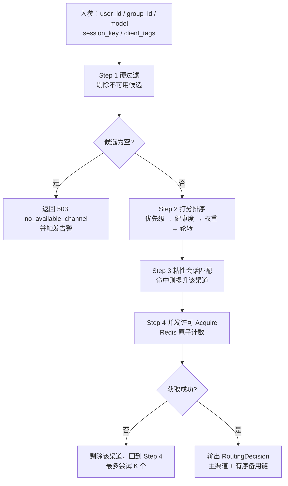
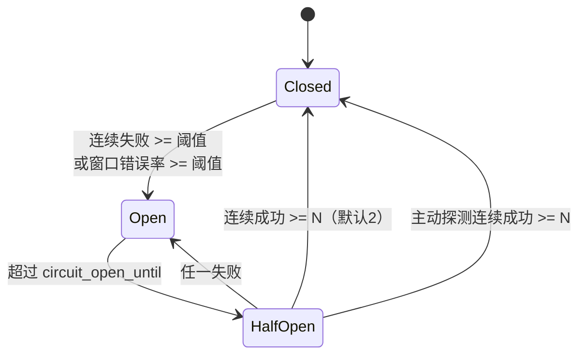
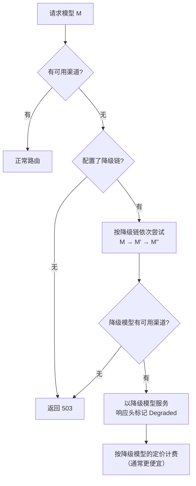

# 05 · 调度与容灾

> 本文描述渠道选择算法、并发与限流、健康检查、熔断、重试与降级策略。
> 阅读本文后你应当能回答：请求被分到哪个渠道、渠道挂了会怎样、为什么不会出现雪崩和重复扣费。

---

## 1. 整体决策流程



---

## 2. Step 1 · 硬过滤

任何一条不满足即从候选集剔除：

| 过滤条件 | 数据来源 | 说明 |
| --- | --- | --- |
| 渠道未删除、未禁用 | `channels.deleted_at` / `status` | |
| 属于用户分组 | `channel_groups` | 分组隔离 |
| 供应商支持该模型 | `providers` + `model_mappings` | 有映射或原生支持 |
| **供应商支持所需能力** | `providers.capabilities` | 请求含图片但渠道不支持视觉 → 剔除 |
| `schedulable = true` | `channels.schedulable` | 管理员手动暂停 |
| 未处于熔断 Open 态 | `channels.circuit_state` + `circuit_open_until` | |
| 未被限流冷却 | `rate_limit_reset_at > now` | |
| 未处于过载冷却 | `overload_until > now` | |
| 未被临时封禁 | `temp_unschedulable_until > now` | |
| 凭证未过期 | `expires_at` | 过期且 `auto_pause_on_expired=true` 则剔除 |
| 并发未满 | Redis 计数 vs `concurrency` | 在 Step 4 处理 |
| 模型在分组白名单内 | `groups.allowed_models` | |

**候选集缓存（静态/动态拆分）**：既要避免每个请求都查库，又要保证熔断/限流**即时生效**，缓存只放"低频变化"的部分：

| 部分 | 内容 | 存储与时效 |
| --- | --- | --- |
| **静态属性**（缓存 30s） | 渠道 ID 列表、优先级、权重、并发上限、能力集、模型映射、分组绑定 | Redis，TTL 30s；渠道/分组/映射**配置变更**时版本号广播失效 |
| **动态状态**（每次实时读） | 熔断状态与 `circuit_open_until`、限流冷却至、过载冷却至、临时封禁至、并发余量 | Redis 原子读写（Step 1 过滤与 Step 4 Acquire 直接查），**不缓存、不广播** |

> **为什么动态状态不走广播**：熔断与限流是高频事件（故障期每秒都可能发生），广播会造成风暴；且所有实例都把本实例的被动探测结果写入同一份 Redis（§6.1 的 `Report`），其他实例路由时实时读取即可看到，**天然跨实例一致**。静态属性才是低频的，才值得 30s TTL + 广播失效。此裁决与 [01 §11.3](./01-architecture.md#113-业务实体缓存失效)"熔断/限流不广播"一致。

---

## 3. Step 2 · 打分排序


| 层级 | 键 | 规则 | 目的 |
| --- | --- | --- | --- |
| 1 | `priority` | 升序 | 管理员的主权控制：把便宜/稳定的渠道排前面 |
| 2 | `health_score` | 降序 | 自动规避近期表现差的渠道 |
| 3 | `weight` | 加权随机 | 同档位内按比例分流（如 3:1 分配给两个渠道） |
| 4 | `last_used_at` | 升序 | 轮转，避免总是打同一个渠道触发上游限流 |

**health_score 计算**（由 `channel:probe` 与被动探测共同更新，0~100）：

```
score = 100
      - 25 * (近 5 分钟错误率)
      - 20 * (近 1 小时错误率)
      - 15 * (限流次数惩罚，按小时衰减)
      - 10 * (平均延迟超出基线的程度)
```

分数低于阈值（默认 30）的渠道自动进入**低优先级池**，仅在正常池为空时使用。

> **为什么用加权随机而非严格轮询**：严格轮询在渠道权重差异大时（如 10:1）会导致小权重渠道被连续跳过或集中命中。加权随机在长期统计上符合权重比例，且短期分布更平滑。

---

## 4. Step 3 · 粘性会话

### 4.1 目的

上游的 **prompt 缓存（prefix cache）** 命中能显著降低成本与延迟。若同一段系统提示词 + 历史对话每次落到不同渠道，缓存就永远命中不了。粘性会话让同一会话尽量复用同一渠道。

### 4.2 实现

```go
// 会话键：优先用请求中的 user 字段，
// 否则对"前 N 条消息 + system"做哈希（N 默认 2，取前缀即可区分会话）。
func deriveSessionKey(userID int64, req *CanonicalRequest) string {
    if req.Params.User != "" {
        return fmt.Sprintf("u:%d:user:%s", userID, hash(req.Params.User))
    }
    return fmt.Sprintf("u:%d:pfx:%s", userID, prefixHash(req.System, req.Messages, 2))
}
```

| 要素 | 取值 | 说明 |
| --- | --- | --- |
| 存储 | Redis `SET sticky:{group_id}:{session_key} {channel_id} EX 3600` | TTL 1 小时 |
| 命中处理 | 把该渠道排到候选队首 | 若该渠道不可用则正常回退 |
| 清理时机 | 渠道被切换（限流/故障）时**主动删除** | 避免后续请求继续走故障渠道 |
| 并发安全 | 用 `SET NX` 抢占；抢占失败说明已有绑定，直接沿用 | |

> 参考来源：sub2api `internal/service/antigravity_gateway_service.go` 使用 `sessionHash` + `groupID` 作为键、TTL 1 小时，并在切换账号时调用 `clearStickySession` 清理绑定。本平台沿用该设计，并把"粘性会话切换时强制按缓存计费"的语义下沉到计费模块。

### 4.3 注意事项

- **粘性不是强制**：目标渠道不可用时立即回退到正常调度，粘性只作为排序加权。
- **粘性不等于会话一致性**：不同渠道的模型版本可能不同，跨渠道继续对话可能风格突变。降级时需在响应头 `X-CloudFog-Degraded: true` 告知客户端。
- **隐私**：`Params.User` 可能含用户标识，哈希后存储，不落明文。

---

## 5. 并发控制

### 5.1 三层并发限制

| 层级 | 作用 | 实现 |
| --- | --- | --- |
| 用户级 | 防止单用户打满平台资源 | Redis 计数器 `conc:user:{id}`，上限来自 `KeyContext` |
| 渠道级 | 遵守上游并发上限 | Redis 计数器 `conc:ch:{id}`，上限 `channels.concurrency` |
| 全局 | 保护平台与下游 | 进程内信号量 + Redis 全局计数（可选） |

```go
// Acquire 用 Lua 脚本保证"判断 + 自增"的原子性，避免超限。
// KEYS[1]=计数键  ARGV[1]=上限  ARGV[2]=TTL(秒)
var acquireScript = redis.NewScript(`
local cur = tonumber(redis.call('GET', KEYS[1]) or '0')
if cur >= tonumber(ARGV[1]) then return 0 end
redis.call('INCR', KEYS[1])
redis.call('EXPIRE', KEYS[1], tonumber(ARGV[2]))
return 1
`)
```

**必须成对释放**：`Acquire` 成功后用 `defer Release()` 保证任何路径（成功、失败、panic、客户端取消）都会归还。计数键设置 TTL（如 5 分钟）作为兜底，防止进程崩溃后计数泄漏永久占用名额。

### 5.2 限流

| 维度 | 算法 | 键 |
| --- | --- | --- |
| IP 全局粗限流 | 令牌桶 | `rl:ip:{ip}` |
| 用户 RPM | 滑动窗口计数 | `rl:user:{id}:rpm` |
| 用户 TPM | 滑动窗口计数 | `rl:user:{id}:tpm` |
| API Key RPM/TPM | 滑动窗口计数 | `rl:key:{id}:rpm` |
| 分组 RPM | 滑动窗口计数 | `rl:group:{id}:rpm` |

限流响应带 `Retry-After` 与 `X-RateLimit-*` 头，与主流平台一致。

**Redis 故障降级**：Redis 不可用时退化为**进程内令牌桶**（按进程数分摊全局配额），并告警。宁可短暂放宽限流，也不能拒绝全部流量。

---

## 6. 健康检查

### 6.1 被动探测（主要信号）

每次真实调用的结果都作为健康信号，通过 `ChannelService.Report` 上报：

```go
type ReportInput struct {
    ChannelID   int64
    RequestID   string
    Success     bool
    StatusCode  int
    ErrorCode   string
    LatencyMS   int
    FirstTokenMS int
    RetryAfter  time.Duration
}
```

上报后的状态更新：

| 结果 | 状态更新 |
| --- | --- |
| 成功 | `health_score` 小幅回升；`circuit_fail_count` 归零；`last_used_at` 更新 |
| 429 | `rate_limited_at = now`；`rate_limit_reset_at = now + RetryAfter`（无则默认 60s）；health_score 扣减 |
| 529 / 503（过载） | `overload_until = now + backoff`；health_score 扣减 |
| 5xx | `circuit_fail_count++`；连续失败达阈值 → 熔断 |
| 401 / 403 | `status = error`（凭证问题，需人工介入）；告警 |
| 超时 | 同 5xx，但额外计入延迟惩罚 |

**状态字段的写入者与恢复条件（原设计未定义，实现必读）**：

| 字段 | 写入者 | 恢复条件 |
| --- | --- | --- |
| `status = error` | `ChannelService.Report`（401/403） | **不自动恢复**。由 `channel:probe` 主动探测连续成功 `N`（默认 2，见 [04 §5](./04-provider-adapter.md#5-健康检查规范)）后置回 `active`；或管理员在控制台手动恢复 |
| `circuit_state` | 熔断状态机（内存 + DB 快照） | 见 §7 状态机 |
| `rate_limit_reset_at` | `Report`（429） | 时间到期自动恢复；上游给了 `Retry-After` 则优先采用 |
| `overload_until` | `Report`（529/503） | 时间到期自动恢复 |
| `temp_unschedulable_until` | 故障转移循环重试耗尽 | 时间到期自动恢复 |

### 6.2 主动探测

见 [04-provider-adapter §5](./04-provider-adapter.md#5-健康检查规范)。

---

## 7. 熔断状态机



> **状态机修正说明**：早期版本中存在 `Open → Closed` 的直接边（管理员手动恢复）与"HalfOpen 按概率 10% 放行"两种表述，与 `half_open_max_calls=3` 的计数制互斥。现统一为：**Open 只能经 HalfOpen 回到 Closed**；管理员手动恢复 = 把 `circuit_open_until` 置为当前时间（立即转 HalfOpen），仍须通过试探验证，避免把请求直接放回一个刚故障的渠道。

| 状态 | 行为 |
| --- | --- |
| **Closed** | 正常调度。维护滑动窗口（默认 60s，最少 20 个样本）统计错误率 |
| **Open** | 完全不参与调度，写入 `circuit_state='open'`、`circuit_open_until = now + 冷却` |
| **HalfOpen** | **计数制**：在窗口内最多放行 `half_open_max_calls`（默认 3）个试探请求（真实请求或主动探测均可）；连续成功达 `half_open_success_threshold`（默认 2）转 Closed，任一失败立即回 Open 并把冷却时长 ×2（上限 `open_duration_max`） |

**阈值默认值**：

| 参数 | 默认值 | 说明 |
| --- | --- | --- |
| `failure_threshold` | 5 | 滑动窗口内连续失败次数 |
| `error_rate_threshold` | 50% | 窗口内错误率 |
| `min_samples` | 20 | 样本不足时不熔断（避免低流量误判） |
| `open_duration` | 60s | Open 态持续时间，之后转 HalfOpen |
| `half_open_max_calls` | 3 | HalfOpen 期允许的试探请求数 |
| `half_open_success_threshold` | 2 | 连续成功达到此值转 Closed |
| `open_duration_backoff` | ×2，上限 10min | 反复熔断时延长冷却，避免频繁试探 |

**熔断统计存放**：滑动窗口数据在 Redis（`cb:{channel_id}:{bucket}`），DB 中的 `circuit_*` 字段是持久化快照，进程重启后可恢复。Redis 故障时退化为进程内统计（精度下降但不失效）。

> **为什么用"连续失败 + 错误率"双条件**：单看连续失败，在高频渠道上会因偶发抖动误熔断；单看错误率，在低流量渠道上样本不足时不可靠。两者结合 + `min_samples` 门槛，能覆盖两种场景。

---

## 8. 重试与故障转移决策

### 8.1 决策树

```
上游返回错误
  ├─ NormalizeError.Retryable == false  → 直接返回错误，不重试
  ├─ 已输出内容（流式中途失败）
  │    ├─ 配置了降级续写  → 切换渠道，携带已生成内容作为上下文
  │    └─ 否则            → 终止，按实际用量结算，返回错误
  └─ 未输出内容
       ├─ RetryableOnSame && 同渠道重试次数未超上限 → 原地重试（指数退避）
       └─ 切换下一候选渠道
```

### 8.2 参数表

| 参数 | 默认值 | 说明 |
| --- | --- | --- |
| `max_switches` | 3 | 单次请求最多切换渠道次数 |
| `max_same_channel_retries` | 2 | 同渠道原地重试次数 |
| `same_retry_base_delay` | 500ms | 同渠道重试基础间隔，指数退避 |
| `max_request_scoped_delay` | 8s | 单次请求累计退避上限（含所有重试） |
| `switch_backoff` | 200ms | 切换渠道前的固定间隔 |
| `first_token_timeout` | 60s | 等待首字节超时（配置键见 [10 §3.2](./10-deployment.md#32-配置项清单按模块)） |
| `stream_idle_timeout` | 120s | 流式中途无数据超时 |

> 参考来源：sub2api `internal/handler/failover_loop.go` 定义了 `maxSameAccountRetries=3`、`sameAccountRetryDelay=500ms`、`maxRequestScopedRetryDelay=8s`、`singleAccountBackoffDelay=2s`。本平台沿用这组量级，并补充了"单次请求累计退避上限"作为总闸。

### 8.3 流式故障转移的特殊处理

| 情况 | 处理 |
| --- | --- |
| **首字节之前失败** | 透明切换到下一候选，客户端无感知 |
| **已输出部分内容后失败** | 默认终止。原因：① 重新生成会让客户端收到重复/矛盾内容；② 两次生成都产生了上游成本，需按实际用量计费 |
| **配置了"降级续写"** | 把已生成内容拼接为上下文，用降级模型继续生成；响应头标记 `X-CloudFog-Degraded: true` |
| **客户端已断开** | 不重试，直接结算已产生用量并释放资源 |

**计费原则**：无论成功、失败、中断，**只要上游产生了用量就计费**。这与主流云平台一致（上游已扣费，平台无法追回）。

具体判定**不是**"平台一律吸收"，而是按供应商配置决定（此处以 [06 §11.4](./06-billing-payment.md#114-失败请求是否计费) 为准，本文早期版本"由渠道侧成本统计吸收"的表述已废止）：

```
向用户计费 ⇔ (providers.bill_on_failure && 上游返回了非零 usage)
          || (providers.bill_partial_stream && 已输出内容)
```

- 首字节前失败重试：只有**最终成功那次**的用量计费；失败尝试若上游返回了非零 usage 且 `bill_on_failure=true`，同样按上游 usage 计费（因为上游已经扣了平台的钱，平台吸收即为亏损）。
- 流式中途失败：按已输出的 token 计费，不重复计。
- 多条失败尝试都产生了用量时，**逐次累加**写入 `usage_logs`（不同 `switch_count`），但归属同一 `request_id`，由 `billing_ledger` 的唯一约束保证只结算一次。

---

## 9. 降级策略



**降级链配置的存储载体与优先级**（三处均可配置，原设计未定义优先级）：

| 级别 | 载体 | 字段 | 说明 |
| --- | --- | --- | --- |
| 1（最高） | 请求级 | 请求体 `fallback_models` 参数 | 调用方本次请求显式指定，见 [07 §2.1](./07-api-sdk.md#21-openai-兼容主入口) |
| 2 | 分组级 | `groups.fallback_models`（jsonb） | 不同用户等级的降级策略不同（如免费组只降国产模型） |
| 3 | 模型级 | `models.fallbacks`（jsonb） | 平台默认策略，兜底 |

取值时**取命中的最高级别**，不做合并（合并会让降级链长度不可控）。字段定义见 [02 §3.4](./02-data-model.md#34-groups-分组-与-user_allowed_groups)、[02 §5.1](./02-data-model.md#51-models-模型规格)。

```json
// models.fallbacks / groups.fallback_models 的结构
["gpt-4o", "deepseek-chat", "qwen-plus"]
```

| 规则 | 说明 |
| --- | --- |
| 能力匹配 | 降级模型必须具备请求所需能力（如视觉、工具调用） |
| 上下文匹配 | 降级模型的 `context_window` 必须 ≥ 请求估算 token 数 |
| 计费 | 按**实际服务的模型**计费，通常是更便宜的价格 |
| 告知 | 响应头 `X-CloudFog-Degraded: true` + `X-CloudFog-Model: <实际模型>` |
| 可关闭 | 分组或 Key 级可关闭降级（对结果一致性要求高的场景） |

---

## 10. 幂等设计

| 场景 | 幂等键 | 机制 | 最终防线 |
| --- | --- | --- | --- |
| 计量落库 | `usage:{request_id}` | L1 Redis（5min）+ L2 `idempotency_records`（7 天） | **DB 层无法全局防重**（`usage_logs` 是分区表，唯一约束须含分区键）。重复日志不影响扣费，由日对账发现 |
| 计费结算 | `settle:{request_id}` | 同上 | `billing_ledger` 部分唯一索引 `UNIQUE(request_id) WHERE type='settle'`（永久生效） |
| 支付回调 | `pay:{provider_trade_no}` | 订单状态机 `pending → paid` 的 CAS 更新 | `payment_orders.provider_trade_no` 唯一索引 |
| 套餐发放 | `sub:{subscription_id}:{period}` | 幂等记录 + 唯一约束 | 唯一约束 |
| 客户端重试 | `Idempotency-Key` 请求头（可选支持） | 缓存首次响应结果 | 同上（同一 `request_id` 只结算一次） |

> **完整设计与推导见 [06 §10](./06-billing-payment.md#10-幂等键生命周期与重复计费防护)**：幂等的正确性由**数据库唯一约束**保证，而非由可过期的幂等记录保证；`usage_logs` 因分区限制只能做到"尽力防重"，但**用户不会被重复扣费**。

**RequestID 的稳定性**：重试（平台内部切换渠道）时必须保持 `request_id` 不变，这是所有幂等的基础。客户端未传 `X-Request-ID` 时由平台生成并贯穿全链路。

---

## 11. 雪崩防护清单

| 风险 | 防护手段 |
| --- | --- |
| 上游整体不可用，请求堆积 | 熔断 + 快速失败；单次请求总退避上限 8s |
| 重试风暴放大流量 | 切换次数上限 3；指数退避；熔断期间零流量 |
| Redis 故障导致限流失效 | 退化为进程内令牌桶 |
| 异步队列积压拖垮内存 | 有界队列；Redis 持久化；降级为本地队列 + WAL |
| 大请求打爆内存 | 请求体大小限制（8MB）；流式逐块转发不整包缓存 |
| 慢上游占满连接池 | 首字节超时 + 空闲超时；连接池上限 + 排队上限 |
| 单用户霸占资源 | 用户级并发与 RPM/TPM 限制 |

---

## 12. 配置项汇总

> **唯一权威在 [10-deployment §3.2](./10-deployment.md#32-配置项清单按模块)**。本表只列出与调度/容灾直接相关的键，**键名与 10 必须完全一致**（此前本文的 `timeouts.*` / `limits.*` 段与 10 的 `gateway.*` / `server.*` 重复且命名不一，已合并到 10）。

```yaml
scheduling:
  candidate_cache_ttl: 30s
  max_switches: 3
  max_same_channel_retries: 2      # 注意：不是 max_same_account_retries
  same_retry_base_delay: 500ms
  max_request_scoped_delay: 8s
  switch_backoff: 200ms
  low_score_threshold: 30
  sticky_ttl: 1h
  probe_interval: 5m               # 主动探测周期；渠道异常时提高到 1m
  probe_recover_success: 2         # 连续成功 N 次才从 error 恢复为 active

circuit_breaker:
  failure_threshold: 5
  error_rate_threshold: 0.5
  min_samples: 20
  window: 60s
  open_duration: 60s
  open_duration_max: 10m
  half_open_max_calls: 3
  half_open_success_threshold: 2

gateway:                           # 超时统一在此段，与 10 一致
  dial_timeout: 5s
  first_token_timeout: 60s
  stream_idle_timeout: 120s
  probe_timeout: 10s

server:                            # 限流与体量限制统一在此段
  body_max_bytes: 8388608
  global_concurrency: 10000
  per_ip_rpm: 600
```

---

## 13. 参考来源（sub2api）

| 本设计点 | 参考位置 | 关系 |
| --- | --- | --- |
| 渠道调度字段 | `ent/schema/account.go`：`priority`、`concurrency`、`load_factor`、`schedulable`、`rate_limited_at`、`rate_limit_reset_at`、`overload_until`、`temp_unschedulable_until`、`last_used_at` | 沿用字段语义 |
| 调度阈值评估 | `internal/service/account_scheduling_threshold_eval.go`、`account_scheduling_threshold_reason.go` | 参考"阈值评估 + 原因记录"的做法，本平台简化为 health_score |
| 负载因子 | `internal/service/account_load_factor_test.go`、`channels.load_factor` | 参考，本平台并入 weight + health_score |
| RPM 限制 | `internal/service/account_rpm_test.go`、`admin_service_update_user_rpm_test.go` | 沿用多层级限流思路 |
| 并发控制 | `internal/service/` 的 ConcurrencyService（见 `wire.go` 注入） | 沿用"获取许可 + 上报释放"模型 |
| 粘性会话 | `internal/service/antigravity_gateway_service.go`：`antigravityStickySessionTTL = 1h`、`sessionHash` + `groupID`、`clearStickySession`、切换时 `ForceCacheBilling` | 沿用 |
| 智能重试与熔断 | `internal/service/antigravity_smart_retry.go`、`antigravity_gateway_retry.go`、`antigravity_internal500_penalty.go` | 参考"按错误类型差异化重试/惩罚"的设计 |
| 故障转移循环 | `internal/handler/failover_loop.go` | 沿用动作枚举与状态结构 |
| 无可用渠道的错误处理 | `internal/handler/no_account_error.go` | 参考统一错误文案与告警 |