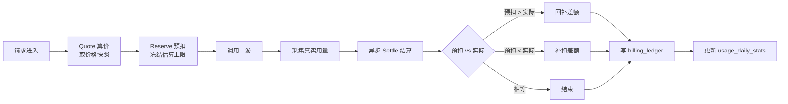
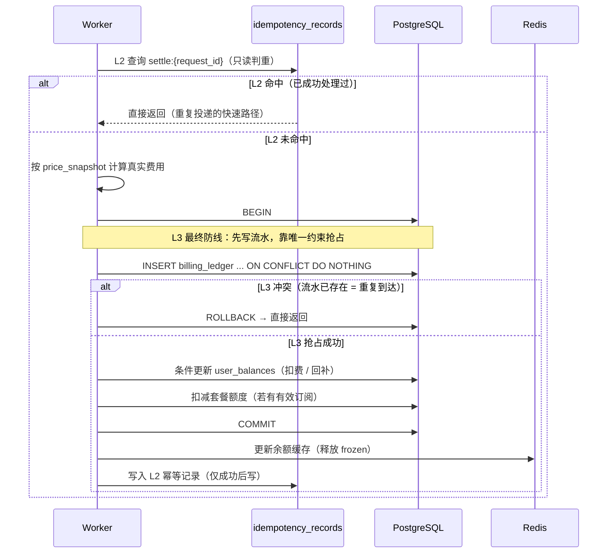
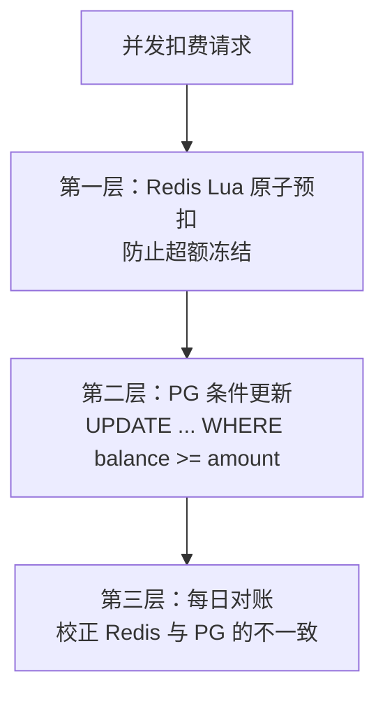
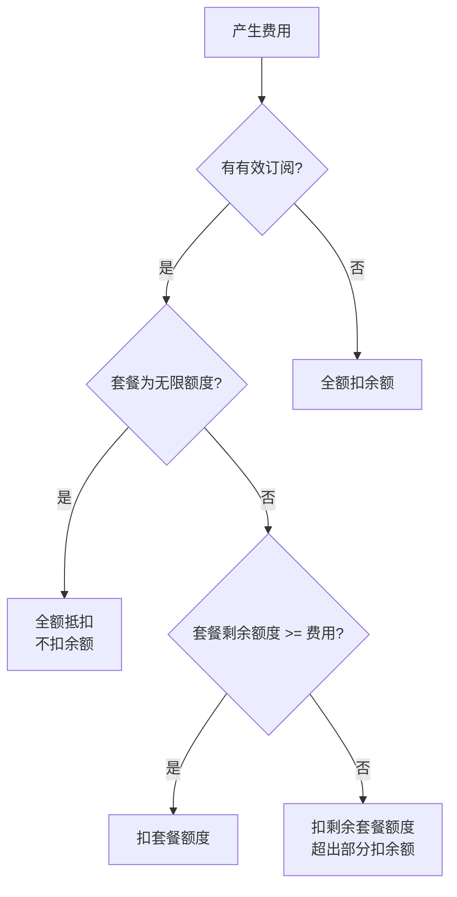
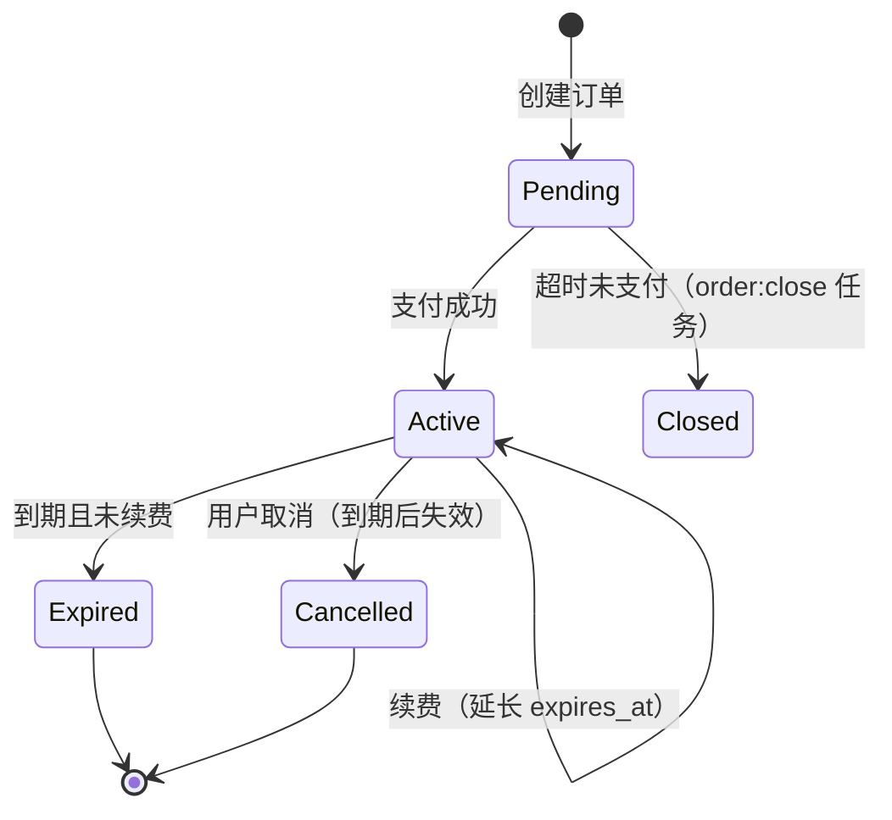
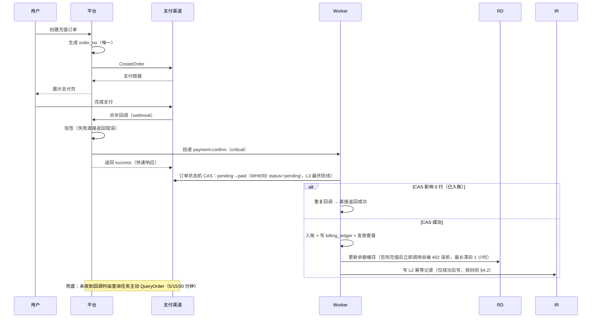
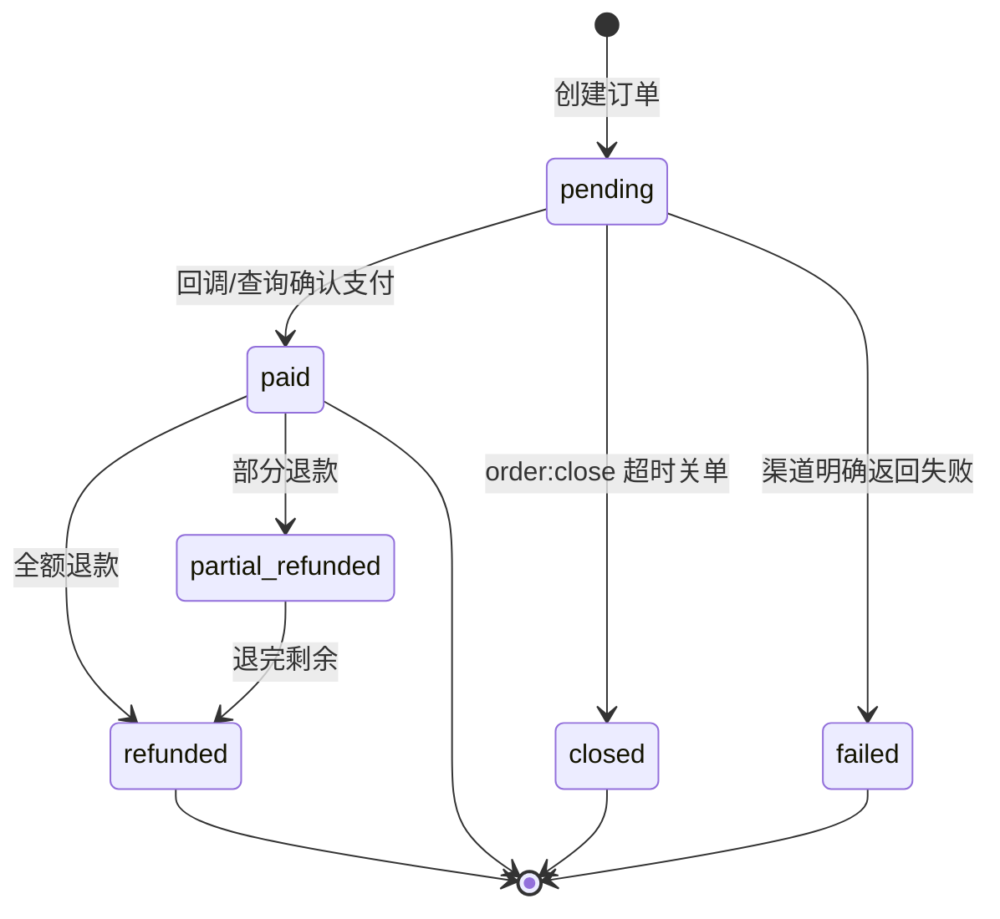
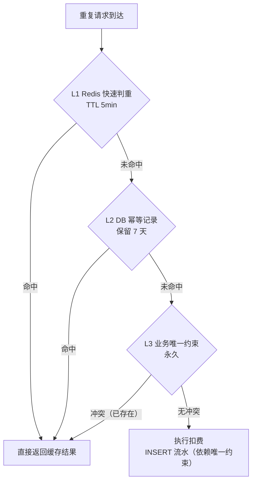
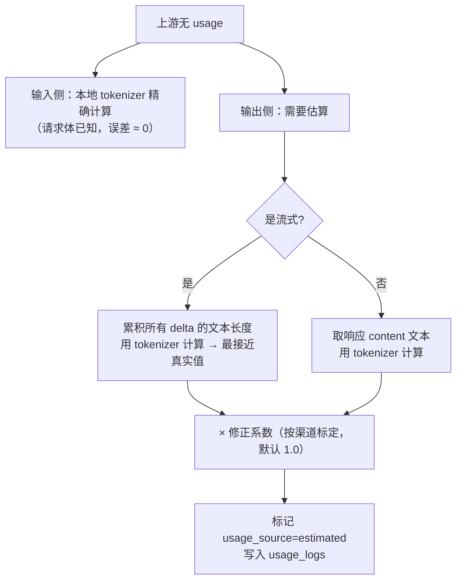

# 06 · 计费与支付

> 本文描述定价模型、扣费流程、余额并发安全、套餐订阅、支付接入与对账。
> 阅读本文后你应当能回答：一次调用收多少钱、钱什么时候扣、高并发下为什么不会扣超、账目怎么核对。

---

## 1. 计费全景



**三段式的价值**：

| 阶段 | 时机 | 作用 |
| --- | --- | --- |
| Quote | 路由后、转发前 | 得到当次价格快照（防止调价漂移） |
| Reserve | 转发前 | 冻结额度，防止超额使用 |
| Settle | 流式结束后（异步） | 按真实用量多退少补，保证准确 |

如果只有"事后扣费"，恶意用户可以在余额耗尽前瞬间发起大量高成本请求；如果只有"事前全额扣费"，则无法处理实际用量小于估算的情况。三段式同时解决了这两个问题。

---

## 2. 定价模型

### 2.1 价格构成

```
用户应付 = 模型基础费用 × 分组倍率
渠道成本 = 模型基础费用 × 渠道倍率（用于毛利核算，不暴露给用户）
毛利     = 用户应付 - 渠道成本
```

| 因子 | 来源 | 说明 |
| --- | --- | --- |
| 模型基础费用 | `model_prices`（当前生效版本） | 见 §2.2 |
| 分组倍率 | `groups.rate_multiplier` | 不同用户等级不同倍率（如 VIP 0.8、免费 1.2） |
| 渠道倍率 | `channels.rate_multiplier` | 该渠道的成本系数，仅内部核算 |
| 套餐抵扣 | `subscriptions` | 有有效订阅时优先扣套餐额度 |

### 2.2 基础费用计算

**Token 计费模式**（`billing_mode = token`）：

```
input_cost       = input_tokens       / 1000 × input_price_per_1k
output_cost      = output_tokens      / 1000 × output_price_per_1k
cache_read_cost  = cache_read_tokens  / 1000 × cache_read_price_per_1k
cache_write_cost = cache_write_tokens / 1000 × cache_write_price_per_1k
基础费用 = input_cost + output_cost + cache_read_cost + cache_write_cost
```

**长上下文分级定价**：当 `input_tokens + output_tokens > long_context_threshold` 时，超出部分（或全部，可配置）使用 `long_context_*_price`：

```
若 total > threshold：
  基础费用 = threshold/1000 × 常规价 + (total-threshold)/1000 × 长上下文艺价
```

> 长上下文模型（如 200k 上下文）的实际推理成本随长度超线性增长，分级定价能更准确地反映成本，避免长对话场景亏损。

**按次计费模式**（`billing_mode = per_request`）：嵌入、重排序等场景，基础费用 = `per_request_price`。

**图像计费模式**（`billing_mode = image`）：按 `image_count × per_request_price`，可叠加分辨率系数。

### 2.3 价格快照

每次调用把当次生效的价格写入 `usage_logs.price_snapshot`：

```json
{
  "input_per_1k": 0.0025,
  "output_per_1k": 0.01,
  "cache_read_per_1k": 0.00025,
  "cache_write_per_1k": 0.00125,
  "long_ctx_threshold": 128000,
  "long_ctx_input_per_1k": 0.005,
  "long_ctx_output_per_1k": 0.02,
  "currency": "USD",
  "group_rate": 1.0,
  "channel_rate": 0.8,
  "price_version": "2026-08-01T00:00:00Z"
}
```

**为什么必须快照**：异步结算可能在请求结束后数秒甚至数分钟执行（重试、队列积压）。若此时管理员调价，按新价计算会让用户看到"调用时的价格"与"实际扣费"不一致的投诉。快照让账单永远可复现。

### 2.4 计量来源与精度

| 来源 | 说明 | 精度 |
| --- | --- | --- |
| `Upstream` | 上游响应返回的 usage | 高，首选 |
| `Estimated` | 上游未返回 usage 时用本地 tokenizer 估算 | 中，兜底 |

- 优先使用上游 usage（各家口径略有差异，但用户可按上游账单核对）。
- 流式场景统一请求 `include_usage`；不支持的厂商用估算。
- `usage_source=Estimated` 的比例是重要的监控指标，超过 5% 需排查对应渠道。
- 估算只在**输出 token** 上容易发生（输入 token 可在发起前精确计算），因此估算误差通常不影响输入侧计费准确性。

---

## 3. 预扣（Reserve）

### 3.1 估算公式

```
预估输入 token   = 本地 tokenizer 计算（精确）
预估输出 token   = min(max_tokens 或模型默认上限, 配置上限)
预估费用 = (预估输入 × 输入单价 + 预估输出 × 输出单价) × 分组倍率
```

为避免"每次都按 max_tokens 预扣"导致用户额度被长时间冻结，引入**自适应预扣**：

```
预估输出 = clamp(该用户该模型近 24h 平均输出 × 1.5, 256, max_tokens)
```

新用户/新模型无历史数据时退化为 `max_tokens × 0.3`。

### 3.2 预扣实现

预扣在**Redis**中以原子操作完成，不落库（高频操作）：

```go
// 预扣：冻结额度
// KEYS[1] = balance:{user_id}
// 返回 1 成功 / 0 余额不足
var reserveScript = redis.NewScript(`
local bal = tonumber(redis.call('HGET', KEYS[1], 'avail') or '-1')
if bal < 0 then return -1 end              -- 缓存未加载
local amt = tonumber(ARGV[1])
if bal < amt then return 0 end
redis.call('HINCRBYFLOAT', KEYS[1], 'avail', -amt)
redis.call('HINCRBYFLOAT', KEYS[1], 'frozen', amt)
return 1
`)
```

| 情况 | 处理 |
| --- | --- |
| 缓存命中且余额充足 | 扣减 `avail`，增加 `frozen`，返回成功 |
| 缓存命中但余额不足 | 返回 `insufficient_balance`，请求以 402 拒绝 |
| 缓存未加载 | 回源 PG 加载余额到 Redis（带锁防击穿），再重试 |
| Redis 不可用 | 退化为**直接查库 + 条件更新**（性能下降但正确性保证） |

> **为什么预扣走 Redis 而非数据库**：预扣发生在每次请求的主链路上，若走数据库，单用户高频请求会在同一行上产生严重的锁竞争，且增加主链路延迟。Redis 的原子 Lua 脚本能保证一致性，落库由异步结算任务完成。

### 3.3 冻结额度的释放保障（必须实现，否则额度永久泄漏）

预扣只改 Redis、不落库，因此**"预扣成功但结算任务丢失"会直接导致用户额度被永久冻结**。这是三段式计费最容易被忽略的资损点。四层保障：

| 层 | 机制 | 说明 |
| --- | --- | --- |
| L1 **显式释放** | 结算任务成功/失败路径都必须 `HINCRBYFLOAT frozen -amt` | 用 `defer` 保证任何分支都执行 |
| L2 **TTL 兜底** | 冻结记录 `frozen:{request_id}` 写独立键，`EX 3600`（60 分钟，> reclaim 阈值 45m） | 仅用于**审计与对账**，不作为释放依据（不能因为 TTL 到期就静默归还，否则可能重复释放） |
| L3 **死信补偿** | `billing:settle` 进死信后，由 `reserve:reclaim` 任务（见 [01 §7.2](./01-architecture.md#72-任务清单)）按"预扣已超 45 分钟且无 settle 流水"的条件释放。**45 分钟 > 结算最大重试时长约 41 分钟**（10 次重试经 `retry.5s/1m/5m` 桶：5s + 1m + 8×5m ≈ 41min，见 §4.1）——阈值必须大于重试窗口，否则会在结算任务仍在合法重试期间误释放冻结额度 | 幂等：释放前检查 `billing_ledger` 是否已有该 `request_id` 的 `settle` 流水 |
| L4 **每小时对账** | 比对 `SUM(Redis frozen)` 与"近 1 小时未结算的预扣记录"，差异进人工队列 | 兜底发现前三层的漏洞 |

**释放的正确顺序**：先写 `billing_ledger`（依赖唯一约束抢占），再更新 `user_balances`，最后释放 Redis `frozen`。顺序不可颠倒——若先释放冻结，可能被并发的新请求再次占用，导致后续扣费时余额不足。

> **为什么不用"TTL 自动释放"作为主机制**：Redis 键过期无法保证与业务状态一致（任务可能仍在重试队列里）。TTL 只用于**发现**泄漏，真正的释放必须由幂等的业务动作完成。

---

## 4. 结算（Settle）

### 4.1 任务定义

| 属性 | 值 |
| --- | --- |
| 任务类型 | `billing:settle` |
| 队列 | `critical`（最高优先级，避免被日志洪峰阻塞） |
| 幂等键 | `settle:{request_id}` |
| 最大重试 | 10（应用级重试，经 `retry.5s/1m/5m` TTL 桶，最大间隔 5 分钟，见 [01 §7.1](./01-architecture.md#71-拓扑与队列划分)）；**总重试窗口约 41 分钟**（5s + 1m + 8×5m），冻结额度 reclaim 阈值 45min 与审计 TTL 60min 均据此设定（§3.3） |
| 超时 | 30s（处理函数 ctx 超时，超时按失败重试） |
| 死信 | 重试耗尽进 `task.dlq`（P0 告警）；`reserve:reclaim` 兜底释放冻结额度（§3.3） |

**任务负载必须自包含**：`settle` 的 Payload 携带结算所需的完整数据（`request_id`、四类 token 用量、`price_snapshot`、`user_id`、`api_key_id`、`channel_id`、`group_id`、`subscription_id`），**不得依赖 `usage_logs` 已落库**。原因：`usage:write` 走 `default` 队列、`billing:settle` 走 `critical` 队列，两者并发且无顺序保证，critical 的结算大概率先于日志落库完成。若结算需要回查日志（如与 payload 交叉核对的兜底路径），查不到则走重试即可，不影响正确性。

### 4.2 处理流程



> **L2 写入时机是关键细节（易错点）**：幂等记录必须在**任务成功后**写入，而不是处理前抢占。若处理前就写入 L2，任务一旦失败，重试会被 L2 挡住 → **漏结算**（比重复结算更严重）。失败重试时 L2 未命中、重新走完整流程，由 L3 唯一约束保证不重复扣费。L1 Redis 层同理：只缓存成功结果，TTL 短（5 分钟），失败不写。

### 4.3 差额处理

| 情况 | 动作 | 流水类型 |
| --- | --- | --- |
| 实际 = 预扣 | 仅把 `frozen` 转为实际扣减 | `settle` |
| 实际 < 预扣 | 释放差额回 `avail` | `settle`（实际额） + `refund`（差额，正数） |
| 实际 > 预扣 | 补扣差额（需再次检查余额，不足则记为欠费并限制后续请求） | `settle`（实际额） |
| 上游失败且无用量 | 全额释放预扣 | `refund` |
| 客户端中断但已产生用量 | 按实际用量扣费，释放剩余 | `settle` + `refund` |

**补扣时余额不足的处理**：不阻塞（请求已完成），但：
1. 写入 `billing_ledger` 时 `balance_after` 记 0，差额写入 `overdraft` 列（见 [02 §7.1](./02-data-model.md#71-billing_ledger-账单流水)）。**不允许 `balance_after` 为负**——`user_balances.balance` 有 `CHECK (balance >= 0)` 约束，两者口径必须一致；
2. 用户下次请求时，预扣前先检查 `overdraft > 0`，若有则先从当次预扣额度中补足欠费（扣减顺序：欠费 → 当次预扣），仍不足则返回 402；
3. 触发风控告警（P1），人工介入。

这种情况极少见（预扣已按上限冻结），通常由价格配置错误或极端长输出导致。

---

## 5. 余额并发安全方案

### 5.1 三层防护



### 5.2 第一层：Redis 原子预扣

见 §3.2 的 Lua 脚本。保证"判断余额 + 扣减"是不可分割的原子操作，杜绝并发下的超额冻结。

### 5.3 第二层：数据库条件更新

结算落库时使用**条件更新**，把余额充足性检查交给数据库：

```sql
UPDATE user_balances
SET balance      = balance - $2,
    frozen       = frozen   - $3,
    total_consumed = total_consumed + $2,
    version      = version + 1,
    updated_at   = now()
WHERE user_id = $1
  AND balance - $2 >= 0;   -- 条件：扣减后不为负
```

- 返回 `rows affected = 1` 表示成功；`0` 表示余额不足，任务转为告警 + 人工处理。
- **不使用** `SELECT ... FOR UPDATE` 悲观锁：结算是异步单线程按用户聚合的（见下），竞争极小；条件更新更轻量且天然防超扣。
- 乐观锁 `version` 用于检测并发写入冲突（正常情况下不会触发，作为兜底断言）。

### 5.4 第三层：对账

| 对账项 | 频率 | 方法 |
| --- | --- | --- |
| `user_balances.balance` vs `billing_ledger` 累计值 | 每日 | 比对，差异 > 阈值（0.01）进入人工队列 |
| `usage_logs.total_cost` 汇总 vs `billing_ledger.settle` 汇总 | 每日 | 同上 |
| Redis 余额缓存 vs PG | 每小时 | 以 PG 为准刷新缓存 |
| 平台用量 vs 上游账单 | 每月 | 导入上游账单，核算渠道成本与毛利 |

对账任务走 `low` 队列，产出差异报告，异常自动创建工单。

### 5.5 同一用户的结算串行化

为避免同一用户的并发结算任务互相覆盖（虽然条件更新能保证正确性，但会放大冲突），按 `user_id` 分片：

```
同一 user_id 的结算任务 → 同一个队列的同一消费者（按 user_id hash 路由）
```

RabbitMQ 同样不原生支持按自定义键路由到指定消费者，实现方式：投递时按 `user_id % N` 选择路由键（`billing:settle:0` ~ `billing:settle:{N-1}`），对应 `task.critical.s0` ~ `task.critical.s{N-1}` N 个分片队列，每个队列单并发消费。这样天然保证同一用户的结算串行。（也可改用 `x-consistent-hash` 类型 exchange 实现按 key 均衡，但其为社区插件，与 01 §3 决策 4"不引入社区插件"的原则冲突，默认不采用。）

> 权衡：这会增加队列数量与运维复杂度。**MVP 阶段可以不做**（条件更新已保证正确性），等结算冲突率成为问题时再引入。

---

## 6. 套餐订阅

### 6.1 抵扣优先级



### 6.2 订阅生命周期



| 字段 | 说明 |
| --- | --- |
| `quota_total` / `quota_used` | 套餐内含额度；`quota_total` 为空表示不限量 |
| `rate_multiplier` | 套餐内的计费倍率（通常 < 1，作为卖点） |
| `allowed_models` | 套餐可用模型范围 |
| `auto_renew` | 到期前 24h 由 `subscription:expire` 任务发起续费扣款 |
| `period_index` | 期次序号，续费时 +1；与 `id` 共同构成"同一期次只发放一次"的唯一约束（见 [02 §7.2](./02-data-model.md#72-subscription_plans-与-subscriptions)） |

**续费扣款失败的处理**（原设计缺失）：

| 结果 | 处理 |
| --- | --- |
| 余额充足 | 扣款 → `period_index+1`、`expires_at` 顺延、发放新一期额度（同事务） |
| 余额不足 | 标记 `auto_renew_failed`，**降级为按量计费**（不中断服务）；发送通知；3 天内重试 2 次，仍失败则到期转 `expired` |
| 扣款成功但额度发放失败 | 由 `subscription:grant` 任务重试（幂等键 `sub:{id}:{period_index}`）；该场景对应 [13-operations §4.1](./13-operations.md#41-必备操作) 的"补发套餐"人工入口 |

### 6.3 套餐与按量的边界

- 套餐额度只在有效期内可用，过期清零（`quota_used` 不退还）。
- 同时存在多个有效订阅时，按**先到期者优先**抵扣。
- 套餐抵扣同样写 `billing_ledger`（`type=subscription`），保证账目完整。

---

## 7. 支付接入

### 7.1 渠道抽象

```go
// PaymentProvider 抽象支付渠道，新增渠道只需实现该接口并注册。
type PaymentProvider interface {
    Code() string                                            // alipay / wechat / stripe
    CreateOrder(ctx context.Context, in CreateOrderInput) (*OrderResult, error)
    QueryOrder(ctx context.Context, orderNo string) (*OrderStatus, error)
    // VerifyNotify 校验回调签名并解析为统一的 NotifyPayload。
    // 签名校验失败必须返回错误，绝不能跳过。
    VerifyNotify(ctx context.Context, r *http.Request) (*NotifyPayload, error)
    Refund(ctx context.Context, in RefundInput) error
    CloseOrder(ctx context.Context, orderNo string) error
}

type OrderResult struct {
    TradeNo   string   // 平台订单号
    PayURL    string   // 跳转/扫码支付链接
    QRCode    string   // 二维码内容（可选）
    ExpireAt  time.Time
}

type NotifyPayload struct {
    ProviderTradeNo string          // 渠道流水号（幂等键）
    OrderNo         string          // 平台订单号
    Amount          decimal.Decimal
    PaidAt          time.Time
    Status          PayStatus
}
```

### 7.2 支付流程



### 7.3 回调幂等与安全性

| 要点 | 做法 |
| --- | --- |
| **验签** | 必须使用渠道提供的签名算法校验；验签失败直接返回 400，不做任何业务处理 |
| **幂等** | 以 `provider_trade_no` 唯一索引为准；`INSERT ... ON CONFLICT DO NOTHING` 抢占 |
| **状态机** | `UPDATE payment_orders SET status='paid' WHERE order_no=? AND status='pending'`，影响行数为 0 说明已处理 |
| **金额校验** | 回调金额必须等于订单金额（允许容差 0），不一致则标记异常订单并告警（防篡改） |
| **快速响应** | 验签 + 入队后立即返回 success，业务处理异步化。避免渠道因超时反复重发 |
| **主动查询兜底** | 订单创建后 5/15/30 分钟各查一次渠道（若仍 pending），防止回调丢失导致用户已付款却未到账 |
| **重复回调** | 幂等键保证只入账一次，重复回调直接返回 success |
| **退款** | 独立流程，见 [§7.5](#75-退款流程)：状态机、幂等键 `refund:{order_no}:{refund_no}`、先渠道后平台流水的顺序约束、部分退款与赠送额度回收 |

### 7.4 订单超时关单

`order:close` 任务（每 5 分钟扫描一次）：`status='pending' AND expired_at < now` 的订单 → 调用渠道 `CloseOrder` → 标记 `closed`。

### 7.4.1 主动查询兜底任务（原设计只有描述、无任务定义）

§7.3 提到"订单创建后 5/15/30 分钟各查一次渠道"，落地为：

| 属性 | 值 |
| --- | --- |
| 任务类型 | `payment:query` |
| 队列 | `default` |
| 投递时机 | 下单成功后由 API 用 `EnqueueIn` 投递 3 个延迟任务（经 `delay.5m/15m/30m` TTL 队列实现，见 [01 §7.1](./01-architecture.md#71-拓扑与队列划分)）。`EnqueueIn` 取 ≥ 请求延迟的最小档位，实际延迟 = 档位值（有向上误差）；请求超过最大档位 30m 直接报错 |
| 幂等键 | `payq:{order_no}:{attempt}`（`attempt` ∈ {1,2,3}） |
| 执行逻辑 | 订单仍为 `pending` → 调用 `QueryOrder` → 已支付则走与 `payment:confirm` **完全相同**的入账逻辑（复用同一函数，保证幂等语义一致）；仍 `pending` 则结束；渠道查不到则记 `warn` |
| 与回调的竞态 | 回调与查询并发时，由 `provider_trade_no` 唯一索引 + 状态机 CAS 保证只入账一次 |

> **为什么用延迟任务而非 cron 扫描**：下单量小时 cron 扫描浪费；量大会产生全表扫描压力。延迟任务是 O(订单数) 而非 O(全表)，且天然错峰。
>
> **兜底的兜底**：若三次查询都失败（渠道不可用），订单停留在 `pending` 直到 `order:close` 关单。用户已付款却未到账时，由客服走"手动补单"入口（见 [13-operations §4.1](./13-operations.md#41-必备操作)），补单复用同一入账函数并强制填写渠道流水号与凭证。

### 7.4.2 订单状态机（完整定义）



`failed` 的入边：渠道回调明确返回"支付失败/已关闭"（区别于 `pending` 的无回调）。

---

### 7.5 退款流程

> §7.3 只写了"退款走独立流程，写 `billing_ledger`"，缺少可落地的状态机、幂等与失败补偿。本节补齐。

### 7.5.1 触发场景与退款方向

| 场景 | 发起人 | 退款方向 | 是否回收赠送额度 |
| --- | --- | --- | --- |
| 用户申请（未消费） | 用户 → 客服审批 | 原路退回渠道 | 是（全额退，赠送一并回收） |
| 重复扣费 / 计费错误 | 客服 | 可原路退回，也可退回平台余额 | 按差额退，赠送部分按比例回收 |
| 上游大面积故障补偿 | 运营批量 | **退平台余额**（不走渠道） | 否（作为补偿） |
| 风控冻结后的误判解封 | 客服 | 退平台余额 | 否 |

**原则**：原路退款优先（合规与用户体验），但**必须校验"已消费额度"**——已消费部分不可退。因此 `可退金额 = amount × (1 - 已消费比例)`，或按运营策略取 `credited_amount - 已消费额`。

### 7.5.2 退款状态机与幂等

| 属性 | 值 |
| --- | --- |
| 任务类型 | `payment:refund` |
| 队列 | `critical`（资金相关，与结算同级） |
| 幂等键 | `refund:{order_no}:{refund_no}` |
| L3 唯一约束 | `payment_orders.refund_no` 唯一（部分索引）+ `billing_ledger` 的 `UNIQUE(request_id) WHERE type='refund'` |
| 最大重试 | 10（指数退避，上限 5 分钟） |

处理流程：

```
1. 前置校验（同步，API 层）：订单已 paid、可退金额 > 0、未在退款中
2. 生成 refund_no，插入 payment_orders.refund_no（依赖唯一索引抢占）
3. 写 billing_ledger（type=refund，amount 为正数表示增加用户余额 → 平台侧为支出）
   或：原路退款时先调渠道 Refund，成功后再写流水
4. 更新 payment_orders.refunded_amount / status
5. 回收赠送额度（写 type=promo 的负数流水）
6. 更新 user_balances（条件更新：balance + amount，仅退余额场景）
```

**关键顺序（原路退款）**：**先调渠道 `Refund` 成功，再写平台流水与余额**。若先给用户加余额而渠道退款失败，平台直接资损。渠道退款超时（结果未知）时：

- 标记 `refund_unknown`，**不写平台流水**；
- 由 `payment:query` 类似的兜底任务查询渠道退款状态；
- 人工可在客服台确认后强制入账（记审计）。

**退余额场景**则相反：先写 `billing_ledger` 抢占（防重复），再更新余额。

### 7.5.3 部分退款与已消费额度

```
可退金额 = credited_amount - 已消费额度 - 已退金额
已消费额度 = SUM(billing_ledger.amount) WHERE payment_order_id = ? AND type IN ('settle','subscription')
```

- 可退金额 ≤ 0 → 拒绝退款并提示原因。
- 退款后若用户余额因退款变负（不应发生，防御性检查）→ 阻断并告警 P0。
- 套餐已发放：退款时按比例回收套餐额度，`subscription` 置 `cancelled`。

### 7.5.4 失败补偿与审计

| 失败点 | 处理 |
| --- | --- |
| 渠道 `Refund` 返回明确失败 | 不改平台任何状态，任务重试 2 次后转人工工单 |
| 渠道超时 | 标记 `refund_unknown`，走查询兜底；**禁止自动重试**（可能重复退） |
| 写流水成功但更新订单失败 | 由对账任务发现（流水有 refund 但订单 `refunded_amount` 未变），自动补偿或告警 |
| 全部失败 | 进死信，告警 P0（涉及资金） |

所有退款操作**必须**写 `audit_logs`（`action = payment.refund`），并记录操作人、原因、金额、关联订单。金额超阈值需超管审批（见 [13-operations §4.2](./13-operations.md#42-操作审计)）。

---

## 8. 成本与毛利核算

| 指标 | 计算 |
| --- | --- |
| 单请求毛利 | `usage_logs.total_cost - usage_logs.upstream_cost` |
| 渠道日成本 | `SUM(upstream_cost) GROUP BY channel_id` |
| 模型毛利率 | `(SUM(total_cost) - SUM(upstream_cost)) / SUM(total_cost)` |
| 用户毛利 | 按用户维度聚合 |

- `upstream_cost` 按渠道倍率与上游实际用量计算。
- 上游账单导入后与 `upstream_cost` 比对，差异用于校正渠道倍率。
- 毛利率低于阈值的渠道/模型触发运营告警（可能是渠道涨价或倍率配置错误）。

---

## 9. 风控

| 风险 | 检测 | 处置 |
| --- | --- | --- |
| 余额耗尽前的密集高成本请求 | 预扣机制天然防护 | — |
| 单 Key 异常高频 | RPM/TPM 限流 | 自动限流 + 告警 |
| 异常大额充值后立即高消费 | 充值后 24h 内消费速率监控 | 人工复核 |
| 余额异常波动 | 对账任务 + 实时阈值告警 | 冻结账户 + 人工介入 |
| 渠道侧账单远超平台记录 | 上游账单导入比对 | 检查是否有漏计（用量估算偏差、失败请求未计费） |
| 信用卡拒付 / 欺诈支付 | 渠道风控通知 | 冻结账户 + 追回额度 |

---

## 10. 幂等键生命周期与重复计费防护

> 这是 §8.1 遗留的关键问题：幂等记录会过期清理，但迟到的重复请求可能在清理后到达。本节给出分层防护设计。

### 10.1 问题刻画

```
T0      请求完成，投递 settle 任务，写入幂等键 settle:{request_id}
T0+1s   任务执行成功，扣费一次
T0+7d   idempotency_records 清理任务删除该键
T0+8d   客户端/队列的迟到重复消息到达 → 幂等键已不存在 → 重复扣费 ❌
```

只要"幂等键保留期 < 重复到达的最晚时刻"，就会漏。因此**不能把可过期的幂等记录当作唯一防线**。

### 10.2 三层防护



| 层 | 载体 | 保留期 | 作用 | 能否作为最终防线 |
| --- | --- | --- | --- | --- |
| L1 | Redis `idem:{scope}:{key}` | 5 分钟 | 拦截高频瞬时重复（队列 at-least-once 的典型重复窗口） | 否 |
| L2 | `idempotency_records` 表 | 7 天（可清理） | 缓存执行结果，避免重复计算；覆盖异步重试 | 否 |
| L3 | **业务表唯一约束** | **永久** | 结构性约束，任何时刻到达的重复都会被数据库拒绝 | **是** |

### 10.3 L3 唯一约束（最终防线）

这是设计的核心：**幂等的正确性由数据库约束保证，而非由记录的存活期保证**。

| 业务 | 唯一约束 | 效果 |
| --- | --- | --- |
| 计费结算 | `UNIQUE (request_id) WHERE type='settle'`（部分唯一索引） | 同一请求永远只有一条 settle 流水 |
| 计量日志 | `(request_id, created_at)` 唯一 + L1/L2 幂等层 | **分区表无法建立全局唯一约束**（见 [02 §6.1](./02-data-model.md#6-计量域)），故日志防重只能"尽力而为"；重复日志不影响扣费，由对账兜底 |
| 支付入账 | `UNIQUE (provider_trade_no)` | 同一渠道流水号只入账一次 |
| 套餐发放 | `UNIQUE (subscription_id, period)` | 同一周期只发放一次 |
| 退款 | `UNIQUE (request_id) WHERE type='refund'` | 同一请求只退一次 |

**实现方式**：所有扣费路径必须先写 `billing_ledger`（依赖唯一约束抢占），抢占成功才更新余额。顺序不可颠倒：

```sql
-- 1) 抢占：依赖唯一约束，冲突即视为已处理
INSERT INTO billing_ledger (user_id, type, amount, request_id, ...)
VALUES ($1, 'settle', $2, $3, ...)
ON CONFLICT (request_id) WHERE type = 'settle' DO NOTHING
RETURNING id;
-- 返回 0 行 → 已处理过，直接结束

-- 2) 抢占成功后才更新余额
UPDATE user_balances SET balance = balance - $2, ... WHERE user_id = $1 AND balance - $2 >= 0;
```

### 10.4 幂等键保留期推导

| 重复来源 | 最晚到达时刻 | 覆盖层 |
| --- | --- | --- |
| 消费端应用级重试（max_retry=10，经 retry TTL 桶，上限 5min） | 约 T0+1h | L1 + L2 |
| Worker 崩溃后重新入队 | 分钟级 | L1 + L2 |
| 支付渠道回调重发（通常 24~72h 内多次） | T0+72h | L2（7 天覆盖） |
| 客户端 SDK 自动重试 | 秒~分钟级 | L1 |
| 人工重放 / 运维补偿 / 程序 bug | 无上限 | **L3** |

**结论**：

- L2 保留 **7 天**足以覆盖所有正常的系统内重复（含支付回调的 72 小时重发窗口）。
- 超出 7 天的重复只可能来自人工或 bug，由 **L3 唯一约束**兜底，**这条防线没有时间限制**。
- 因此"幂等记录过期"不会导致重复计费——它只是失去了一层**快速返回**的缓存，正确性仍由 L3 保证。

### 10.5 清理任务的安全约束

| 约束 | 说明 |
| --- | --- |
| 清理对象 | **只能清理 L2**（`idempotency_records`），绝不清理 L1 之外的业务数据 |
| 清理条件 | `expires_at < now()`，且**对应业务的 L3 唯一约束必须已存在**（上线检查项） |
| 批量删除 | 分批（每次 1000 条）避免长事务与锁表 |
| 监控 | 清理任务失败需告警（表会无限增长） |
| 兜底审计 | 每日对账会比对 `usage_logs` 与 `billing_ledger`，即使出现极端重复也能被发现 |

### 10.6 支付幂等的特殊性

支付回调的重复窗口最长（渠道可能重发达数天），且金额大，因此：

1. `provider_trade_no` 唯一索引**永久保留**，不随 `idempotency_records` 清理。
2. 入账前校验订单状态机：`UPDATE ... SET status='paid' WHERE order_no=? AND status='pending'`，影响行数为 0 说明已入账，直接返回成功。
3. 回调验签失败**不入队、不记录**，直接返回错误并计入安全告警（防伪造攻击）。
4. 主动查询兜底任务在订单创建后 5/15/30 分钟各查一次，防止回调丢失。

---

## 11. 上游用量缺失与异常值处理

> §2.4 只说了"用本地估算兜底"，本节定义完整的判定与处理规则——这是"计量不准导致亏损"风险的直接防控手段。

### 11.1 用量采集的四类情况

| 类型 | 特征 | 处理 |
| --- | --- | --- |
| **完整** | 上游返回 input + output | 直接使用，`usage_source=upstream` |
| **部分** | 只有 input，无 output（部分厂商流式结束时不给 output） | input 用上游值，output 用估算，标记 `usage_source='partial'` |
| **缺失** | 无 usage 字段（未请求 `include_usage`、厂商不支持、流被中断） | input 用本地精确计算，output 用估算，标记 `estimated` |
| **零值** | usage 存在但全为 0 | **不能直接采信**，见 §11.3 |

### 11.2 估算算法与误差控制



| 要素 | 说明 |
| --- | --- |
| 输入侧 | **始终精确**（请求体已知），不使用估算 |
| 输出侧·流式 | 累积 delta 后 tokenize，误差来自 tokenizer 与上游分词差异，通常 < 5% |
| 输出侧·非流式 | 同样精确（响应体已知），仅在响应被截断时才有误差 |
| 修正系数 | 按渠道用历史数据标定（`channels.token_ratio`），定期用上游账单校准 |
| 保守原则 | 估算值**向上取整**（宁可多计，不可少计，防止亏损） |

> 关键认知：只有**流式中途被中断**（客户端断开、超时）且上游未返回 usage 的场景，才存在真正的估算误差。正常完成的流式请求，输出内容完整可见，tokenize 结果与上游真实值高度接近。

### 11.3 usage 全为 0 的判定（易错点）

上游返回 `usage: {input: 0, output: 0}` 有三种可能，**处理方式完全不同**：

| 可能 | 判定依据 | 处理 |
| --- | --- | --- |
| 请求被上游拒绝/内容审核，确实无消耗 | HTTP 非 2xx，或 `finish_reason=content_filter` | **不计费**，全额释放预扣 |
| 上游统计延迟/降级，实际有消耗 | HTTP 200 且有实际输出内容 | **用估算值计费**，标记 `estimated`，并累计该渠道的零值次数 |
| 厂商对某些模型不统计 usage | 该渠道 `zero_usage_count` 在滑动窗口内占比持续 > 50% | **判定为不可信渠道**（无需额外字段，由 `zero_usage_count` 阈值动态判定），改用本地估算为主，并通知运营核对上游账单 |

**判定规则**：

```
若 status_code == 200 且 存在非空输出内容 且 usage.total == 0：
    → 视为"统计缺失"，用估算值计费，channel.zero_usage_count++
若 status_code == 200 且 无输出内容 且 usage.total == 0：
    → 视为"无消耗"，不计费（但按次计费模型仍需计 1 次）
若 status_code != 200：
    → 见 §11.4 失败请求计费规则
```

### 11.4 失败请求是否计费

不同厂商策略不同（有的失败也扣、有的不扣），**必须在 `providers` 表显式记录**：

| 字段 | 说明 |
| --- | --- |
| `providers.bill_on_failure` | 该供应商是否对失败请求计费（默认 `false`） |
| `providers.bill_partial_stream` | 流式中途失败时是否按已输出部分计费（默认 `true`） |

处理逻辑：

```
失败请求计费 =
    (bill_on_failure && 上游返回了非零 usage)         // 上游确实扣了
 || (bill_partial_stream && 已输出内容)                // 部分消耗
```

- 若上游失败但仍返回 usage（多数厂商如此），且渠道配置了 `bill_on_failure`，则按上游 usage 计费——**因为上游已经扣了平台的钱**，不向用户计费就是平台亏损。
- 该规则写入 `usage_logs`，账单明细中可解释（"上游失败但已产生消耗"）。

### 11.5 异常值保护（防止天价账单）

| 异常 | 阈值 | 处理 |
| --- | --- | --- |
| 输出 token 超上限 | `output_tokens > max_tokens × 1.5 + 100` | 截断到 `max_tokens × 1.5`，标记 `usage_capped`，告警 |
| 输入 token 异常大 | `input_tokens > context_window` | 视为上游统计错误，改用本地计算值，告警 |
| 单次费用异常高 | `total_cost > billing.max_cost_per_request`（默认 **10**，单位：记账币种） | 仍计费但**立即告警**，人工核查是否为攻击或配置错误。配置键见 [10 §3.2](./10-deployment.md#32-配置项清单按模块) |
| 负值 / NaN | 任何 | 视为无效，改用估算，告警 |
| 缓存 token > 输入 token | 逻辑矛盾 | 视为上游统计错误，缓存部分按 0 计，告警 |

**设计意图**：异常值不完全阻断服务（避免误伤），但必须**可观测**。所有异常事件记入日志并计入指标 `cloudfog_usage_anomaly_total`。

### 11.6 监控指标

| 指标 | 告警阈值 | 含义 |
| --- | --- | --- |
| `cloudfog_usage_estimated_ratio` | > 5% 持续 1 小时 | 估算占比过高，计量精度下降 |
| `cloudfog_usage_zero_total`（按渠道） | 单渠道 1 小时 > 50 次 | 该渠道 usage 不可靠 |
| `cloudfog_usage_anomaly_total` | > 0 | 出现异常值，需核查 |
| `cloudfog_channel_token_ratio` | 与标定值偏差 > 20% | 修正系数需重新标定 |

### 11.7 与上游账单的闭环校准

每月导入上游账单后：

```
实际偏差率 = (上游账单金额 - 平台记录 upstream_cost) / 上游账单金额
```

| 偏差率 | 处置 |
| --- | --- |
| < 3% | 正常（计费口径差异） |
| 3% ~ 10% | 调整该渠道 `token_ratio` 修正系数 |
| > 10% | 排查：是否有未计费请求、usage 缺失严重、或上游乱收费 |
| 持续为负（平台多计） | 检查估算是否过于保守，适当下调修正系数 |

---

## 12. 参考来源（sub2api）

| 本设计点 | 参考位置 | 关系 |
| --- | --- | --- |
| 计费倍率分层 | `ent/schema/account.go` 的 `rate_multiplier`（账号维度）与 `ent/schema/group.go`（分组维度） | 沿用"渠道倍率 + 分组倍率"双层设计 |
| 成本族字段 | `ent/schema/usage_log.go`：`input_cost`/`output_cost`/`cache_creation_cost`/`cache_read_cost`/`total_cost`/`actual_cost`/`rate_multiplier`/`account_rate_multiplier`（均 `decimal(20,10)`） | 沿用精度与拆分方式；本平台把 `actual_cost` 更名为 `upstream_cost` 以明确语义 |
| 长上下文分级计费 | 同文件 `long_context_billing_applied` 字段 + `internal/service/account_long_context_billing_test.go` | 沿用 |
| 缓存 TTL 计费 | 同文件 `cache_creation_5m_tokens`/`cache_creation_1h_tokens`/`cache_ttl_overridden` | 沿用（5m/1h 缓存写入价格不同） |
| 计费模式 | 同文件 `billing_mode`：`token`/`per_request`/`image` | 沿用 |
| 用量采集与统计 | `internal/service/usage_service.go`、`account_usage_service.go`、`internal/pkg/usagestats/` | 沿用"采集 + 聚合分离" |
| 支付渠道抽象 | `internal/payment/`（28 个文件，含支付宝/微信/Stripe/EasyPay） | 沿用接口抽象与 webhook 幂等思路 |
| 支付订单 | `ent/schema/payment_order.go`、`payment_provider_instance.go`、`payment_audit_log.go` | 参考字段设计 |
| 套餐订阅 | `ent/schema/subscription_plan.go`、`user_subscription.go` | 参考 |
| 余额通知 | `internal/service/balance_notify_service.go` | 沿用：余额低于阈值时通知（走 default 队列） |
| 兑换码/优惠码 | `ent/schema/redeem_code.go`、`promo_code.go` | 作为扩展位，二期实现 |