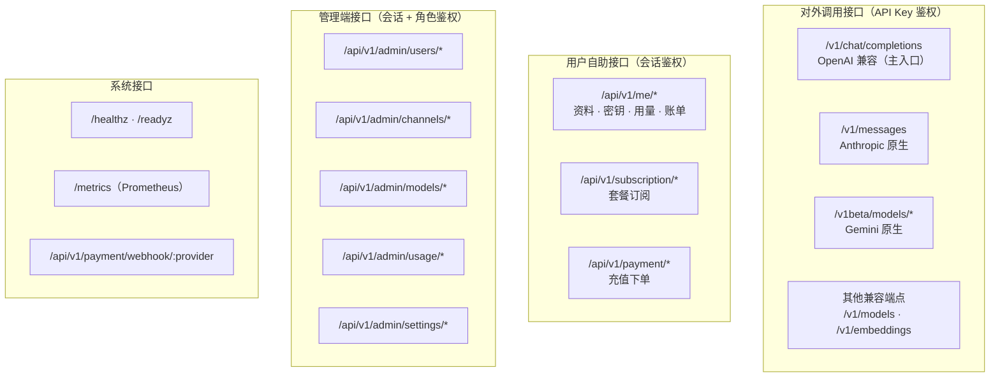
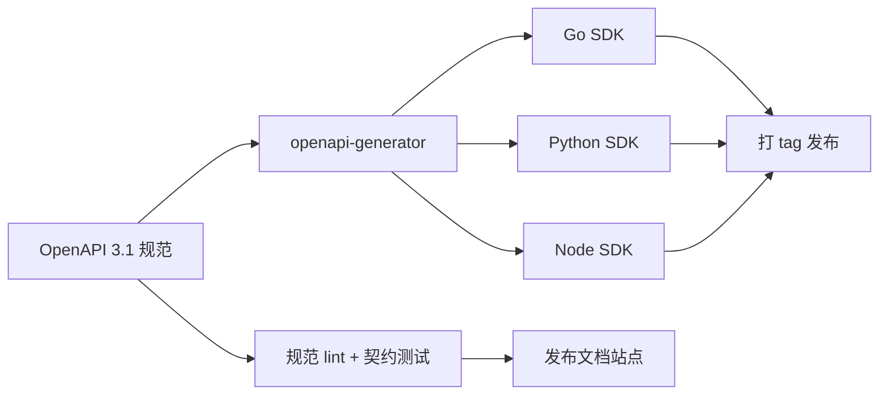

# 07 · 开放接口与 SDK

> 本文描述对外调用协议、管理端 RESTful 接口、OpenAPI 规范组织与多语言 SDK 设计。
> 阅读本文后你应当能回答：开发者怎么用、管理端有哪些接口、SDK 怎么生成与维护。

---

## 1. 接口体系总览



| 接口族 | 鉴权 | 限流 | 文档 |
| --- | --- | --- | --- |
| 对外调用 | API Key | 用户/Key 级 RPM+TPM+并发 | 开发者文档（OpenAI 兼容为主，直接复用 OpenAI 文档） |
| 用户自助 | 会话 Cookie/JWT | 会话级 | OpenAPI `portal.yaml` |
| 公开门户 | 无（公开数据） | 同 IP 限流 | OpenAPI `public.yaml` |
| 管理端 | 会话 + 角色 | 管理级 | OpenAPI `admin.yaml` |
| 系统 | 无 / 签名 | — | — |

---

## 2. 对外调用接口

### 2.1 OpenAI 兼容（主入口）

| 端点 | 方法 | 说明 |
| --- | --- | --- |
| `/v1/chat/completions` | POST | 对话补全，支持流式 |
| `/v1/models` | GET | 列出当前 Key 可用的模型 |
| `/v1/embeddings` | POST | 向量化（按次计费）。**二期**：IR 暂不覆盖 embedding 结构，且 [11 §3.2](./11-roadmap.md#32-范围) 未纳入 MVP |
| `/v1/images/generations` | POST | 图像生成（二期） |
| `/v1/responses` | POST | OpenAI Responses API 兼容（二期） |

**接入方式**：开发者只需改两处。

```python
from openai import OpenAI

client = OpenAI(
    base_url="https://api.cloudfog.example/v1",
    api_key="sk-cf-xxxxxxxxxxxxxxxxxxxxxx",
)

resp = client.chat.completions.create(
    model="claude-sonnet-4",
    messages=[{"role": "user", "content": "你好"}],
    stream=True,
)
```

**请求体**：与 OpenAI 完全兼容，额外支持的扩展参数：

| 扩展参数 | 说明 |
| --- | --- |
| `provider` | 可选，指定供应商（如 `anthropic`），不指定则由平台自动路由 |
| `fallback_models` | 可选，本次请求的降级链 |
| `disable_fallback` | 布尔，禁用自动降级 |

**响应头扩展**（与 [03 §7.2](./03-request-lifecycle.md#72-平台侧错误响应格式) 为同一份清单，改动须同步两处）：

| 头 | 说明 |
| --- | --- |
| `X-Request-ID` | 请求唯一标识 |
| `X-CloudFog-Model` | 实际服务的上游模型（降级时与原模型不同） |
| `X-CloudFog-Provider` | 实际供应商 code |
| `X-CloudFog-Degraded` | `true` 表示发生了降级 |
| `X-CloudFog-Switches` | 故障转移次数 |
| `X-CloudFog-Channel` | 渠道 ID（**仅管理员/超管身份返回**） |
| `X-CloudFog-Notice` | 存在未读重要公告时的提示 |
| `X-RateLimit-Limit` / `-Remaining` / `-Reset` | 限流余量 |
| `Retry-After` | 429 / 503 时的建议等待秒数 |

### 2.1.1 出口响应体与 SSE 契约

> 此前本文只定义了端点与响应头，出口的 JSON/SSE 结构散落在 [04 §3.6](./04-provider-adapter.md#36-流式sse)（上游侧）与 [03 §3.2](./03-request-lifecycle.md#32-ir-结构定义)（内部 IR），**平台对客户端的输出格式无一处定义**。本节补齐，且必须与 OpenAI 官方完全一致（客户端用官方 SDK 直接解析）。

**非流式响应**（`POST /v1/chat/completions`）：

```json
{
  "id": "chatcmpl-01HZX8K3M4N5P6Q7R8S9T0V1W2",
  "object": "chat.completion",
  "created": 1754400000,
  "model": "claude-sonnet-4",
  "choices": [
    {
      "index": 0,
      "message": { "role": "assistant", "content": "你好！", "reasoning_content": null },
      "finish_reason": "stop"
    }
  ],
  "usage": {
    "prompt_tokens": 12,
    "completion_tokens": 8,
    "total_tokens": 20,
    "prompt_tokens_details": { "cached_tokens": 0 }
  }
}
```

**流式响应**（SSE，逐块转发不整包缓存）：

```
data: {"id":"...","object":"chat.completion.chunk","created":1754400000,"model":"claude-sonnet-4","choices":[{"index":0,"delta":{"role":"assistant","content":"你"},"finish_reason":null}]}

data: {"id":"...","object":"chat.completion.chunk","choices":[{"index":0,"delta":{"content":"好"},"finish_reason":null}]}

data: {"id":"...","object":"chat.completion.chunk","choices":[],"usage":{"prompt_tokens":12,"completion_tokens":8,"total_tokens":20}}

data: [DONE]
```

**字段与 IR 的映射约定**：

| 出口字段 | IR 来源 | 说明 |
| --- | --- | --- |
| `choices[].delta.content` | `StreamEvent.Delta`（`Type=Delta`） | 增量文本 |
| `choices[].delta.reasoning_content` | `StreamEvent.Type=ReasoningDelta` | **统一用 `reasoning_content`**，与 DeepSeek 一致；`delta.reasoning` 仅作兼容别名输出给已知需要的客户端（默认关闭） |
| `choices[].delta.tool_calls[]` | `StreamEvent.ToolCallDelta` | arguments 为增量 JSON 串，由 Adapter 累积后校验 |
| `usage.prompt_tokens` | `Usage.InputTokens` | **出口用 OpenAI 命名**，内部一律 `InputTokens/OutputTokens` |
| `usage.completion_tokens` | `Usage.OutputTokens` | 同上 |
| `usage.prompt_tokens_details.cached_tokens` | `Usage.CacheReadTokens` | |
| `finish_reason` | `FinishReason` 映射表，见 [04 §3.7](./04-provider-adapter.md#37-停止原因映射) | |

**三条硬约束**：

1. **`usage` chunk 必须在 `data: [DONE]` 之前**输出。`[DONE]` 之后不再发送任何内容。若上游 usage 到达过晚，用最后一个 content chunk 之后的 **usage-only chunk** 输出（choices 为空数组），推荐请求时统一带 `stream_options: {include_usage: true}`。
2. **只输出一次 usage**：整条流中 usage chunk 至多一个，避免客户端重复累加。
3. **降级/切换的可见性**：发生降级时首个 chunk 之前必须已发送响应头（见上表），且 `model` 字段填**实际服务的模型**，`X-CloudFog-Model` 与之一致。

### 2.2 Anthropic 原生入口

| 端点 | 说明 |
| --- | --- |
| `POST /v1/messages` | Anthropic Messages API，支持流式 |

鉴权：`x-api-key: <平台 API Key>` + `anthropic-version: 2023-06-01`。

**使用建议**：若客户端是 Claude Code 等需要完整 Anthropic 语义（extended thinking、tool_use 结构）的工具，走此入口可避免转换失真。

### 2.3 Gemini 原生入口

| 端点 | 说明 |
| --- | --- |
| `POST /v1beta/models/{model}:generateContent` | 非流式 |
| `POST /v1beta/models/{model}:streamGenerateContent` | 流式（`alt=sse`） |
| `GET /v1beta/models` | 模型列表 |

鉴权：`x-goog-api-key: <平台 API Key>`。

### 2.4 模型列表响应

`GET /v1/models` 返回 OpenAI 格式，并补充平台扩展字段：

```json
{
  "object": "list",
  "data": [
    {
      "id": "claude-sonnet-4",
      "object": "model",
      "created": 1754400000,
      "owned_by": "anthropic",
      "context_window": 200000,
      "max_output_tokens": 64000,
      "capabilities": ["vision", "tools", "reasoning"],
      "pricing": {
        "input_per_1k": 0.003,
        "output_per_1k": 0.015,
        "cache_read_per_1k": 0.0003,
        "currency": "USD"
      },
      "avg_first_token_ms": 420
    }
  ]
}
```

---

## 3. 认证与用户自助接口

> **认证接口此前整块缺失**：[14-frontend §2](./14-frontend.md#2-信息架构) 有登录/注册/找回密码、[14 §3.7](./14-frontend.md#37-设置) 有密码修改与 TOTP 与会话管理、[08 §5.4](./08-security.md#54-注册与登录安全) 有注册登录限流，但本文没有对应路由。本节补齐。

### 3.0 认证接口（无需会话）

| 方法 | 路径 | 说明 | 限流 |
| --- | --- | --- | --- |
| POST | `/api/v1/auth/register` | 注册（受 `settings.register_enabled` 控制） | 同 IP 5 次/小时 |
| POST | `/api/v1/auth/login` | 登录，成功后下发 HttpOnly Cookie（或 JWT） | 同账号 5 次失败锁定 15 分钟 |
| POST | `/api/v1/auth/logout` | 登出，吊销当前会话 | — |
| POST | `/api/v1/auth/password/forgot` | 申请重置密码（发邮件，令牌一次性 + 30min 过期） | 同 IP 5 次/小时 |
| POST | `/api/v1/auth/password/reset` | 用令牌重置密码 | — |
| POST | `/api/v1/auth/refresh` | 刷新会话令牌 | — |
| GET | `/api/v1/auth/verify-email` | 邮箱验证（`users.status: pending → active`） | — |
| GET | `/api/v1/auth/captcha` | 登录/注册验证码（可开关） | — |
| GET | `/api/v1/public/models` | **门户模型目录**（`status=active` 的模型：名称、供应商、上下文、最大输出、能力标签、输入/输出**基础价**、平均首字延迟；**不含**渠道、成本、健康度等内部字段）。供门户模型广场 SSR 渲染（[14 §3.3](./14-frontend.md#33-模型广场)）；**展示的是基础价，实际扣费按用户分组倍率**（[06 §2](./06-billing-payment.md#2-定价模型)）。控制台内"当前 Key 可用模型"仍走 `/v1/models`（§2.4） | 同 IP 60 次/分钟 |
| GET | `/api/v1/public/announcements` | **公开公告列表**（仅 `status=published` 且在展示期内的全站公告，**不含定向内容与已读状态**；供门户 SSR 页未登录渲染，见 [14 §1.1](./14-frontend.md#11-三个区域)） | — |

**会话安全**：Cookie `HttpOnly + Secure + SameSite=Lax`；会话表记录设备指纹与 IP，支持查看与吊销（见下）。敏感操作前强制重认证（`POST /api/v1/auth/reauthenticate`，需密码或 TOTP）。

### 3.0.1 账户安全接口（需会话）

| 方法 | 路径 | 说明 |
| --- | --- | --- |
| PATCH | `/api/v1/me/password` | 修改密码（需原密码） |
| POST | `/api/v1/me/totp` | 开启 TOTP：返回二维码与密钥（**一次性展示**） |
| POST | `/api/v1/me/totp/verify` | 绑定确认（需 6 位码） |
| DELETE | `/api/v1/me/totp` | 关闭 TOTP（需密码 + 6 位码） |
| GET | `/api/v1/me/sessions` | 会话列表（设备、IP、最后活跃） |
| DELETE | `/api/v1/me/sessions/{id}` | 吊销指定会话 |
| GET | `/api/v1/me/groups` | 当前用户可用分组列表（`user_allowed_groups`，Key 创建/切换分组的数据来源，见 [02 §3.4](./02-data-model.md#34-groups-分组-与-user_allowed_groups)） |
| PATCH | `/api/v1/me` | 修改资料（昵称、**时区**、默认分组；**默认分组必须在可用分组集合内**，服务端校验） |
| GET | `/api/v1/announcements` | 当前用户可见的公告（未读置顶） |
| POST | `/api/v1/announcements/{id}/read` | 标记已读 |

> 管理员强制 TOTP（[08 §5.4](./08-security.md#54-注册与登录安全)）：`role != user` 的账号在首次登录时引导绑定，未绑定则在访问管理端接口时返回 `403 totp_required`。

### 3.1 用户自助接口

| 方法 | 路径 | 说明 |
| --- | --- | --- |
| GET | `/api/v1/me` | 当前用户资料 |
| GET | `/api/v1/me/balance` | 余额与累计消费 |
| GET | `/api/v1/me/summary` | 今日/本月用量概览 |
| — | API Key 管理 | |
| GET | `/api/v1/me/keys` | 密钥列表（脱敏） |
| POST | `/api/v1/me/keys` | 创建密钥（**唯一一次返回明文**） |
| PATCH | `/api/v1/me/keys/{id}` | 修改名称/状态/白名单 |
| DELETE | `/api/v1/me/keys/{id}` | 删除密钥 |
| — | 用量与账单 | |
| GET | `/api/v1/me/usage` | 用量查询（按时间/模型/密钥筛选，分页） |
| GET | `/api/v1/me/usage/stats` | 聚合统计（日/月趋势、模型分布） |
| GET | `/api/v1/me/usage/logs` | 调用明细（脱敏） |
| GET | `/api/v1/me/billing` | 账单流水 |
| — | 套餐与支付 | |
| GET | `/api/v1/subscription/plans` | 可订阅套餐 |
| GET | `/api/v1/subscription` | 当前订阅 |
| POST | `/api/v1/subscription` | 订阅/续费 |
| POST | `/api/v1/payment/orders` | 创建充值订单 |
| GET | `/api/v1/payment/orders/{no}` | 查询订单状态 |
| GET | `/api/v1/payment/providers` | 可用支付渠道 |

**统一响应格式**：

```json
{
  "code": 0,
  "message": "ok",
  "data": { },
  "request_id": "req_01HZX8K3M4N5P6Q7R8S9T0V1W2"
}
```

**分页约定**：`page`（从 1 开始）+ `page_size`（默认 20，最大 100），返回 `total` 与 `has_more`。

**排序约定**：`sort_by` + `sort_order`（`asc`/`desc`），可选字段在接口文档中枚举，不接受任意字段（防 SQL 注入与索引失效）。

---

## 4. 管理端接口

> 早期版本此处只有"资源 | 主要操作"的概述表，前端无法据此生成类型。现给出与 §3 同格式的 method + path 清单，OpenAPI `admin.yaml` 以此为蓝本。

**通用约定**：全部以 `/api/v1/admin` 为前缀；除标注 `super_admin` 的接口外，`admin` 与 `super_admin` 均可访问；**所有接口服务端强制校验角色**（前端权限只是体验优化，见 [08 §5.3](./08-security.md#53-强制的资源归属校验)）。

### 4.1 用户与分组

| 方法 | 路径 | 说明 |
| --- | --- | --- |
| GET | `/api/v1/admin/users` | 用户列表（分页、筛选：角色/分组/状态/风险等级） |
| POST | `/api/v1/admin/users` | 创建用户 |
| GET | `/api/v1/admin/users/{id}` | 用户详情（含余额、订阅、Key 数） |
| PATCH | `/api/v1/admin/users/{id}` | 改资料/分组/并发限制 |
| POST | `/api/v1/admin/users/{id}/disable` | 禁用（必填原因；递增 `users.version` 使 Key 缓存全失效） |
| POST | `/api/v1/admin/users/{id}/enable` | 启用 |
| PATCH | `/api/v1/admin/users/{id}/role` | 改角色（`super_admin` 专属） |
| GET/PUT | `/api/v1/admin/users/{id}/groups` | 查看/全量设置用户可用分组（`user_allowed_groups`，[02 §3.4](./02-data-model.md#34-groups-分组-与-user_allowed_groups)；PUT 为全量替换，幂等） |
| POST | `/api/v1/admin/users/{id}/balance` | **手动调账**（必填原因；写 `billing_ledger` + 审计；金额超阈值需超管） |
| GET | `/api/v1/admin/users/{id}/usage` | 该用户用量 |
| GET | `/api/v1/admin/users/{id}/keys` | 该用户 Key 列表（脱敏） |
| POST | `/api/v1/admin/users/{id}/force-logout` | 强制登出（吊销全部会话） |
| GET/POST/PATCH/DELETE | `/api/v1/admin/groups[/{id}]` | 分组 CRUD（含倍率、模型范围、降级链） |
| POST | `/api/v1/admin/groups/{id}/channels` | 渠道与分组绑定 |

### 4.2 供应商、渠道与模型

| 方法 | 路径 | 说明 |
| --- | --- | --- |
| GET | `/api/v1/admin/providers` | 供应商元数据列表 |
| PATCH | `/api/v1/admin/providers/{code}` | 改计费语义字段（`bill_on_failure` 等） |
| GET/POST/PATCH/DELETE | `/api/v1/admin/channels[/{id}]` | 渠道 CRUD（凭证写入即加密，永不明文返回） |
| POST | `/api/v1/admin/channels/{id}/test` | 测试连通性（走 `BuildHealthCheck`，返回结果与延迟） |
| POST | `/api/v1/admin/channels/{id}/enable` \| `/disable` | 启停（立即广播失效缓存） |
| POST | `/api/v1/admin/channels/{id}/circuit/reset` | 手动重置熔断（置 `circuit_open_until=now`） |
| POST | `/api/v1/admin/channels/{id}/credential` | **查看凭证明文**（TOTP 二次校验 + 审计，返回脱敏值 + 一次性明文） |
| POST | `/api/v1/admin/channels/batch` | 批量改优先级/分组/启停（**跨供应商需二次确认**，见 [14 §4.2](./14-frontend.md#42-渠道管理运营最高频页面)） |
| GET | `/api/v1/admin/channels/{id}/health` | 健康详情（错误率趋势、熔断历史、限流次数） |
| GET/POST/PATCH/DELETE | `/api/v1/admin/models[/{id}]` | 模型 CRUD（含 `fallbacks` 降级链） |
| GET/POST/PATCH/DELETE | `/api/v1/admin/model-prices[/{id}]` | 定价 CRUD（带生效时间） |
| POST | `/api/v1/admin/model-prices/preview` | **调价影响预览**（受影响用户/分组、预估收入变化） |
| GET/POST/PATCH/DELETE | `/api/v1/admin/model-mappings[/{id}]` | 模型映射规则 |
| GET/POST/PATCH/DELETE | `/api/v1/admin/proxies[/{id}]` | 回源代理 CRUD（`http`/`socks5`，password 仅写入不可读，见 [02 §4.4](./02-data-model.md#44-proxies-回源代理)） |
| POST | `/api/v1/admin/proxies/{id}/test` | 代理连通测试（经该代理请求供应商探测端点，返回延迟） |

### 4.3 用量、账单与对账

| 方法 | 路径 | 说明 |
| --- | --- | --- |
| GET | `/api/v1/admin/usage` | 全量用量查询（按用户/渠道/模型/分组聚合） |
| GET | `/api/v1/admin/usage/stats` | 聚合统计（趋势、分布） |
| GET | `/api/v1/admin/usage/logs` | 调用明细（分页，强制时间范围） |
| GET | `/api/v1/admin/usage/logs/{request_id}` | **单条完整链路**（供工单与客服台使用） |
| GET | `/api/v1/admin/billing` | 账单流水（按用户/类型/时间筛选） |
| POST | `/api/v1/admin/billing/adjust` | 手动调账（同用户维度接口） |
| GET | `/api/v1/admin/reconcile/reports` | 对账报告列表 |
| GET | `/api/v1/admin/reconcile/reports/{date}` | 对账差异明细 |
| PATCH | `/api/v1/admin/reconcile/reports/{date}/{id}` | 标记差异"已核实/需修正" |
| POST | `/api/v1/admin/reconcile/upstream-bill` | **上游账单 CSV 导入**（异步任务，返回任务 ID） |
| GET | `/api/v1/admin/reconcile/upstream-bill/{task_id}` | 导入结果与偏差率 |

### 4.4 套餐、支付与退款

| 方法 | 路径 | 说明 |
| --- | --- | --- |
| GET/POST/PATCH/DELETE | `/api/v1/admin/subscription-plans[/{id}]` | 套餐 CRUD |
| GET | `/api/v1/admin/subscriptions` | 订阅列表 |
| POST | `/api/v1/admin/subscriptions/{id}/grant` | **补发套餐额度**（幂等键 `sub:{id}:{period_index}`） |
| GET/POST/PATCH | `/api/v1/admin/payments/providers[/{code}]` | 支付渠道配置（密钥走环境变量，接口只配开关与参数） |
| GET | `/api/v1/admin/payments/orders` | 订单查询（含异常/可疑订单筛选） |
| POST | `/api/v1/admin/payments/orders/manual-confirm` | **手动补单**（渠道流水号 + 凭证 + 二次确认） |
| POST | `/api/v1/admin/payments/orders/{no}/refund` | **退款**（走 `payment:refund`，见 [06 §7.5](./06-billing-payment.md#75-退款流程)） |
| GET | `/api/v1/admin/payments/refunds` | 退款列表与状态 |

### 4.5 运营支撑与系统

| 方法 | 路径 | 说明 |
| --- | --- | --- |
| GET/POST/PATCH/DELETE | `/api/v1/admin/announcements[/{id}]` | 公告 CRUD（Markdown、分级、定向、定时、置顶） |
| POST | `/api/v1/admin/announcements/{id}/publish` | 发布/下线 |
| GET | `/api/v1/admin/tickets` | 工单列表（筛选：状态/分类/负责人） |
| GET | `/api/v1/admin/tickets/{no}` | 工单详情（含 `ref_type` 关联对象的完整链路） |
| PATCH | `/api/v1/admin/tickets/{no}` | 改状态/优先级/负责人 |
| POST | `/api/v1/admin/tickets/{no}/messages` | 回复工单 |
| GET | `/api/v1/admin/audit-logs` | 审计日志查询（**只读**） |
| GET/POST | `/api/v1/admin/exports` | 导出任务（异步，返回签名下载链接） |
| GET | `/api/v1/admin/settings` | 系统配置 |
| PATCH | `/api/v1/admin/settings` | 修改配置（`super_admin`，写审计；需重启项标注） |
| GET | `/api/v1/admin/system/info` | 版本、启动时间、引导状态 |
| GET | `/api/v1/admin/system/queues` | RabbitMQ 队列深度与状态（服务端代理 Management HTTP API，见 [09 §7](./09-observability.md#7-健康检查端点)） |
| POST | `/api/v1/admin/system/queues/{queue}/retry` | 重投死信任务（从消息 `x-death` 头恢复原任务类型作为 routing key，重发 `cloudfog.tasks`，见 [01 §7.1](./01-architecture.md#71-拓扑与队列划分)） |
| POST | `/api/v1/admin/system/tasks/{type}/run` | 手动触发周期任务（带分布式锁，见 [01 §7.3](./01-architecture.md#73-可靠性设计)） |
| POST | `/api/v1/admin/system/stats/rebuild` | 指定日期范围重跑 `stats:aggregate` |

**特殊操作的安全要求**：

| 操作 | 额外要求 |
| --- | --- |
| 查看渠道凭证明文 | TOTP 二次校验 + 审计 |
| 修改用户余额 | 必填原因 + 审计 |
| 删除渠道/用户 | 软删除 + 二次确认 |
| 修改系统配置 | 超管权限 + 审计 |
| 导出数据 | 限流 + 审计 + 脱敏 |

---

## 5. 错误码规范

### 5.1 错误响应格式（对外调用接口）

兼容 OpenAI，保证 SDK 可解析。**`request_id` 是必带字段**（排障主键；前端与 SDK 都依赖它向用户展示，见 §5.3 与 [14 §6](./14-frontend.md#6-api-对接与类型同源)）：

```json
{
  "error": {
    "message": "Insufficient balance",
    "type": "cloudfog_error",
    "code": "insufficient_balance",
    "param": null,
    "request_id": "req_01HZX8K3M4N5P6Q7R8S9T0V1W2"
  }
}
```

**管理端与自助接口**用统一响应封装（§3 的 `code/message/data/request_id`），其中 `code` 取业务错误码（如 `insufficient_balance`），HTTP 状态与下表一致。

### 5.2 错误码表（唯一权威）

> 本文是错误码的**唯一权威**。[03 §7.1](./03-request-lifecycle.md#71-上游错误--平台错误) 只定义"上游状态码 → 平台错误码"的映射，不得新增本表之外的错误码。
> 命名一律 `snake_case`（早期版本中 `NoAvailableChannel` 这类驼峰写法已废止）。

**平台侧错误**：

| HTTP | code | 含义 | 客户端应如何处理 |
| --- | --- | --- | --- |
| 400 | `invalid_request` | 请求参数错误 | 修正参数，不重试 |
| 400 | `context_length_exceeded` | 超出上下文长度 | 缩减输入或换长上下文模型（**400，与 OpenAI 官方一致**） |
| 400 | `content_filter` | 内容被上游审核拒绝 | 修改输入，不重试 |
| 401 | `invalid_api_key` | API Key 无效/过期/被禁用 | 检查密钥，不重试 |
| 402 | `insufficient_balance` | 余额或额度不足 | 充值后重试 |
| 403 | `model_not_allowed` | 模型不在白名单 | 换模型或申请权限 |
| 403 | `permission_denied` | 无权限（上游 403 或权限校验失败） | 检查密钥权限 |
| 403 | `totp_required` | 管理员未绑定 TOTP | 先绑定 TOTP |
| 404 | `model_not_found` | 模型不存在 | 检查模型名 |
| 409 | `idempotency_conflict` | 幂等键复用但请求体不同 | 换新幂等键 |
| 413 | `request_too_large` | 请求体超限 | 缩减输入 |
| 429 | `rate_limited` | 限流 | 按 `Retry-After` 退避重试 |
| 429 | `quota_exceeded` | 配额耗尽 | 等待周期重置或升级套餐 |
| 500 | `internal_error` | 平台内部错误 | 携带 `request_id` 反馈 |
| 503 | `no_available_channel` | 无可用渠道 | 稍后重试 |

**上游错误**（由 `NormalizeError` 归一化，[03 §7.1](./03-request-lifecycle.md#71-上游错误--平台错误) 给出映射规则）：

| HTTP | code | 含义 | 可重试 |
| --- | --- | --- | --- |
| 429 | `upstream_rate_limited` | 上游限流 | 是（切换渠道） |
| 502 | `upstream_auth_failed` | 上游凭证无效（渠道自身问题，非用户密钥） | 否（平台侧切换渠道） |
| 502 | `upstream_internal_error` | 上游 500 | 是 |
| 502 | `upstream_error` | 上游其他错误（兜底） | 是 |
| 503 | `upstream_unavailable` | 上游 502/503/504 | 是 |
| 503 | `upstream_overloaded` | 上游过载（529） | 是 |
| 504 | `upstream_timeout` | 上游超时 | 是 |

### 5.3 重试建议

| 错误 | 是否重试 | 建议策略 |
| --- | --- | --- |
| 429 | 是 | 尊重 `Retry-After`，指数退避，最多 3 次 |
| 5xx / 502 / 503 / 504 | 是 | 指数退避（1s、2s、4s），最多 3 次 |
| 4xx（429 除外） | 否 | 修正请求 |
| 402 | 否 | 需先充值 |

**幂等提示**：客户端重试时应保持 `X-Request-ID` 不变，平台侧保证同一 `request_id` 只计一次费。

---

## 6. OpenAPI 规范组织

```
api/openapi/
├── common/
│   ├── errors.yaml          # 错误响应与错误码定义
│   ├── pagination.yaml      # 分页参数与响应
│   └── scalars.yaml         # 自定义标量（金额、时间、模型名）
├── portal.yaml              # 用户自助接口
├── public.yaml              # 公开门户接口（/api/v1/public/*：模型目录、公开公告，未鉴权）
├── admin.yaml               # 管理端接口
└── gateway.yaml             # 对外调用接口（OpenAI 兼容部分引用社区规范）
```

**规范原则**：

| 原则 | 说明 |
| --- | --- |
| 规范是唯一事实源 | 接口变更必须先改规范，再改实现，最后重新生成 SDK |
| 复用优先 | 公共结构（错误、分页、标量）抽到 `common/`，用 `$ref` 引用 |
| 版本化 | 规范文件随代码一起版本管理；URL 中的 `/v1` 与规范版本对应 |
| 自动化校验 | CI 中用 spectral 做规范 lint；用 Dredd/Schemathesis 做契约测试 |
| 文档生成 | 由规范生成 HTML 文档（Redoc / Swagger UI）随站点发布 |

**契约测试**：以规范为准，自动生成测试用例，验证实现返回的结构与状态码符合规范。防止"文档与实现不一致"这个最常见的 API 问题。

---

## 7. SDK 设计

### 7.1 生成策略



| 语言 | 生成器 | 包管理 | 特殊处理 |
| --- | --- | --- | --- |
| Go | `openapi-generator` (go) | Go Modules | 手写一层薄封装，提供流式 helper |
| Python | `openapi-generator` (python) | PyPI | 提供同步/异步双客户端 |
| Node | `openapi-generator` (typescript-axios) | npm | 提供 ESM/CJS 双产物 |

**关键决策**：SDK 主体由生成器产出（保证与规范同步），但**对外暴露的入口手写封装**，提供更好的开发体验：

```go
// 生成的底层客户端：cloudfog-go/client
// 手写封装：cloudfog-go/cloudfog
client := cloudfog.NewClient(apiKey,
    cloudfog.WithBaseURL("https://api.cloudfog.example/v1"),
    cloudfog.WithTimeout(60*time.Second),
    cloudfog.WithMaxRetries(3),
)

stream, err := client.Chat.Stream(ctx, &cloudfog.ChatRequest{
    Model:    "claude-sonnet-4",
    Messages: []cloudfog.Message{{Role: "user", Content: "你好"}},
})
for event := range stream.Events() {
    fmt.Print(event.Delta)
}
```

### 7.2 SDK 必须内置的能力

| 能力 | 说明 |
| --- | --- |
| 自动重试 | 对 429/5xx 按指数退避重试，尊重 `Retry-After` |
| 超时控制 | 连接超时、整体超时可配置 |
| 流式支持 | 提供迭代器/channel 形式，自动处理 SSE 解析与 `[DONE]` |
| 错误处理 | 结构化错误类型，暴露 `code` 与 `request_id` |
| 幂等支持 | 允许传入/固定 `X-Request-ID` |
| 上下文传递 | 支持 `context.Context` / `AbortSignal` / `asyncio` 取消 |
| 日志钩子 | 可注入日志，默认不打印敏感信息 |

### 7.3 对于 OpenAI 兼容接口的建议

**优先推荐用户直接使用官方 OpenAI SDK**（改 `base_url` 即可），而非平台 SDK。理由：

- 生态工具（LangChain、LlamaIndex、各类客户端）原生支持 OpenAI 格式，零改造接入。
- 官方 SDK 的稳定性与更新频率优于自研。

平台 SDK 主要面向**管理端与自助接口**（用量查询、密钥管理、充值），以及需要平台特有扩展参数（`provider`、`fallback_models`）的场景。

### 7.4 版本与兼容

| 约定 | 说明 |
| --- | --- |
| URL 版本 | `/v1`；不兼容变更时升到 `/v2`，旧版本至少保留 12 个月 |
| 兼容变更 | 新增可选字段、新增端点、新增错误码 —— 不升版本 |
| 不兼容变更 | 删除/重命名字段、改变语义、收紧校验 —— 升版本 + 提前 3 个月公告 |
| SDK 版本 | 遵循语义化版本；主版本随 API 主版本 |
| 弃用流程 | 响应头加 `Deprecation` + `Sunset`，文档标记，提前通知 |

---

## 8. 开发者门户内容规划

| 板块 | 内容 |
| --- | --- |
| 快速开始 | 5 分钟接入示例（改 base_url 即用） |
| 模型列表 | 模型广场：能力、上下文、价格、平均延迟、可用性 |
| API 参考 | 由 OpenAPI 生成的交互式文档 |
| SDK | 三语言安装与示例 |
| 计费说明 | 定价规则、倍率、套餐、账单示例 |
| 最佳实践 | 流式处理、错误重试、成本控制、Prompt 缓存利用 |
| 控制台 | 用量图表、密钥管理、账单 |
| 状态页 | 各供应商/模型的可用率与延迟（二期） |

---

## 9. 参考来源（sub2api）

| 本设计点 | 参考位置 | 关系 |
| --- | --- | --- |
| OpenAI 兼容端点 | `internal/handler/openai_chat_completions.go`、`openai_embeddings.go`、`openai_images.go`、`openai_gateway_count_tokens.go`、`openai_codex_models_handler.go` | 沿用端点划分 |
| Anthropic / Gemini 原生入口 | `internal/handler/gateway_handler_responses.go`、`gemini_v1beta_handler.go` | 沿用"多协议并存入口"设计 |
| 模型广场 | `internal/handler/model_plaza_handler.go` | 沿用独立端点的做法 |
| 可用渠道查询 | `internal/handler/available_channel_handler.go` | 参考，本平台归入管理端 |
| 管理端子路由分组 | `internal/handler/admin/`（130 个文件，按资源分文件） | 沿用组织方式 |
| 分页 | `internal/pkg/pagination/` | 沿用统一分页工具 |
| 统一响应封装 | `internal/pkg/response/` | 沿用 |
| 端点测试 | `internal/handler/endpoint.go`、`endpoint_test.go` | 参考端点注册与测试方式 |