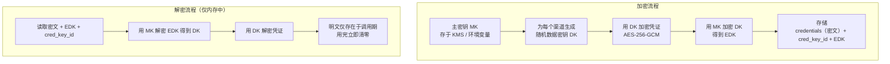
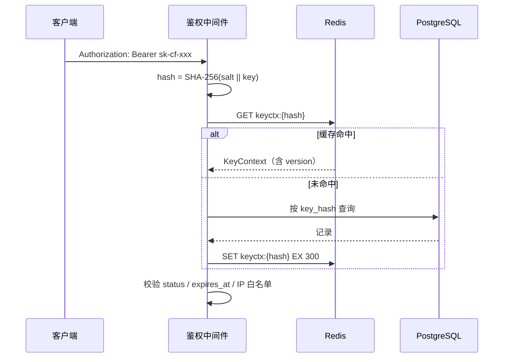
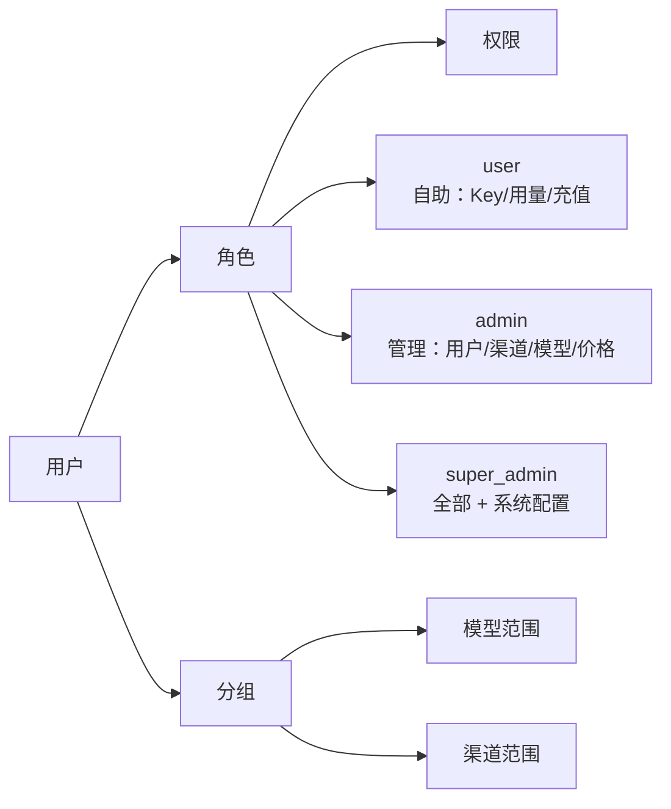

# 08 · 安全设计

> 本文描述凭证加密、密钥管理、脱敏、权限模型、审计与合规。
> 阅读本文后你应当能回答：上游密钥怎么存才安全、数据库泄露了会怎样、谁能看什么。

---

## 1. 威胁模型与防护目标

| 威胁 | 影响 | 防护措施 |
| --- | --- | --- |
| 数据库整体泄露 | 上游密钥、用户密钥全部暴露 | 上游凭证信封加密（DB 泄露不等于密钥泄露）；用户 API Key 只存哈希 |
| 内部人员越权查看凭证 | 凭证被挪用 | 凭证明文永不返回前端；读取需二次校验并审计 |
| 日志/错误信息泄露密钥 | 密钥进入日志系统扩散 | 统一脱敏函数；日志禁止记录 body |
| 中间人攻击 | 传输中被窃听 | 全链路 HTTPS；回源强制 TLS 校验 |
| SSRF（多模态图片 URL） | 攻击者借平台访问内网 | URL 白名单/黑名单 + 专用出网代理 |
| 暴力破解 API Key | 盗刷额度 | Key 熵 ≥128 bit（明文 `sk-cf-` + 22 位 Base62 ≈ 131 bit）；失败限流；异常告警 |
| 提权 / 越权访问他人资源 | 数据泄露 | RBAC + 资源归属校验（每个查询强制带 user 条件） |
| 支付回调伪造 | 白嫖额度 | 强制验签；金额校验；幂等 |
| 提示词注入导致的数据外泄 | 间接攻击上游 | 内容安全审计（可选），记录摘要告警 |

**核心原则**：假设数据库会被攻破，设计上保证攻破后攻击者**无法获得可直接使用的凭证**。

---

## 2. 上游凭证加密存储

### 2.1 信封加密方案

> 参考来源：sub2api `internal/repository/aes_encryptor.go` 采用 AES-256-GCM，输出 `base64(nonce + ciphertext + tag)`，密钥来自配置的 hex 字符串。本平台在其基础上升级为**信封加密 + 密钥轮换**，解决"单主密钥泄露影响全量数据"与"密钥无法轮换"的问题。



### 2.2 存储结构

```json
{
  "v": 1,
  "key_id": "k_2026_08",
  "edk": "base64(用主密钥加密的数据密钥)",
  "nonce": "base64(随机 nonce)",
  "ct": "base64(AES-256-GCM 密文 + tag)",
  "fields": ["api_key"]
}
```

| 字段 | 说明 |
| --- | --- |
| `v` | 格式版本，便于未来升级 |
| `key_id` | 主密钥 ID，支持多版本共存（轮换期） |
| `edk` | 被主密钥加密的数据密钥 |
| `nonce` | GCM nonce，每次加密随机生成，**绝不复用** |
| `ct` | 凭证密文（含 GCM 认证标签，提供完整性校验） |
| `fields` | 标明哪些子字段被加密（部分字段如 `extra` 可能不加密） |

**AAD（附加认证数据）**：加密时把 `channel_id` 作为 AAD 传入，防止密文在不同渠道间被整体移植。

### 2.3 密钥管理

| 密钥 | 存储 | 轮换 |
| --- | --- | --- |
| 主密钥 MK | 环境变量 / KMS / Vault；**绝不入库** | 每年，或泄露时立即 |
| 数据密钥 DK | 加密后随记录存储 | 每次保存凭证时重新生成 |

**轮换流程**（不中断服务）：

1. 新增主密钥 `MK_new`，配置中同时保留 `MK_old` 与 `MK_new`（按 `key_id` 区分）。
2. 后台任务分批读取用 `MK_old` 的记录：解密 DK → 用 `MK_new` 重新加密 DK → 更新 `edk` 与 `key_id`。
3. 全量迁移完成后移除 `MK_old`。
4. 全程无需停机，解密时按记录的 `key_id` 选择对应主密钥。

### 2.4 使用约束

| 约束 | 说明 |
| --- | --- |
| 明文生命周期 | 仅在 `EncodeRequest` 调用期存在于内存，用完立即清零（`memzero`） |
| 不落日志 | 凭证结构体实现 `String()` / `MarshalLogObject()` 返回脱敏串，防止被日志库自动序列化 |
| API 永不返回明文 | 管理端接口只返回脱敏结果；"查看明文"需二次校验（TOTP/密码）并写审计 |
| 不进错误信息 | 上游返回的错误 body 若含凭证片段，需过滤后再返回 |
| 子进程隔离 | 不把凭证作为命令行参数传递（会进入 `ps` 输出） |

---

## 3. 用户 API Key 管理

### 3.1 生成与存储

```
明文格式：sk-cf-<22位随机串>     总熵 ≈ 131 bit（22 × log2(62)），满足 ≥128 bit 要求
存储：key_hash = SHA-256(global_salt || 明文)  唯一索引
      key_prefix = 明文前 10 位（sk-cf-ab12）  用于列表展示
```

> **位数统一说明**：早期版本中 `key_prefix` 有"前 8 位"（[02 §3.3](./02-data-model.md#33-api_keys-平台下发密钥)）与"前 11 位"（本文）两种写法，而示例 `sk-cf-ab12` 实际为 **10** 位。现统一为前 10 位，两处已同步。
>
> **熵的换算**：22 位 Base62 ≈ 131 bit。若未来合规要求 ≥160 bit，将随机串增至 **27 位**（27 × log2(62) ≈ 161 bit），`key_prefix` 仍取前 10 位不受影响。

| 决策 | 理由 |
| --- | --- |
| **只存哈希，不存可逆密文** | API Key 是长期凭证，泄露等同账号密码。哈希意味着数据库泄露后攻击者无法获得可用密钥 |
| 用 SHA-256 而非 bcrypt | API Key 本身是高熵随机串（不像密码易被字典攻击），无需慢哈希；鉴权在热路径上，SHA-256 性能更好 |
| 保留前缀明文 | 用户有多个 Key 时需要在列表中区分 |

**代价**：用户只能在创建时看到一次明文，之后无法找回 —— 这是所有主流 API 平台的通行做法，需在 UI 上明确提示。

### 3.2 校验与吊销



**吊销即时生效**：

| 场景 | 机制 |
| --- | --- |
| 用户删除 Key | 删除 DB 记录 + `DEL` 缓存键 |
| 管理员禁用 | 同上 |
| Key 过期 | 缓存 TTL 到期后自然失效；同时有定时任务清理 |
| 用户被禁用 | 需要批量失效其所有 Key → 用**全局版本号**：`keyctx:{hash}` 中存 `user_version`，与 `users.version` 比对，不一致视为失效 |

> **为什么引入全局版本号**：一个用户可能有数十个 Key，全部 `DEL` 需要遍历且存在竞争窗口。用版本号比对是 O(1) 且无需枚举。缓存 TTL 5 分钟 + 版本号双重保险，最坏情况下 5 分钟内生效，实际上禁用操作会主动广播失效。

### 3.3 使用约束

| 约束 | 值 |
| --- | --- |
| 单个用户 Key 数量上限 | 50 |
| Key 有效期 | 可选，最长 2 年 |
| 失败鉴权限流 | 同 IP 每分钟最多 20 次失败，超出锁定 15 分钟 |
| 异常使用告警 | 短时间大量失败、异地 IP 切换等触发通知 |

---

## 4. 脱敏策略

> 参考来源：sub2api `internal/service/account_credentials_redact.go` 提供凭证脱敏能力。本平台把脱敏扩展为全局强制规范。

### 4.1 脱敏规则

| 数据类型 | 脱敏后形态 | 示例 |
| --- | --- | --- |
| 上游 API Key | 前 3 后 4，中间 `*` | `sk-****...****7Xa2` |
| 用户 API Key | 前缀 + `****` | `sk-cf-ab12****` |
| OAuth Token | 完全隐藏，仅显示 `***` | `***` |
| 邮箱 | 首字符 + `***` + `@` + 域名 | `a***@example.com` |
| 手机号 | 前 3 后 4 | `138****5678` |
| IP | 最后一段掩码 | `203.0.113.*` |
| 请求/响应正文 | **不记录**（仅记录 token 统计与采样摘要） | — |

### 4.2 强制落地点

```go
// 所有进入日志与 API 响应的凭证类型必须实现该接口。
type Redactable interface {
    Redacted() string
}

// 日志序列化钩子：slog 的 ReplaceAttr 统一处理。
func redactAttr(groups []string, a slog.Attr) slog.Attr {
    if v, ok := a.Value.Any().(Redactable); ok {
        return slog.String(a.Key, v.Redacted())
    }
    return a
}
```

| 落地层次 | 措施 |
| --- | --- |
| 日志 | `slog` 的 `ReplaceAttr` 全局钩子 + 凭证类型实现 `Redactable` |
| JSON 序列化 | 凭证结构体实现 `MarshalJSON()` 返回脱敏结果（防止被意外打印） |
| API 响应 | DTO 层只输出脱敏字段；明文接口独立且需二次校验 |
| 错误上报 | panic / error 上报前统一过脱敏过滤器 |
| 数据库 | 不存明文本身（加密或哈希），从源头杜绝 |

### 4.3 日志内容红线

| 禁止记录 | 允许记录 |
| --- | --- |
| 完整请求 body | token 数量、消息条数、是否含图片 |
| 完整响应 body | 输出 token 数、结束原因 |
| 上游凭证 | 渠道 ID、供应商 code |
| 用户 API Key 明文 | Key ID、Key 前缀 |
| 完整 IP | 掩码后 IP（合规要求时可存原文但加密） |

采样审计场景（合规需要保留内容时）：仅记录**哈希摘要 + 采样标记**，原文加密存储于独立的审计库，访问需审批。

---

## 5. 认证与权限

### 5.1 认证方式

| 场景 | 方式 |
| --- | --- |
| 用户自助控制台 | 会话（HttpOnly + Secure + SameSite=Lax Cookie）或 JWT |
| API 调用 | `Authorization: Bearer <API Key>` |
| 管理后台 | 用户会话 + 角色校验；敏感操作二次校验（TOTP / 密码确认） |
| 内部服务 | mTLS 或内网隔离（暂不涉及跨进程） |

### 5.2 RBAC 权限模型



| 角色 | 权限 |
| --- | --- |
| `user` | 管理自己的 API Key、查看自己的用量与账单、充值、订阅套餐 |
| `admin` | 管理用户（不含超管）、渠道、模型、价格、查看全量日志（脱敏）、处理对账 |
| `super_admin` | 全部权限 + 系统配置、主密钥轮换、角色分配、审计日志查看 |

**权限点命名规范（全平台统一点分）**：

```
<资源>.<子资源>.<动作>      例：channel.credential.view、billing.adjust.create
动作取值：view / create / update / delete / export / approve
```

权限点与 `audit_logs.action` **共用同一命名空间**（见 [02 §8.2](./02-data-model.md#82-audit_logs-审计日志)），即"能做什么"与"做了什么"用同一套字符串，避免两张表对不上。

| 角色 | 权限点（MVP 最小集） |
| --- | --- |
| `user` | `api_key.*`、`usage.view`、`billing.view`、`payment.order.create`、`subscription.*`、`ticket.*` |
| `admin` | `user.*`（不含 `user.role.update`）、`group.*`、`channel.*`、`model.*`、`model_price.view/create`、`usage.view`（全量）、`billing.adjust.create`（有金额上限）、`reconcile.*`、`ticket.*`、`announcement.*` |
| `super_admin` | `*`；其中 `settings.update`、`crypto.rotate`、`user.role.update`、`audit_log.view` 为**超管专属** |

> **前端指令写法**：[14 §5.1](./14-frontend.md#51-守卫设计) 中的 `v-permission` 值必须与本表一致（**点分**，早期版本的 `channel:credential:view` 冒号写法已废止）。

### 5.3 强制的资源归属校验

**最常见的越权漏洞**是"查询时忘记带归属条件"。为此：

```go
// 所有用户侧查询必须显式传入 ownerID，且由中间件从会话注入，
// 不接受客户端传入的 user_id。
func (s *UsageService) List(ctx context.Context, ownerID int64, q Query) ([]UsageDTO, error)

// 管理端接口单独一组，带 admin 权限校验中间件。
func (s *UsageService) ListAll(ctx context.Context, q Query) ([]UsageDTO, error)
```

- 用户侧接口**不接受**客户端传入的 `user_id` 参数，一律取会话身份。
- 管理端接口与用户侧接口**物理分离**（不同路由前缀 + 不同中间件），避免误用。
- 敏感管理操作（改余额、删渠道、看凭证）需二次校验并写审计。

### 5.4 注册与登录安全

| 措施 | 说明 |
| --- | --- |
| 密码策略 | 最小 8 位；存储用 bcrypt/argon2id |
| 注册限流 | 同 IP 每小时 5 次；可开启邮箱验证、验证码 |
| 登录失败限流 | 同账号 5 次失败锁定 15 分钟；同 IP 分级别限流 |
| 会话管理 | 支持查看与吊销设备会话；敏感操作后强制重认证 |
| 二次验证 | 管理员强制 TOTP；用户可选 |
| OAuth | 支持第三方登录（可扩展），绑定关系独立表 |

---

## 6. 配额与用量控制

| 层级 | 控制项 | 超出行为 |
| --- | --- | --- |
| 用户 | 并发、RPM、TPM、日/月额度 | 429 / 402 |
| API Key | 并发、RPM、TPM、日额度（覆盖用户级） | 429 / 402 |
| 分组 | 可用模型、RPM、并发、日额度 | 429 / 403 |
| 渠道 | 并发上限、配额周期 | 渠道停止调度 |
| 全局 | 总并发、总 QPS | 503 并告警 |

额度检查走 Redis 计数器（避免每次查库）。

**配额重置口径（与 [02 §13.2](./02-data-model.md#132-账期切分平台时区--用户时区双轨) 统一）**：日/月额度按**平台时区**（`settings.billing_timezone`，默认 `Asia/Shanghai`）重置，**不是 UTC 0 点**。由 `quota:reset` 周期任务（每日 0 点，平台时区）推进 `user_balances.quota_reset_at` 并清零计数；重置结果写 `billing_ledger` 汇总。

> 早期版本写"UTC 0 点重置"，与 02 §13.2"配额重置走平台时区"冲突。若按 UTC 重置而看板按 UTC+8 展示，用户会看到"今天 8 点前用量算昨天"的错乱——这是投诉量最高的计费类问题之一。以 **02 §13.2 为准**。

---

## 7. 传输与回源安全

| 项 | 要求 |
| --- | --- |
| 对外 API | 强制 HTTPS（HSTS）；TLS 1.2+ |
| 回源上游 | 强制 TLS 校验（**禁止** `InsecureSkipVerify`）；上游证书异常视为渠道故障 |
| 回源代理 | 若配置代理，代理凭据加密存储；代理出口 IP 纳入白名单管理 |
| SSRF 防护 | 多模态图片 URL 下载前校验：禁止内网网段（10/8、172.16/12、192.168/16、169.254/16、127/8）、禁止非 HTTP(S) 协议、限制重定向次数、限制响应大小（20MB）与超时（5s） |
| Webhook | 强制验签；IP 白名单（若渠道提供）；限流防重放 |
| 内部组件 | Redis / PG 置于内网，启用认证；Redis 禁用危险命令（`FLUSHALL`、`KEYS`） |

---

## 8. 审计日志

### 8.1 必审计事件

| 类别 | 事件 |
| --- | --- |
| 凭证 | 渠道凭证创建/读取明文/更新/删除 |
| 用户 | 登录成功失败、密码修改、二次验证变更、角色变更、禁用启用 |
| 密钥 | API Key 创建/删除/禁用（不记录明文） |
| 资金 | 手动调整余额、退款、订单状态变更、套餐发放 |
| 配置 | 渠道/模型/价格/分组/系统配置变更 |
| 数据 | 导出、删除、归档操作 |

### 8.2 记录内容

```json
{
  "actor_id": 1001,
  "actor_type": "admin",
  "action": "channel.credential.view",
  "target_type": "channel",
  "target_id": 42,
  "client_ip": "203.0.113.*",
  "user_agent": "Mozilla/5.0 ...",
  "before": null,
  "after": null,
  "result": "success",
  "created_at": "2026-09-05T10:30:00Z"
}
```

**注意**：`before` / `after` 只记录**非敏感字段的变更**（如 status、priority），凭证内容一律不记录。

**保留与保护**：审计日志保留 1 年后归档；审计表**只允许 INSERT**，应用账号无 UPDATE/DELETE 权限，防止被篡改。

---

## 9. 内容安全与合规

| 项 | 说明 |
| --- | --- |
| 上游内容审核 | 上游返回审核拒绝时，归一化为 `content_filter` 错误，不重试 |
| 平台侧审核（可选） | 对提示词做敏感内容检测（可开关）；命中后拒绝并记录；**只存摘要与哈希，不存原文** |
| 数据留存 | 调用日志默认保留 6 个月（可配置）；用户可申请删除个人数据（需保留账单流水以满足财务合规） |
| 地域合规 | 若面向欧盟用户，需支持数据驻留与删除请求（GDPR）；日志中的 IP 做掩码处理 |
| 供应商条款 | 平台仅做技术中转，需在服务条款中明确用户需自行遵守上游服务条款 |

---

## 10. 安全加固清单

| 类别 | 检查项 |
| --- | --- |
| 依赖 | `govulncheck` 纳入 CI；Dependabot/Renovate 自动更新 |
| 静态扫描 | `gosec` + `golangci-lint`（含 `errcheck`） |
| 密钥泄露扫描 | CI 中扫描代码与配置中的密钥格式（gitleaks） |
| 请求体限制 | 全局 8MB；JSON 解析深度与键数量限制（防嵌套炸弹） |
| 慢速攻击 | 读超时、写超时、空闲超时齐全 |
| 错误信息 | 对外不暴露堆栈、SQL、内部路径 |
| 依赖最小化 | 生产镜像基于 distroless/scratch；非 root 用户运行 |
| 备份加密 | 数据库备份加密存储，定期演练恢复 |
| 密钥轮转演练 | 每半年演练一次主密钥轮换流程 |
| 渗透测试 | 上线前一次，之后每年一次 |

---

## 11. 参考来源（sub2api）

| 本设计点 | 参考位置 | 关系 |
| --- | --- | --- |
| AES-256-GCM 加密器 | `internal/repository/aes_encryptor.go`：`NewAESEncryptor` 从 `cfg.Totp.EncryptionKey`（hex，32 字节）构造；`Encrypt` 输出 `base64(nonce + ciphertext + tag)` | 沿用算法与编码；本平台升级为信封加密 + `key_id` 轮换 |
| 凭证脱敏 | `internal/service/account_credentials_redact.go`、`account_credentials_redact_test.go` | 沿用"统一脱敏函数"思路，扩展到全局日志钩子 |
| 凭证 JSONB 存储 | `ent/schema/account.go` 的 `credentials` / `extra` | 沿用结构，值改为密文 |
| 密钥/机密管理 | `ent/schema/security_secret.go` | 参考 |
| 二次验证 | `internal/handler/totp_handler.go`、`internal/service/totp_service.go` | 沿用 TOTP 作为敏感操作二次校验 |
| 审计日志 | `internal/service/audit_log.go`、`audit_log_service.go` | 沿用 |
| 内容安全 | `internal/securityaudit/`（36 个文件）、`internal/handler/admin/content_moderation_handler.go` | 作为扩展位，二期实现 |
| 合规 | `internal/service/admin_compliance.go`、`ent/schema/payment_audit_log.go` | 参考 |
| 安全审计错误 | `internal/handler/security_audit_errors.go` | 参考"安全模块自身错误不暴露细节" |