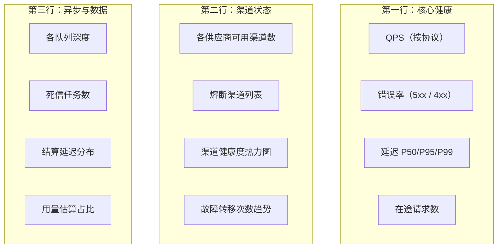

# 09 · 可观测性

> 本文定义日志规范、监控指标、看板设计、告警规则与链路追踪。
> 阅读本文后你应当能回答：线上出问题怎么定位、应该盯哪些指标、什么情况需要告警。

---

## 1. 三支柱与各自定位

| 支柱 | 回答的问题 | 工具 | 保留期 |
| --- | --- | --- | --- |
| **日志** | 这次请求具体发生了什么 | `log/slog` 结构化日志 → 日志系统 | **应用日志** 30 天热，90 天冷（注意：与 [02 §9.2](./02-data-model.md#92-生命周期) 的 `usage_logs` 业务数据生命周期是两套口径，不可混淆） |
| **指标** | 整体趋势与异常在哪 | Prometheus + Grafana | 15 个月（降采样） |
| **链路追踪** | 跨组件耗时分布在哪 | OpenTelemetry（可选） | 7 天 |

> **两套"日志"必须区分**：① **应用日志**（本表）= 进程输出的 slog JSON，保留 30/90 天；② **调用日志**（`usage_logs` 表）= 业务数据，热 3 月 / 温 6 月 / 冷 12 月。前者用于排障，后者用于计费与对账，生命周期与存储介质都不同。

**分工原则**：指标用于发现"有问题"，日志用于定位"什么问题"，追踪用于分析"慢在哪"。

---

## 2. 日志规范

### 2.1 结构化日志

统一 `log/slog` JSON 输出，禁止 `fmt.Println` 与字符串拼接式日志。

**全局字段**（每条日志必带）：

| 字段 | 说明 |
| --- | --- |
| `ts` | ISO8601 时间戳（UTC） |
| `level` | `debug` / `info` / `warn` / `error` |
| `msg` | 固定英文短句（便于聚合，不拼接变量） |
| `service` | `cloudfog` |
| `role` | `api` / `worker` / `scheduler` |
| `instance` | 实例 ID |

**请求级字段**（调用链路上的日志）：

| 字段 | 说明 |
| --- | --- |
| `request_id` | 贯穿全链路，排障主键 |
| `user_id` / `key_id` | 归属 |
| `group_id` | 分组 |
| `model` / `upstream_model` | 模型 |
| `channel_id` / `provider` | 渠道与供应商 |
| `duration_ms` / `first_token_ms` | 耗时 |
| `status_code` | 状态码 |
| `input_tokens` / `output_tokens` | 用量 |

### 2.2 日志级别约定

| 级别 | 使用场景 | 量级 |
| --- | --- | --- |
| `debug` | 详细调试信息（请求体摘要、路由候选详情） | 生产默认关闭，按需临时开启 |
| `info` | 关键生命周期事件：请求完成、渠道状态变更、任务投递 | 与 QPS 同量级 |
| `warn` | 可自愈的异常：渠道切换、熔断打开、估算用量、限流触发 | 低频 |
| `error` | 需要关注的失败：上游不可用、结算失败、支付验签失败 | 极低 |

### 2.3 关键日志事件

| 事件 | 级别 | 关键字段 | 用途 |
| --- | --- | --- | --- |
| `request.completed` | info | 全量请求字段 | 用量分析、延迟分析 |
| `request.failed` | error | `error_code`、`status_code`、`switch_count` | 错误率统计 |
| `channel.switched` | warn | `from`、`to`、`reason` | 故障转移分析 |
| `circuit.opened` / `closed` | warn / info | `channel_id`、`fail_count`、`error_rate` | 熔断监控 |
| `channel.rate_limited` | warn | `channel_id`、`retry_after` | 上游限流监控 |
| `usage.estimated` | warn | `channel_id`、`model` | 计量精度监控 |
| `billing.settle_failed` | error | `request_id`、`user_id`、`amount` | 资金安全 |
| `queue.backlog` | warn | `queue`、`depth` | 队列积压 |
| `payment.verified` / `failed` | info / error | `order_no`、`provider` | 支付监控 |
| `credential.accessed` | info | `channel_id`、`actor_id` | 安全审计 |

### 2.4 采样与脱敏

| 场景 | 策略 |
| --- | --- |
| 请求完成日志 | 全量记录（这是调用日志的补充，字段精简） |
| 请求体内容 | **默认不记录**；审计场景下按采样率（如 1%）记录脱敏摘要 |
| Debug 日志 | 按渠道/用户维度动态开关（配置热更新），避免全量开启 |
| 敏感字段 | 全局 `ReplaceAttr` 钩子强制脱敏（见 [08-security §4](./08-security.md#4-脱敏策略)） |

**禁止**：把完整 body、凭证、Key 明文写入任何日志。

---

## 3. Prometheus 指标

### 3.1 网关核心指标

| 指标 | 类型 | 标签 | 说明 |
| --- | --- | --- | --- |
| `cloudfog_requests_total` | Counter | `protocol`、`model`、`provider`、`status_code` | 请求总数 |
| `cloudfog_request_duration_seconds` | Histogram | `protocol`、`model`、`stream` | 请求耗时（buckets: 0.1/0.5/1/2/5/10/30/60） |
| `cloudfog_first_token_duration_seconds` | Histogram | `model`、`provider` | 首字延迟 |
| `cloudfog_requests_inflight` | Gauge | `protocol` | 在途请求数 |
| `cloudfog_request_body_bytes` | Histogram | `protocol` | 请求体大小分布 |
| `cloudfog_response_tokens_total` | Counter | `model`、`provider` | 输出 token 总量 |
| `cloudfog_failover_switches_total` | Counter | `model`、`reason` | 故障转移次数 |
| `cloudfog_degraded_requests_total` | Counter | `from_model`、`to_model` | 降级次数 |

### 3.2 渠道健康指标

| 指标 | 类型 | 标签 |
| --- | --- | --- |
| `cloudfog_channel_health_score` | Gauge | `channel_id`、`provider` |
| `cloudfog_channel_circuit_state` | Gauge | `channel_id`（0=closed, 1=half_open, 2=open） |
| `cloudfog_channel_errors_total` | Counter | `channel_id`、`error_code` |
| `cloudfog_channel_rate_limited_total` | Counter | `channel_id` |
| `cloudfog_channel_concurrency` | Gauge | `channel_id` |
| `cloudfog_channel_available` | Gauge | `provider`、`group_id` | 可用渠道数（**关键**：为 0 时应告警） |

### 3.3 队列与异步指标

| 指标 | 类型 | 说明 |
| --- | --- | --- |
| `rabbitmq_queue_messages_ready` | Gauge | 各队列可投递消息深度（RabbitMQ Prometheus 插件，15692，按 `queue` label） |
| `rabbitmq_queue_messages_unacked` | Gauge | 已投递未 ack 消息数（处理中） |
| `cloudfog_dlq_depth` | Gauge | `task.dlq` 死信深度（应用侧从 Management HTTP API 采集，**>0 即告警**） |
| `cloudfog_tasks_processed_total` | Counter | 已处理任务数（应用侧，按任务类型 label） |
| `cloudfog_task_duration_seconds` | Histogram | 任务处理耗时 |
| `cloudfog_task_retries_total` | Counter | 应用级重试次数（经 retry TTL 桶，按任务类型 label） |

### 3.4 计费指标

| 指标 | 类型 | 说明 |
| --- | --- | --- |
| `cloudfog_billing_reserve_total` | Counter | 预扣次数 |
| `cloudfog_billing_settle_total` | Counter | 结算次数 |
| `cloudfog_billing_settle_failed_total` | Counter | **结算失败次数（>0 告警）** |
| `cloudfog_billing_amount_total` | Counter | 累计扣费金额 |
| `cloudfog_balance_insufficient_total` | Counter | 余额不足拒绝次数 |
| `cloudfog_usage_estimated_ratio` | Gauge | 估算用量占比（**>5% 告警**） |
| `cloudfog_settle_delay_seconds` | Histogram | 从请求结束到结算完成的延迟 |
| `cloudfog_billing_overdraft_total` | Counter | 补扣时余额不足产生欠费的次数（>0 告警，见 [06 §4.3](./06-billing-payment.md#43-差额处理)） |
| `cloudfog_frozen_balance` | Gauge | Redis 中冻结中的额度总额（对账用，异常偏高说明预扣泄漏） |

### 3.4.1 计量质量指标（[06 §11.6](./06-billing-payment.md#116-监控指标) 引用，此前未定义）

| 指标 | 类型 | 标签 | 说明 |
| --- | --- | --- | --- |
| `cloudfog_usage_anomaly_total` | Counter | `channel_id`、`anomaly_type` | 用量异常值次数（`output_capped` / `input_over_ctx` / `negative` / `cache_gt_input`），见 06 §11.5 |
| `cloudfog_usage_zero_total` | Counter | `channel_id` | 上游返回 usage 全 0 且 HTTP 200 的次数 |
| `cloudfog_usage_partial_total` | Counter | `channel_id` | `usage_source='partial'` 的次数 |
| `cloudfog_channel_token_ratio` | Gauge | `channel_id` | 当前生效的 `channels.token_ratio` 标定值（与上游账单偏差 >20% 告警） |
| `cloudfog_payment_notify_verify_failed_total` | Counter | `provider` | 支付回调**验签失败**次数（>5 次/5min 告警 P0） |
| `cloudfog_payment_refund_total` | Counter | `provider`、`result` | 退款成功/失败/未知次数 |
| `cloudfog_partition_missing` | Gauge | — | 下月 `usage_logs` 分区是否已创建（1=缺失，>0 告警） |
| `cloudfog_archive_failed_total` | Counter | `partition` | 归档失败次数（>0 告警 P1，见 [02 §9.2](./02-data-model.md#92-生命周期)） |

### 3.5 业务指标

| 指标 | 类型 | 标签 | 说明 |
| --- | --- | --- | --- |
| `cloudfog_active_users` | Gauge | `period`（daily/monthly） | 日活/月活（由统计任务导出） |
| `cloudfog_revenue_total` | Counter | `type`（recharge/subscription） | 累计收入 |
| `cloudfog_gross_margin` | Gauge | `model`、`channel_id` | 毛利率 = (total_cost - upstream_cost) / total_cost |
| `cloudfog_payment_orders_total` | Counter | `provider`、`status` | 订单数（按状态拆分，可算成功率） |
| `cloudfog_subscription_active` | Gauge | `plan_id` | 有效订阅数 |

---

## 4. 看板设计

### 4.1 技术看板（SRE）

### 4.2 运营看板

| 面板 | 内容 |
| --- | --- |
| 营收概览 | 今日/本月充值额、消费额、毛利率 |
| 用量趋势 | 按日/月调用量与 token 趋势（ stacked by model） |
| 模型分布 | Top 10 模型的调用占比与收入占比（饼图 + 表） |
| 渠道成本 | 各渠道调用量、成本、毛利（表格，可按列排序） |
| 用户分层 | 消费 Top 用户、新增用户、活跃用户 |
| 套餐转化 | 订阅数、续费率、套餐使用率 |

### 4.3 用户自助看板（控制台）

**性能要求**：用户看板必须查 `usage_daily_stats` 聚合表，**禁止**直接扫 `usage_logs`。明细查询强制带时间范围（默认 24h，最大 90 天）并分页。

---

## 5. 告警规则与分级

### 5.1 告警级别

| 级别 | 定义 | 通知方式 | 响应时限 |
| --- | --- | --- | --- |
| **P0 紧急** | 平台大面积不可用或资金异常 | 电话 + 短信 + IM | 15 分钟 |
| **P1 重要** | 核心功能受损、错误率显著上升 | 短信 + IM | 1 小时 |
| **P2 一般** | 单渠道异常、队列积压 | IM | 4 小时 |
| **P3 提示** | 趋势异常、容量预警 | IM（免打扰时段静默） | 次日处理 |

### 5.2 告警规则清单

| 级别 | 规则 | 阈值 | 依赖指标 | 说明 |
| --- | --- | --- | --- | --- |
| P0 | 全局错误率 | 5 分钟窗口 > 20% | `cloudfog_requests_total` | 大面积故障 |
| P0 | 可用渠道数 | 某分组 = 0 持续 2 分钟 | `cloudfog_channel_available` | 该分组用户完全不可用 |
| P0 | 结算失败 | 5 分钟内 > 10 次 | `cloudfog_billing_settle_failed_total` | 资金安全 |
| P0 | 死信任务 | `task.dlq` 深度 > 0 | `cloudfog_dlq_depth` | 账单可能丢失 |
| P0 | 支付回调验签失败 | 5 分钟内 > 5 次 | `cloudfog_payment_notify_verify_failed_total` | 可能在被攻击 |
| P0 | 欠费产生 | 任何一次 | `cloudfog_billing_overdraft_total` | 价格配置错误或极端长输出 |
| P1 | 错误率 | 5 分钟窗口 > 5% | `cloudfog_requests_total` | 部分故障 |
| P1 | 首字延迟 P95 | > 基线 2 倍持续 10 分钟 | `cloudfog_first_token_duration_seconds` | 上游变慢 |
| P1 | 队列积压 | `task.critical` ready 深度 > **1000** 持续 5 分钟 | `rabbitmq_queue_messages_ready{queue="task.critical"}` | 结算延迟。**扩容阈值是 500/3min**（见 [10 §4.3](./10-deployment.md#43-扩缩容策略)），两者不同 |
| P1 | 结算延迟 P95 | > 60s | `cloudfog_settle_delay_seconds` | 异步链路异常 |
| P1 | 余额扣减失败 | 任何一次 | `cloudfog_billing_settle_failed_total` | 需人工介入 |
| P1 | 归档失败 | 任何一次 | `cloudfog_archive_failed_total` | 分区可能处于半归档状态 |
| P2 | 单渠道熔断 | 持续 > 10 分钟 | `cloudfog_channel_circuit_state` | 上游故障。**P2 而非 P1**——单渠道熔断已有自动切换兜底，不直接影响用户；[13 §2.3](./13-operations.md#23-与故障联动) 早期写 P1 已更正 |
| P2 | 用量估算占比 | > 5% 持续 1 小时 | `cloudfog_usage_estimated_ratio` | 计量精度下降 |
| P2 | 用量异常值 | `cloudfog_usage_anomaly_total` > 0 | 同名指标 | 需核查是否为攻击或配置错误 |
| P2 | 渠道 usage 全零 | 单渠道 1 小时 > 50 次 | `cloudfog_usage_zero_total` | 该渠道 usage 不可靠 |
| P2 | 渠道限流频繁 | 单渠道 1 小时内 > 50 次 | `cloudfog_channel_rate_limited_total` | 需要扩容或降权 |
| P2 | 冻结额度异常 | `cloudfog_frozen_balance` 持续 1 小时不降 | 同名指标 | 预扣可能泄漏 |
| P2 | Redis 连接池 | 使用率 > 80% | `redis_exporter` | 容量预警 |
| P3 | 磁盘使用率 | > 70% | `node_exporter` | 日志或数据库增长 |
| P3 | 日志分区未创建 | 距下月 < **20** 天仍无分区 | `cloudfog_partition_missing` | 分区任务异常。**20 天而非 15 天**：[02 §9.2](./02-data-model.md#92-生命周期) 要求提前 30 天创建，15 天才告警已错过一个修复周期 |
| P3 | 毛利率低于阈值 | 某模型 < 5% | `cloudfog_gross_margin` | 定价或渠道成本异常 |

### 5.3 告警设计原则

| 原则 | 说明 |
| --- | --- |
| 可行动 | 每条告警必须有明确的处置动作，否则降级为看板指标 |
| 去噪 | 同一规则 5 分钟内只发一次（聚合）；连续抖动用 `for` 持续时间过滤 |
| 分级路由 | P0/P1 走值班电话，P2/P3 走群通知 |
| 自动恢复通知 | 告警恢复时发送 resolved，避免误判持续跟进 |
| 定期演练 | 每季度验证告警链路可用（防止通知渠道失效） |

---

## 6. 链路追踪（可选，二期）

| 项 | 设计 |
| --- | --- |
| 协议 | OpenTelemetry，导出到 Jaeger / Tempo |
| 采样 | 头部采样 1% + 错误请求 100% 采样（尾部采样更好但成本更高） |
| Span 设计 | `request`（根） → `auth` → `route` → `encode` → `upstream`（子 span 含 HTTP 客户端指标）→ `decode` → `metering` |
| 关键属性 | `request_id`、`user_id`、`model`、`channel_id`、`provider`、`stream`、`switch_count` |
| 与日志关联 | 日志中输出 `trace_id`，可从日志跳转到链路 |

**一期建议**：先用结构化日志 + `request_id` 做串联（成本极低，覆盖 90% 场景），待系统稳定后再引入追踪。

---

## 7. 健康检查端点

| 端点 | 检查内容 | 用途 |
| --- | --- | --- |
| `GET /healthz` | 进程存活 | 存活探针（liveness） |
| `GET /readyz` | PG 连通、关键配置加载 | 就绪探针（readiness），失败则从负载均衡摘除 |
| `GET /metrics` | Prometheus 抓取 | 监控 |
| `GET /api/v1/admin/system/queues` | RabbitMQ 队列深度与状态（服务端代理 Management HTTP API） | 运维查看 |

**就绪探针的注意点**：Redis / RabbitMQ 短暂抖动不应导致所有实例被摘除（会引发雪崩）。因此 `readyz` 只检查**强依赖**（PG），RabbitMQ 与 Redis 异常通过降级（WAL / 进程内限流）与告警处理，不影响 readiness。

---

## 8. 排障手册（Runbook 索引）

| 现象 | 排查路径 |
| --- | --- |
| 用户报"请求全部失败" | 看全局错误率 → 看该用户分组的可用渠道数 → 看具体 `error_code` 分布 → 用 `request_id` 查日志 |
| 某个模型不可用 | 看该模型的渠道健康度 → 看是否有渠道处于熔断 → 检查模型映射配置 → 手动测试渠道连通性 |
| 余额扣多了 | 用 `request_id` 查 `usage_logs` → 核对 `price_snapshot` → 查 `billing_ledger` 流水 → 检查是否有重复结算 |
| 队列积压 | 看 `rabbitmq_queue_messages_ready` 与 `unacked` → 检查 worker 消费者是否存活 → 看任务处理耗时 → 检查 PG 写入性能 |
| 上游响应变慢 | 看首字延迟 P95 按渠道拆分 → 定位到具体供应商 → 降低该渠道权重或临时摘除 |
| 支付成功未到账 | 查 `payment_orders` 状态 → 查 `raw_notify` → 检查 webhook 是否验签失败 → 手动触发 `QueryOrder` 补单 |

---

## 9. 参考来源（sub2api）

| 本设计点 | 参考位置 | 关系 |
| --- | --- | --- |
| 结构化日志 | `internal/pkg/logger/`（基于 zap） | 沿用结构化思路；本平台用标准库 `log/slog` 减少依赖 |
| 错误日志与归因 | `internal/handler/ops_error_logger.go`：worker 数按 `GOMAXPROCS*2`（4~32）、队列 256~8192、队列字节上限 32MB | 参考其"有界队列 + 自动扩缩容 + 字节上限"的防雪崩设计 |
| 服务器计时 | `internal/pkg/servertiming/` | 参考：响应头输出服务端各阶段耗时，便于客户端排障 |
| 用量统计 | `internal/pkg/usagestats/` | 沿用聚合统计分离的设计 |
| 渠道监控 | `ent/schema/channel_monitor.go`、`channel_monitor_history.go`、`channel_monitor_daily_rollup.go`、`channel_monitor_request_template.go` | 作为**扩展位**（二期）：平台主动拨测并展示可用率 |
| 运维面板 | `internal/handler/admin/ops_handler.go`、`admin/ops_system_log_handler.go` | 参考运维端点组织 |
| 通知 | `internal/service/balance_notify_service.go`、`notification_email_service.go` | 沿用余额阈值通知 |