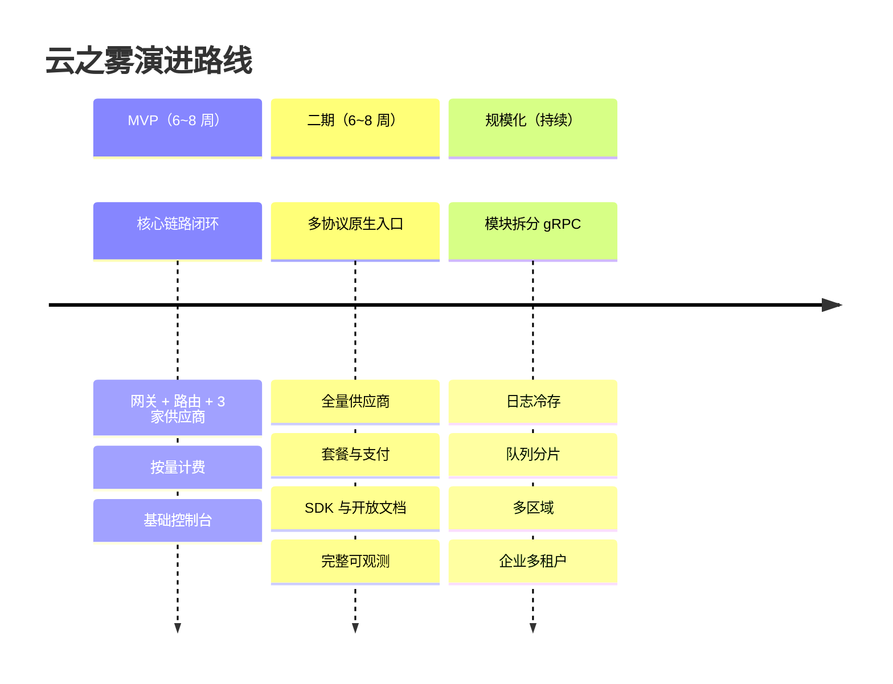
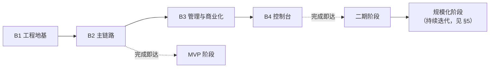

# 11 · 演进路线

> 本文把「云之雾」拆成三个阶段，明确每阶段的范围、验收标准与风险。
> 阅读本文后你应当能回答：第一个版本做什么、什么时候该做第二期、有哪些坑要提前避开。

---

## 1. 演进原则

| 原则 | 说明 |
| --- | --- |
| **先跑通再优化** | MVP 只做主链路闭环，不做锦上添花的功能 |
| **架构约束先行** | 模块边界、interface 契约、异步化这些"难以事后补救"的决策在第一期就定死 |
| **数据模型一次到位** | 表结构尽量在第一期设计完整（加列容易，改语义困难） |
| **能力可后置** | 内容审核、渠道拨测、联盟返佣等以「扩展位」标注，按需启用 |
| **每个阶段有可验收的产出** | 不是"做了 80%"，而是能跑通哪条完整链路 |

---

## 2. 里程碑总览

---

### 2.1 实施批次（工程落地视角）

> §3~§5 描述的是**产品能力的三阶段**；本节描述的是**工程实施的四批次**。二者是不同维度的切分：阶段回答"做成什么样"，批次回答"先写哪些代码"。
> 每个批次都是**可运行、可验收的增量**，不做"最后才拼起来"的瀑布式开发。

| 批次 | 内容 | 对应阶段 | 验收标志 |
| --- | --- | --- | --- |
| **B1 工程地基** | `go.mod`、目录骨架、Makefile、CI（lint/test/build）、`docker-compose.dev.yml`、**全部 GORM 模型 + 首次迁移**、配置与日志框架 | MVP 前置 | `make dev` 起得来；`/healthz` 返回 200；PG 中 20+ 张表已建；CI 全绿 |
| **B2 主链路闭环** | 中间件链、Canonical IR、3 个 Adapter（OpenAI/Anthropic/DeepSeek）、路由+熔断+故障转移、计量与异步结算（RabbitMQ 异步层）、OpenAI 兼容端点 | MVP 主体 | 官方 OpenAI SDK 改 base_url 跑通流式对话；余额正确扣减；`usage_logs` 与 `billing_ledger` 一致（对应 §3 的 M1~M10） |
| **B3 管理与商业化** | 用户/密钥/渠道/模型/价格 管理 API、套餐与支付（支付宝/微信）、对账任务、看板聚合、OpenAPI 规范 | 二期主体 | 管理端建渠道并测试连通；完成一次真实充值入账；对账脚本零差异（对应 §4 的 S1~S10） |
| **B4 控制台与生产化** | Nuxt 4 控制台（门户页 SSR/SEO + 用户端与管理端 CSR）、告警规则、Grafana 看板、部署编排与灰度文档 | 二期收尾 | 非技术同事能独立完成"建渠道 → 下发密钥 → 看账单"全流程（对应 [14-frontend §11](./14-frontend.md#11-验收标准b4) 的 F1~F16） |

**批次与阶段的关系**：

| 约束 | 说明 |
| --- | --- |
| 顺序不可颠倒 | B2 必须晚于 B1（依赖 schema）；B3 依赖 B2 的计量能力 |
| **Worker 先于 API 升级** | 发布时先升 Worker 再升 API，保证新任务负载能被消费（见 [01 §7.3](./01-architecture.md#7-异步层设计) 任务负载版本兼容） |
| 每批独立验收 | 一批未通过不进入下一批，避免问题累积 |
| B2 完成即可接真实流量 | 不必等 B4——控制台可用最小版或临时管理脚本替代 |

---

## 3. MVP 阶段

### 3.1 目标

**用最小代价跑通"一次调用 → 一次计费 → 一次可查"的完整闭环**，验证核心架构假设。

### 3.2 范围

| 模块 | 纳入范围 | 明确不做 |
| --- | --- | --- |
| 网关 | OpenAI 兼容 `/v1/chat/completions`（含流式）、`/v1/models` | Responses API、图像、嵌入 |
| 适配器 | OpenAI、Anthropic、DeepSeek 三家（覆盖"原生 + 兼容"两类） | 其余七家 |
| 路由 | 优先级 + 权重 + 硬过滤 + 故障转移 | 粘性会话、健康度打分（用固定优先级代替） |
| 容灾 | 熔断（简化版：连续失败计数）、切换重试 | 主动健康探测、降级链 |
| 计费 | 按量计费：预扣 + 异步结算 + 账单流水 + 日志落库 | 套餐、支付、对账自动化 |
| 密钥 | 上游凭证加密存储（信封加密）、平台 API Key 哈希 | 密钥轮换流程、IP 白名单 |
| 用户 | 注册登录、**三个角色（user / admin / super_admin）**、API Key 管理 | OAuth、二次验证、多租户 |
| 可观测 | 结构化日志 + 核心 Prometheus 指标 + 一个 Grafana 看板 | 追踪、告警分级、RabbitMQ Management 看板 |
| 异步 | RabbitMQ **三队列（critical / default / low）**，MVP 消费 `usage:write`、`billing:settle`、`billing:refund`，外加 `reserve:reclaim`（M12 冻结额度泄漏验收依赖，critical；周期任务仅注册这一个 cron）；`payment:confirm` 随 B3 支付上线 | 其余任务（`stats:aggregate`、`channel:probe`、对账等）与完整周期任务调度；`low` 队列在 MVP 期间**不启用消费**（实现口径：消费者组配置 `enabled: false`，见 [10 §3.2](./10-deployment.md#32-配置项清单按模块)），任务类型仍按三队列定义，避免后续改队列归属 |
| 控制台 | 极简：模型列表、密钥管理、用量趋势、调用明细 | 完整运营后台 |

### 3.3 验收标准

| 编号 | 验收项 | 判定方式 |
| --- | --- | --- |
| M1 | 用官方 OpenAI SDK 改 base_url 即可完成一次流式对话 | 手工验证 + 自动化冒烟 |
| M2 | 三家供应商任一被禁用后，请求自动切换且用户无感知（首字节前失败场景） | 故障注入测试 |
| M3 | 一次调用的 `usage_logs` 与 `billing_ledger` 记录一致，金额与价格快照计算吻合 | 对账脚本比对 |
| M4 | 并发 100 QPS 下，主链路无数据库写入（PG 写入 QPS 接近 0） | 压测 + 监控 |
| M5 | 余额不足时返回 402 且不发起上游请求 | 单元测试 |
| M6 | 进程重启后，已投递但未完成的结算任务仍能执行 | 杀进程测试 |
| M7 | 重复投递同一 `request_id` 的结算任务只扣一次费 | 幂等测试 |
| M8 | 日志中无任何凭证明文或完整请求体 | 日志扫描 |
| M9 | 首字延迟相比直连上游增量 < 30ms（P95） | 对比压测 |
| M10 | 单条调用 P95 延迟、错误率、队列深度在看板可见 | 人工检查 |
| M11 | **手动补单 / 手动调账 / 按 `request_id` 查看完整链路** 三项客服操作可用且全部留审计（补单复用 `payment:confirm` 链路，随 B3 支付上线；MVP 末段用测试渠道模拟回调演练） | 手工验证（[13 §9](./13-operations.md#9-实施优先级) 定为 P0，此前未纳入本表） |
| M12 | 预扣冻结额度在结算任务失败/进死信后能被 `reserve:reclaim` 释放，无额度泄漏 | 故障注入（杀 Worker） |

### 3.4 主要风险与对策

| 风险 | 影响 | 对策 |
| --- | --- | --- |
| IR 抽象设计不当，导致某家语义丢失 | 返工 | 先实现"透传路径"保证可用，IR 转换按能力逐步覆盖；每家用真实响应样本做契约测试 |
| 流式 usage 缺失导致计费不准 | 收入损失 | 优先请求 `include_usage`；估算比例纳入监控，>5% 立即排查 |
| 预扣估算偏差大 | 用户体验差（额度被冻结）或超额使用 | 先用保守上限（max_tokens 全量），上线后按真实分布调自适应系数 |
| 异步结算延迟导致余额显示滞后 | 用户困惑 | 前端展示"可用余额 = 余额 - 预扣中"；结算延迟纳入监控 |
| 上游限流策略差异大 | 频繁切换 | 冷却时间优先采用上游 `Retry-After`，无则按供应商配置默认值 |
| 日志表快速增长 | 磁盘压力 | 从第一天起就按月分区（事后改分区成本极高） |

---

## 4. 二期

### 4.1 目标

**从"能用"到"好用 + 可运营"**：补齐协议入口、供应商覆盖、商业化能力与可观测性。

### 4.2 范围

| 模块 | 新增内容 |
| --- | --- |
| 协议入口 | Anthropic `/v1/messages` 原生入口、Gemini `v1beta` 原生入口、透传短路路径 |
| 供应商 | 补齐 Google Gemini、通义千问、GLM、Kimi、MiniMax、文心一言（共 10 家） |
| 调度 | 粘性会话、健康度打分、主动健康探测、降级链、加权随机分流 |
| 计费 | 长上下文分级定价、缓存读写计费、按次计费（嵌入/图像） |
| 商业化 | 套餐订阅、支付渠道（支付宝/微信/Stripe）、订单与 webhook 幂等、**退款流程**（见 [06 §7.5](./06-billing-payment.md#75-退款流程)）。兑换码为扩展位，见 §6 |
| 开放能力 | OpenAPI 3.1 规范、Go/Python/Node SDK、开发者门户 |
| 可观测 | 告警分级（P0~P3）、RabbitMQ Management 看板、链路追踪（可选）、运营看板、对账报告 |
| 安全 | 密钥轮换流程、TOTP 二次验证、完整审计日志、内容安全（可选开关） |
| 异步 | 完整 Scheduler 周期任务：聚合、对账、归档、探活、套餐到期、订单关单 |

### 4.3 验收标准

| 编号 | 验收项 |
| --- | --- |
| S1 | 10 家供应商全部可用，每家有契约测试（真实样本固化） |
| S2 | 同一会话连续请求命中同一渠道（粘性会话），上游缓存命中率可观测 |
| S3 | 主模型不可用时自动降级到备用模型，响应头正确标记 `X-CloudFog-Degraded` |
| S4 | 完成一次真实支付：下单 → 支付 → 回调入账 → 余额增加 → 账单流水完整 |
| S5 | 重复回调同一订单只入账一次（幂等） |
| S6 | 日聚合任务产出的 `usage_daily_stats` 与 `usage_logs` 汇总一致 |
| S7 | 对账任务能发现并报告人为注入的差异数据 |
| S8 | 三语言 SDK 均能通过冒烟测试（含流式） |
| S9 | 告警在注入故障时能在 5 分钟内触发并送达 |
| S10 | 密钥轮换演练成功（新旧主密钥并存期服务不中断） |
| S11 | **降级链**在三种级别（请求级/分组级/模型级）分别生效，且高优先级覆盖低优先级 |
| S12 | **退款**闭环：全额退与部分退各一次，金额、订单状态、`billing_ledger` 三者一致；渠道超时产生 `refund_unknown` 时不自动重试 |

### 4.4 主要风险与对策

| 风险 | 对策 |
| --- | --- |
| 供应商协议变更导致批量失效 | 契约测试 + 定期（每周）跑真实探测；上游公告订阅 |
| 支付回调丢失导致用户投诉 | 主动查询兜底（5/15/30 分钟三次）+ 客服手动补单入口 |
| 多供应商计费口径不一致 | 每家接入时明确记录"token 单位、缓存计费规则、是否对失败请求计费"，形成核对表 |
| 套餐与按量混合抵扣逻辑复杂易错 | 抵扣优先级写成状态机，覆盖全部组合的单元测试 |
| SDK 与规范不同步 | CI 中规范变更自动触发 SDK 重新生成与契约测试 |

---

## 5. 规模化阶段

### 5.1 触发条件

| 信号 | 阈值 |
| --- | --- |
| 日调用量 | > 500 万 |
| 日志表热数据 | > 500 GB |
| 队列持续积压 | `task.critical` ready 深度（`rabbitmq_queue_messages_ready`）常态 > 1000 |
| 团队规模 | 后端 > 5 人，需要按模块划分 ownership |
| 业务需求 | 企业客户需要多租户隔离、SLA 保障、专属渠道 |

### 5.2 演进项

| 方向 | 内容 |
| --- | --- |
| **模块拆分** | 按 [01-architecture §9](./01-architecture.md#9-未来拆分为-grpc-服务的边界) 的顺序，先拆 `ops`，再拆 `billing`、`adapter` |
| **日志冷存** | `usage_logs` 分区导出 Parquet 到对象存储，热数据保留 3~6 个月；历史查询走回捞任务 |
| **队列优化** | 批量任务（单消息携带 N 条用量记录）；按 user_id 分片路由键（06 §5.5）；critical 队列迁至独立 RabbitMQ 集群（quorum 队列） |
| **数据库** | 读写分离（ops 查询走只读副本）；`usage_logs` 考虑按时间分库 |
| **多区域** | 按地域部署接入点，共享控制面；渠道按地域归属 |
| **企业多租户** | 租户维度的数据隔离、专属渠道池、自定义倍率、子账号与审批流 |
| **高可用** | PostgreSQL 主从自动切换；Redis 集群；多可用区部署 |

### 5.3 注意事项

- **不要过早拆分**：在日请求未达百万级前，微服务的复杂度成本远大于收益。
- **拆分顺序按"独立性"而非"重要性"**：先拆最独立、最耗资源的 `ops`，风险最低。
- **保持接口契约稳定**：拆分的难易程度完全取决于第一期是否严格执行了 interface 隔离。

---

## 6. 扩展位清单

以下能力在设计中已预留位置，但首期不实现：

| 扩展位 | 所在文档 | 预留方式 |
| --- | --- | --- |
| 渠道主动拨测与可用率状态页 | [05](./05-scheduling-resilience.md)、[09](./09-observability.md) | `channel:probe` 任务 + `low` 队列；监控表扩展 |
| 内容安全审计 | [08](./08-security.md) | 提示词检测开关；只存摘要 |
| 兑换码 / 优惠码 / 联盟返佣 | [06](./06-billing-payment.md) | 独立表 + 独立抵扣类型 |
| 批量图像/视频任务 | [04](./04-provider-adapter.md) | `billing_mode = image`；异步任务类型扩展 |
| OAuth 上游账号池 | [04](./04-provider-adapter.md) | `auth_type = oauth` + TokenProvider |
| TLS 指纹与出口 IP 管理 | [04](./04-provider-adapter.md)、[08](./08-security.md) | `proxies` 表 + 回源客户端配置 |
| 插件系统 | [01](./01-architecture.md) | Provider 注册机制天然可扩展 |
| 管理端一键备份 | [10](./10-deployment.md) | `backup_service` + 对象存储 |
| OpenAI Responses API 兼容 | [07](./07-api-sdk.md) | 新增端点，复用 IR |
| 嵌入 / 重排序 / 语音 | [04](./04-provider-adapter.md)、[06](./06-billing-payment.md) | `billing_mode = per_request` 已支持 |
| 模型自动发现与价格同步 | [02](./02-data-model.md) | `model_prices` 带生效时间，支持程序化写入 |
| 多租户与企业版 | [05](./05-scheduling-resilience.md) | 分组与渠道绑定机制天然支持隔离 |
| 公告 / 工单 / 客服操作台 | [13-operations](./13-operations.md) | 独立文档：数据模型、必备操作、审计要求 |
| 数据迁移（one-api / new-api / sub2api） | [13-operations §5](./13-operations.md#5-数据迁移方案) | 独立文档：实体映射、迁移流程、校验 SQL |

> **注意**：上表中的"公告、工单、客服操作台"与"数据迁移"虽列为扩展位，但**手动补单、手动调账、查看完整链路**三项属于 P0 —— 没有它们，系统一旦上线出现账务问题就只能直接改数据库，无法作为产品交付。详见 [13-operations §9](./13-operations.md#9-实施优先级)。

---

## 7. 风险登记册（全局）

| 编号 | 风险 | 等级 | 影响 | 缓解措施 | 负责人角色 |
| --- | --- | --- | --- | --- | --- |
| R1 | 上游服务条款限制中转 | 高 | 渠道被封、业务中断 | 服务条款明确用户责任；渠道分散；监控封禁信号 | 法务 + 运营 |
| R2 | 上游突然改价或涨价 | 中 | 毛利变负 | 价格同步机制 + 毛利率告警 + 快速调价能力 | 运营 |
| R3 | 计量不准导致亏损 | 高 | 成本高于收入 | 优先用上游 usage；估算比例监控；月度上游账单核对 | 后端 |
| R4 | 密钥泄露 | 高 | 额度被盗刷 | 信封加密 + 哈希存储 + 异常用量告警 + 快速吊销 | 安全 |
| R5 | 数据库成为瓶颈 | 中 | 全站变慢 | 主链路零写；按月分区；读写分离预案 | 后端 + DBA |
| R6 | Redis 单点故障 | 中 | 限流与分布式锁失效（队列在 RabbitMQ，不受影响） | 主从 + 哨兵；降级为进程内限流；告警 | SRE |
| R7 | 异步任务积压导致账单延迟 | 中 | 用户余额显示不准 | 队列优先级；批量任务；积压告警；扩容预案 | 后端 |
| R8 | 支付回调丢失或伪造 | 中 | 资金损失或用户投诉 | 验签 + 幂等 + 主动查询兜底 + 金额校验 | 后端 |
| R9 | 供应商 SDK/协议不兼容变更 | 中 | 某模型不可用 | 契约测试 + 定期探测 + 快速降级到替代模型 | 后端 |
| R10 | 合规要求变化（数据留存等） | 中 | 法律风险 | 日志保留策略可配置；支持数据删除请求 | 法务 + 后端 |

---

## 8. 建议节奏

| 阶段 | 周期 | 团队配置（参考） |
| --- | --- | --- |
| MVP | 6~8 周 | 后端 2 人、前端 1 人、兼职运维 |
| 二期 | 6~8 周 | 后端 3 人、前端 1~2 人、运维 0.5 人 |
| 规模化 | 持续迭代 | 按模块划分 ownership |

**每周节奏建议**：周一规划 → 周中开发 → 周五演示 + 回顾；MVP 阶段每周至少跑一次完整回归（冒烟测试脚本化）。

---

## 9. 与 sub2api 的演进对照

sub2api 从「订阅配额分发」起步，逐步叠加了 OAuth 账号池、TLS 指纹、批量图像、渠道拨测、内容审核、支付系统、插件系统等能力，最终成为 2200+ 文件的庞大工程。

**本平台的差异**：

| 维度 | sub2api | 云之雾 |
| --- | --- | --- |
| 起点定位 | 订阅配额分发 | 多供应商统一接入 + 商业化计费 |
| 复杂度策略 | 能力持续叠加 | 首期严格裁剪，能力以扩展位预留 |
| 异步方案 | 自研内存 worker pool | RabbitMQ（更早获得可靠性与可观测性，且与缓存 Redis 故障隔离） |
| 协议策略 | 逐供应商适配 | IR 中间层统一 |
| 目标规模 | 社区/自用 | 面向商业化运营 |

**可复用的经验**：其分层结构、Wire 依赖注入、schema 层组织（其用 Ent，本平台对应为 `internal/model/` 下的 GORM 模型）、渠道调度字段、全量 usage_log、故障转移循环、粘性会话、凭证加密与脱敏都是经过生产验证的设计，本平台直接沿用或简化。

**需要避免的**：在没有真实需求前引入重型能力（TLS 指纹、OAuth 账号池等），会显著拉高维护成本与上手门槛。本平台把这些明确列为扩展位，等业务需求出现时再评估。