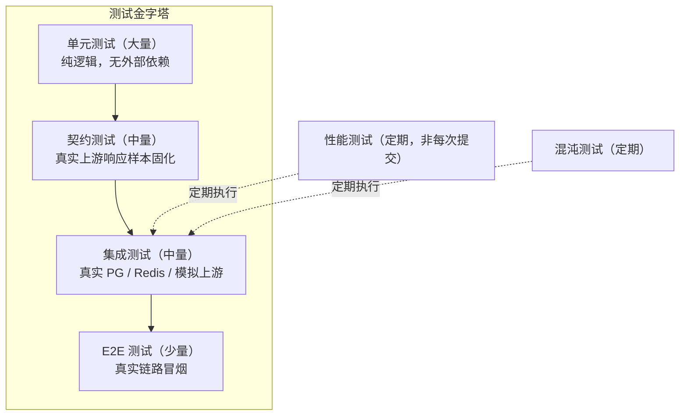

# 12 · 测试策略

> 本文定义测试分层、各层的职责与工具、覆盖率门禁、CI 检查项与压测方案。
> 阅读本文后你应当能回答：改动一行代码要跑哪些测试、什么情况下可以发布、怎么证明系统扛得住预期流量。

---

## 1. 测试目标

对计费与网关系统而言，测试的优先级排序是：

```
正确性（钱不能算错） > 可靠性（不能崩、不能丢单） > 性能 > 功能完整度
```

因此**计费、幂等、故障转移**三个区域的测试投入最高，即使牺牲部分管理端功能的覆盖率。

---

## 2. 测试分层



| 层 | 范围 | 外部依赖 | 执行频率 | 目标覆盖率 |
| --- | --- | --- | --- | --- |
| **单元测试** | 纯函数、算法、状态机、金额计算 | 无（全部 mock） | 每次提交 | 核心模块 ≥ 80% |
| **契约测试** | Adapter 编解码、第三方接口结构 | 录制的样本文件 | 每次提交 | Adapter 100% |
| **集成测试** | 服务 + 真实 PG/Redis + 模拟上游 | Testcontainers | 每次提交 / PR | 主链路 100% |
| **E2E 测试** | 完整链路冒烟 | 独立环境 | 发布前 | 关键路径 100% |
| **性能测试** | 压测与基准 | 独立环境 | 每周 / 大改前 | — |
| **混沌测试** | 故障注入 | 独立环境 | 每月 | — |

### 2.1 Build Tag 约定

沿用 Go 社区做法（与 sub2api 一致）用 build tag 区分，避免每次提交都拉起容器：

```go
//go:build unit
// 纯单元测试，毫秒级，无外部依赖

//go:build integration
// 集成测试，需要 PG/Redis（Testcontainers 自动拉起）
```

```bash
make test-unit         # go test -tags=unit ./...
make test-integration  # go test -tags=integration ./...
make test-all          # 两者都跑
make test-race         # go test -race -tags=unit ./...
```

---

## 3. 各层详细设计

### 3.1 单元测试

**工具**：标准 `testing` + `testify`（assert/require/mock）+ `shopspring/decimal`（金额断言）。

**必须覆盖的高价值区域**：

| 区域 | 测试内容 | 理由 |
| --- | --- | --- |
| 金额计算 | 定价公式、倍率、长上下文分级、舍入规则、边界值（0、极小、极大） | 算错就是资损 |
| 舍入策略 | 只对总额舍入一次；分项不舍入；`0.0000005` 的进位 | 见 [02 §14](./02-data-model.md#14-金额精度与舍入策略) |
| 熔断状态机 | Closed → Open → HalfOpen → Closed 的完整转换与阈值边界；**HalfOpen 计数制**（`half_open_max_calls` 内成功 2 次转 Closed、任一失败回 Open 且冷却 ×2）；反复熔断的退避上限 | 状态错乱导致雪崩或不可用 |
| 调度打分 | 优先级、权重、健康度、粘性会话命中与回退 | 路由错误导致成本上升 |
| 重试决策 | 各错误码的可重试判定、退避序列、总时长上限 | 重试风暴 |
| **降级链选择** | 请求级 > 分组级 > 模型级的**覆盖**（非合并）关系；能力不匹配的降级模型被剔除；降级后按实际模型计费 | 见 [05 §9](./05-scheduling-resilience.md#9-降级策略)；选错降级模型直接导致调用失败或计费错误 |
| **失败计费判定** | `bill_on_failure` / `bill_partial_stream` 四种组合 × "有/无 usage" × "有/无输出" 的真值表 | 见 [06 §11.4](./06-billing-payment.md#114-失败请求是否计费)；与 05 §8.3 的原则必须一致，用同一份表驱动测试 |
| 模型映射 | 精确 > 通配 > 全局 > 透传的解析顺序 | 映射错误导致调用失败 |
| 幂等键生成 | 稳定性（同一请求多次生成一致） | 幂等失效 |
| **退款金额计算** | 可退金额 = `credited_amount - 已消费 - 已退`；超退拒绝；赠送额度按比例回收 | 见 [06 §7.5](./06-billing-payment.md#75-退款流程) |
| 脱敏函数 | 各类凭证的脱敏结果、空值、异常输入；`key_prefix` 固定 10 位 | 泄露风险 |
| 加密解密 | 加解密往返、AAD 校验、篡改检测 | 安全 |
| Tokenizer 估算 | 中英文、代码、特殊字符的估算精度；`usage_source` 三态（upstream/partial/estimated）判定 | 计量精度 |

**反例（必须避免）**：

- 用 `float64` 断言金额相等 → 改用 `decimal.Decimal` 的 `Equal` 或字符串比较。
- 依赖 `time.Now()` → 注入 `Clock` 接口，测试中固定时间（否则时区/夏令时用例会随机失败）。
- 依赖真实随机数 → 注入随机源。

### 3.2 契约测试（Adapter）

**核心做法**：录制真实上游响应样本（脱敏后）存入 `testdata/`，作为解码用例的黄金标准。

```
internal/pkg/adapter/openai/
├── provider.go
├── provider_test.go
└── testdata/
    ├── request_chat_basic.json          // IR → 上游请求
    ├── response_chat_basic.json         // 上游响应 → IR
    ├── response_chat_toolcalls.json
    ├── stream_chunks.txt                // SSE 片段序列
    ├── stream_with_usage.txt
    └── error_429.json / error_500.json / error_context_length.json
```

| 测试 | 断言 |
| --- | --- |
| **编码黄金文件** | 给定 IR，编码后的 JSON 与 `testdata/request_*.json` 完全一致 |
| **解码黄金文件** | 给定上游响应，解码后的 IR 与期望结构一致 |
| **往返测试** | OpenAI 请求 → IR → 目标协议 → IR → OpenAI 响应，语义等价（允许"已知差异清单"内的偏差） |
| **流式序列** | 喂入 SSE 片段序列，断言事件序列（delta 顺序、tool_call 拼接、usage 补齐） |
| **错误归一** | 每个错误样本断言 `UpstreamError` 的 `Retryable` / `TriggersCircuit` / `RetryAfter` |
| **用量提取** | 从真实响应中提取的 token 数已固化断言 |

**已知差异清单（Known Divergence）**：往返测试允许的差异必须显式登记在测试代码中并注明原因，例如"Anthropic 不支持连续同角色消息，往返后会合并"。新增差异需评审——这是防止 IR 设计腐化的关键机制。

> **为什么契约测试对本项目尤其重要**：上游厂商会静默改格式（如新增字段、调整 usage 口径）。契约测试能在第一时间发现，而单元测试用自造数据永远发现不了。

### 3.3 集成测试

**工具**：`testcontainers-go` 自动拉起 PostgreSQL、Redis 与 RabbitMQ，无需本地安装（仅需 Docker）。**容器镜像必须与生产一致**：`postgres:18-alpine`、`redis:8.10-alpine`、`rabbitmq:4.2-management`（版本基线见 [10 §3.5](./10-deployment.md#35-技术基线与核心依赖清单)），禁止测试与生产版本漂移。测试库结构通过执行 `migrations/` 建立（**禁用 `gorm.AutoMigrate`**，[02 §11](./02-data-model.md#11-迁移与版本管理)）；AMQP 拓扑（exchange/队列/死信）由测试引导统一声明（01 §7.1）。

```go
//go:build integration

func TestBilling_Settle_Concurrent(t *testing.T) {
    pg := testutil.StartPostgres(t)     // 复用容器，包级别共享
    redis := testutil.StartRedis(t)
    svc := setupBillingService(t, pg, redis)

    // 并发 100 次结算同一用户
    var wg sync.WaitGroup
    for i := 0; i < 100; i++ {
        wg.Add(1)
        go func(i int) { defer wg.Done(); svc.Settle(ctx, settleInput(i)) }(&i)
    }
    wg.Wait()

    // 断言：余额 = 初始 - 全部费用，且不为负
    bal := svc.GetBalance(ctx, userID)
    require.Equal(t, expected.String(), bal.String())
}
```

**必须覆盖的主链路场景**：

| 场景 | 断言 |
| --- | --- |
| 完整调用成功 | `usage_logs` 与 `billing_ledger` 各一条，金额吻合 |
| 余额不足 | 返回 402，**未发起上游请求**，无流水 |
| 上游 429 后切换渠道 | 切换一次，最终成功，只计一次费 |
| 流式中途失败 | 按实际用量计费，预扣剩余释放 |
| 客户端断开 | 上游请求被取消，已产生用量计费 |
| 并发结算同一请求 | 只扣一次费（幂等） |
| 并发扣费同一用户 | 余额不为负，总额正确 |
| 渠道熔断 | 熔断期间该渠道不被选中；冷却后恢复 |
| 粘性会话 | 同一 session_key 命中同一渠道；渠道故障后清理绑定 |
| **实际用量 > 预扣** | 补扣成功；补扣时余额不足 → 记 `overdraft`、`balance_after` 恒非负、下次请求先补欠费 | 见 [06 §4.3](./06-billing-payment.md#43-差额处理)，唯一会触碰 `balance >= 0` 约束边界的路径 |
| **冻结额度泄漏** | 杀掉 Worker 使 settle 进死信 → `reserve:reclaim` 释放冻结，且不重复释放（有 settle 流水时跳过） | 见 [06 §3.3](./06-billing-payment.md#33-冻结额度的释放保障必须实现否则额度永久泄漏) |
| **退款** | 全额退/部分退；渠道退款超时 → `refund_unknown` 且**不自动重试**、不写平台流水 | 见 [06 §7.5](./06-billing-payment.md#75-退款流程) |
| **密钥轮换** | 新旧主密钥并存：旧 `key_id` 记录可解密、新写入用新密钥；全量重加密后旧密钥可下线 | 见 [08 §2.3](./08-security.md#23-密钥管理)；对应 [11 §4.3](./11-roadmap.md#43-验收标准) S10 |
| 异步任务重试 | 任务失败后重试成功，数据最终一致 |
| Redis 不可用 | 降级为本地限流与直写，服务不整体失败 |
| **RabbitMQ 不可用** | `TaskEnqueuer` 降级为本地内存队列 + WAL 落盘；broker 恢复后重放，幂等键保证不重复计费（01 §7.3） |
| 支付回调重复 | 只入账一次，返回成功 |
| **回调与查询竞态** | `payment:confirm` 与 `payment:query` 并发处理同一订单，只入账一次 | 见 [06 §7.4.1](./06-billing-payment.md#741-主动查询兜底任务原设计只有描述无任务定义) |
| 对账任务 | 人为注入差异后能被发现 |
| **缓存失效** | 管理端改渠道/分组/模型后，其他实例在广播延迟内（≤TTL）读到新值；用户禁用后其所有 Key 在 `users.version` 递增后立即失效 | 见 [01 §11](./01-architecture.md#11-配置热更新与缓存失效) |

**数据库测试隔离**：每个测试用独立事务（开始时 `BEGIN`，结束时 `ROLLBACK`）或独立 schema，避免用例间污染。

### 3.4 E2E 测试

在独立环境（docker-compose 拉起全套）跑真实链路冒烟，用真实 OpenAI SDK 调用：

| 用例 | 验证 |
| --- | --- |
| SDK 改 base_url 完成一次非流式对话 | 端到端连通 |
| SDK 完成一次流式对话 | SSE 转发正常 |
| 调用一个不存在的模型 | 返回 404 且格式符合 OpenAI 规范 |
| 用无效 API Key | 返回 401 |
| 余额归零后调用 | 返回 402 |
| 管理端创建渠道 → 测试连通 → 立即调用 | 配置即时生效 |
| 充值 → 余额增加 → 调用成功 | 支付链路连通（用沙箱） |

E2E 用**真实的小额上游调用**（如 `max_tokens=1`），成本极低但价值极高。

### 3.5 性能测试

| 项目 | 方法 | 目标 |
| --- | --- | --- |
| 网关吞吐与延迟 | `k6` / `vegeta` 打 `/v1/chat/completions`，上游用 mock server（固定延迟） | 单实例 ≥ 2000 QPS，P95 增量 < 30ms |
| 首字延迟 | 流式场景测量 TTFB | 平台引入的增量 < 30ms（P95） |
| 数据库写入 | 压测期间监控 PG 写入 QPS | **主链路应接近 0**（全部异步化） |
| 队列吞吐 | 持续写入，观察队列深度与消费速率 | 消费速率 > 写入速率 |
| 内存与 goroutine | 压测 30 分钟后 `pprof` 采样 | goroutine 数稳定，无泄漏；无内存持续增长 |
| 大请求 | 构造 8MB 请求体 | 不 OOM，超限返回 413 |

**基准线（Baseline）管理**：每次性能结果存入 CI  artifacts，与上次对比，退化超过 20% 则告警。

### 3.6 混沌测试

| 注入故障 | 期望行为 |
| --- | --- |
| 杀掉上游 mock（连接失败） | 快速切换渠道，不雪崩 |
| 上游返回慢（延迟 30s） | 超时后切换，连接池不耗尽 |
| Redis 宕机 | 降级为进程内限流，服务可用（功能降级但可用） |
| Worker 全部停止 | API 仍可用（异步降级为本地队列），恢复后账单补齐 |
| 队列堆积 10 万 | 不 OOM，渐进消费，告警触发 |
| 数据库慢查询 | 主链路不受影响（异步化生效） |
| 网络分区 | 不出现脑裂扣费（依赖 DB 唯一约束） |

---

## 4. 关键测试工具与基础设施

| 用途 | 工具 |
| --- | --- |
| 断言与 mock | `testify`（assert / require / mock） |
| 容器化依赖 | `testcontainers-go`（`postgres:18-alpine`、`redis:8.10-alpine`、`rabbitmq:4.2-management`，与生产同版本） |
| HTTP 录制回放 | 自研 `record` 包（首次真实调用并录制，后续回放） |
| 上游 mock | `httptest` + 可控延迟/错误的 mock server |
| 时间注入 | 自研 `clock.Clock` 接口（生产用真实时钟，测试用固定时钟） |
| 金额 | `shopspring/decimal`（禁止 float） |
| 并发检测 | `go test -race`（CI 中必须开启） |
| 覆盖率 | `go tool cover` + `Codecov` |

### 4.1 录制回放机制

Adapter 的样本采集：

```bash
# 首次：真实调用上游并录制（需配置真实凭证，仅限开发环境）
go test -tags=record ./internal/pkg/adapter/openai/...

# 之后：回放（无需凭证，CI 可跑）
go test -tags=unit ./internal/pkg/adapter/openai/...
```

**录制时必须脱敏**：移除 `authorization` 头、密钥、用户内容（用占位文本替换），仅保留结构。CI 中校验样本文件不含 `sk-` 等密钥特征（与 gitleaks 配合）。

---

## 5. CI 流水线与门禁


### 5.1 门禁标准

| 门禁 | 标准 | 失败处理 |
| --- | --- | --- |
| 格式 | `gofmt -l` 无输出 | 阻断 |
| Lint | `golangci-lint run` 零新增问题 | 阻断 |
| 构建 | `go build ./...` 成功 | 阻断 |
| 单元测试 | 全部通过（含 `-race`） | 阻断 |
| 契约测试 | 全部通过 | 阻断 |
| 集成测试 | 全部通过 | 阻断 |
| **覆盖率** | **核心模块 ≥ 80%，全量 ≥ 60%** | 阻断（核心模块） |
| 数据竞争 | `-race` 无告警 | 阻断 |
| 依赖漏洞 | `govulncheck` 无可利用漏洞（high/critical） | 阻断 |
| 密钥泄露 | `gitleaks` 无命中 | 阻断 |
| 迁移校验 | 干净库 `migrate up → down 1 → up` 幂等通过；模型 ↔ 表结构一致性测试通过（[02 §15.6](./02-data-model.md#156-变更与迁移工作流)） | 阻断 |
| 规范校验 | OpenAPI lint（spectral）通过 | 阻断 |

**核心模块清单**（覆盖率要求 ≥ 80%）：

- `internal/service/billing*`（计费）
- `internal/service/metering*`（计量）
- `internal/service/routing*`（路由）
- `internal/pkg/adapter/*`（适配器）
- `internal/pkg/circuit`（熔断）
- `internal/pkg/crypto`（加密）
- `internal/pkg/redact`（脱敏）

### 5.2 定期任务（非每次提交）

| 任务 | 频率 | 内容 |
| --- | --- | --- |
| 性能测试 | 每周 | 基准对比 |
| 混沌测试 | 每月 | 故障注入 |
| 依赖更新 | 每周 | Dependabot/Renovate |
| 安全审计 | 每周 | `govulncheck` 全量 |
| E2E 全量 | 每次发布前 | 真实环境冒烟 |

---

## 6. 测试数据管理

| 类型 | 方式 |
| --- | --- |
| 种子数据 | `scripts/seed.go`：创建管理员、默认分组、示例渠道与模型（仅开发环境） |
| 工厂函数 | `testutil.NewUser()`、`NewChannel()` 等，避免每个测试重复构造 |
| 清理 | 集成测试用事务回滚或独立 schema，不依赖手工清理 |
| 敏感数据 | 测试用凭证全部为占位值，CI 中扫描禁止出现真实密钥 |

---

## 7. 发布前回归清单

| # | 检查项 |
| --- | --- |
| 1 | 全量测试通过（unit + integration + 契约） |
| 2 | `-race` 无竞争告警 |
| 3 | 覆盖率达标 |
| 4 | E2E 冒烟通过（预发环境） |
| 5 | 迁移脚本在预发环境执行成功（含回滚验证） |
| 6 | 性能基准无显著退化（< 20%） |
| 7 | 压测通过（目标 QPS 下错误率 < 0.1%） |
| 8 | 告警规则已更新并在预发验证触发 |
| 9 | 对账脚本零差异 |
| 10 | 回滚方案已验证（上一版本镜像可用） |
| 11 | **门户公开页 SSR 冒烟**：view-source 含模型名与价格、`/sitemap.xml` 与公开端点（`/api/v1/public/*`）可访问、`/console/**` 未出现在 sitemap（[14 F16](./14-frontend.md#11-验收标准b4)） |

---

## 8. 参考来源（sub2api）

| 本设计点 | 参考位置 | 关系 |
| --- | --- | --- |
| Build tag 分层 | `make test-unit` = `go test -tags=unit ./...`；`make test-integration` = `go test -tags=integration ./...` | 沿用 |
| 测试桩与 mock | `internal/service/*_test_stubs_test.go`（如 `antigravity_default_test_stubs_test.go`） | 沿用"集中管理 interface stub"的做法 |
| 黄金文件测试 | `internal/service/account_openai_passthrough_test.go` 等大量 `*_test.go` | 沿用 |
| CI 工作流 | `.github/workflows/backend-ci.yml`（测试 + golangci-lint v2.13）、`security-scan.yml`（govulncheck + gosec + pnpm audit） | 沿用检查项组合 |
| 测试工具包 | `internal/testutil/` | 沿用：集中提供测试辅助 |
| 接口变更时补齐 stub | DEV_GUIDE 坑 6：给 interface 新增方法后所有测试 stub 必须补全 | 沿用的工程纪律 |