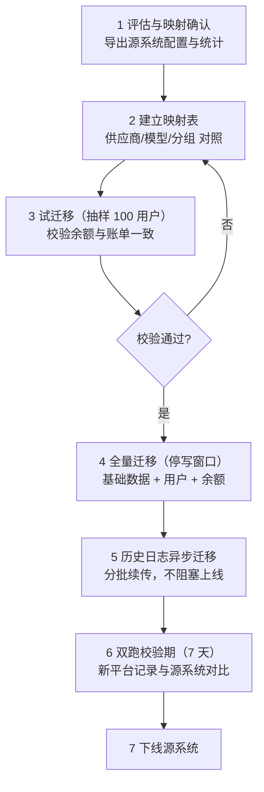

# 13 · 运营能力与数据迁移

> 本文补齐两类"上线后一定会用到但常被设计遗漏"的能力：**运营支撑**（公告、工单、客服操作台）与**数据迁移**（从既有平台导入）。
> 没有这些，出问题时只能改数据库，无法作为产品交付给客户。

---

## 1. 为什么需要这一章

| 缺失后果 | 场景 |
| --- | --- |
| 上游大面积故障时无法通知用户 | 用户不断重试，投诉量暴增 |
| 用户反馈"扣费不对"无处理流程 | 只能工程师查库，无记录、无追溯 |
| 支付渠道回调丢失导致用户已付款未到账 | 无补单入口，只能手工改数据库 |
| 客户从 one-api 迁移过来要求保留余额与历史 | 无方案，客户流失 |

---

## 2. 公告系统

### 2.1 数据模型

```sql
CREATE TABLE announcements (
    id           bigserial PRIMARY KEY,
    title        varchar(200) NOT NULL,
    content      text         NOT NULL,   -- Markdown
    level        varchar(20)  NOT NULL,   -- info | warning | critical
    target_type  varchar(20)  NOT NULL,   -- all | group | user
    target_ids   jsonb,                   -- 目标 ID 数组
    status       varchar(20)  NOT NULL,   -- draft | published | archived
    pinned       boolean      DEFAULT false,
    start_at     timestamptz,
    end_at       timestamptz,
    created_by   bigint,
    created_at   timestamptz DEFAULT now(),
    updated_at   timestamptz DEFAULT now()
);

CREATE TABLE announcement_reads (
    announcement_id bigint NOT NULL,
    user_id         bigint NOT NULL,
    read_at         timestamptz DEFAULT now(),
    PRIMARY KEY (announcement_id, user_id)
);
```

### 2.2 能力设计

| 能力 | 说明 |
| --- | --- |
| 分级 | `info`（常规）、`warning`（黄）、`critical`（红，强制弹窗） |
| 定向 | 全部用户 / 指定分组 / 指定用户（用于"某分组渠道维护"） |
| 定时 | `start_at` / `end_at` 控制生效期，支持预约发布 |
| 置顶 | `pinned` 的公告常驻顶部 |
| 已读 | `announcement_reads` 记录已读，未读显示红点 |
| 多渠道 | 控制台弹窗 + 邮件（重要公告）+ API 响应头 `X-CloudFog-Notice`（可选） |

### 2.3 与故障联动

渠道连续熔断触发 **P2 告警**（持续 > 10 分钟，与 [09 §5.2](./09-observability.md#52-告警规则清单) 一致）时，**建议半自动生成草稿公告**（管理员确认后发布），缩短故障通知时间。这是运营效率的关键点。

> **注意**：本条早期写 P1，与 09 的告警分级冲突。统一为 **P2**——单渠道熔断已有自动切换兜底，不直接影响用户可用性；若多个渠道同时熔断导致"某分组可用渠道数 = 0"，那是 09 中的 P0 规则，应直接触发 P0 而非借助公告流程。

---

## 3. 工单系统

### 3.1 数据模型

```sql
CREATE TABLE tickets (
    id            bigserial PRIMARY KEY,
    ticket_no     varchar(32) UNIQUE NOT NULL,   -- 对外展示编号
    user_id       bigint NOT NULL,
    category      varchar(30) NOT NULL,  -- billing | api | account | bug | other
    subject       varchar(200) NOT NULL,
    status        varchar(20) NOT NULL,  -- open | pending | resolved | closed
    priority      varchar(20) DEFAULT 'normal',
    assignee_id   bigint,
    created_at    timestamptz DEFAULT now(),
    updated_at    timestamptz DEFAULT now(),
    resolved_at   timestamptz,
    first_reply_at timestamptz          -- 用于统计首响时长
);

CREATE TABLE ticket_messages (
    id           bigserial PRIMARY KEY,
    ticket_id    bigint NOT NULL,
    sender_type  varchar(20) NOT NULL,   -- user | admin | system
    sender_id    bigint,
    content      text NOT NULL,
    attachments  jsonb,
    created_at   timestamptz DEFAULT now()
);
```

### 3.2 与业务的关联

工单必须能直接关联业务对象，否则客服要跨系统查：

```sql
ALTER TABLE tickets ADD COLUMN ref_type varchar(30);  -- usage_log | payment_order | api_key | subscription
ALTER TABLE tickets ADD COLUMN ref_id   varchar(64);  -- request_id / order_no / key_id
```

**关键体验**：用户在调用明细页点击"这笔费用有疑问"→ 自动创建工单并带上 `request_id` → 客服侧直接看到该请求的完整链路（模型、渠道、用量、价格快照、流水）。这把"查一次问题 30 分钟"缩短到"1 分钟"。

### 3.3 SLA 指标

| 指标 | 目标 |
| --- | --- |
| 首响时长（P1） | < 1 小时 |
| 首响时长（普通） | < 8 小时 |
| 解决时长 | < 48 小时 |
| 工单分类占比 | 用于反向驱动产品改进（如计费类工单多 → 优化账单展示） |

---

## 4. 客服操作台

> 这是"能不能交付给客户"的分水岭：所有高频人工处置必须有界面操作，且全部留审计。

### 4.1 必备操作

| 操作 | 适用场景 | 安全要求 |
| --- | --- | --- |
| **手动补单** | 支付回调丢失，用户已付款未到账 | 需填写渠道流水号 + 上传凭证；校验订单未入账；二次确认；**入账复用 `payment:confirm` 链路**（同一状态机 CAS 与幂等，禁止旁路直改余额） |
| **手动调账** | 计费错误补偿、活动赠送 | 必填原因；金额上限（超出需超管）；审计 |
| **退款** | 用户申请、重复扣费 | 关联原订单/流水；回收赠送额度；写 `billing_ledger` |
| **补发套餐** | 支付成功但套餐发放失败 | 幂等键 `sub:{subscription_id}:{period}` |
| **重放结算任务** | 结算失败进入死信 | 从死信队列重投；校验幂等 |
| **查看用户完整链路** | 排查问题 | 按 `request_id` 展示：请求 → 路由 → 上游 → 用量 → 计费 → 流水 |
| **禁用/启用用户** | 风控处置 | 必填原因；同时失效其所有 API Key（版本号机制） |
| **强制登出** | 账号异常 | 吊销会话 |
| **渠道手动摘除/恢复** | 上游故障 | 立即生效（广播失效缓存） |
| **重新计算聚合** | 数据修复 | 指定日期范围重跑 `stats:aggregate` |

### 4.2 操作审计

所有客服操作**必须**写入 `audit_logs`，字段包括：操作人、操作类型、目标、前后值、原因、客户端 IP。审计日志**只允许 INSERT**（数据库权限层面限制）。

**金额类操作的额外约束**：

| 约束 | 值 |
| --- | --- |
| 单笔调账上限（普通管理员） | 可配置，如 $100 |
| 超出上限 | 需超管审批（工单流转） |
| 每日调账总额上限 | 可配置，超出告警 |
| 调账方向 | 补偿（正）与扣减（负）分开设限 |
| 不可逆提示 | 操作前明确展示影响（如"将扣除该用户 $12.5，当前余额 $30"） |

### 4.3 支付对账看板

客服需要快速回答"用户说付了钱但没到账"，因此需要专门看板：

| 面板 | 内容 |
| --- | --- |
| 异常订单 | `status='pending'` 且 `expired_at < now` 的订单（可能回调丢失） |
| 可疑订单 | 金额与订单不符、验签失败、重复回调 |
| 待处理退款 | 退款申请列表与状态 |
| 一键补单 | 输入渠道流水号 → 校验 → 入账 |

---

## 5. 数据迁移方案

> 客户从 one-api / new-api / sub2api 迁移而来时，**余额与历史账单必须平滑迁移**，这是能否签下客户的关键。

### 5.1 实体映射（以 one-api / new-api 为参照）

| 源系统实体 | 目标实体 | 迁移要点 |
| --- | --- | --- |
| `users` | `users` | 密码哈希算法可能不同（bcrypt 通用），需支持"首次登录强制重置密码"或双算法兼容 |
| `users.quota` | `user_balances.balance` | **单位换算**：one-api 的 quota 是"额度单位"，1 USD = 500000 quota（`$1 = 500000` 或按 `QuotaPerUnit` 配置）。迁移必须按源系统配置换算，且**保留换算系数记录** |
| `tokens` | `api_keys` | 源系统存明文 key → 目标只存哈希。**迁移后明文可继续用**（哈希校验兼容），但需提示用户轮换 |
| `channels` | `channels` + `providers` | 源渠道的 `type`（供应商类型）映射为目标 `provider_code`；`models` 逗号分隔 → `model_mappings` 多行 |
| `abilities` | `channel_groups` + `model_mappings` | 源系统用 abilities 表关联分组与模型，需拆解 |
| `logs` / `quota_data` | `usage_logs` + `billing_ledger` | **大表迁移**：分批、按时间范围、可断点续传 |
| `redeem_codes` | 扩展位（二期） | 可暂不迁移 |
| `midjourney` / `tasks` | 不涉及 | 跳过 |

### 5.2 迁移流程



### 5.3 关键设计

| 要点 | 方案 |
| --- | --- |
| **幂等** | 迁移脚本必须可重复执行：`INSERT ... ON CONFLICT DO UPDATE`；用 `source='migration'` + `source_id`（源系统主键）标记来源，字段定义见 [02 §16](./02-data-model.md#16-支撑表运营与迁移) |
| **断点续传** | 记录迁移进度表 `migration_progress`（实体、最后 ID、状态），中断后从断点继续 |
| **大表分批** | `usage_logs` 按月、每批 1000 条，避免长事务与锁表 |
| **单位换算** | 换算系数写入 `migration_progress` 并在迁移报告中明确记录，便于追溯 |
| **密码兼容** | 保留源哈希，登录成功时用新算法重新哈希（渐进升级）；或强制重置 |
| **密钥兼容** | 源明文 key 直接计算目标哈希入库，保证迁移后不失效；同时用 `source='migration'` + `source_id` 标记来源（**不是 `migrated=true`**，字段定义见 [02 §16](./02-data-model.md#16-支撑表运营与迁移)），并在控制台提示用户轮换 |
| **余额校验** | 迁移后：`SUM(源 quota 换算值) == SUM(目标 balance)`，逐用户比对，差异列表导出 |
| **回滚** | 保留源系统只读副本；新平台数据可整库删除重来（迁移期无真实流量） |

### 5.4 迁移工具形态

```bash
# 独立子命令，不混入主服务
cloudfog migrate-data \
    --source=one-api \
    --source-dsn="postgres://..." \
    --quota-per-unit=500000 \
    --batch-size=1000 \
    --entities=users,keys,channels,balances \
    --dry-run            # 只校验不写入，输出差异报告

cloudfog migrate-data --source=one-api --resume    # 断点续传
cloudfog migrate-data --verify                     # 迁移后校验，输出不一致清单
```

**必须先 `--dry-run`**：输出"将迁移 N 个用户、M 个渠道、总余额 X，发现 K 处无法映射的项"，人工确认后再执行。无法映射的项（如未知供应商类型）需人工决策而非自动跳过。

### 5.5 迁移校验 SQL（示例）

```sql
-- 1) 余额总量校验
SELECT
    (SELECT SUM(balance) FROM user_balances)                    AS target_total,
    (SELECT SUM(quota)::numeric / 500000 FROM source_users)     AS source_total;

-- 2) 逐用户差异（超过容差 0.01 需要处理）
SELECT u.id, ub.balance, su.quota::numeric / 500000 AS src,
       ub.balance - su.quota::numeric / 500000 AS diff
FROM users u
JOIN user_balances ub ON ub.user_id = u.id
JOIN source_users su ON su.id = u.source_id
WHERE abs(ub.balance - su.quota::numeric / 500000) > 0.01;

-- 3) 孤儿数据检查
SELECT count(*) FROM channels c
LEFT JOIN providers p ON p.code = c.provider_code
WHERE p.id IS NULL;   -- 必须为 0
```

### 5.6 从 sub2api 迁移

sub2api 与本平台同构度较高（都有 `accounts` / `usage_logs` / `groups` / `user_subscription`），映射相对直接：

| sub2api | 云之雾 | 说明 |
| --- | --- | --- |
| `accounts` | `channels` | `platform` → `provider_code`；`credentials` 需**用新主密钥重新加密**（源密钥不同） |
| `accounts.credentials` | `channels.credentials` | **必须重新加密**，不能直接搬密文 |
| `usage_logs` | `usage_logs` | 字段基本对应，补充 `status_code`、`price_snapshot` |
| `api_keys` | `api_keys` | 若源系统存哈希且算法一致可复用，否则需轮换 |
| `users` / `groups` | 同名 | 直接映射 |

> **凭证重新加密是硬要求**：不同主密钥下的密文不可互用。迁移工具需读取源系统明文（在源系统侧解密）后用目标主密钥重新加密，全程在内存中完成，不落盘。

---

## 6. 运营报表与导出

| 报表 | 内容 | 频率 |
| --- | --- | --- |
| 日报 | 调用量、收入、成本、毛利、错误率、Top 模型/用户 | 每日 |
| 月报 | 同上 + 增长趋势、渠道成本分析、毛利变化 | 每月 |
| 对账报告 | `usage_logs` vs `billing_ledger` 差异、上游账单 vs 平台记录 | 每日/每月 |
| 用户账单 | 单用户的消费明细（可导出 PDF/CSV） | 按需 |
| 财务导出 | 收入、退款、调账的流水汇总（供财务系统对接） | 每月 |

**导出要求**：
- 大文件走异步任务（生成后提供下载链接，链接带签名与过期时间）。
- 导出内容脱敏程度按角色区分（管理员看不到完整凭证）。
- 导出操作记入审计。

---

## 7. 风控运营

| 能力 | 说明 |
| --- | --- |
| 用户风险标记 | 手动标记可疑用户（`risk_level`），触发更严格的限流或人工审核 |
| 异常检测 | 短时间高频失败、异地登录、异常大额消费 → 自动标记并通知 |
| 处置动作 | 禁用用户 / 禁用 Key / 降额 / 强制重认证，均可一键执行并留痕 |
| 黑名单 | IP、邮箱域名、设备指纹（可选）黑名单 |
| 申诉流程 | 被封禁用户可通过工单申诉，管理员在处理台查看完整证据链后解封 |

**证据链**：风控处置必须能展示"为什么"（触发的规则、相关调用记录、时间线），否则客服无法向用户解释，容易引发纠纷。

---

## 8. 与既有文档的衔接

| 本文内容 | 关联文档 |
| --- | --- |
| 公告、工单、客服操作台 | 相关表（`announcements`、`announcement_reads`、`tickets`、`ticket_messages`、`migration_progress`）已并入 [02-data-model §16](./02-data-model.md#16-支撑表运营与迁移)；建表语句见本文 §2、§3 |
| 手动补单/退款 | [06-billing-payment §7](./06-billing-payment.md#7-支付接入) 的订单状态机与幂等 |
| 操作审计 | [08-security §8](./08-security.md#8-审计日志) |
| 迁移工具 | [10-deployment](./10-deployment.md) 的发布流程（迁移为独立前置步骤） |
| 迁移后校验 | [12-testing §7](./12-testing.md) 发布前回归清单 |

---

## 9. 实施优先级

| 优先级 | 能力 | 理由 |
| --- | --- | --- |
| P0（MVP 就要有） | 手动补单、手动调账、**查看完整链路** | 没有这些，上线即事故 |
| P0 | 客服操作审计 | 安全底线 |
| P1（二期） | 工单系统、公告系统、支付对账看板 | 用户量上来后必需 |
| P1 | 数据迁移工具（至少支持 one-api / new-api） | 客户签约前置条件 |
| P2 | 风控运营台、运营报表、SLA 统计 | 规模化阶段 |

> **这里的 P0/P1/P2 是"功能优先级"，与 [09 §5.1](./09-observability.md#51-告警级别) 的告警分级 P0~P3 同名但不同义**——前者按上线必要性排序，后者按故障紧急度排序。文档中两处各自独立，不要互相套用。

**P0 三项在路线图中的落点**（此前 [11-roadmap §3.2/§3.3](./11-roadmap.md#33-验收标准) 未包含，已补入 M11/M12）：

| 能力 | 验收方式 |
| --- | --- |
| 手动补单 | 构造"回调丢失"场景，客服台输入渠道流水号后入账成功，且重复提交不重复入账 |
| 手动调账 | 调账后 `billing_ledger` 与 `user_balances` 一致，审计日志记录操作人/原因/前后值 |
| 查看完整链路 | 按 `request_id` 一次查出：请求 → 路由 → 上游 → 用量 → 计费 → 流水 |

---

## 10. 参考来源（sub2api）

| 本设计点 | 参考位置 | 关系 |
| --- | --- | --- |
| 公告系统 | `ent/schema/announcement.go`、`announcement_read.go`、`internal/service/announcement_service.go`、`announcement_targeting.go` | 沿用：分级 + 定向 + 已读记录 |
| 审计日志 | `ent/schema/` 相关 + `internal/service/audit_log_service.go`、`internal/handler/admin/audit_log_handler.go` | 沿用 |
| 兑换码/优惠码 | `ent/schema/redeem_code.go`、`promo_code.go`、`promo_code_usage.go` | 作为扩展位：运营活动能力 |
| 外部系统集成 | README 提到"支持通过 iframe 嵌入外部系统（如工单）" | 参考：工单系统可用 iframe 嵌入第三方（如开源工单系统），降低自研成本 |
| 数据备份/导出 | `internal/service/backup_service.go`、`backup_archive.go` | 参考：导出走异步任务 + 签名链接 |
| 用户属性扩展 | `ent/schema/user_attribute_definition.go`、`user_attribute_value.go` | 参考：运营侧自定义用户标签的实现方式 |
