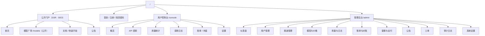
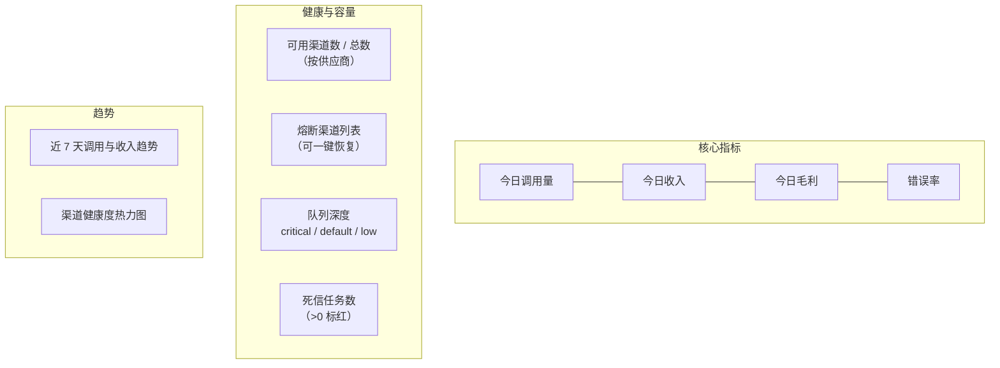
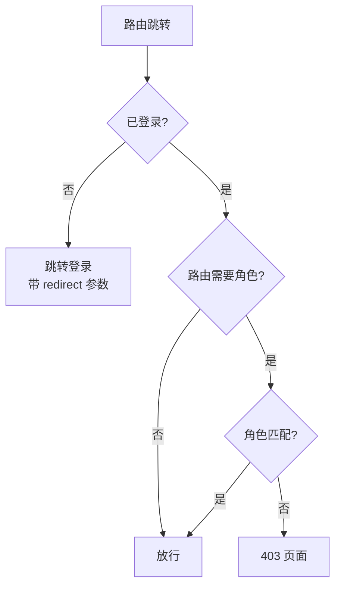
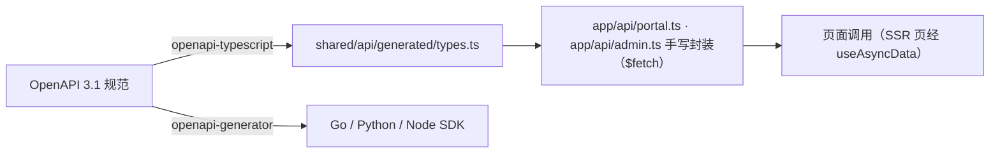

# 14 · 前端控制台设计

> 本文定义前端应用的信息架构、页面清单、状态管理与工程约定，是 B4 批次的实施依据。前端基于 **Nuxt 4.2** 构建：门户公开页（首页/模型广场/文档/公告）服务端渲染以支持 **SEO**，用户控制台与管理后台为 CSR 单页。
> 阅读本文后你应当能回答：控制台有哪些页面、每个页面做什么、与后端哪些接口对接、权限怎么控。

---

## 1. 定位与技术栈

### 1.1 三个区域

| 区域 | 使用者 | 入口 | 渲染 | 侧重 |
| --- | --- | --- | --- | --- |
| **公开门户** | 所有人（未登录可见） | `/` | **SSR + 缓存** | 获客与 SEO：首页、模型广场、文档/快速开始、公告、定价 |
| **用户控制台** | 开发者（登录） | `/console` | CSR | 自助：拿 Key、看用量、充值、排查问题 |
| **管理后台** | 运营/管理员（登录） | `/admin` | CSR | 管控：渠道、模型、价格、用户、账单、系统 |

三者共用一套工程与组件库，通过路由前缀与权限中间件隔离。**SEO 只针对公开门户**（§1.2 的 `routeRules`）；控制台与管理后台不产生公开可收录内容。**管理后台是内部系统，不追求视觉花哨，追求信息密度与操作效率**。

### 1.2 技术栈

| 层 | 选型 | 理由 |
| --- | --- | --- |
| 框架 | **Nuxt 4.2**（`nuxt@^4.2`，Vue 3 内核 + Nitro，Composition API + `<script setup>`） | **SSR/混合渲染带来 SEO**：门户公开页服务端渲染可被搜索引擎收录（模型名、价格直接出现在 HTML 源码中）；构建基于 Vite，开发体验保留 |
| 渲染策略 | **混合渲染（`routeRules`）** | 公开页默认 `ssr: true`，可叠加 `swr: 300`（Nitro 页面缓存）扛流量；`/console/**` 与 `/admin/**` 显式 `ssr: false`——登录后页面无 SEO 需求，且**禁止服务端渲染用户私有数据** |
| 语言 | TypeScript（strict） | 类型安全，配合 OpenAPI 生成类型 |
| 包管理 | **pnpm**（非 npm） | 必须提交 `pnpm-lock.yaml`，CI 用 `--frozen-lockfile` |
| UI 库 | Element Plus（`element-plus/nuxt` 模块，处理 SSR 样式注入） | **仅作基础组件，必须按 §8 tokens 深度主题定制**——默认观感是通用后台，达不到精致度要求 |
| 状态 | Pinia（`@pinia/nuxt`） | 官方推荐 |
| 路由 | Nuxt **文件式路由**（`app/pages/`）+ route middleware | 权限守卫改为中间件实现（§5.1），不再手写路由表 |
| SEO 基建 | `useSeoMeta` / `useHead` + `@nuxtjs/sitemap` + `@nuxtjs/robots` | 每页独立 title/description/OG/canonical；自动生成 `sitemap.xml` 与 `robots.txt`；模型详情页结构化数据（Product/Offer）为增强项 |
| 图表 | ECharts（`<ClientOnly>` 包裹） | 用量趋势、分布、健康度热力图；SSR 页面图表位置先渲染骨架占位 |
| 请求 | **`$fetch` / `useFetch` / `useAsyncData`**（ofetch 拦截器：`onRequest` / `onResponseError`） | **SSR 页面取数必须走 `useAsyncData`/`useFetch`**（payload 随首屏下发，避免客户端二次请求）；不引入 Axios |
| 国际化 | `@nuxtjs/i18n`（vue-i18n 内核） | 路由前缀策略 + **hreflang** 多语言 SEO |
| 类型生成 | `openapi-typescript` → `shared/api/generated/` | **由 OpenAPI 规范生成类型，保证前后端同源**；`shared/` 目录供应用与 Nitro 服务端共用 |

### 1.3 工程结构（Nuxt 4 目录规范，`app/` 为源码根）

```
frontend/
├── app/
│   ├── pages/            # 文件式路由：index、models/[slug]、docs、announcements、
│   │                     #   console/（用户控制台）、admin/（管理后台）、login 等
│   ├── components/       # 通用组件
│   │   ├── charts/       #   UsageTrend / ModelPie / LatencyHistogram
│   │   ├── common/       #   MoneyText / TokenText / StatusTag / CopyField
│   │   └── business/     #   ModelCard / ChannelHealth / KeyCreateDialog
│   ├── layouts/          # default（门户）/ console / admin / blank
│   ├── middleware/       # auth.global.ts：全局路由中间件（登录态 + 角色，§5.1）
│   ├── stores/           # Pinia：user / app / usage
│   ├── api/              # 手写接口封装（portal.ts / admin.ts，基于 $fetch）
│   ├── composables/      # useTable / usePermission / useMoney 等
│   ├── locales/          # zh-CN / en-US（@nuxtjs/i18n）
│   └── utils/            # 格式化（金额/token/时间带时区）
├── shared/
│   └── api/generated/    # openapi-typescript 生成物，禁止手改（应用与 server/ 共用）
├── server/               # Nitro 服务端路由（可选 BFF：代理后端、隐藏 cookie 细节）
├── public/               # robots 由 @nuxtjs/robots 生成；静态资源
├── design-tokens.json    # §8 唯一事实源 → 构建生成 --cf-* CSS 变量
├── package.json
├── pnpm-lock.yaml        # 必须提交
└── nuxt.config.ts        # routeRules 渲染策略在此声明
```

**`nuxt.config.ts` 渲染策略（唯一权威声明）**：

```ts
routeRules: {
  '/':               { swr: 300 },        // 门户首页：SSR + 5 分钟 SWR 缓存
  '/models/**':      { swr: 300 },        // 模型广场与详情：SSR + 缓存（SEO 核心页面）
  '/docs/**':        { prerender: true }, // 文档/快速开始：预渲染静态化
  '/announcements':  { swr: 60 },
  '/console/**':     { ssr: false },      // 用户控制台：CSR
  '/admin/**':       { ssr: false },      // 管理后台：CSR
  '/login/**':       { ssr: true },
}
```

### 1.4 容器化部署（Nuxt SSR 是常驻进程，非静态产物）

```dockerfile
# frontend/Dockerfile（多阶段；Node 24 LTS）
FROM node:24-alpine AS builder
WORKDIR /src
RUN corepack enable
COPY frontend/package.json frontend/pnpm-lock.yaml ./
RUN pnpm install --frozen-lockfile
COPY frontend/ .
RUN pnpm build            # 产出 .output/（Nitro 自包含产物）

FROM node:24-alpine
WORKDIR /app
COPY --from=builder /src/.output ./.output
ENV NITRO_PORT=3000
EXPOSE 3000
USER node
CMD ["node", ".output/server/index.mjs"]
```

> 编排接入见 [10 §2](./10-deployment.md#2-docker-compose-编排) 的 `frontend` 服务；反向代理（Caddy/Nginx）将 `/` 转发到 `frontend:3000`，`/api`、`/v1` 转发到后端。SSR 进程访问后端走内网 `CLOUDFOG_API_BASE_URL`，浏览器侧请求走反代同域路径。

---

## 2. 信息架构



---

## 3. 门户与用户控制台页面

> §3.3 模型广场为公开门户页（SSR/SEO）；其余为登录后页面。公开公告列表走未鉴权端点 `GET /api/v1/public/announcements`（[07 §3.0](./07-api-sdk.md#30-认证接口无需会话)），与控制台内的已读/定向公告接口（需会话）不同。

### 3.1 概览（Dashboard）

| 区块 | 内容 | 接口 |
| --- | --- | --- |
| 数字卡片 | 当前余额、今日消费、本月消费、本月调用次数 | `GET /me/balance`、`GET /me/summary` |
| 用量趋势 | 近 30 天调用量/消费折线图（可切换指标） | `GET /me/usage/stats` |
| 模型分布 | Top 5 模型占比饼图 | 同上 |
| 最近调用 | 最近 10 条调用（模型/状态/耗时/费用），可跳转明细 | `GET /me/usage/logs?page_size=10` |
| 快速开始 | 复制 base_url + 示例代码（curl / Python / Node） | 静态 |
| 公告 | 未读公告（顶部可关闭） | `GET /api/v1/announcements`（见 [07 §3.0.1](./07-api-sdk.md#301-账户安全接口需会话)） |

**体验要点**：余额低于阈值时卡片变红并显示"立即充值"；新用户无 Key 时展示引导卡片。

### 3.2 API 密钥

| 功能 | 说明 |
| --- | --- |
| 列表 | 名称、前缀（脱敏）、分组、状态、创建时间、最后使用、今日用量 |
| 创建 | 名称、分组、有效期、IP 白名单、模型白名单、日额度 |
| **创建后弹窗** | **一次性展示完整明文**，明确提示"仅此一次可见"，提供复制按钮 |
| 编辑 | 名称、状态、白名单（**不可改明文**） |
| 删除/禁用 | 二次确认；删除后立即失效 |
| 用量 | 每行可查看该 Key 的用量趋势 |

对应 [07-api-sdk §3.1](./07-api-sdk.md#31-用户自助接口) 的 `/api/v1/me/keys` 系列接口。

### 3.3 模型广场

> **公开门户页**（未登录可见，SSR + `swr` 缓存，SEO 核心页面——模型名与定价直接出现在 HTML 源码中，见 §1.2）。登录用户从控制台直达；未登录时展示定价与能力并引导注册。

| 元素 | 内容 |
| --- | --- |
| 筛选 | 供应商、能力（视觉/工具/推理/长上下文）、价格区间、状态 |
| 卡片 | 模型名、供应商、上下文长度、最大输出、能力标签、输入/输出价格、平均首字延迟、可用性指示 |
| 详情 | 完整定价（含缓存价、长上下文价）、能力说明、调用示例 |
| 排序 | 推荐 / 价格 / 上下文 / 延迟 |

**数据来源**：门户 SSR 取数走 `GET /api/v1/public/models`（未鉴权、仅 `active` 模型与基础价，见 [07 §3.0](./07-api-sdk.md#30-认证接口无需会话)）；**展示基础价，实际扣费按用户分组倍率（[06 §2](./06-billing-payment.md#2-定价模型)），页面需标注**。登录用户在控制台内查看"当前 Key 可用模型与生效倍率"仍走 `/v1/models`（[07 §2.4](./07-api-sdk.md#24-模型列表响应)）。

### 3.4 用量统计

| 图表 | 类型 | 说明 |
| --- | --- | --- |
| 趋势 | 折线/柱状（堆叠） | 按日/小时，指标可选：调用次数、输入 token、输出 token、费用 |
| 模型分布 | 饼图 / 环形 | 按模型维度的费用或调用占比 |
| 成本构成 | 堆叠柱 | 输入 / 输出 / 缓存读 / 缓存写 四类成本 |
| 状态码分布 | 饼图 | 成功与各类错误占比 |
| 延迟分布 | 直方图 | 首字延迟 P50/P95/P99 趋势 |

**筛选**：时间范围（今天/7天/30天/自定义）、模型、API Key、分组（管理端）。

**关键约束**：时间范围最大 90 天；查询走 `usage_daily_stats`，不扫明细。**页面必须标注统计时区**（见 [02 §13](./02-data-model.md#13-时区与账期切分)）。

### 3.5 调用日志

| 功能 | 说明 |
| --- | --- |
| 表格列 | 时间、请求 ID、模型、上游模型、供应商、流式、状态、耗时、首字延迟、输入/输出 token、费用 |
| 筛选 | 时间、模型、Key、状态码、是否降级 |
| 详情抽屉 | 完整信息：请求参数摘要（脱敏）、响应摘要、价格快照、故障转移次数、渠道、错误详情 |
| **反馈入口** | "这笔费用有疑问" → 创建工单并自动带 `request_id`（见 [13-operations §3.2](./13-operations.md)） |

### 3.6 账单与充值

| 区块 | 内容 |
| --- | --- |
| 余额卡片 | 当前余额、累计充值、累计消费 |
| 账单流水 | 时间、类型（消费/充值/退款/套餐/调整）、金额、余额变动后、说明、关联请求 |
| 充值 | 选择/输入金额 → 选择支付方式 → 生成支付二维码/跳转 → 轮询订单状态 → 成功后刷新余额 |
| 套餐 | 可订阅套餐列表、当前订阅、到期时间、已用额度 |
| 导出 | 账单导出 CSV（异步生成，下载链接带签名） |

### 3.7 设置

资料修改、**时区选择**（影响看板口径，见 02 §13）、密码修改、二次验证（TOTP）、会话管理（查看/吊销设备）。

---

## 4. 管理后台页面

### 4.1 仪表盘



### 4.2 渠道管理（运营最高频页面）

| 功能 | 说明 |
| --- | --- |
| 列表 | 名称、供应商、优先级、权重、并发、健康度、状态、今日用量、今日成本、最后使用。**状态列为聚合派生值**（02 只存原始字段）：`disabled` > 熔断中（`circuit_state='open'` 且未到期）> 限流中（`rate_limit_reset_at` 未到）> `error` > 正常（`active`）——禁止前端自造状态机 |
| 筛选 | 供应商、分组、状态、健康度区间 |
| 创建/编辑 | 名称、供应商、BaseURL、鉴权类型、凭证（**写入后不可读，仅可覆盖**）、代理、优先级、权重、并发、倍率、过期时间、分组绑定、模型映射 |
| **测试连通** | 调用真实上游探活，展示延迟与返回模型列表 |
| 启停 | 立即生效（依赖缓存失效广播） |
| 查看凭证 | **需 TOTP 二次校验**，展示脱敏值，提供"复制"（记审计） |
| 批量操作 | 批量改优先级/分组/启停（**注意**：跨供应商批量改映射易出错，需按供应商分组操作并二次确认——这是 sub2api 的踩坑经验） |
| 健康详情 | 错误率趋势、最近错误、熔断历史、限流次数 |

### 4.3 模型与价格

| 页面 | 功能 |
| --- | --- |
| 模型列表 | 名称、供应商、上下文、最大输出、能力、状态、排序 |
| 模型编辑 | 能力标签、上下文、计费模式、状态 |
| **价格管理** | 按模型查看价格历史；新建价格（带生效时间）；**调价前影响预览**（受影响的用户/分组、预估收入变化） |
| 模型映射 | 按渠道配置别名 → 上游模型，支持通配；解析顺序说明 |

### 4.4 用户管理

列表（用户名/邮箱/角色/分组/余额/状态/注册时间/最后登录）、创建、禁用/启用、改角色、改分组、**调整余额（必填原因，记审计）**、查看该用户用量与账单、查看其 API Key（脱敏，可禁用）。

### 4.5 用量与日志

与用户端类似，但可跨用户查询，额外维度：按用户、按渠道、按供应商、按分组聚合。**支持下钻**：渠道 → 该渠道的调用明细。

### 4.6 账单与对账

| 页面 | 功能 |
| --- | --- |
| 账单流水 | 全量流水，可按用户/类型/时间筛选 |
| **对账报告** | 展示每日对账结果：日志 vs 流水的差异、异常清单、处理状态 |
| 差异处理 | 点击进入差异详情，可标记"已核实/需修正"，必要时联动手动调账 |
| 上游账单导入 | 上传上游账单 CSV，自动比对并计算偏差率（见 [06 §11.7](./06-billing-payment.md#117-与上游账单的闭环校准)） |

### 4.7 其他

| 页面 | 说明 |
| --- | --- |
| 套餐与支付 | 套餐 CRUD、支付渠道配置（密钥走环境变量，界面只配开关与参数）、订单查询、退款 |
| 公告管理 | 编辑（Markdown）、分级、定向、定时发布、置顶 |
| 工单 | 列表、分配、回复；工单内嵌该 `request_id` 的完整调用链路 |
| 审计日志 | 按操作人/类型/目标查询（**只读，不可删除**） |
| 系统设置 | 注册开关、默认分组、时区与计费精度、风控阈值、通知模板 |
| 队列监控 | 嵌入 RabbitMQ Management（iframe，15672）或自研（服务端代理 Management HTTP API）：各队列深度、消息列表、死信查看、手动重投 |

---

## 5. 权限与路由

### 5.1 守卫设计



| 层级 | 实现 |
| --- | --- |
| 路由元信息 | 页面内 `definePageMeta({ requiresAuth: true, roles: ['admin'] })`（文件式路由的页面级声明） |
| 全局守卫 | `app/middleware/auth.global.ts` 全局路由中间件：校验登录态与角色（`to.meta`），未登录跳登录并带 `redirect` 参数 |
| 按钮级权限 | `v-permission="'channel.credential.view'"` 指令（**点分命名**，权限点清单见 [08 §5.2](./08-security.md#52-rbac-权限模型)） |
| **服务端兜底** | 前端权限只是体验优化，**所有接口必须服务端校验角色**（见 [08-security §5.3](./08-security.md)）；CSR 页面的会话 Cookie 一律 `HttpOnly`，token 不进 localStorage |

### 5.2 敏感操作的二次校验

| 操作 | 校验方式 |
| --- | --- |
| 查看渠道凭证 | TOTP 弹窗 |
| 调整余额 | 二次确认 + 原因输入 |
| 删除渠道/用户 | 输入名称确认 |
| 修改系统配置 | 超管 + TOTP |
| 批量操作 | 展示影响范围后确认 |

---

## 6. API 对接与类型同源



| 约定 | 说明 |
| --- | --- |
| 生成物只读 | `shared/api/generated/` 禁止手改，重新生成会覆盖 |
| 封装层 | 在 `app/api/portal.ts` 中封装，处理错误提示、加载态、数据转换 |
| 类型即契约 | 后端改接口 → 规范变更 → CI 重新生成 → 前端类型报错 → 编译期发现不兼容 |
| 统一错误处理 | ofetch 拦截器（`onResponseError`）：401 跳登录、403 提示无权限、429 读取 `Retry-After` 提示稍后重试、5xx 展示 `request_id` 便于反馈 |
| **SSR 取数纪律** | 公开页数据获取**必须**用 `useAsyncData`/`useFetch`（payload 随首屏下发）；`setup` 中禁止裸 `$fetch`（会导致服务端与客户端各请求一次） |
| 金额处理 | **前端不做金额计算**，只做展示（后端返回已舍入值）；展示用 `Intl.NumberFormat`，避免浮点 |
| 时间处理 | 后端返回 UTC ISO 串，前端按用户时区渲染（见 02 §13） |

---

## 7. 通用组件清单

> 全部组件基于 §8 的 design tokens 实现（色值、圆角、间距取自 `--cf-*` 变量）；`MoneyText`、`TokenText`、`StatusTag` 出现频率最高，视觉精度直接决定产品质感，**必须第一个打磨**。

| 组件 | 用途 | 备注 |
| --- | --- | --- |
| `MoneyText` | 金额展示 | 带货币符号、负数标红。**直接展示后端已舍入值（6 位 ROUND_HALF_UP，见 [02 §14.2](./02-data-model.md#142-计费精度与舍入规则唯一标准)），前端不二次舍入或截断**——截断会让前端显示与扣费金额不一致，引发"账对不上"工单 |
| `TokenText` | Token 数展示 | 自动 K/M 单位 |
| `StatusTag` | 状态标签 | 正常/警告/错误/禁用 四态配色 |
| `CopyField` | 可复制字段 | 用于 API Key、请求 ID |
| `MaskedSecret` | 脱敏展示 | 配合"点击显示"二次校验 |
| `UsageTrend` | 用量趋势图 | ECharts 封装，支持多指标切换 |
| `ModelPie` | 模型分布饼图 | |
| `LatencyChart` | 延迟分布/趋势 | P50/P95/P99 |
| `HealthBadge` | 渠道健康度 | 数值 + 颜色 |
| `ChannelSelect` | 渠道选择器 | 带健康状态 |
| `ModelSelect` | 模型选择器 | 带能力与价格提示 |
| `DateRangePicker` | 时间范围 | 最大 90 天，带时区提示 |
| `RequestTrace` | 调用链路详情 | 工单与日志详情共用 |

---

## 8. 视觉与体验设计系统

> **定位**：用户控制台是产品的脸面，**精致度是硬性验收要求**，不是加分项。本节定义可直接实施的设计 tokens 与规则；所有视觉实现以本节为准，UI 库默认样式仅作基础。
> **实现约定**：设计 tokens 以 `design-tokens.json` 为唯一事实源（亮/暗两套），构建时生成 CSS 变量（`--cf-*`）；**代码中禁止硬编码色值/间距**，CI 用 stylelint 校验。

### 8.1 设计原则

| # | 原则 | 落地含义 |
| --- | --- | --- |
| 1 | **克制的精致** | 秩序感来自留白与对齐，而非装饰；每屏只有一个视觉焦点 |
| 2 | **数据即界面** | 金额、token、延迟是主角——等宽数字、清晰层级、一眼可比 |
| 3 | **一致性高于创意** | 同类信息同形态：所有状态同款 Tag、所有金额同款排版、所有时间同款格式 |
| 4 | **反馈永远及时** | 任何操作 100ms 内必须有可见响应（loading、禁用、乐观更新三选一） |
| 5 | **暗色是一等公民** | 开发者工具的用户大多偏好暗色；两套主题同时设计、同时验收 |

### 8.2 色彩系统

| 类别 | 规范 |
| --- | --- |
| 品牌色 | 「云雾」意象：雾蓝 `#5B8DEF` 为主（主按钮、链接、选中态），品牌时刻（登录页、Logo、空态插画）允许 `#5B8DEF → #8B5CF6` 的克制渐变；正文界面保持中性 |
| 语义色 | 成功 `#10B981`、警告 `#F59E0B`、错误 `#EF4444`、信息 `#3B82F6`，各配 50–900 色阶（Tag/Alert/图表用） |
| 中性色 | 灰阶 11 级（`--cf-gray-50..950`），暗色模式反向映射；文字对比度 **WCAG AA**（正文 ≥ 4.5:1，亮暗两套都必须达标） |
| 主题 | class 策略（`html.dark`）+ CSS 变量切换，默认跟随系统；**图表、代码块、ECharts 主题必须有暗色适配**，禁止暗色下出现白底图表 |

### 8.3 排印与数字（账单类产品的精致度第一标志）

| 项 | 规范 |
| --- | --- |
| 字体栈 | 界面：`Inter, -apple-system, "PingFang SC", "Microsoft YaHei", sans-serif`；代码/Key：`JetBrains Mono, Consolas, monospace` |
| 字号阶梯 | 12 / 13 / 14（正文）/ 16 / 20 / 24，行高 1.5（正文）、1.2（标题）——UI 密度型阶梯，不引入更大字号 |
| **数字等宽** | **所有数字（金额、token、延迟、百分比）必须 `font-variant-numeric: tabular-nums`，表格内右对齐**——数字宽度抖动是账单类界面"廉价感"的头号来源 |
| 金额展示 | `MoneyText` 规格：负数红色、货币符号缩小 1 号、千分位；超长小数（>2 位）主显 2 位 + hover tooltip 全值（**不二次舍入**，见 §6） |

### 8.4 布局、间距与层级

| 项 | 规范 |
| --- | --- |
| 栅格 | 8pt 基准；间距只允许 4 / 8 / 12 / 16 / 24 / 32 |
| 版心 | 内容最大宽度 1280 居中；侧边栏 240px 可折叠至 64px（图标态） |
| 圆角 | 控件 6px、卡片 10px、弹窗 12px——三档，不出现第四种 |
| 阴影 | 三级：卡片 hover 抬升、下拉、弹窗；暗色模式以**边框提亮 + 浅阴影**替代重阴影 |

### 8.5 动效与微交互

| 项 | 规范 |
| --- | --- |
| 时长 | 微交互 120ms、元素进出 200ms、页面切换 240ms；缓动统一 `cubic-bezier(0.2, 0, 0, 1)` |
| 微交互清单 | 复制成功 → 图标变勾 1s 回弹；余额变动 → 数字滚动补间；图表载入 → 曲线渐显；Tab 切换 → 下划线跟随滑动；按钮按压 → `scale(0.98)` |
| 无障碍 | 全部动效尊重 `prefers-reduced-motion`（直接呈现终态） |
| 禁止 | 弹跳、旋转、超过 300ms 的阻塞动画、纯装饰性动画 |

### 8.6 状态设计（四态齐全才允许上线页面）

| 状态 | 规格 |
| --- | --- |
| 加载 | **骨架屏**（按真实卡片/表格行形状），禁止整页 spinner；局部数据局部骨架 |
| 空态 | 图标/插画 + 一句话 + 主行动按钮；新用户空态必须串成引导链（无 Key → 引导创建 → 给出示例代码） |
| 错误 | 人话文案 + `request_id` + 重试按钮；与空态视觉可区分 |
| 限流 | 429 场景展示倒计时重试按钮（读取 `Retry-After`） |

### 8.7 性能要点

| 项 | 要求 |
| --- | --- |
| 首屏 | 路由懒加载（文件式路由自动 chunk）；CSR 首屏 JS < 300KB（gzip） |
| SSR 缓存 | 公开页 TTFB < 200ms（`routeRules` 的 `swr`/`prerender` 缓存，回源由 Nitro 承担）；公开页响应头不得携带任何用户态 |
| 表格 | 大数据量用虚拟滚动或分页（默认 20/页）；禁止一次加载全部日志 |
| 图表 | 数据量 > 1000 点时后端聚合降采样；ECharts 按需引入（tree-shaking） |
| 轮询 | 支付状态轮询 ≤ 10 次、间隔 3s 后转手动刷新；仪表盘指标 30s 轮询 |
| 缓存 | 模型列表、供应商等低频数据在 Pinia 缓存并设置过期 |

### 8.8 两端质感分级

| 端 | 质感定位 |
| --- | --- |
| **用户控制台** | 完整设计系统 + 暗色 + 微交互 + 插画级空态，质感对标 Vercel / OpenAI 控制台 |
| **管理后台** | 同一套 tokens，但**紧凑模式**（表格行高、间距各降一档）、动效克制、信息密度优先——"朴素但不粗糙"：对齐、间距、状态色零妥协，装饰性元素归零 |

---

## 9. 国际化

| 项 | 说明 |
| --- | --- |
| 语言 | 简体中文（默认）、英文 |
| 范围 | 界面文案、错误提示、日期与数字格式、金额货币 |
| 实现 | `@nuxtjs/i18n`（vue-i18n 内核），key 按模块命名空间组织；路由前缀策略（`/` 默认中文、`/en/` 英文） |
| 多语言 SEO | 公开页输出 `hreflang` alternate 链接（模块自动生成），避免多语言内容被判重复 |
| 后端文案 | 错误 `message` 由后端返回时带 `code`，前端按 code 查本地化文案（后端原文仅作兜底） |
| 模型/供应商名 | 不翻译（专有名词） |

---

## 10. 与后端文档的对应

| 本文档页面 | 对应设计文档 |
| --- | --- |
| 全部接口 | [07-api-sdk](./07-api-sdk.md)（OpenAPI 规范为唯一事实源） |
| 用量图表口径与时区 | [02 §13](./02-data-model.md#13-时区与账期切分)、[09 §4](./09-observability.md#4-看板设计) |
| 渠道健康展示 | [05](./05-scheduling-resilience.md)（健康度、熔断状态机） |
| 价格展示 | [06 §2](./06-billing-payment.md#2-定价模型)（长上下文分级、缓存价） |
| 权限与二次校验 | [08 §5](./08-security.md#5-认证与权限) |
| 工单与客服 | [13-operations §3](./13-operations.md#3-工单系统) |
| 公告展示 | [13-operations §2](./13-operations.md#2-公告系统) |

---

## 11. 验收标准（B4）

| # | 验收项 |
| --- | --- |
| F1 | 新用户注册 → 创建 API Key → 用官方 SDK 完成一次调用 → 在用量页看到该次记录，全流程自助完成 |
| F2 | 用量趋势图与后端 `usage_daily_stats` 数据一致（同一时间范围对比） |
| F3 | 页面明确标注统计时区，切换用户时区后账期口径随之变化 |
| F4 | 管理员创建渠道 → 测试连通成功 → 前端立即能选到该渠道（验证缓存失效广播） |
| F5 | 查看渠道凭证触发 TOTP 校验，且审计日志有记录 |
| F6 | 充值流程：下单 → 支付 → 余额刷新（沙箱环境） |
| F7 | 管理端批量操作跨供应商时给出明确警告 |
| F8 | 后端接口变更导致类型不匹配时，前端构建失败（验证类型同源生效） |
| F9 | 大数据量日志表格分页流畅，无明显卡顿 |
| F10 | 中英文切换无遗漏文案（关键路径全覆盖） |
| F11 | **设计走查五查**全过：对齐（8pt 栅格无违例）、间距、暗色模式、空态、加载态——逐页走查并留档截图 |
| F12 | 金额/token/延迟全部 `tabular-nums` 右对齐；亮暗两套主题对比度达 WCAG AA；无硬编码色值（stylelint 通过） |
| F13 | 所有交互 ≤100ms 有可见反馈；动效尊重 `prefers-reduced-motion`；无禁止清单内的动画 |
| F14 | 每个页面四态齐全（加载骨架/空态/错误/数据），且新用户空态引导链完整可走通 |
| F15 | 设计 tokens 单一来源（`design-tokens.json` → CSS 变量），主题切换无需改组件代码 |
| F16 | **SEO 闭环**：首页/模型广场/模型详情/公告为服务端渲染（浏览器 view-source 可见模型名与价格，非 JS 注入）；每页独立 title/description/OG/canonical；`/sitemap.xml` 与 `robots.txt` 可访问且收录公开页；`/console/**`、`/admin/**` 不出现在 sitemap 且无公开缓存 |

---

## 12. 实施注意事项

| 注意点 | 说明 |
| --- | --- |
| **pnpm，不是 npm** | 若之前用 npm 装过需先删 `node_modules` 再 `pnpm install`（否则 EPERM） |
| **锁定文件必提交** | `pnpm-lock.yaml` 必须入库，CI 用 `--frozen-lockfile` |
| **类型生成为 CI 步骤** | 规范变更自动生成前端类型并提交，避免本地手工同步 |
| **不信任前端传参** | 用户 ID、角色、价格等一律由服务端从会话取，前端传参仅作筛选条件 |
| **金额不在前端算** | 展示层的"预估费用"仅作提示，必须标注"以实际扣费为准" |
| **管理后台信息密度优先** | 不要为了美观牺牲一屏可见的数据量 |
| **SSR 环境差异** | 服务端无浏览器 API：`window`/`localStorage`/剪贴板等一律放 `onMounted` 或 `import.meta.client` 分支；ECharts 等图表组件用 `<ClientOnly>` 包裹，SSR 阶段渲染骨架占位（§8.6 加载态） |
| **SSR 数据私有性** | 公开页只允许预取公开数据（模型/价格/公告）；`/console/**`、`/admin/**` 已设 `ssr: false`，禁止为"少写代码"把私有页改回 SSR |
| **SEO 是验收项** | 公开页每页独立 `useSeoMeta`（title/description/OG/canonical），禁止全站同一 title；模型详情含结构化数据（增强项） |

---

## 13. 参考来源（sub2api）

| 本设计点 | 参考位置 | 关系 |
| --- | --- | --- |
| 技术栈 | `frontend/`（Vue 3.4 + pnpm） | 页面组织与工程纪律沿用；框架本平台改为 **Nuxt 4.2**（SEO 需要，见 §1.2） |
| 页面组织 | `frontend/src/views/`、`components/`、`api/`、`i18n/` | 目录约定映射到 Nuxt（views → pages、i18n → locales） |
| 必须使用 pnpm | `DEV_GUIDE.md` 坑 1、坑 2 | 沿用的工程纪律 |
| 国际化 | `frontend/src/i18n/` | 沿用 |
| 管理端批量修改的坑 | `DEV_GUIDE.md` 坑 10：跨平台批量修改会覆盖模型映射导致渠道不可用 | **重点规避**：批量操作按供应商分组 + 二次确认 |
| 外部系统集成 | README："支持通过 iframe 嵌入外部系统（如工单）" | 参考：工单页可用 iframe 嵌入第三方系统，降低自研成本 |
